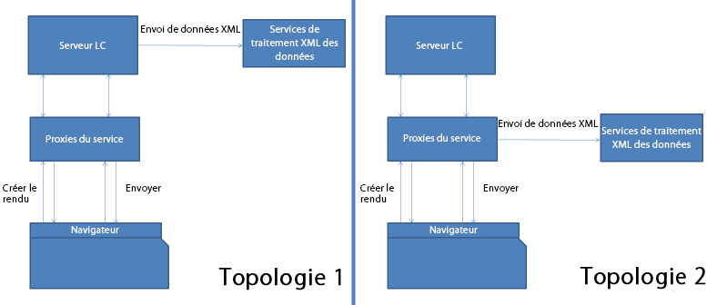

# Proxy de service de formulaires HTML5{#html-forms-service-proxy}

Le proxy de service de formulaires HTML5 est une configuration permettant d’enregistrer un proxy pour le service d’envoi. Pour configurer le proxy, précisez l’URL du service d’envoi via le paramètre de demande du proxy de service d’envoi :*submissionServiceProxy*.

## Avantages du proxy de service {#benefits-of-service-proxy-br}

Le proxy de service élimine les éléments suivants :

* Le flux de travail de formulaires HTML5 nécessite une connexion au service d’envoi « /content/xfaforms/submission/default » pour les utilisateurs de formulaires HTML5. Il expose les serveurs AEM à un public plus large et sans précédent.
* L’URL de service est incluse dans le modèle d’exécution du formulaire. Il est impossible de changer le chemin de l’URL de service.
* L’envoi est un processus en deux étapes. Pour l&#39;envoi de données au formulaire, au moins deux voyages vers le serveur sont nécessaires. Par conséquent, la charge sur le serveur augmente.
* Les formulaires HTML5 envoient des données dans la demande de post-traitement au lieu de la demande PDF. Pour le flux de travail impliquant des formulaires PDF et HTML5, deux méthodes différentes sont nécessaires pour traiter les envois.

### Topologies {#topologies-br}

Les formulaires HTML5 peuvent utiliser les topologies suivantes pour se connecter aux serveurs AEM.

* Une topologie où le serveur AEM ou les formulaires HTML5 envoient des données au serveur par le biais de la demande de post-traitement.
* Une topologie dans laquelle le serveur proxy envoie des données de post-traitement au serveur.

Topologies du proxy de service de formulaires HTML5

Les formulaires HTML5 se connectent aux serveurs AEM pour exécuter les scripts, les services web et les envois côté serveur. L’exécution XFA des formulaires HTML5 utilise des appels Ajax sur l’extrémité « /bin/xfaforms/submitaction » avec divers paramètres permettant de se connecter aux serveurs AEM. Les formulaires HTML5 connectent les serveurs AEM pour effectuer les opérations suivantes :

#### Exécuter les scripts et services Web côté serveur {#execute-server-sided-scripts-and-web-services}

Les scripts destinés à s’exécuter sur le serveur sont appelés scripts côté serveur. Le tableau suivant liste tous les paramètres utilisés dans les scripts côté serveur et les services Web.

<table>
 <tbody>
  <tr>
   <td>
<strong>Paramètre</strong>
 </td>
   <td>
<strong>Description</strong>
 </td>
  </tr>
  <tr>
   <td>
activity
 </td>
   <td>
Le paramètre activity contient les événements qui déclenchent la demande. Par exemple : cliquer sur, quitter ou modifier
 </td>
  </tr>
  <tr>
   <td>
contextSom
 </td>
   <td>
Le paramètre contextSom contient l’expression SOM de l’objet où des événements ont été exécutés.
 </td>
  </tr>
  <tr>
   <td>
Template
 </td>
   <td>
Le paramètre Template contient le modèle utilisé pour générer le formulaire.
 </td>
  </tr>
  <tr>
   <td>
contentRoot
 </td>
   <td>
Le paramètre contentRoot contient le répertoire racine du modèle utilisé pour générer le formulaire.
 </td>
  </tr>
  <tr>
   <td>
Données
 </td>
   <td>
Le paramètre Data contient les octets de données utilisés pour générer le formulaire.
 </td>
  </tr>
  <tr>
   <td>
formDom
 </td>
   <td>
formDom contient le fichier DOM du formulaire HTML5 au format JSON.
 </td>
  </tr>
  <tr>
   <td>
packet
 </td>
   <td>
Le paramètre packet est indiqué comme formulaire.
 </td>
  </tr>
  <tr>
   <td>
debugDir
 </td>
   <td>
Le paramètre debugDir contient le répertoire de débogage utilisé pour générer le formulaire.
 </td>
  </tr>
 </tbody>
</table>

#### Envoi de données  {#submit-data}

En cliquant sur le bouton Envoyer, les formulaires HTML5 envoient des données au serveur. Le tableau suivant répertorie tous les paramètres que les formulaires HTML5 envoient au serveur.

<table>
 <tbody>
  <tr>
   <td>
<strong>Paramètre</strong>
 </td>
   <td>
<strong>Description</strong>
 </td>
  </tr>
  <tr>
   <td>
Modèle
 </td>
   <td>
Motif utilisé pour rendre le formulaire.
 </td>
  </tr>
  <tr>
   <td>
contentRoot
 </td>
   <td>
le répertoire racine de modèle utilisé pour générer le formulaire.
 </td>
  </tr>
  <tr>
   <td>
Données
 </td>
   <td>
octets de données utilisés pour générer le formulaire.
 </td>
  </tr>
  <tr>
   <td>
formDom
 </td>
   <td>
DOM du formulaire HTML5 au format JSON.
 </td>
  </tr>
  <tr>
   <td>
submiturl
 </td>
   <td>
L’URL de l’emplacement où les données XML sont publiées.
 </td>
  </tr>
  <tr>
   <td>
debugDir
 </td>
   <td>
Le répertoire de débogage utilisé pour générer le formulaire.
 </td>
  </tr>
 </tbody>
</table>

#### Fonctionnement du proxy d’envoi.  {#how-nbsp-the-nbsp-submit-proxy-works}

Si submiturl ne figure pas dans le paramètre de requête, le proxy de service d’envoi agit en tant que passerelle. Il agit en tant que passerelle. Il envoie la requête à l’extrémité //bin/xfaforms/submitaction et la réponse à l’exécution XFA.

Si submiturl figure dans le paramètre de requête, le proxy de service d’envoi sélectionne une topologie.

* Si les serveurs AEM publient les données, le service de proxy agit comme une passerelle. Il envoie la requête à l’extrémité //bin/xfaforms/submitaction et la réponse à l’exécution XFA.
* Si le proxy publie les données, le service proxy transmet tous les paramètres, à l’exception de submitUrl, au point de terminaison */bin/xfaforms/submitaction* et reçoit des octets xml dans le flux de réponse. Ensuite, le service de proxy publie les octets XML de données au paramètre submitUrl pour traitement.

* Avant d’envoyer des données (demande de post-traitement) sur un serveur, les formulaires HTML5 vérifient la connectivité et la disponibilité du serveur. Pour vérifier la connectivité et la disponibilité, les formulaires HTML envoient une première demande vide au serveur. Si le serveur est disponible, les formulaires HTML5 envoie les données (demande de post-traitement) au serveur. Si le serveur n&#39;est pas disponible, un message d&#39;erreur, *Impossible de se connecter au serveur,* s&#39;affiche. La détection anticipée prévient les problèmes lors du remplissage du formulaire par les utilisateurs. La servlet proxy traite la demande de tête et ne lance pas d&#39;exception.
