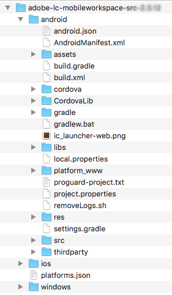
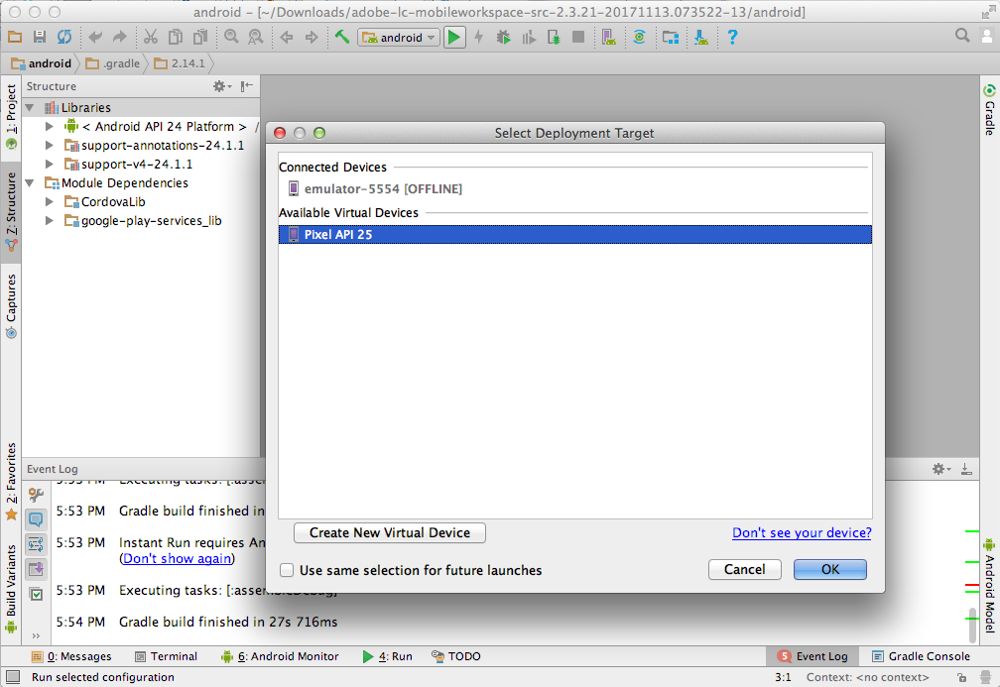

# Configuration du projet Android Studio et génération de l’application Android {#set-up-the-android-studio-project-and-build-the-android-app}

Cet article permet de créer l’application AEM Forms 6.3.1.1 et versions ultérieures. Pour créer une application à partir du code source du code source de l’application AEM Forms 6.3, voir [Configuration du projet Eclipse et génération de l’application Android™](/help/forms/using/setup-eclipse-project-build-installer.md).

AEM Forms fournit le code source complet de l’application AEM Forms. La source contient tous les composants nécessaires pour générer une application AEM Forms personnalisée. L&#39;archive de code source `adobe-lc-mobileworkspace-src-<version>.zip` fait partie du package `adobe-aemfd-forms-app-src-pkg-<version>.zip` sur la distribution de logiciels.

Pour obtenir le code source de l’application AEM Forms, procédez comme suit :

1. Ouvrez [Distribution de logiciels](https://experience.adobe.com/fr/downloads). Vous avez besoin d’un Adobe ID pour vous connecter à la Distribution de logiciels.
1. Appuyez sur **[!UICONTROL Adobe Experience Manager]** dans le menu d’en-tête.
1. Dans la section **[!UICONTROL Filtres]** :
   1. Sélectionnez **[!UICONTROL Formulaires]** dans la liste déroulante **[!UICONTROL Solution]**.
   2. Sélectionnez la version et le type du package. Vous pouvez également utiliser l&#39;option **[!UICONTROL Rechercher les téléchargements]** pour filtrer les résultats.
1. Appuyez sur le nom du package correspondant à votre système d’exploitation, sélectionnez **[!UICONTROL Accepter les termes du contrat de licence de l’utilisateur final]**, puis appuyez sur **[!UICONTROL Télécharger]**.
1. Ouvrez [Package Manager](https://docs.adobe.com/content/help/fr-FR/experience-manager-65/administering/contentmanagement/package-manager.html) et cliquez sur **[!UICONTROL Télécharger le package]** pour télécharger le package.
1. Sélectionnez le package et cliquez sur **[!UICONTROL Installer]**.

L&#39;image suivante affiche le contenu extrait du fichier`adobe-lc-mobileworkspace-src-<version>.zip`.

L&#39;image suivante affiche la structure de répertoires du dossier `android`dans le dossier `src`.

## Génération d’une application AEM Forms standard {#set-up-the-xcode-project}

1. Effectuez les étapes suivantes pour configurer un projet dans Android™ Studio et fournir une identité de signature :

   Ouvrez une session sur un ordinateur sur lequel Android™ Studio est installé et configuré.

1. Copiez l&#39;archive `adobe-lc-mobileworkspace-src-<version>.zip` téléchargée dans :

   **Pour les utilisateurs** de Mac :  `[User_Home]/Projects`

   **Pour les utilisateurs** de Windows® :  `%HOMEPATH%\Projects`

   >[!NOTE]
   >
   >Pour Windows®, il est recommandé de conserver le projet Android dans le lecteur système.

1. Extrayez l’archive dans le répertoire suivant :

   **Pour les utilisateurs** de Mac :  `[User_Home]/Projects/[your-project]`

   **Pour les utilisateurs** de Windows® :  `%HOMEPATH%\Projects\[your-project]`

   >[!NOTE]
   >
   >Il est recommandé de conserver le projet Android extrait dans le lecteur système avant d’importer le projet dans Android Studio.

1. Lancez Android™ Studio.

   **Pour les utilisateurs** de Mac : Mettez à jour le  `local.properties` fichier présent dans le  `[User_Home]/Projects/[your-project]/android` dossier et pointez la  `sdk.dir` variable vers  `SDK` l’emplacement de votre bureau.

   **Pour les utilisateurs** de Windows® : Mettez à jour le  `local.properties` fichier présent dans le  `%HOMEPATH%\Projects\[your-project]\android` dossier et pointez la  `sdk.dir` variable vers  `SDK` l’emplacement de votre bureau.

1. Cliquez sur **[!UICONTROL Terminer]** pour créer le projet.

   Le projet est disponible dans l’explorateur de projets ADT.

   

1. Dans Android™ Studio, sélectionnez **[!UICONTROL Importer un projet (Eclipse ADT, Gradle, etc.)]**.
1. Dans l&#39;explorateur de projets, sélectionnez le répertoire racine du projet à créer dans la zone de texte **Répertoire racine** :

   **Pour les utilisateurs de Mac :** [User_Home]/Projects/MobileWorkspace/src/android

   **Pour les utilisateurs de Windows® :** %HOMEPATH%\Projects\MobileWorkspace\src\android

1. Une fois le projet importé, une fenêtre contextuelle s’affiche avec une option permettant de mettre à jour le module externe Android™ Gradle. Cliquez sur le bouton approprié selon vos exigences.

   

1. Une fois Gradle généré, l’écran suivant s’affiche. Connectez le périphérique ou l’émulateur approprié au système et cliquez sur **[!UICONTROL Exécuter Android™]**.

   

1. Android™ Studio affiche les périphériques connectés et les émulateurs disponibles. Sélectionnez le périphérique sur lequel vous souhaitez exécuter l’application, puis cliquez sur **OK**.

   

Après avoir créé le projet, vous pouvez choisir d’installer l’application à l’aide d’Android™ Debug Bridge ou d’Android™ Studio.

### À l’aide d’Android™ Debug Bridge {#andriod-debug-bridge}

Vous pouvez installer l’application sur un périphérique Android™ via [Android™ Debug Bridge](https://developer.android.com/tools/help/adb.html) avec la commande suivante :

**Pour les utilisateurs** de Mac :  `adb install [User_Home]/Projects/[your-project]/adobe-lc-mobileworkspace-src-[version]/android/build/outputs/apk/android-debug.apk`

**Pour les utilisateurs** de Windows® :  `adb install %HOMEPATH%\Projects\[your-project]\adobe-lc-mobileworkspace-src-[version]\android\build\outputs\apk\android-debug.apk`
