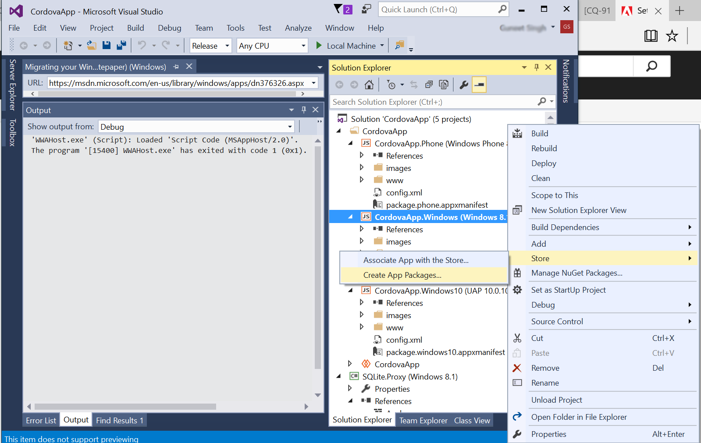

# Configuration du projet Visual Studio et création d’une application Windows{#set-up-the-visual-studio-project-and-build-the-windows-app}

AEM Forms fournit le code source complet de l’application AEM Forms. La source contient tous les composants nécessaires pour générer une application d’espace de travail personnalisée. L&#39;archive du code source `adobe-lc-mobileworkspace-src-<version>.zip`fait partie du `adobe-aemfd-forms-app-src-pkg-<version>.zip` package sur la distribution de logiciels.

Pour obtenir le code source de l’application AEM Forms, suivez les étapes ci-après :

1. Distribution de logiciels ouverts. Vous avez besoin d&#39;un Adobe ID pour vous connecter à la distribution de logiciels.
1. Appuyez sur **[!UICONTROL Adobe Experience Manager]** disponible dans le menu d’en-tête.
1. In the **[!UICONTROL Filters]** section:
   1. Sélectionnez **[!UICONTROL Forms]** dans la liste déroulante **[!UICONTROL Solution]** .
   2. Sélectionnez la version et le type du package. Vous pouvez également utiliser l’option Téléchargements **[!UICONTROL de]** recherche pour filtrer les résultats.
1. Appuyez sur le nom du pack applicable à votre système d’exploitation, sélectionnez **[!UICONTROL Accepter les termes]** du contrat de licence de l’utilisateur final et appuyez sur **[!UICONTROL Télécharger]**.
1. Ouvrez [Package Manager](https://docs.adobe.com/content/help/fr-FR/experience-manager-65/administering/contentmanagement/package-manager.html) et cliquez sur **[!UICONTROL Télécharger le package]** pour télécharger le package.
1. Select the package and click **[!UICONTROL Install]**.

1. Pour télécharger l’archive du code source, ouvrez- `https://<server>:<port>/crx/de/content/forms/mobileapps/src/adobe-lc-mobileworkspace-src-<version>.zip` la dans votre navigateur.\
   Le package source est téléchargé sur votre périphérique.

L&#39;image suivante affiche le contenu extrait du fichier`adobe-lc-mobileworkspace-src-<version>.zip`.

The following image displays the directory structure of the `windows` folder in the `src` folder.

## Configuration de l’environnement {#setting-up-the-environment}

Pour les périphériques Windows, vous devez disposer des éléments suivants :

* Microsoft Windows 8.1 ou Windows 10
* Microsoft Visual Studio 2015
* Outils Microsoft Visual Studio pour Apache Cordova

## Installation du projet Visual Studio pour l’application AEM Forms {#setting-up-visual-studio-project-for-aem-forms-app}

Exécutez les étapes suivantes pour configurer le projet de l’application AEM Forms dans Visual Studio.

1. Copy the `adobe-lc-mobileworkspace-src-<version>.zip` archive to `%HOMEPATH%\Projects` folder in the Windows 8.1 or Windows 10 device with Visual Studio 2015 installed and configured.
1. Extract the archive in the `%HOMEPATH%\Projects\MobileWorkspace` directory.
1. Navigate to the `%HOMEPATH%\Projects\MobileWorkspace\adobe-lc-mobileworkspace-src-[versionsrc]\windows` directory.
1. Ouvrez le fichier `CordovaApp.sln` à l’aide de Visual Studio 2015 et continuez à créer l’application AEM Forms.

## Génération de l&#39;application AEM Forms {#build-aem-forms-app}

Suivez les étapes ci-après pour générer et déployer l’application AEM Forms.

>[!NOTE]
>
>Les données stockées sur le système de fichiers Windows de l’application AEM Forms ne sont pas chiffrées. Il est recommandé d’utiliser un outil tiers, tel que Windows BitLocker Drive Encryption, pour chiffrer les données du disque.

1. In the Visual Studio Standard Toolbar, select **Release** from the drop-down for build mode.

1. Sélectionnez Windows-AnyCPU, Windows-x64 ou Windows-x86 en fonction de votre plateforme. Windows-AnyCPU est recommandé.
1. In the Visual Studio Solution Explorer, right-click the project **CordovaApp.Windows** and select **Store > Create AppPackages**.

   

   L’assistant de création de packs d’applications s’affiche.

   Le fichier d’installation CordovaApp.Windows_3.0.2.0_anycpu.appx est créé dans le répertoire platforms\windows\AppPackages\CordovaApp.Windows_3.0.2.0_anycpu_Test.

   If you encounter the error `Retarget to windows 8.1 required`, right-click the error and in the pop-up menu, select **Retarget To Windows 8.1**.

   

1. Dans l’assistant Créer des packages d’application, indiquez si vous souhaitez charger votre application dans Windows Store, puis cliquez sur **Suivant**.

   

1. Effectuez les modifications dans les paramètres, tels que la version et l’emplacement de sortie de la build de l’application, selon les besoins.

   

1. Une fois que le projet est créé, vous pouvez installer l’application à l’aide des éléments suivants :

   * Windows PowerShell
   * Visual Studio

   The `.appx` package requires the following items to install successfully:

   1. Bibliothèque WinJS
   1. Assurez-vous que le package s’accompagne d’un certificat auto-signé ou qu’une autorité approuvée, telle que VeriSign, a signé le certificat public.
   1. Licence de développeur

   Le répertoire Platforms\windows\AppPackages\CordovaApp.Windows_3.0.2.0_anycpu_Test contient les quatre composants principaux suivants :

   1. `.appx` approuvé
   1. Certificat (il s’agit actuellement d’un certificat signé Apache Cordova)
   1. Dossier de dépendance
   1. Fichier PowerShell (.ps1 extension)

## Déploiement d’une application à l’aide de Windows PowerShell {#deploying-an-app-using-windows-powershell}

Il existe deux manières d’installer l’application sur un périphérique Windows.

### Via l’acquisition d’une licence développeur {#by-acquiring-the-developer-license}

1. Right-click on the PowerShell file ( `Add-AppDevPackage.ps1)`, and choose **Run with PowerShell**.

1. La configuration vous invite à obtenir une licence développeur. Utilisez les informations de connexion de votre compte Microsoft pour l’acquérir.\
   Cette licence est valable pendant 30 jours et peut être renouvelée gratuitement.
1. Lors de l’acquisition de la licence développeur, la configuration entraîne l’installation d’un certificat auto-signé sur le système et l’application s’installe correctement.

### Via des périphériques d’entreprise {#by-using-enterprise-owned-devices}

Pour les périphériques d’entreprise connectés au domaine de l’entreprise, la licence développeur n’est pas obligatoire.

Les périphériques d’entreprise utilisent Windows Professionnel et Windows Entreprise.

Microsoft recommande d’installer un certificat public émis par une autorité de confiance, telle que VeriSign.

Pour déployer l’application :

* Assurez-vous que le périphérique est joint au domaine de l’entreprise.
* Activez le paramètre de stratégie de groupe.

**Pour activer le paramètre de stratégies de groupe :** 

1. In your device, run `gpedit.msc`.
1. Accédez à **Configuration de l’ordinateur > Modèles d’administration > Composant Windows > Déploiement du package de l’application**.
1. Cliquez avec le bouton droit de la souris sur **Autoriser toutes les applications de confiance pour l’installation**.
1. Cliquez sur **Modifier** puis sélectionnez **Activé**.

1. Cliquez sur **OK**.

Modifiez le script PowerShell généré par Visual Studio pour l’empêcher d’acquérir la licence de développeur.

In the PowerShell script, set the variable: `$NeedDeveloperLicense = $false`.

Pour les périphériques non connectés à un domaine, la clé de sideloading d’activation du produit est requise. Vous pouvez l’acheter auprès d’un revendeur Windows.

Pour Windows 8.1 Famille, il n’y a aucune stratégie de groupe. Le sideloading d’entreprise n’est pas activé et vous ne pouvez pas effectuer de connexion avec le domaine d’entreprise. Déployez l’application sur un périphérique exécutant Windows 8.1 Famille lors de l’utilisation de la licence de développeur.

Pour plus d’informations, cliquez [ici](https://blogs.msdn.com/b/mvpawardprogram/archive/2014/03/24/side-loading-deployment-of-windows-store-apps-in-enterprises-step-by-step.aspx).

## Déploiement d’une application à l’aide de Visual Studio {#deploying-an-app-using-visual-studio}

Pour installer l’application sous Windows à l’aide de Visual Studio :

1. Connectez le périphérique à l’aide du débogueur à distance.\
   For more information, see [Run Windows Store apps on a remote machine](https://docs.microsoft.com/en-us/visualstudio/debugger/run-windows-store-apps-on-a-remote-machine).

1. Avec l’application ouverte dans Visual Studio, sélectionnez Windows x64, Windows-x86 ou Windows-AnyCPU à partir de la liste des plateformes de solution, puis sélectionnez **Ordinateur distant**.
1. Votre application est déployée sur un ordinateur distant.

