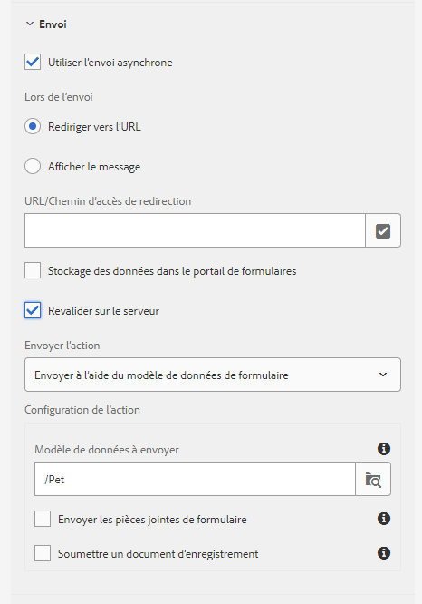

# Messages d’erreur de validation standard pour les formulaires adaptatifs {#standard-validation-error-messages}

Les formulaires adaptatifs valident les entrées fournies dans les champs en fonction de critères de validation prédéfinis. Les critères de validation font référence aux valeurs d’entrée acceptables pour les champs d’un formulaire adaptatif. Vous pouvez définir les critères de validation en fonction de la source de données que vous utilisez avec le formulaire adaptatif. Par exemple, si vous utilisez les services Web RESTful comme source de données, vous pouvez définir les critères de validation dans un fichier de définition Swagger.

Si les valeurs d’entrée répondent aux critères de validation, elles sont envoyées à la source de données. Sinon, le formulaire adaptatif affiche un message d’erreur.

De même, les formulaires adaptatifs peuvent désormais s’intégrer à des services personnalisés pour effectuer des validations de données. Si les valeurs d’entrée ne répondent pas aux critères de validation et que le message d’erreur de validation renvoyé par le serveur est au format standard, les messages d’erreur s’affichent au niveau du champ dans le formulaire.

Si les valeurs d’entrée ne répondent pas aux critères de validation et que le message d’erreur de validation du serveur n’est pas au format de message standard, les formulaires adaptatifs offrent un mécanisme permettant de transformer les messages d’erreur de validation en format standard afin qu’ils s’affichent au niveau du champ dans le formulaire. Vous pouvez transformer le message d’erreur en format standard en utilisant l’une des deux méthodes suivantes :

* Ajouter un gestionnaire d’erreurs personnalisé lors de l’envoi du formulaire adaptatif
* Ajouter un gestionnaire personnalisé à l’action Appeler le service à l’aide de l’éditeur de règles

Cet article décrit le format standard des messages d’erreur de validation et les instructions de transformation des messages d’erreur d’un format personnalisé en format standard.

## Format du message d’erreur de validation standard {#standard-validation-message-format}

Les formulaires adaptatifs affichent les erreurs au niveau du champ si les messages d’erreur de validation du serveur sont au format standard suivant :

```javascript
   {
    errorCausedBy : "SERVER_SIDE_VALIDATION/SERVICE_INVOCATION_FAILURE"
    errors : [
        {
             somExpression  : <somexpr>
             errorMessage / errorMessages : <validationMsg> / [<validationMsg>, <validationMsg>]

        }
    ]
    originCode : <target error Code>
    originMessage : <unstructured error message returned by service>
}
```

Où :

* `errorCausedBy` décrit la raison de l’échec
* `errors` mentionnez l’expression SOM des champs qui ont échoué aux critères de validation, ainsi que le message d’erreur de validation.
* `originCode` contient le code d&#39;erreur renvoyé par le service externe
* `originMessage` contient les données d&#39;erreur brutes renvoyées par le service externe

## Configuration de l’envoi de formulaire adaptatif pour ajouter des gestionnaires personnalisés {#configure-adaptive-form-submission}

Si le message d’erreur de validation du serveur ne s’affiche pas dans le format standard, vous pouvez activer l’envoi asynchrone et ajouter un gestionnaire d’erreurs personnalisé lors de l’envoi du formulaire adaptatif pour convertir le message dans un format standard.

### Configure asynchronous adaptive form submission {#configure-asynchronous-adaptive-form-submission}

Avant d’ajouter un gestionnaire personnalisé, vous devez configurer le formulaire adaptatif pour un envoi asynchrone. Procédez comme suit :

1. In adaptive form authoring mode, select the Form Container object and tap  to open its properties.
1. In the **[!UICONTROL Submission]** properties section, enable **[!UICONTROL Use asynchronous submission]**.
1. Sélectionnez **[!UICONTROL Revalider sur le serveur]** pour valider les valeurs des champs d’entrée sur le serveur avant envoi.
1. Sélectionnez l’action Envoyer :

   * Sélectionnez **[!UICONTROL Envoyer à l’aide du modèle]** de données de formulaire et sélectionnez le modèle de données approprié si vous utilisez le modèle [de données de](work-with-form-data-model.md) formulaire basé sur le service Web RESTful comme source de données.
   * Sélectionnez **[!UICONTROL Envoyer vers le point de terminaison]** REST et spécifiez l’URL/le chemin **[!UICONTROL de]** redirection si vous utilisez les services Web RESTful comme source de données.

   

1. Appuyez sur  (Enregistrer) pour enregistrer les propriétés.

### Ajouter un gestionnaire d’erreurs personnalisé lors de l’envoi du formulaire adaptatif {#add-custom-error-handler-af-submission}

AEM Forms fournit des gestionnaires de réussite et d’erreur prêts à l’emploi pour les envois de formulaires. Les gestionnaires sont des fonctions côté client qui s’exécutent en fonction de la réponse du serveur. Lorsqu’un formulaire est envoyé, les données sont transmises au serveur pour validation, ce qui renvoie une réponse au client avec des informations sur l’événement de réussite ou d’erreur pour l’envoi. Les informations sont transmises en tant que paramètres au gestionnaire approprié pour exécuter la fonction.

Exécutez les étapes suivantes pour ajouter un gestionnaire d’erreurs personnalisé lors de l’envoi du formulaire adaptatif :

1. Open the adaptive form in authoring mode, select any form object, and tap <!----> to open the rule editor.
1. Sélectionnez **[!UICONTROL Formulaire]** dans l’arborescence des objets de formulaire et appuyez sur **[!UICONTROL Créer]**.
1. Sélectionnez **[!UICONTROL Erreur dans l’envoi]** dans la liste déroulante Événement.
1. Ecrivez une règle pour convertir la structure d’erreur personnalisée en structure d’erreur standard et appuyez sur **[!UICONTROL Terminé]** pour enregistrer la règle.

Voici un exemple de code pour convertir une structure d’erreur personnalisée en structure d’erreur standard :

```javascript
var data = $event.data;
var som_map = {
    "id": "guide[0].guide1[0].guideRootPanel[0].Pet[0].id_1[0]",
    "name": "guide[0].guide1[0].guideRootPanel[0].Pet[0].name_2[0]",
    "status": "guide[0].guide1[0].guideRootPanel[0].Pet[0].status[0]"
};

var errorJson = {};
errorJson.errors = [];

if (data) {
    if (data.originMessage) {
        var errorData;
        try {
            errorData = JSON.parse(data.originMessage);
        } catch (err) {
            // not in json format
        }

        if (errorData) {
            Object.keys(errorData).forEach(function(key) {
                var som_key = som_map[key];
                if (som_key) {
                    var error = {};
                    error.somExpression = som_key;
                    error.errorMessage = errorData[key];
                    errorJson.errors.push(error);
                }
            });
        }
        window.guideBridge.handleServerValidationError(errorJson);
    } else {
        window.guideBridge.handleServerValidationError(data);
    }
}
```

L’ `var som_map` expression SOM des champs de formulaire adaptatif que vous souhaitez transformer en format standard est liste. Vous pouvez vue l’expression SOM de n’importe quel champ d’un formulaire adaptatif en appuyant sur le champ et en sélectionnant l’Expression **[!UICONTROL SOM]** Vue.

A l’aide de ce gestionnaire d’erreurs personnalisé, le formulaire adaptatif convertit les champs répertoriés dans `var som_map` le format de message d’erreur standard. En conséquence, les messages d’erreur de validation s’affichent au niveau du champ dans le formulaire adaptatif.

## Ajouter un gestionnaire personnalisé à l’aide de l’action Service d’appel

Exécutez les étapes suivantes pour ajouter un gestionnaire d’erreurs afin de convertir une structure d’erreurs personnalisée en structure d’erreurs standard à l’aide de l’action Invoke Service de l’éditeur de [règles](rule-editor.md) :

1. Open the adaptive form in authoring mode, select any form object, and tap  to open the rule editor.
1. Appuyez sur **[!UICONTROL Créer]**. 
1. Créez une condition dans la section **[!UICONTROL Lorsque]** de la règle. Par exemple,[WhenName du champ] est modifié. Sélectionnez **[!UICONTROL est modifié]** dans la liste déroulante **[!UICONTROL Sélectionner un état]** pour atteindre cette condition.
1. Dans la section **[!UICONTROL Then]** (Alors), sélectionnez **[!UICONTROL Invoke Service]** (Appeler un service) dans la liste déroulante **[!UICONTROL Select Action]** (Sélectionner une action). 
1. Sélectionnez un service Post et ses liaisons de données correspondantes dans la section **[!UICONTROL Entrée]** . Par exemple, si vous souhaitez valider les champs **Nom**, **ID** et **État** dans le formulaire adaptatif, sélectionnez un service Post (animal de compagnie) et sélectionnez pet.name, pet.id et pet.status dans la section **[!UICONTROL Input.]**

En conséquence, les valeurs que vous saisissez pour les champs **Nom**, **ID** et **État** sont validées dès que le champ défini à l’étape 2 est modifié et que vous sortez du champ du formulaire.

1. Select **[!UICONTROL Code Editor]** from the mode selection drop-down list.
1. Appuyez sur **[!UICONTROL Modifier le code]**.
1. Supprimez la ligne suivante du code existant :

   ```javascript
   guidelib.dataIntegrationUtils.executeOperation(operationInfo, inputs, outputs);
   ```

1. Ecrivez une règle pour convertir la structure d’erreur personnalisée en structure d’erreur standard et appuyez sur **[!UICONTROL Terminé]** pour enregistrer la règle.
Par exemple, ajoutez l’exemple de code suivant à la fin pour convertir une structure d’erreur personnalisée en structure d’erreur standard :

   ```javascript
   var errorHandler = function(jqXHR, data) {
   var som_map = {
       "id": "guide[0].guide1[0].guideRootPanel[0].Pet[0].id_1[0]",
       "name": "guide[0].guide1[0].guideRootPanel[0].Pet[0].name_2[0]",
       "status": "guide[0].guide1[0].guideRootPanel[0].Pet[0].status[0]"
   };
   
   
   var errorJson = {};
   errorJson.errors = [];
   
   if (data) {
       if (data.originMessage) {
           var errorData;
           try {
               errorData = JSON.parse(data.originMessage);
           } catch (err) {
               // not in json format
           }
   
           if (errorData) {
               Object.keys(errorData).forEach(function(key) {
                   var som_key = som_map[key];
                   if (som_key) {
                       var error = {};
                       error.somExpression = som_key;
                       error.errorMessage = errorData[key];
                       errorJson.errors.push(error);
                   }
               });
           }
           window.guideBridge.handleServerValidationError(errorJson);
       } else {
           window.guideBridge.handleServerValidationError(data);
       }
     }
   };
   
   guidelib.dataIntegrationUtils.executeOperation(operationInfo, inputs, outputs, null, errorHandler);
   ```

   L’ `var som_map` expression SOM des champs de formulaire adaptatif que vous souhaitez transformer en format standard est liste. Vous pouvez vue l’expression SOM de n’importe quel champ d’un formulaire adaptatif en appuyant sur le champ et en sélectionnant Expression **[!UICONTROL SOM]** Vue dans le menu **[!UICONTROL Autres options]** (...).

   Assurez-vous de copier la ligne suivante de l’exemple de code dans le gestionnaire d’erreurs personnalisé :

   ```javascript
   guidelib.dataIntegrationUtils.executeOperation(operationInfo, inputs, outputs, null, errorHandler);
   ```

   L’API executeOperation inclut les paramètres `null` et `errorHandler` en fonction du nouveau gestionnaire d’erreurs personnalisé.

   A l’aide de ce gestionnaire d’erreurs personnalisé, le formulaire adaptatif convertit les champs répertoriés dans `var som_map` le format de message d’erreur standard. En conséquence, les messages d’erreur de validation s’affichent au niveau du champ dans le formulaire adaptatif.