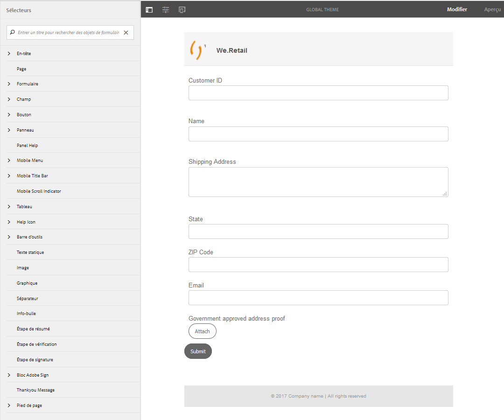
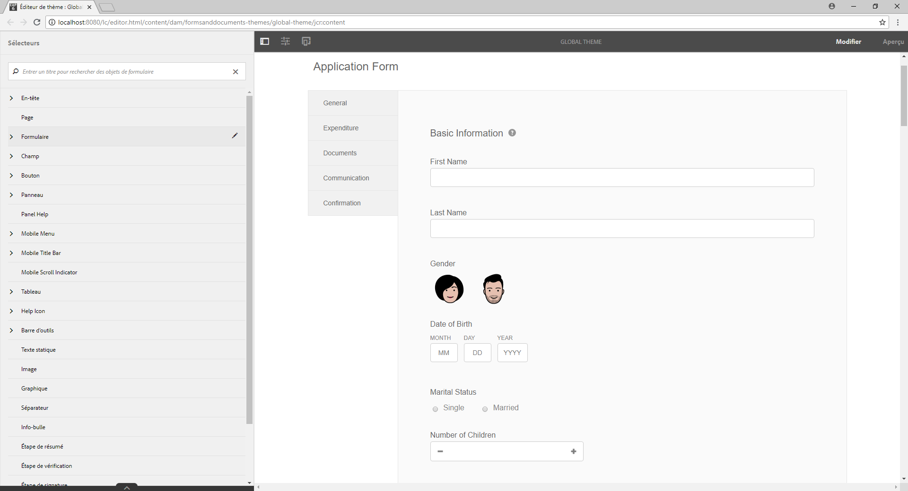
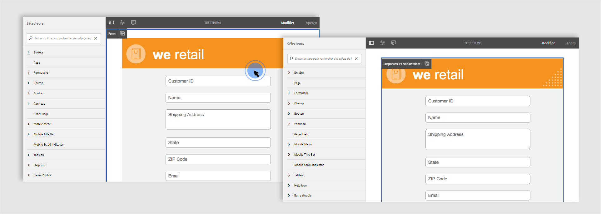
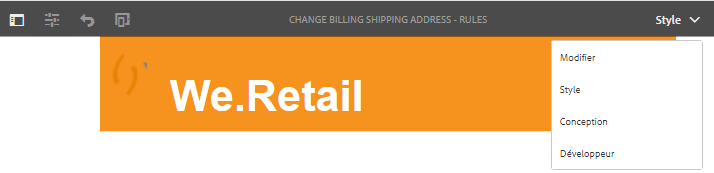

# Application d’un style à votre formulaire adaptatif {#do-not-publish-style-your-adaptive-form}

Apprenez à créer un thème personnalisé, à appliquer un style à des composants individuels et à utiliser les polices web dans un thème.

Ce didacticiel est une étape de la série [Création de votre premier formulaire adaptatif](https://helpx.adobe.com/experience-manager/6-3/forms/using/create-your-first-adaptive-form.html). Il est recommandé de suivre la série dans l’ordre chronologique pour comprendre, exécuter et démontrer le cas d’utilisation complet du didacticiel.

## À propos du didacticiel  {#about-the-tutorial}

Vous pouvez utiliser des thèmes pour donner une apparence et un style uniques à un formulaire adaptatif. Vous pouvez appliquer des thèmes prêts à l’emploi fournis avec l’éditeur de formulaires adaptatifs ou créer vos propres thèmes. Les formulaires AEM fournissent un [éditeur de thème](https://helpx.adobe.com/fr/experience-manager/6-3/forms/using/themes.html) pour créer des thèmes personnalisés. Un seul thème peut conférer une apparence différente au même formulaire adaptatif ouvert sur un mobile, une tablette ou un ordinateur de bureau. Aucune connaissance préalable de CSS ou de LESS n’est nécessaire pour utiliser l’éditeur de thèmes, mais cela est préférable.

À la fin du didacticiel, vous découvrirez comment :

* Appliquer un thème prêt à l’emploi à un formulaire adaptatif
* Créer un thème pour formulaire adaptatif à l’aide de l’éditeur de thème
* Style des composants individuels
* Section bonus : utilisation des polices web dans un thème personnalisé

Lorsque vous aurez terminé le didacticiel, le modèle de données de formulaire se présentera comme ceci :

## Avant de commencer {#before-you-start}

Téléchargez sur votre ordinateur local les images de style d’en-tête et de logo présentées ci-dessous. L’en-tête du formulaire adaptatif `shipping-address-add-update-form` utilise les images de style d’en-tête et de logo. L’image de style d’en-tête s’affiche à droite de l’en-tête.

[Obtenir le fichier](assets/header-style.png)

[Obtenir le fichier](assets/logo-1.png)

## Étape 1 : appliquer un thème à votre formulaire adaptatif {#step-apply-a-theme-to-your-adaptive-form}

L’éditeur de formulaires adaptatifs fournit plusieurs thèmes prêts à l’emploi. Si vous envisagez de ne pas utiliser de style personnalisé pour votre formulaire adaptatif, vous pouvez également publier vos formulaires adaptatifs avec un thème prêt à l’emploi. Les thèmes sont indépendants des formulaires adaptatifs. Vous pouvez appliquer le même thème à plusieurs formulaires adaptatifs. Pour appliquer un thème à un formulaire adaptatif :

1. Ouvrez le formulaire adaptatif pour le modifier.

   [http://localhost:4502/editor.html/content/forms/af/shipping-address-add-update-form.html](http://localhost:4502/editor.html/content/forms/af/shipping-address-add-update-form.html)

1. Ouvrez les propriétés du **conteneur de formulaires adaptatifs**. Dans le navigateur de propriétés, accédez à **De base** > **Thème de formulaire adaptatif**. Le champ **Thème de formulaire adaptatif** répertorie tous les thèmes prêts à l’emploi et personnalisés. Par défaut, le thème Zone de travail est appliqué.
1. Sélectionnez votre thème dans le champ **Thème de formulaire adaptatif**. Par exemple, **Thème Enquête**. Appuyez sur  pour appliquer le thème sélectionné.

**Figure :** Formulaire *adaptatif avec le thème par défaut*

**Figure :** Formulaire *adaptatif avec le thème*

## Étape 2 : mettre à jour votre formulaire adaptatif {#step-update-your-adaptive-form}

La conception présentée ci-dessus nécessite des modifications du texte et du logo de l’espace réservé de votre formulaire adaptatif existant. Effectuez les étapes suivantes pour faire les changements nécessaires :

1. Modifiez le logo existant et le texte de l’en-tête. Pour supprimer le logo :

   1. Ouvrez le formulaire dans l’éditeur de formulaires.

      [http://localhost:4502/editor.html/content/forms/af/shipping-address-add-update-form.html](http://localhost:4502/editor.html/content/forms/af/shipping-address-add-update-form.html)

   1. Tap logo image in the header component and tap  properties. Dans la propriété d’image, appuyez sur X pour supprimer l’image du logo existant.
   1. Tap upload, select the logo.png, and tap  to save the changes. The image was downloaded in the [Before you start](/help/forms/using/style-your-adaptive-form.md#before-you-start) section.
   1. Appuyez sur le texte de l’en-tête `We.Retail`, puis appuyez sur **edit**. Change header text to `we retail`. Apply bold formatting only to `we`in `we retail`.
   

1. Supprimez le titre et ajouter un texte d’espace réservé :

   1. Tap the Customer ID field and tap  properties.
   1. Copiez le contenu du champ **Titre** dans le champ **Texte d’espace réservé**.
   1. Supprimez le contenu du champ **Titre** et appuyez sur .
   1. Répétez les trois étapes précédentes pour toutes les zones de texte, la zone numérique et le champ d’adresse électronique du formulaire.
   

## Étape 3 : créer un thème personnalisé pour votre formulaire adaptatif {#step-create-a-custom-theme-for-your-adaptive-form}

Vous pouvez utiliser un [éditeur de thèmes](/help/forms/using/themes.md) pour créer des thèmes personnalisés. L’éditeur de thèmes est un éditeur WYSIWYG très puissant. Il s’agit d’une méthode visuelle permettant d’appliquer un style CSS à divers composants d’un formulaire adaptatif. Il fournit des commandes plus précises aux composants de style et aux panneaux d’un formulaire adaptatif.

Un thème est une entité distincte au même titre que les formulaires adaptatifs. Il contient des styles (CSS) pour les composants et les panneaux d’un formulaire adaptatif. Ces styles incluent des propriétés CSS telles que les couleurs d’arrière-plan, les couleurs d’état, la transparence, l’alignement et la taille. Lorsque vous appliquez un thème, le style spécifié est appliqué aux composants correspondants d’un formulaire adaptatif.

Dans ce didacticiel, vous allez appliquer un style aux en-têtes et aux pieds de page, aux composants texte et numériques, aux composants de pièces jointes et aux boutons. Commençons par la création d’ un thème :

### Création d’un thème {#create-a-theme}

1. Log in to the AEM author instance and navigate to **Adobe Experience Manager** > **Forms** > **Themes**. L’URL par défaut est [http://localhost:4502/aem/forms.html/content/dam/formsanddocuments-themes](http://localhost:4502/aem/forms.html/content/dam/formsanddocuments-themes).
1. Appuyez sur **[!UICONTROL Créer]** et sélectionnez **[!UICONTROL Thème]**. La page Créer un thème s’affiche avec les champs requis pour créer un thème. Les champs Titre et Nom sont obligatoires :

   * **Titre :** Indiquez un titre pour le thème. Par exemple, **Thème global.** Le titre vous permet d’identifier le thème dans la liste des thèmes.
   * **Nom :** Indiquez le nom du thème. Par exemple, **Thème-global.** Un nœud portant le nom indiqué est alors créé dans le référentiel. Lorsque vous commencez à saisir un titre, une valeur pour le champ de nom est automatiquement générée. Vous pouvez modifier la valeur suggérée. Le champ de nom peut contenir uniquement des caractères alphanumériques, des traits d’union et des tirets bas. Toutes les entrées non valides sont remplacées par un tiret.

1. Appuyez sur **Create** (Créer). Un thème est créé et une boîte de dialogue pour ouvrir le formulaire à modifier s’affiche. Tap **Open** to open the newly created theme in a new tab. Le thème s’ouvre dans l’éditeur de thèmes. Pour le style, l’éditeur de thèmes utilise un formulaire adaptatif prêt à l’emploi fourni avec AEM Forms.

   For information about using theme editor UI, see [About the theme editor](/help/forms/using/themes.md#aboutthethemeeditor).

1. Tap **Theme Options**  > **Configure**. In the **Preview Form** field, select the **shipping-address-add-update-form** adaptive form, tap , tap **Save**. L’éditeur de thème est maintenant configuré pour utiliser votre propre formulaire adaptatif au lieu du formulaire adaptatif par défaut. Appuyez sur **Annuler** pour revenir à l’éditeur de thèmes.

   

   **Figure :** Éditeur de *thème avec le formulaire adaptatif d’expédition-address-add-update-form*

   

   **Figure :** Formulaire *adaptatif avec le formulaire par défaut*

### Application d’un style à l’en-tête et au pied de page {#style-header-and-footer}

L’en-tête et le pied de page donnent un aspect cohérent et distinctif à un formulaire adaptatif. En général, l’en-tête contient le logo et le nom de l’organisation, le pied de page contient des informations de copyright. Ces éléments restent identiques dans plusieurs formulaires d’une organisation. Pour appliquer un style à l’en-tête et au pied de page du formulaire adaptatif shipping-address-add-update-form :

1. Accédez à l’option **En-tête** > **Texte** dans le panneau Sélecteurs. Le panneau Sélecteurs se trouve à gauche de l’éditeur de thèmes. Si le panneau n’est pas visible, appuyez sur Activer/désactiver le panneau latéral.

1. Set the following properties in the **Text** accordion and tap .

   | Propriétés | Valeur |
   |---|---|
   | Famille de polices | Arial |
   | Couleur de la police | FFFFFF |
   | Taille de la police | 54px |

1. Appuyez sur le widget d’en-tête, puis sur **En-tête**. Les options permettant d’appliquer un style au widget En-tête s’affichent à gauche. Développez l’accordéon **Dimensions et position** , définissez la **Hauteur** sur `120px`, puis appuyez sur .
1. Développez l’accordéon Arrière-plan du widget d’en-tête, définissez la **couleur d’arrière-plan** sur `F6921E.`

   Hover over **Image &amp; Gradient** > **+ Add**, tap **Image**. Définissez les propriétés suivantes et appuyez sur .

   | Propriétés | Valeur |
   |---|---|
   | image | Téléchargez le fichier header-style.png. The image was downloaded in the [Before you start](/help/forms/using/style-your-adaptive-form.md#before-you-start) section. |
   | Position | En bas à droite |
   | Mosaïque | Pas de répétition |

1. Dans l’éditeur de thème, appuyez sur le logo dans l’en-tête puis appuyez sur **Logo de l’en-tête**. Expand the Dimensions &amp; Position accordion, set the following properties and tap .

<table> 
 <tbody> 
  <tr> 
   <td>Marge</td> 
   <td>Valeur</td> 
  </tr> 
  <tr> 
   <td>Marge</td> 
   <td> 
    <ul> 
     <li>Haut : 1,5 rem</li> 
     <li>Bas : -35 px</li> 
     <li>Gauche : 1 rem<strong>  </strong></li> 
    </ul> 
<strong>Conseil :</strong> appuyez sur l’icône de lien pour fournir une valeur différente à chaque champ.  
 </td> 
  </tr> 
  <tr> 
   <td>Hauteur</td> 
   <td>4,75 rem</td> 
  </tr> 
 </tbody> 
</table>

1. Appuyez sur le widget de pied de page, puis sur **Pied de page**. Développez l’accordéon **Arrière-plan** , définissez la couleur **d’** arrière-plan sur `F6921E`, puis appuyez sur .

### Application d’un style au composant de capture de données et application d’un arrière-plan au formulaire adaptatif {#style-the-data-capture-component-and-apply-a-background-to-the-adaptive-form}

Vous pouvez utiliser plusieurs composants dans un formulaire adaptatif pour capturer des données. Par exemple, zone de texte et zone numérique. Vous pouvez fournir un style identique à tous les composants de capture de données ou un style distinct pour chaque composant. Dans ce didacticiel, un style identique est appliqué aux zones numériques (ID client, Code postal) et aux zones de texte (ID client, Nom, Adresse de livraison, État, Adresse électronique). Pour mettre en forme les composants de capture de données :

1. Appuyez sur le champ ID de client et sur l’option **Widget de champ**. Définissez les propriétés suivantes et appuyez sur .

<table> 
 <tbody> 
  <tr> 
   <td>Accordéon</td> 
   <td>Propriétés</td> 
   <td>Valeur</td> 
  </tr> 
  <tr> 
   <td> de la bordure</td> 
   <td>Couleur de la bordure</td> 
   <td>A7A9AC</td> 
  </tr> 
  <tr> 
   <td> de la bordure</td> 
   <td>Rayon de bordure </td> 
   <td> 
    <ul> 
     <li>Haut : 7 px  </li> 
     <li>Droite : 7 px  </li> 
     <li>Bas : 7 px  </li> 
     <li>Gauche : 7 px  </li> 
    </ul> </td> 
  </tr> 
  <tr> 
   <td>Text (Texte)</td> 
   <td>Famille de polices</td> 
   <td>Arial</td> 
  </tr> 
  <tr> 
   <td>Text (Texte)</td> 
   <td>Couleur de la police</td> 
   <td>939598  </td> 
  </tr> 
  <tr> 
   <td>Text (Texte)</td> 
   <td>Taille de la police</td> 
   <td>18px</td> 
  </tr> 
  <tr> 
   <td>Dimensions et position</td> 
   <td>Largeur</td> 
   <td>60%</td> 
  </tr> 
  <tr> 
   <td>Dimensions et position</td> 
   <td>Marge</td> 
   <td> 
    <ul> 
     <li>Gauche : 10 rem</li> 
    </ul> </td> 
  </tr> 
 </tbody> 
</table>

1. Appuyez sur la zone vide au-dessus du champ ID de client et appuyez sur **Conteneur de panneau réactif**. Définissez **Arrière-plan** > **Couleur d’arrière-plan** sur F1F2F2. Appuyez sur .

   

### Application d’un style aux boutons {#style-the-buttons}

You can use a custom theme to apply an identical style to all the buttons of the adaptive form and [inline styling](/help/forms/using/inline-style-adaptive-forms.md) to apply a style to a specific button. Pour appliquer un style aux boutons :

1. Appuyez sur le bouton **Envoyer** et appuyez sur l’option **Bouton**. Définissez les propriétés suivantes et appuyez sur .

<table> 
 <tbody> 
  <tr> 
   <td>Accordéon</td> 
   <td>Propriétés</td> 
   <td>Valeur</td> 
  </tr> 
  <tr> 
   <td>Arrière-plan</td> 
   <td>Couleur d’arrière-plan</td> 
   <td>F6921E</td> 
  </tr> 
  <tr> 
   <td> de la bordure  </td> 
   <td>Couleur de la bordure</td> 
   <td>F6921E</td> 
  </tr> 
  <tr> 
   <td> de la bordure</td> 
   <td>Rayon de bordure </td> 
   <td> 
    <ul> 
     <li>Haut : 7 px  </li> 
     <li>Droite : 7 px  </li> 
     <li>Bas : 7 px  </li> 
     <li>Gauche : 7 px</li> 
    </ul> </td> 
  </tr> 
  <tr> 
   <td>Texte  </td> 
   <td>Famille de polices</td> 
   <td>Arial</td> 
  </tr> 
  <tr> 
   <td>Text (Texte)</td> 
   <td>Couleur de la police</td> 
   <td>FFFFFF</td> 
  </tr> 
  <tr> 
   <td>Text (Texte)</td> 
   <td>Taille de la police</td> 
   <td>18px</td> 
  </tr> 
 </tbody> 
</table>

1. [Appliquez le thème personnalisé](/help/forms/using/style-your-adaptive-form.md#step-apply-a-theme-to-your-adaptive-form), Thème global, à votre formulaire adaptatif. Si le style ne se reflète pas sur le formulaire adaptatif, videz le cache du navigateur et réessayez.

   

## Étape 4 : appliquer un style à des composants individuels {#step-style-individual-components}

Certains styles ne s’appliquent qu’à un composant spécifique. Un style est appliqué à ces composants dans l’éditeur de formulaires adaptatifs.

1. Ouvrez le formulaire adaptatif pour le modifier. [http://localhost:4502/editor.html/content/forms/af/shipping-address-add-update-form.html](http://localhost:4502/editor.html/content/forms/af/change-billing-shipping-address.html)
1. Dans la barre supérieure, sélectionnez l’option **Style**.

   

1. Tap the **Attach** button and tap the icon. Set the following properties in the **Dimensions and Position** accordion:

   | Propriétés | Valeur |
   |---|---|
   | Flottant | Gauche |
   | Largeur | 10% |

1. Tap the **Government approved address proof** option and tap the icon. Définissez les propriétés suivantes :

<table> 
 <tbody> 
  <tr> 
   <td>Accordéon</td> 
   <td>Propriétés</td> 
   <td>Valeur</td> 
  </tr> 
  <tr> 
   <td>Dimensions et position</td> 
   <td>Flottant</td> 
   <td>Gauche</td> 
  </tr> 
  <tr> 
   <td>Dimensions et position</td> 
   <td>Largeur</td> 
   <td>73%</td> 
  </tr> 
  <tr> 
   <td>Dimensions et position</td> 
   <td>Remplissage</td> 
   <td> 
    <ul> 
     <li>Gauche : 10 px</li> 
    </ul> </td> 
  </tr> 
  <tr> 
   <td>Dimensions et position</td> 
   <td>Hauteur</td> 
   <td>40px</td> 
  </tr> 
  <tr> 
   <td>Dimensions et position  </td> 
   <td>Marge</td> 
   <td>  
    <ul> 
     <li>Droite : 2 rem</li> 
     <li>Gauche : 10 rem </li> 
    </ul> </td> 
  </tr> 
  <tr> 
   <td>Arrière-plan</td> 
   <td>Couleur d’arrière-plan</td> 
   <td>FFFFFF</td> 
  </tr> 
  <tr> 
   <td> de la bordure</td> 
   <td>Largeur de bordure</td> 
   <td>1px</td> 
  </tr> 
  <tr> 
   <td> de la bordure</td> 
   <td>Style de la bordure</td> 
   <td>Pleine</td> 
  </tr> 
  <tr> 
   <td> de la bordure</td> 
   <td>Couleur de la bordure</td> 
   <td>A7A9AC</td> 
  </tr> 
  <tr> 
   <td> de la bordure</td> 
   <td>Rayon de bordure</td> 
   <td>7px</td> 
  </tr> 
  <tr> 
   <td>Text (Texte)</td> 
   <td>Famille de polices</td> 
   <td>Arial</td> 
  </tr> 
  <tr> 
   <td>Text (Texte)</td> 
   <td>Couleur de la police</td> 
   <td>BCBEC0</td> 
  </tr> 
  <tr> 
   <td>Text (Texte)</td> 
   <td>Taille de la police</td> 
   <td>18px</td> 
  </tr> 
  <tr> 
   <td>Text (Texte)</td> 
   <td>Hauteur de ligne</td> 
   <td>2</td> 
  </tr> 
 </tbody> 
</table>

1. Tap the **Submit** button and tap the  icon. Définissez les propriétés suivantes :

<table> 
 <tbody> 
  <tr> 
   <td>Accordéon</td> 
   <td>Propriétés</td> 
   <td>Valeur</td> 
  </tr> 
  <tr> 
   <td>Dimensions et position</td> 
   <td>Flottant</td> 
   <td>Droite</td> 
  </tr> 
  <tr> 
   <td>Dimensions et position</td> 
   <td>Marge</td> 
   <td> 
    <ul> 
     <li>Haut : 5 rem</li> 
     <li>Droite : 14 rem</li> 
     <li>Bas : 20 px</li> 
     <li>Gauche : 20 px  </li> 
    </ul> </td> 
  </tr> 
  <tr> 
   <td>Arrière-plan</td> 
   <td>Couleur d’arrière-plan</td> 
   <td>F6921E</td> 
  </tr> 
  <tr> 
   <td> de la bordure</td> 
   <td>Couleur de la bordure</td> 
   <td>F6921E</td> 
  </tr> 
 </tbody> 
</table>

## Étape 5 : section bonus : utilisation des polices web dans un thème personnalisé {#step-bonus-section-using-web-fonts-in-a-custom-theme}

Vous pouvez utiliser différentes polices pour concevoir un formulaire adaptatif. Tous les périphériques sur lesquels le formulaire adaptatif est visualisé peuvent ne pas utiliser les polices pour concevoir le formulaire adaptatif. Vous pouvez utiliser un service de polices Web pour fournir les polices requises au périphérique .

Adobe Typekit est un service de polices web d’Adobe. Vous pouvez configurer et utiliser le service avec les formulaires adaptatifs. Pour utiliser Adobe Typekit dans un formulaire adaptatif :

>[!NOTE]
>
> Typekit est désormais appelé Adobe Fonts et est inclus dans Creative Cloud et d’autres  de . [En savoir plus](https://fonts.adobe.com/).

1. Create an [Adobe Typekit](https://typekit.com/) account, create a kit, add font Myriad Pro to the kit, publish the kit, and obtain the Kit ID. Il est nécessaire d’utiliser les polices Adobe Typekit (polices web) dans un formulaire adaptatif.
1. In the AEM Forms server, navigate to  **Adobe Experience Manager** > **Tools**  > **Deployment** > **Cloud Services**. On the Cloud Services page, navigate to **Third Party Services** > **Typekit**, and click **Configure** Now under Typekit. Si une configuration est déjà disponible, cliquez sur le bouton + pour créer une nouvelle instance.

   On the Create Configuration dialog, specify a **Title** for the configuration, and click **Create**. Vous êtes redirigé sur la page de configuration. In the Edit Component dialog that appears, provide your **Kit ID** and click **OK**.

1. Configurez un thème de sorte qu’il utilise la configuration Typekit. On the author instance, open **Global Theme** in the theme editor. In the theme editor, navigate to Theme Options  > Configure. In **Typekit Configuration** field, select the kit, and click **Save**.

   The fonts added to the Typekit are available for selection in the **Text** accordion of all the components.

