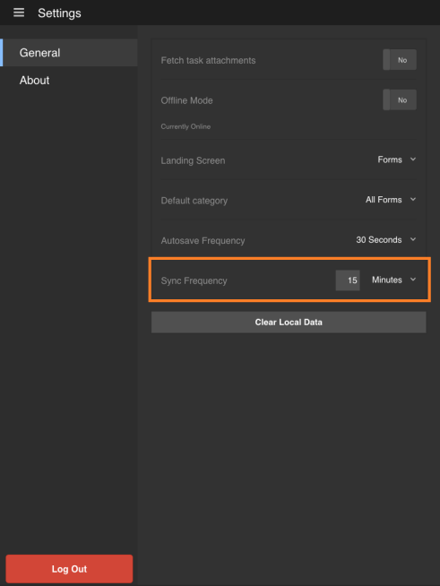

# Synchronisation de l’application{#synchronizing-the-app}

## Synchronisation de l’application {#synchronizing-the-app-1}

Les formulaires de votre application sont téléchargés à partir du serveur AEM Forms. Les formulaires sont téléchargés sous les onglets Tâches et Formulaires. Les brouillons créés à partir de formulaires sont téléchargés dans l’onglet des brouillons et les brouillons créés à partir des tâches sont téléchargés dans l’onglet des tâches. Pour un formulaire autonome sur le serveur OSGi, les formulaires et les brouillons sont téléchargés respectivement dans les onglets Formulaires et Brouillon.

Lorsque vous terminez et envoyez un formulaire, celui-ci est de nouveau chargé sur le serveur AEM Forms instantanément si l’application est en ligne. Les formulaires sont extraits du serveur lorsque l’application est synchronisée. Les brouillons, toutefois, sont synchronisés avec le serveur immédiatement lorsque l’application est en ligne.

Lorsque vous êtes connecté avec le serveur AEM Forms, votre application est synchronisée par défaut toutes les 15 minutes. Vous avez toutefois la possibilité de modifier la fréquence de synchronisation. Vous pouvez également synchroniser manuellement l’application à tout moment.

**Synchronisation manuelle de l’application**

Appuyez sur le bouton Synchroniser  dans l’angle inférieur droit de l’écran d’accueil.

**Modification de la fréquence de synchronisation**

1. Pour accéder à l’écran Paramètres, appuyez sur le bouton de menu dans le coin supérieur gauche de l’écran d’accueil, puis appuyez sur **Paramètres**.
1. Dans l’écran des paramètres, appuyez sur l’onglet General (Général).

   

1. Au niveau de l’option Sync Frequency (Fréquence de synchronisation), appuyez sur la valeur à droite de Sync Frequency.
1. Dans la liste déroulante, sélectionnez la nouvelle fréquence de synchronisation.

### Spécifications techniques {#technical-specifications}

* La logique principale d’envoi des données d’application hors connexion au serveur AEM Forms est incluse dans le fichier runtime/offline/util/offline.js.
* Dans le fichier .js, l’appel de la fonction processOfflineSubmittedSavedTasks(...) envoie vers le serveur les tâches enregistrées/envoyées. Il gère également les erreurs ou les conflits dans le processus de synchronisation. En cas d’échec de l’envoi de la tâche, la tâche est marquée comme en échec dans l’application. En outre, la tâche reste dans votre Outbox.
* Les fonctions syncSubmittedTask() et syncSavedTask() effectuent des opérations sur des tâches individuelles.
* L’appel de la fonction processOfflineSubmittedSavedTasks() est lancé par le composant de la liste des tâches après que l’utilisateur a sélectionné la synchronisation de l’état hors connexion avec le serveur ou la synchronisation automatique par le thread en arrière-plan.
