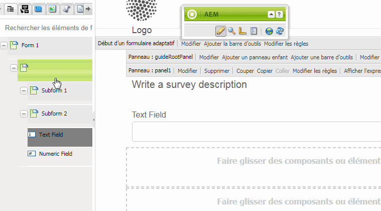
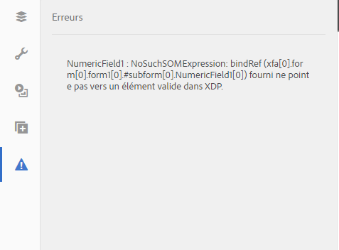

# Synchronisation de formulaires adaptatifs avec des modèles de formulaire XFA{#synchronizing-adaptive-forms-with-xfa-form-templates}

 Adobe recommande d’utiliser la capture de données moderne et extensible. [Composants principaux](https://experienceleague.adobe.com/docs/experience-manager-core-components/using/adaptive-forms/introduction.html?lang=fr) pour [création d’un Forms adaptatif](/help/forms/using/create-an-adaptive-form-core-components.md) ou [Ajout de Forms adaptatif à des pages AEM Sites](/help/forms/using/create-or-add-an-adaptive-form-to-aem-sites-page.md). Ces composants représentent une avancée significative dans la création de Forms adaptatif, ce qui garantit des expériences utilisateur impressionnantes. Cet article décrit l’approche plus ancienne de la création de Forms adaptatif à l’aide de composants de base. 

## Présentation {#introduction}

Vous pouvez créer un formulaire adaptatif basé sur un modèle de formulaire XFA (fichier `*.XDP`.). Cette réutilisation vous permet de conserver votre investissement dans les formulaires XFA existants. Pour plus d’informations sur l’utilisation d’un modèle de formulaire XFA pour créer un formulaire adaptatif, consultez la section [Créer un formulaire adaptatif basé sur un modèle](../../forms/using/creating-adaptive-form.md#p-create-an-adaptive-form-based-on-an-xfa-form-template-p).

Vous pouvez réutiliser des champs du fichier XDP dans votre formulaire adaptatif. Ces champs sont appelés champs liés. Les propriétés des champs liés (comme les scripts, les libellés et le format d’affichage) sont copiées à partir du fichier XDP. Vous pouvez également choisir de remplacer la valeur de certaines de ces propriétés.

AEM Forms permet de conserver les champs des formulaires adaptatifs synchronisés avec les modifications apportées ultérieurement aux champs correspondants du fichier XDP. Cet article explique comment activer cette synchronisation.

Dans l’environnement de création AEM Forms, vous pouvez faire glisser des champs d’un formulaire XFA (à gauche) vers un formulaire adaptatif (à droite).

## Conditions préalables {#prerequisites}

Pour utiliser les informations fournies dans cet article, il est recommandé de disposer de connaissances dans les domaines suivants :

* [Création d’un formulaire adaptatif](../../forms/using/creating-adaptive-form.md)

* XFA (XML Forms Architecture)

Pour utiliser les ressources fournies pour l’exemple de cet article, téléchargez l’exemple de package, comme expliqué dans la section suivante, voir [Exemple de package](../../forms/using/synchronizing-adaptive-forms-xfa.md#p-sample-package-p).

## Exemple de package {#sample-package}

L’article utilise un exemple pour montrer comment synchroniser le formulaire adaptatif avec un modèle de formulaire XFA mis à jour. Les ressources utilisées dans l’exemple sont disponibles dans un package qui peut être téléchargé à partir de la section [Téléchargements](../../forms/using/synchronizing-adaptive-forms-xfa.md#p-downloads-p) de cet article.

Après avoir chargé le module, vous pouvez afficher ces ressources dans l’interface utilisateur d’AEM Forms.

Installez le package à l’aide du gestionnaire de packages : `https://<server>:<port>/crx/packmgr/index.jsp`

Le package contient les ressources suivantes :

1. `sample-form.xdp` : modèle de formulaire XFA utilisé comme exemple.

1. `sample-xfa-af` : formulaire adaptatif basé sur le fichier sample-form.xdp. Ce formulaire adaptatif ne contient toutefois aucun champ. Dans l’étape suivante, vous allez ajouter du contenu à ce formulaire adaptatif.

### Ajout de contenu au formulaire adaptatif {#add-content-to-adaptive-form-br}

1. Accédez à https://&lt;serveur>:&lt;port>/aem/forms.html. Entrez vos informations d’identification si nécessaire.
1. Ouvrez le fichier sample-af-xfa pour le modifier en mode création.
1. Dans l’explorateur de contenu de la barre latérale, sélectionnez l’onglet Objets de modèle de données. Faites glisser NumericField1 et TextField1 jusqu’au formulaire adaptatif.
1. Remplacez le titre de NumericField1 de **Numeric Field** par **AF Numeric Field.**

>[!NOTE]
>
>Dans les étapes précédentes, nous avons remplacé une propriété d’un champ dans le fichier XDP. Cette propriété ne sera donc pas synchronisée si la propriété correspondante du fichier XDP est modifiée ultérieurement.

## Détection des modifications dans le fichier XDP {#detecting-changes-in-xdp-file}

Dès qu’une modification est apportée à un fichier XDP ou à un fragment, l’interface utilisateur d’AEM Forms marque tous les formulaires adaptatifs qui sont basés sur le fichier XDP ou le fragment.

Après la mise à jour d’un fichier XDP, vous devez le télécharger à nouveau dans l’interface utilisateur d’AEM Forms pour que les modifications soient marquées.

À titre d’exemple, vous allez mettre à jour le fichier `sample-form.xdp` en procédant comme suit :

1. Accédez à `https://<server>:<port>/projects.html.` Entrez vos informations d’identification si cela vous est demandé.
1. Cliquez sur l’onglet Formulaires à gauche.
1. Téléchargez le fichier `sample-form.xdp` sur votre ordinateur local. Le fichier XDP est téléchargé sous la forme d’un fichier `.zip`, qui peut être extrait à l’aide de n’importe quel utilitaire de décompression de fichiers.

1. Ouvrez le fichier `sample-form.xdp` et remplacez le titre du champ TextField1 de **Text Field** par **My Text Field**.

1. Téléchargez à nouveau le fichier `sample-form.xdp` dans l’interface utilisateur d’AEM Forms.

Si un fichier XDP est mis à jour, une icône s’affiche dans l’éditeur, lorsque vous modifiez les formulaires adaptatifs en fonction du fichier XDP. Cette icône indique que le formulaire adaptatif n’est pas synchronisé avec le fichier XDP. Dans l’illustration suivante, examinez l’icône en regard de la barre latérale.

## Synchronisation des formulaires adaptatifs avec le fichier XDP le plus récent {#synchronizing-adaptive-forms-with-the-latest-xdp-file}

Lorsqu’un formulaire adaptatif qui n’est pas synchronisé avec le fichier XDP est ouvert en vue de sa création, le message suivant s’affiche :**Schema/Form Template for the Adaptive Form has been updated. `Click Here` pour le baser sur la nouvelle version.**

Lorsque vous cliquez sur le message, les champs du formulaire adaptatif sont synchronisés avec les champs correspondants du fichier XDP.

Pour l’exemple utilisé dans cet article, ouvrez le fichier `sample-xfa-af` en mode création. Le message s’affiche dans la partie inférieure du formulaire adaptatif.

### Mise à jour des propriétés {#updating-the-properties}

Toutes les propriétés qui ont été copiées du fichier XDP vers le formulaire adaptatif sont mises à jour, à l’exception des propriétés qui ont été explicitement remplacées dans le formulaire adaptatif (à partir de la boîte de dialogue Composant) par l’auteur. La liste des propriétés qui ont été mises à jour est disponible dans les journaux du serveur.

Pour mettre à jour les propriétés dans l’exemple de formulaire adaptatif, cliquez sur le lien (intitulé `"Click Here"`) du message. Le titre de TextField1 change de **Text Field** en **My Text Field**.

>[!NOTE]
>
>Le libellé AF Numeric Field n’a pas été modifié, car vous avez remplacé cette propriété dans la boîte de dialogue des propriétés du composant, comme décrit dans la section [Ajouter du contenu aux formulaires adaptatifs](../../forms/using/synchronizing-adaptive-forms-xfa.md#p-add-content-to-adaptive-form-br-p).

### Ajout de nouveaux champs du fichier XDP au formulaire adaptatif   {#adding-new-fields-from-xdp-file-to-adaptive-form-nbsp}

Tous les champs qui sont ajoutés ultérieurement au fichier XDP d’origine apparaissent dans l’onglet Hiérarchie du formulaire et vous pouvez les faire glisser vers le formulaire adaptatif.

Il n’est pas nécessaire de cliquer sur le lien du message d’erreur pour mettre à jour les champs dans l’onglet Hiérarchie du formulaire.

### Champs supprimés du fichier XDP {#deleted-fields-in-xdp-file}

Si un champ qui a été copié précédemment dans un formulaire adaptatif est supprimé d’un fichier XDP, un message d’erreur s’affiche en mode création pour indiquer que le champ n’existe pas dans le fichier XDP. Dans ce cas, supprimez manuellement le champ du formulaire adaptatif ou effacez la propriété `bindRef` dans la boîte de dialogue Composant.

Les étapes suivantes illustrent ce flux d’utilisation des ressources dans l’exemple utilisé dans cet article :

1. Mettez à jour le fichier `sample-form.xdp` et supprimez NumericField1.
1. Téléchargez le fichier `sample-form.xdp` dans l’interface utilisateur d’AEM Forms.
1. Ouvrez le formulaire adaptatif `sample-xfa-af` en vue de sa création. Le message d’erreur suivant s’affiche : Le schéma/le modèle de formulaire du formulaire adaptatif a été mis à jour. `Click Here` pour le baser sur la nouvelle version.

1. Cliquez sur le lien (intitulé « `Click Here` ») du message. Un message d’erreur s’affiche indiquant que le champ n’existe plus dans le fichier XDP.

Le champ qui a été supprimé est également signalé par une icône pour indiquer une erreur dans le champ.

>[!NOTE]
>
>Les champs du formulaire adaptatif ayant une liaison incorrecte (une valeur `bindRef` incorrecte dans la boîte de dialogue Modifier) sont également considérés comme des champs supprimés. Si l’auteur ne corrige pas ces erreurs et publie le formulaire adaptatif, le champ est traité comme un champ de formulaire adaptatif non lié normal et est inclus dans la section unbinded du fichier XML de sortie.

## Téléchargements {#downloads}

Package de contenu pour l’exemple dans cet article

[Obtenir le fichier](assets/sample-xfa-af-sync-1.0.zip)
