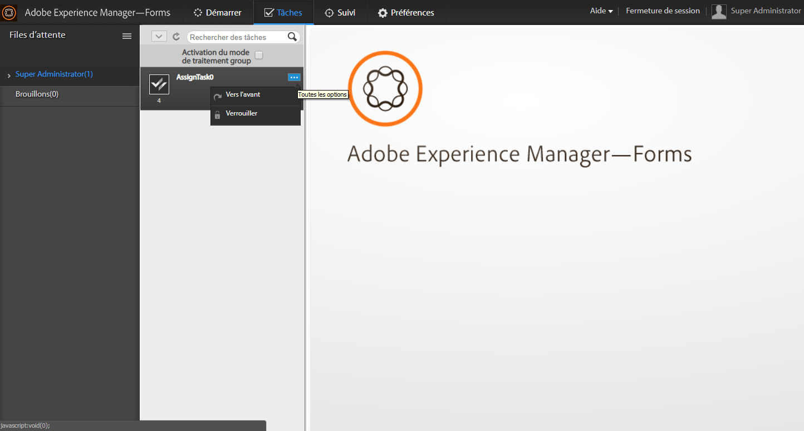

# Gestion des tâches dans une hiérarchie organisationnelle à l’aide de la vue du gestionnaire{#managing-tasks-in-an-organizational-hierarchy-using-manager-view}

Dans l’espace de travail AEM Forms, les gestionnaires peuvent désormais accéder à toutes les tâches assignées aux personnes au sein de leur hiérarchie (rapports directs ou indirects) et y effectuer diverses opérations. Les tâches sont accessibles par l’intermédiaire de l’onglet Tâches de l’espace de travail AEM Forms. Les actions prises en charge pour les tâches de rapports directs sont :

**Transférer** une tâche du rapport direct à tout utilisateur.

**Demander** une tâche d&#39;un rapport direct.

**Demander et ouvrir** Demander une tâche d&#39;un rapport direct et l&#39;ouvrir automatiquement dans la liste Tâches du gestionnaire.

**Rejeter** Rejeter une tâche envoyée à un rapport direct par un autre utilisateur. Cette option est disponible pour les tâches transférées vers un rapport direct par d’autres utilisateurs.

AEM Forms restreint l’accès d’un utilisateur aux seules tâches pour lesquelles cet utilisateur dispose d’un contrôle d’accès (ACL). Ceci permet de garantir que l’utilisateur ne puisse extraire que les tâches pour lesquelles il dispose de droits d’accès. En utilisant des services Web et des implémentations tiers pour définir la hiérarchie, une organisation peut personnaliser la définition des rapports directs et gestionnaires selon ses besoins.

1. Créez un DSC. For more information, see &#39;Developing Components for AEM Forms&#39; topic in [Programming with AEM Forms](https://www.adobe.com/go/learn_aemforms_programming_63) guide.
1. Dans le DSC, définissez une nouvelle SPI pour la gestion de hiérarchie afin de définir les rapports directs et la hiérarchie des utilisateurs d’AEM Forms. Voici un exemple de fragment de code Java™ :

   ```java
   public class MyHierarchyMgmtService
   {
        /*
       Input : Principal Oid for a livecycle user
       Output : Returns true when the user is either the service invoker OR his direct/indirect report.
       */
       boolean isInHierarchy(String principalOid) {
   
       }
   
       /*
       Input : Principal Oid for a livecycle user
       Output : List of principal Oids for direct reports of the livecycle user
       A user may get direct reports only for himself OR his direct/indirect reports.
       So the API is functionally equivalent to -
       isInHierarchy(principalOid) ? <return direct reports> : <return empty list>
       */
       List<String> getDirectReports(String principalOid) {
   
       }
   
       /*
       Returns whether a livecycle user has direct reports or not.
       It's functionally equivalent to -
       getDirectReports(principalOid).size()>0
       */
       boolean isManager(String principalOid) {
   
       }
   }
   ```

1. Créez un fichier component.xml. Veuillez vous assurer que spec-id est identique à l’extrait de code ci-dessous. Voici un exemple de fragment de code que vous pouvez réutiliser.

   ```xml
   <component xmlns="https://adobe.com/idp/dsc/component/document">
       <component-id>com.adobe.sample.SampleDSC</component-id>
       <version>1.1</version>
       <supports-export>false</supports-export>
         <descriptor-class>com.adobe.idp.dsc.component.impl.DefaultPOJODescriptorImpl</descriptor-class>
         <services>
           <service name="MyHierarchyMgmtService" title="My hierarchy management service" orchestrateable="false">
           <auto-deploy service-id="MyHierarchyMgmtService" category-id="Sample DSC" major-version="1" minor-version="0" />
           <description>Service for resolving hierarchy management.</description>
            <specifications>
            <specification spec-id="com.adobe.idp.taskmanager.dsc.enterprise.HierarchyManagementProvider"/>
            </specifications>
           <specification-version>1.0</specification-version>
           <implementation-class>com.adobe.sample.hierarchymanagement.MyHierarchyMgmtService</implementation-class>
           <request-processing-strategy>single_instance</request-processing-strategy>
           <supported-connectors>default</supported-connectors>
           <operation-config>
               <operation-name>*</operation-name>
               <transaction-type>Container</transaction-type>
               <transaction-propagation>supports</transaction-propagation>
               <!--transaction-timeout>3000</transaction-timeout-->
           </operation-config>
           <operations>
               <operation anonymous-access="true" name="isInHierarchy" method="isInHierarchy">
                   <input-parameter name="principalOid" type="java.lang.String" />
                   <output-parameter name="result" type="java.lang.Boolean"/>
               </operation>
               <operation anonymous-access="true" name="getDirectReports" method="getDirectReports">
                   <input-parameter name="principalOid" type="java.lang.String" />
                   <output-parameter name="result" type="java.util.List"/>
               </operation>
               <operation anonymous-access="true" name="isManager" method="isManager">
                   <input-parameter name="principalOid" type="java.lang.String" />
                   <output-parameter name="result" type="java.lang.Boolean"/>
               </operation>
               </operations>
               </service>
         </services>
   </component>
   ```

1. Déployez DSC via Workbench. Redémarrez `ProcessManagementTeamTasksService` le service.
1. Il se peut que vous ayez à actualiser votre navigateur ou à vous déconnecter/connecter de nouveau avec l’utilisateur.

L’écran suivant illustre l’accès aux tâches de rapports directs et les actions disponibles.



Accès aux tâches de rapports directs et actions à effectuer sur les tâches
