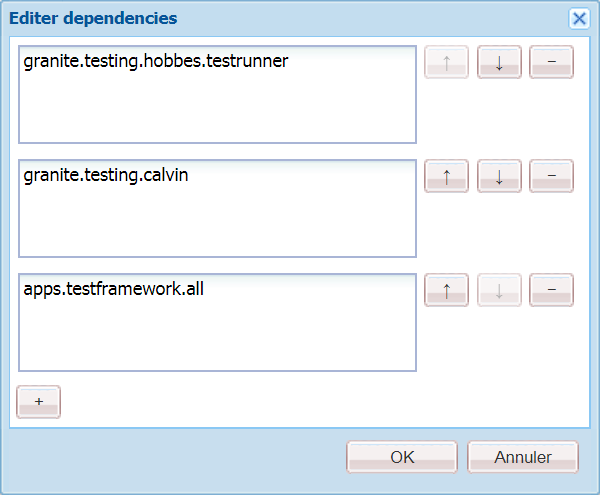
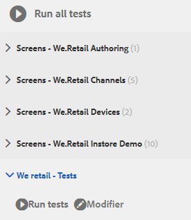
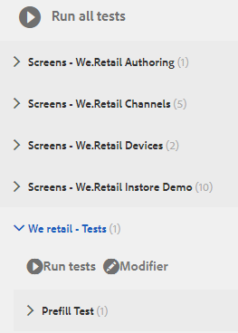
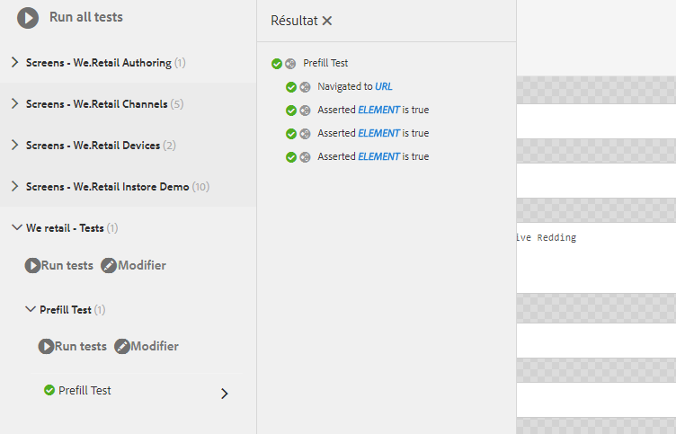

# Didacticiel : Test de votre formulaire adaptatif{#tutorial-testing-your-adaptive-form}


Ce didacticiel est une étape de la série [Création de votre premier formulaire adaptatif](https://helpx.adobe.com/experience-manager/6-3/forms/using/create-your-first-adaptive-form.html). Il est recommandé de suivre la série dans l’ordre chronologique pour comprendre, exécuter et démontrer le cas d’utilisation complet du didacticiel.

Une fois le formulaire adaptatif prêt, il est important de le tester avant de le déployer pour les utilisateurs finaux. Vous pouvez tester manuellement (tests fonctionnels) chaque champ ou automatiser le test de votre formulaire adaptatif. Lorsque vous disposez de plusieurs formulaires adaptatifs, le test manuel de chaque champ de tous les formulaires adaptatifs devient un  intimidant.

AEM Forms fournit une structure de test, Calvin, pour automatiser le test de vos formulaires adaptatifs. Grâce au framework, vous développez et exécutez des tests d’IU directement dans un navigateur Web. La structure fournit des API JavaScript pour la création de tests. Les tests automatisés vous permettent de tester l’expérience de préremplissage d’un formulaire adaptatif, d’envoyer l’expérience d’un formulaire adaptatif, de   règles, des validations, du chargement différé et des interactions avec l’interface utilisateur. Ce didacticiel décrit les étapes à suivre pour créer et exécuter des tests automatisés sur un formulaire adaptatif. À la fin de ce didacticiel, vous serez capable de :

* [Création d’une suite de tests pour votre formulaire adaptatif](../../forms/using/testing-your-adaptive-form.md#step-create-a-test-suite)
* [Création de tests pour votre formulaire adaptatif](../../forms/using/testing-your-adaptive-form.md#step-create-a-test-case-to-prefill-values-in-an-adaptive-form)
* [Exécution de la suite de tests et des tests créés pour votre formulaire adaptatif](#step-run-all-the-tests-in-a-suite-or-individual-tests-cases)

## Étape 1 : Création d’une suite de tests {#step-create-a-test-suite}

Les suites de tests comportent une collection de cas de test. Vous pouvez avoir plusieurs suites de tests. Il est recommandé d’avoir une suite de tests distincte pour chaque formulaire. Pour créer une suite de tests :

1. Connectez-vous à l’instance d’auteur AEM Forms en tant qu’administrateur. Ouvrez CRXDE Lite. Vous pouvez appuyer sur Logo AEM > **Outils** > **Général** > **CRXDE Lite** [ou ouvrir l’URL https://localhost:4502/crx/de/index.jsp dans un navigateur pour ouvrir CRXDE Lite.](https://localhost:4502/crx/de/index.jsp)

1. Accédez à /etc/clientlibs dans CRXDE Lite. Cliquez avec le bouton droit sur le sous-dossier /etc/clientlibs et sélectionnez **Créer** > **Créer un nœud.** Dans le champ Nom, saisissez **WeRetailFormTestCase**. Sélectionnez le type **cq:ClientLibraryFolder** et cliquez sur **OK**. Il crée un noeud. Vous pouvez utiliser n’importe quel nom à la place de WeRetailFormTestCase.
1. Add the following properties to the WeRetailFormTestCases node and tap **Save ALL**.

<table>
 <tbody>
  <tr>
   <td><strong>Propriétés</strong></td>
   <td><strong>Type</strong></td>
   <td><strong>Multi</strong></td>
   <td><strong>Valeur</strong></td>
  </tr>
  <tr>
   <td>categories</td>
   <td>Chaîne</td>
   <td>Activé</td>
   <td>
    <ul>
     <li>granite.testing.hobbes.tests<br /> </li>
     <li>granite.testing.calvin.tests</li>
    </ul> </td>
  </tr>
  <tr>
   <td>dependencies</td>
   <td>Chaîne</td>
   <td>Activé</td>
   <td>
    <ul>
     <li>granite.testing.hobbes.testrunner <br /> </li>
     <li>granite.testing.calvin <br /> </li>
     <li>apps.testframework.all</li>
    </ul> </td>
  </tr>
 </tbody>
</table>

Assurez-vous que chaque propriété est ajoutée à une zone distincte, comme illustré ci-dessous :



1. Right-click the **[!UICONTROL WeRetailFormTestCases]** node click **Create** > **Create File**. In the Name field, type `js.txt` and click **OK**.
1. Ouvrez le fichier js.txt pour le modifier, ajoutez le code suivant, puis enregistrez le fichier :

   ```
   #base=.
    init.js
   ```

1. Créez un fichier, init.js, dans le `WeRetailFormTestCases`noeud. Ajouter le code ci-dessous dans le fichier et appuyez sur **[!UICONTROL Enregistrer tout]**.

   ```
   (function(window, hobs) {
       'use strict';
       window.testsuites = window.testsuites || {};
     // Registering the test form suite to the sytem
     // If there are other forms, all registration should be done here
       window.testsuites.testForm3 = new hobs.TestSuite("We retail - Tests", {
           path: '/etc/clientlibs/WeRetailFormTestCases/init.js',
           register: true
       });
    // window.testsuites.testForm2 = new hobs.TestSuite("testForm2");
   }(window, window.hobs));
   ```

   Le code ci-dessus crée une suite de tests nommée **Nous vendons au détail - Tests**.

1. Ouvrez l’interface utilisateur des tests AEM (AEM > Outils > Opérations > Tests). La suite de tests - **Nous vendons au détail - Tests** - est répertoriée dans l’interface utilisateur.

   

## Étape 2 : Création d’un cas de test pour préremplir des valeurs dans un formulaire adaptatif {#step-create-a-test-case-to-prefill-values-in-an-adaptive-form}

Un cas de test est un ensemble d’actions permettant de tester une fonctionnalité spécifique. Par exemple, le préremplissage de tous les champs d’un formulaire et la validation de quelques champs pour vous assurer que les valeurs correctes sont saisies.

Une action est un  spécifique  sur un formulaire adaptatif, tel qu’un clic sur un bouton. Pour créer un cas de test et des actions permettant de valider les entrées utilisateur pour chaque champ de formulaire adaptatif :

1. Dans CRXDE Lite, accédez au `/content/forms/af/create-first-adaptive-form` dossier. Cliquez avec le bouton droit sur le noeud de dossier **[!UICONTROL create-first-adaptive-form]** et cliquez sur **[!UICONTROL Créer]**> **[!UICONTROL Créer un fichier]**. In the Name field, type `prefill.xml` and click **[!UICONTROL OK]**. Ajoutez le code suivant au fichier 

   ```xml
   <?xml version="1.0" encoding="UTF-8"?><afData>
     <afUnboundData>
       <data>
         <customer_ID>371767</customer_ID>
         <customer_Name>John Jacobs</customer_Name>
         <customer_Shipping_Address>1657 1657 Riverside Drive Redding</customer_Shipping_Address>
         <customer_State>California</customer_State>
         <customer_ZIPCode>096001</customer_ZIPCode>
        </data>
     </afUnboundData>
     <afBoundData>
       <data xmlns:xfa="https://www.xfa.org/schema/xfa-data/1.0/"/>
     </afBoundData>
   </afData>
   ```

1. Accédez à `/etc/clientlibs`. Right-click the `/etc/clientlibs` subfolder and click **[!UICONTROL Create]**> **[!UICONTROL Create Node]**.

   Dans le champ **[!UICONTROL Nom]** , saisissez `WeRetailFormTests`. Sélectionnez le type `cq:ClientLibraryFolder` et cliquez sur **[!UICONTROL OK]**.

1. Add the following properties to the **[!UICONTROL WeRetailFormTests]** node.

<table>
 <tbody>
  <tr>
   <td><strong>Propriétés</strong></td>
   <td><strong>Type</strong></td>
   <td><strong>Multi</strong></td>
   <td><strong>Valeur</strong></td>
  </tr>
  <tr>
   <td>categories</td>
   <td>Chaîne</td>
   <td>Activé</td>
   <td>
    <ul>
     <li>granite.testing.hobbes.tests<br /> </li>
     <li>granite.testing.hobbes.tests.testForm</li>
    </ul> </td>
  </tr>
  <tr>
   <td>dependencies</td>
   <td>Chaîne</td>
   <td>Activé</td>
   <td>
    <ul>
     <li>granite.testing.calvin.tests</li>
    </ul> </td>
  </tr>
 </tbody>
</table>

1. Créez un fichier, js.txt, dans le noeud **[!UICONTROL WeRetailFormTests]** . Ajouter les éléments suivants dans le fichier :

   ```shell
   #base=.
   prefillTest.js
   ```

   Cliquez sur **[!UICONTROL Enregistrer tout]**.

1. Créez un fichier `prefillTest.js`,dans le noeud **[!UICONTROL WeRetailFormTests]** . Ajouter le code ci-dessous dans le fichier. Le code crée un cas de test. Le cas de test préremplit tous les champs d’un formulaire et valide certains champs afin de s’assurer que les valeurs correctes sont saisies.

   ```
   (function (window, hobs) {
       'use strict';
   
       var ts = new hobs.TestSuite("Prefill Test", {
           path: '/etc/clientlibs/WeRetailFormTests/prefillTest.js',
           register: false
       })
   
       .addTestCase(new hobs.TestCase("Prefill Test")
           // navigate to the testForm which is to be test
           .navigateTo("/content/forms/af/create-first-adaptive-form/shipping-address-add-update-form.html?wcmmode=disabled&dataRef=crx:///content/forms/af/create-first-adaptive-form/prefill.xml")
           // check if adaptive form is loaded
           .asserts.isTrue(function () {
               return calvin.isFormLoaded()
           })
           .asserts.isTrue(function () {
               return calvin.model("customer_ID").value == 371767;
           })
           .asserts.isTrue(function () {
               return calvin.model("customer_ZIPCode").value == 96001;
           })
       );
   
       // register the test suite with testForm
       window.testsuites.testForm3.add(ts);
   
   }(window, window.hobs));
   ```

   Le cas de test est créé et prêt à être exécuté. Vous pouvez créer des cas de test pour valider divers aspects d’un formulaire adaptatif, comme vérifier l’exécution du script calculate, valider des modèles et valider l’expérience d’envoi d’un formulaire adaptatif. Pour plus d’informations sur les différents aspects du test des formulaires adaptatifs, voir Test automatique des formulaires adaptatifs.

## Étape 3 : Exécution de tous les tests dans une suite ou des cas de tests individuels {#step-run-all-the-tests-in-a-suite-or-individual-tests-cases}

Une suite de tests peut comporter plusieurs cas de test. Vous pouvez exécuter tous les cas de test d’une suite de tests simultanément ou individuellement. Lorsque vous exécutez un test, les icônes indiquent les résultats :

* A checkmark icon indicates a passed test: 
* An &quot;X&quot; icon indicates a failed test: 

1. Accédez à l’icône AEM > **[!UICONTROL Outils]**> **[!UICONTROL Opérations]**> **[!UICONTROL Tests]**
1. Pour exécuter tous les tests de la suite de tests :

   1. Dans le panneau Tests, appuyez sur **[!UICONTROL Nous commercialisons - Tests (1)]**. Elle s’étend pour afficher les  de test.
   1. Appuyez sur le bouton **[!UICONTROL Exécuter les tests]** . La zone vierge sur le côté droit de l’écran est remplacée par le formulaire adaptatif au cours de l’exécution du test.
   

1. Pour exécuter un seul test à partir de la suite de tests :

   1. Dans le panneau Tests, appuyez sur **[!UICONTROL Nous commercialisons - Tests (1)]**. Elle s’étend pour afficher les  de test.
   1. Appuyez sur Test **[!UICONTROL de]** préremplissage et sur le bouton **[!UICONTROL Exécuter les tests]** . La zone vierge sur le côté droit de l’écran est remplacée par le formulaire adaptatif au cours de l’exécution du test.

1. Appuyez sur le nom du test, Test de préremplissage, pour examiner les résultats du cas de test. Il ouvre le panneau Résultat. Appuyez sur le nom de votre cas de test dans le du panneau Résultat  tous les détails du test.

   

Le formulaire adaptatif est maintenant prêt pour la publication.
