# Création et utilisation des thèmes {#creating-and-using-themes}

## Présentation {#introduction}

Vous pouvez créer et appliquer des thèmes pour styliser un formulaire adaptatif ou une communication interactive. Un thème contient des détails de style pour les composants et les panneaux. Ces styles incluent les propriétés telles que les couleurs d’arrière-plan, les couleurs d’état, la transparence, l’alignement et la taille. Lorsque vous appliquez un thème, le style spécifié se reflète sur les composants correspondants. Les thèmes sont gérés de manière indépendante sans référence à un formulaire adaptatif ou à une communication interactive.

Vous pouvez :

* Création d’un thème
* Modifier et copier un thème existant
* Télécharger et charger un thème existant sur le serveur AEM Forms
* Gérer les dépendances pour un thème

## Création, téléchargement ou chargement d’un thème {#creating-downloading-or-uploading-a-theme}

Avec AEM Forms, vous pouvez créer, télécharger ou charger des thèmes. Un thème est créé comme d’autres actifs tels que les formulaires, les documents et les lettres. Le thème est enregistré en tant qu’entité distincte, avec des propriétés de métadonnées comme les formulaires. Les thèmes en tant qu’entité séparée peuvent être réutilisés dans plusieurs formulaires adaptatifs et communications interactives. Vous pouvez également déplacer un thème vers une autre instance d’AEM Forms et le réutiliser.

### Création d’un thème {#creating-a-theme}

Procédez comme suit pour créer un thème :

1. Cliquez sur **Adobe Experience Manager**, cliquez sur **Formulaires**, puis sur **Thèmes**.

1. Dans la page Thèmes, cliquez sur **Créer > Thème**.
Un assistant de création d’un thème se lance.

1. Dans l’onglet Réglages de base de l’assistant de création de thème, indiquez le **titre** et le **nom** du thème. Il s’agit de champs obligatoires.

1. Dans l’onglet Avancé, vous avez deux champs :

   * **Emplacement** de la bibliothèque cliente : Emplacement dans le référentiel qui stocke les clientlibs pour le thème.

   * **Catégorie** Clientlib : Fournit un champ de texte permettant de saisir le nom de la catégorie clientlib pour le thème.

1. Cliquez sur **Créer**, puis sur **Modifier** pour ouvrir le thème dans l’éditeur de thème, ou cliquez sur **Terminé** pour revenir à la page thèmes.

### Téléchargement d’un thème {#downloading-a-theme}

Vous pouvez exporter des thèmes dans un fichier .zip et les utiliser dans d’autres projets ou instances AEM. Pour télécharger un thème :

1. Cliquez sur **Adobe Experience Manager**, cliquez sur **Formulaires**, puis sur **Thèmes**.

1. Dans la page Thèmes, **sélectionnez** un thème, puis cliquez sur **Télécharger**. Une boîte de dialogue contenant les détails du thème s’affiche.

1. Cliquez sur **Télécharger**. Le thème est téléchargé sous forme de fichier .zip.

>[!NOTE]
>
>Si vous téléchargez un thème auquel un formulaire adaptatif est associé et que ce dernier est basé sur un modèle personnalisé, téléchargez également le modèle personnalisé. Lorsque vous chargez le thème téléchargé et le formulaire adaptatif sur un serveur AEM Forms, téléchargez également le modèle personnalisé associé.

### Chargement d’un thème {#uploading-a-theme}

Vous pouvez utiliser les thèmes créés avec des paramètres prédéfinis de style sur votre projet. Vous pouvez importer des packages de thème que d’autres créent en les chargeant sur votre projet.

Pour charger un thème :

1. Cliquez sur **Adobe Experience Manager**, cliquez sur **Formulaires**, puis sur **Thèmes**.

1. Sur la page Thèmes, cliquez sur **Créer > Chargement de fichier**.
1. Dans l’invite de téléchargement de fichier, recherchez et sélectionnez un package de thème sur votre ordinateur et cliquez sur **Charger**.
Le thème chargé est disponible dans la page Thèmes.

## Métadonnées d’un thème {#metadata-of-a-theme}

Liste de propriétés des métadonnées d’un thème (sur la page Propriétés d’un thème).

<table>
 <tbody>
  <tr>
   <th>
<strong>ID</strong>
 
 
 </th>
   <th><strong>Nom</strong></th>
   <th><strong>Peut être modifié </strong></th>
   <th><strong>Description de la propriété </strong></th>
  </tr>
  <tr>
   <td>1.</td>
   <td>Titre</td>
   <td>Oui</td>
   <td>Nom d’affichage du thème.</td>
  </tr>
  <tr>
   <td>2.</td>
   <td>Description</td>
   <td>Oui</td>
   <td>Description du thème.</td>
  </tr>
  <tr>
   <td>3.</td>
   <td>Type</td>
   <td>Non</td>
   <td>
    <ul>
     <li>Type d’actif.</li>
     <li>La valeur est toujours Thème.</li>
    </ul> </td>
  </tr>
  <tr>
   <td>4.</td>
   <td>Créé</td>
   <td>Non</td>
   <td>Date de création du thème</td>
  </tr>
  <tr>
   <td>5.</td>
   <td>Nom de l’auteur</td>
   <td>Oui</td>
   <td>Auteur du thème. Calculé au moment de la création du thème.</td>
  </tr>
  <tr>
   <td>6.</td>
   <td>Date de la dernière modification</td>
   <td>Non</td>
   <td>Date à laquelle le thème a été modifié la dernière fois.</td>
  </tr>
  <tr>
   <td>7.</td>
   <td>État</td>
   <td>Non</td>
   <td>État du thème (modifié/publié).</td>
  </tr>
  <tr>
   <td>8.</td>
   <td>Heure de publication</td>
   <td>Oui</td>
   <td>Heure de publication automatique du thème.</td>
  </tr>
  <tr>
   <td>9.</td>
   <td>Heure de désactivation de la publication</td>
   <td>Oui</td>
   <td>Heure de désactivation de la publication automatique du thème.</td>
  </tr>
  <tr>
   <td>10.</td>
   <td>Balises</td>
   <td>Oui</td>
   <td>Un libellé lié au thème pour l’identification utilisée pour améliorer la recherche.</td>
  </tr>
  <tr>
   <td>11.</td>
   <td>Références</td>
   <td>Liens</td>
   <td>
    <ul>
     <li>Contient la section "Référencé par". Répertorie les formulaires qui utilisent le thème.</li>
     <li>Etant donné que le thème ne fait référence à aucun autre actif, il n’y a pas de section « Référence ».</li>
    </ul> </td>
  </tr>
  <tr>
   <td>12.</td>
   <td>Emplacement de la bibliothèque cliente</td>
   <td>Oui</td>
   <td>
    <ul>
     <li>Le chemin d’accès défini par l’utilisateur du référentiel de « /etc » dans lequel les bibliothèques clientes correspondant à ce thème sont stockées.</li>
     <li>Valeur par défaut : « /etc/clientlibs/fd/themes » + chemin d’accès relatif de l’actif du thème.</li>
     <li>Si l’emplacement n’existe pas, la hiérarchie des dossiers est générée automatiquement.</li>
     <li>Lorsque cette valeur change, la structure de nœud clientlib est déplacée vers le nouvel emplacement saisi.  <em><strong>Remarque : </strong> si vous modifiez l’emplacement par défaut de clientlib, dans le référentiel CRXDE, affectez-le  <code>crx:replicate, rep:write, rep:glob:*, rep:itemNames:: js.txt, jcr:read </code>à  <code>forms-users</code> et  <code>crx:replicate</code>à  <code>jcr:read </code>  <code>fd-service</code> l’emplacement suivant. Associez également une autre liste ACL en ajoutant <code>deny jcr:addChildNodes</code> pour <code>forms-user</code></em></li>
    </ul> </td>
  </tr>
  <tr>
   <td>13.</td>
   <td>Nom de la catégorie de bibliothèque cliente</td>
   <td>Oui</td>
   <td>
    <ul>
     <li>Nom de la catégorie de bibliothèque cliente défini par l’utilisateur pour ce thème.</li>
     <li>Un message d’erreur s’affiche si le nom est déjà utilisé par un autre thème existant.</li>
     <li>Valeur par défaut : calculée à l’aide de l’emplacement du thème.</li>
     <li>Lorsque cette valeur est modifiée, le nom de la catégorie est mis à jour sur le nœud de la bibliothèque cliente correspondant. La mise à jour du Nom de la catégorie de bibliothèque cliente dans les fichiers jsp n’est pas obligatoire, car le nom de la catégorie de bibliothèque cliente est utilisé par référence.</li>
    </ul> </td>
  </tr>
 </tbody>
</table>

## A propos de l’éditeur de thème {#about-the-theme-editor}

AEM Forms est assorti d’un éditeur de thème. Il s’agit d’une interface conviviale pour les utilisateurs professionnels et les concepteurs Web/développeurs qui fournit les fonctionnalités nécessaires pour spécifier le style de divers formulaires adaptatifs et éléments de communication interactifs facilement. Lorsque vous créez un thème, il est stocké en tant qu’entité distincte telle que les formulaires, les communications interactives, les lettres, les fragments de document et les dictionnaires de données.

L’éditeur de thèmes vous permet de personnaliser les styles des composants mis en forme dans un thème. Vous pouvez personnaliser l’apparence d’un formulaire ou d’une communication interactive sur un périphérique.

L’éditeur de thème est divisé en deux panneaux :

* **Zone de travail**  - Apparaît sur le côté droit. Elle illustre un exemple de formulaire adaptatif ou de communication interactive dans lequel toutes les modifications de style sont immédiatement répercutées. Vous pouvez également sélectionner des objets directement à partir de la zone de travail pour consulter les styles qui y sont associés et les modifier. Une règle de résolution du périphérique dans la partie supérieure régit la zone de travail. La sélection d’un point d’arrêt de résolution de la règle affiche l’aperçu de l’exemple de formulaire ou de communication interactive à la résolution appropriée. La zone de travail est expliquée en détails [ci-dessous](../../forms/using/themes.md#using-canvas).

* **Encadré** : apparaît sur le côté gauche. Il comporte les éléments suivants :

   * **Sélecteur :** affiche le composant sélectionné pour le style, ainsi que ses propriétés dont vous pouvez définir le style. Le sélecteur représente tous les composants d’un type. Si vous sélectionnez un composant de zone de texte dans un thème pour le style, toutes les zones de texte de votre formulaire ou de votre communication interactive héritent du style. Les sélecteurs vous permettent de choisir un composant générique ou un composant spécifique pour le style. Par exemple, un composant de champ est un composant générique, et une zone de texte est un composant spécifique.

      **Mettre en forme un composant générique :** un champ peut être un champ de zone numérique, tel que l’âge, ou un champ de zone de texte, tel qu’une adresse.
Lorsque vous mettez en forme un champ, tous les champs tels que l’âge, le nom et l’adresse sont stylisés.

      **Mise en forme d’un composant spécifique** : un composant spécifique a un impact sur les objets de la catégorie spécifique. Lorsque vous appliquez un style au composant numérique de la zone dans le thème, seul l’objet numérique de zone hérite du style.

      Par exemple, un champ de zone de texte tel qu’une adresse est plus long et un champ de zone numérique tel qu’un âge est plus court. Vous pouvez sélectionner un champ de zone numérique, réduire sa longueur et l’appliquer à votre formulaire. La largeur de tous les champs de zone numérique est réduite dans votre formulaire.

      Lorsque vous personnalisez tous les composants de champ avec une couleur d’arrière-plan spécifique, tous les champs tels que l’âge, le nom et l’adresse héritent de la couleur d’arrière-plan. Lorsque vous sélectionnez une zone numérique, telle que l’âge, et réduisez sa largeur, toutes les zones numériques telles que l’âge et le nombre de personnes dans une famille sont réduites. La largeur des champs de texte n’est pas modifiée.

   * **Etat :** permet de personnaliser les styles d’un objet dans un état spécifique. Par exemple, vous pouvez spécifier l’aspect d’un objet lorsqu’il est à l’état par défaut, mis au point, désactivé, survolé ou d’erreur.
   * **Catégories de propriété :** les propriétés de style sont divisées en différentes catégories. Par exemple, Dimension et position, Texte, Arrière-plan, Bordure et Effets. Sous chaque catégorie, vous fournissez des informations de mise en forme. Par exemple, sous Arrière-plan, vous pouvez indiquer la Couleur d’arrière-plan, l’Image et le Dégradé de l’arrière-plan.

   * **Avancé : vous** permet d’ajouter un CSS personnalisé à un objet, qui remplace les propriétés que les contrôles visuels définissent en cas de chevauchement.

   * **Affichage CSS** : vous permet d’afficher le fichier CSS du composant sélectionné
   En outre, dans la barre latérale, vous verrez une flèche dans la partie inférieure. Lorsque vous cliquez sur la flèche, vous bénéficiez de deux options supplémentaires : **Simuler la réussite** et **Simuler une erreur.** Ces options, ainsi que les options décrites ci-dessus, sont expliquées en détails [ci-dessous](../../forms/using/themes.md#using-rail).

[ 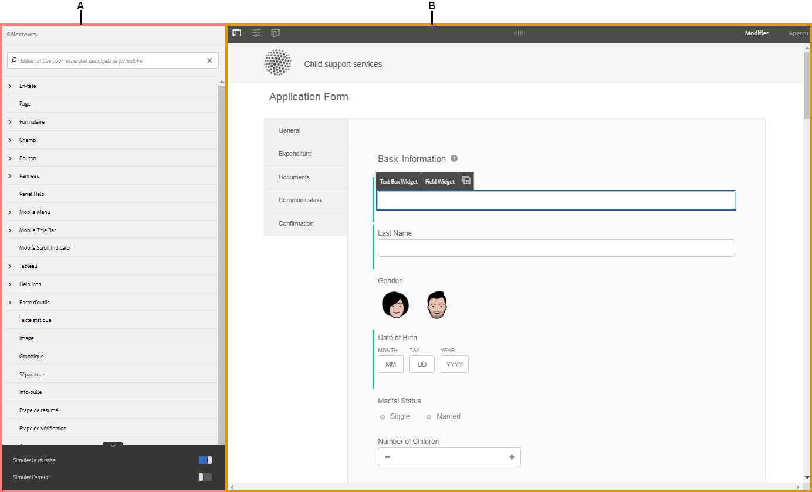](assets/themes-1.png) **A.** Barre latérale  **B.** Canvas

### Mise en forme des composants {#styling-components}

Vous pouvez utiliser un thème dans plusieurs formulaires adaptatifs et communications interactives, ce qui importe le formatage des composants que vous avez spécifié dans le thème. Vous pouvez mettre en forme divers composants tels que les titres, la description, les panneaux, les champs, les icônes et les zones de texte. Utilisez des widgets pour configurer les propriétés des composants dans un thème. La connaissance préalable du code CSS ou LESS n’est pas obligatoire mais souhaitée, même si la section Remplacements de CSS vous permet d’écrire un code CSS ou de fournir des sélecteurs personnalisés. La section Remplacements de CSS apparaît lorsque vous sélectionnez un composant dans l’encadré.

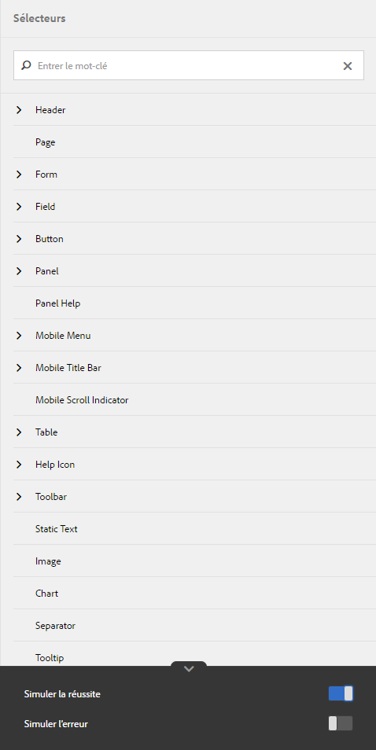

Les options de la barre latérale vous permettent de sélectionner et de mettre en forme différents composants.

Cliquer sur le bouton Modifier au niveau d’un composant dans l’encadré sélectionne le composant dans Zone de travail et vous permet de mettre en forme le composant à l’aide des options de l’encadré.

Certains composants tels que la zone de texte, la zone numérique, le bouton radio et la case à cocher sont classés sous des composants génériques comme Champ. Par exemple, vous souhaitez personnaliser le style des boutons radio. Pour sélectionner des boutons radio à mettre en forme, sélectionnez **Champ > Widget > Bouton-radio**.

Cliquez sur **DÉVELOPPER TOUT** dans l’encadré pour afficher, sélectionner et mettre en forme les composants classés qui ne sont pas visibles immédiatement.

### Mise en forme des mises en page de panneau{#styling-panel-layouts-br} 

Les thèmes dans AEM Forms prennent en charge le style d’éléments de la mise en page des panneaux dans vos formulaires et vos communications interactives. La mise en forme d’éléments de mises en page prêtes à l’emploi et personnalisées est prise en charge.

Les panneaux prêts à l’emploi comprennent :

* Onglets sur la gauche
* Onglets dans la partie supérieure
* Accordéon
* Réactive
* Assistant
* Mise en page mobile

   * Titres de panneau dans l’en-tête
   * Sans titres de panneau dans l’en-tête

Les sélecteurs varient pour chaque mise en page.
 La mise en forme des mises en page personnalisées à partir de l’éditeur de thèmes implique ce qui suit :

* La définition des composants pour une mise en page pouvant être mise en forme, et les sélecteurs CSS pour identifier de manière unique ces composants
* La définition des propriétés CSS pouvant être appliquées sur ces composants
* Définissez la mise en forme de ces composants de manière interactive à partir de l’interface utilisateur

### Styles différents pour différentes tailles d’écran {#different-styles-for-different-screen-sizes-br}

Les mises en page sur les périphériques de bureau et mobiles ont parfois des styles légèrement ou entièrement différents. Pour les périphériques mobiles, la tablette et le téléphone partagent des mises en page similaires, à l’exception des tailles des composants.

Utilisez des points d’arrêt de l’éditeur de thème pour définir une autre mise en forme pour différents formats d’écran. Vous pouvez sélectionner un périphérique ou une résolution de base sur lesquels vous commencez à générer le thème ; les variantes de mise en forme pour les autres résolutions sont générées automatiquement. Vous pouvez explicitement modifier la mise en forme pour toutes les résolutions.

>[!NOTE]
>
>Le thème est d’abord créé à l’aide d’un formulaire ou d’une communication interactive, puis appliqué sur différents formulaires ou communications interactives. Les points d’arrêt utilisés lors de la création du thème peuvent être différents du formulaire ou de la communication interactive auquel/à laquelle le thème est appliqué. Les requêtes multimédias CSS sont basées sur le formulaire ou la communication interactive utilisé dans la création de thème, et non sur le formulaire ou la communication interactive sur lequel le thème est appliqué.

### Mise en forme des modifications en contexte des propriétés de l’encadré lors de la sélection d’objets {#styling-properties-context-changes-in-sidebar-on-selecting-objects}

Lorsque vous sélectionnez un composant dans Zone de travail, ses propriétés de mise en forme sont répertoriées dans l’encadré. Sélectionnez le type d’objet et son état, puis indiquez sa mise en forme.

### Styles récemment utilisés dans l’éditeur de thème {#recently-used-styles-in-theme-editor}

L’éditeur de thèmes met en cache jusqu’à 10 styles appliqués à un composant. Vous pouvez utiliser les styles mis en cache avec d&#39;autres composants d&#39;un thème. Les styles récemment utilisés sont disponibles juste en dessous du composant sélectionné dans la barre latérale sous forme de liste. Au début, la liste de styles récemment utilisée est vide.

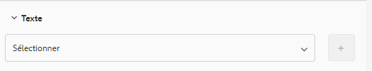

Lorsque vous créez un composant, les styles sont mis en cache et répertoriés dans la zone de liste. Dans cet exemple, l’étiquette de la zone de texte est conçue pour modifier la taille et la couleur de la police. Vous pouvez suivre des étapes similaires pour choisir une image ou modifier les couleurs pour personnaliser un composant. Observez comment le style est mis en cache et répertorié dans la zone de liste lorsque le style d’étiquette de champ est modifié.

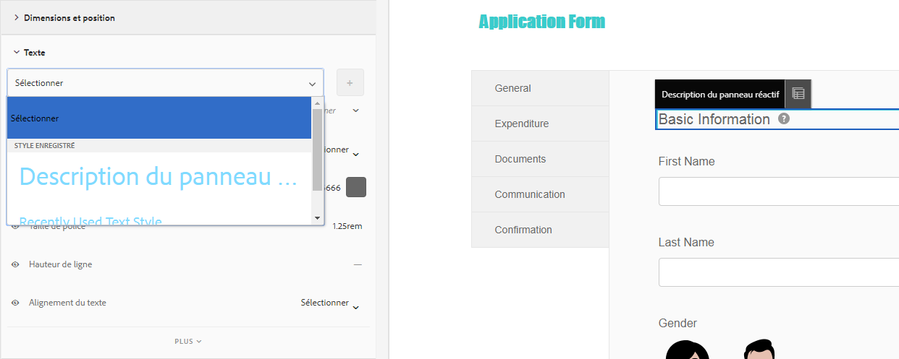

Dans cet exemple, le style de l’étiquette de champ est modifié et, lorsque l’option Description du panneau réactif est sélectionnée pour le style, une entrée de liste est ajoutée dans la bibliothèque de ressources. L’entrée dans la bibliothèque de ressources peut être utilisée pour modifier le style de Description du panneau réactif.

Lorsqu’un style est ajouté à la bibliothèque de ressources, il est disponible pour d’autres thèmes et dans le [mode Style](../../forms/using/inline-style-adaptive-forms.md) de l’interface utilisateur de l’éditeur de formulaire ou de communication interactive. De même, lorsque vous utilisez le mode style de l’éditeur de formulaires ou de l’interface utilisateur de l’éditeur de communication interactif pour mettre en forme un composant, le style est mis en cache et est disponible dans les thèmes.

Le bouton Plus de la bibliothèque de ressources vous permet d’enregistrer le style de façon permanente avec le nom de votre choix. Le bouton Plus enregistre le style même si vous ne cliquez pas sur le bouton Enregistrer dans la barre latérale pour appliquer le style à un composant. Le bouton Plus pour enregistrer un style pour une utilisation ultérieure n’est pas disponible en mode Style.

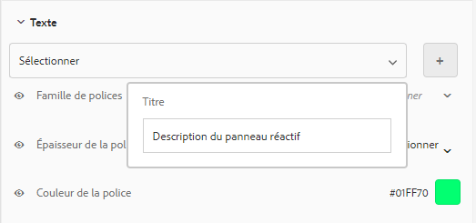

Lorsque vous attribuez un nom personnalisé pour un style, le style est lié à un thème et n’est plus disponible pour les autres thèmes. Pour supprimer un style enregistré :

1. Dans la barre d&#39;outils CANVAS, cliquez sur **Options de thème**  > **Gérer les styles**.
1. Dans la boîte de dialogue Gérer les styles, sélectionnez un style enregistré, cliquez sur **Supprimer**.

   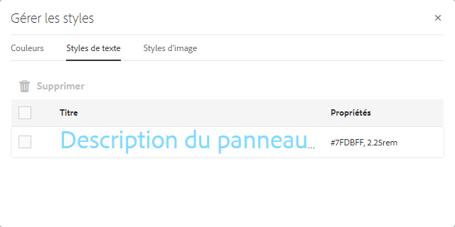

### Aperçu, enregistrement et ignorer les modifications en direct {#live-preview-save-and-discard-changes}

Les modifications apportées au style sont immédiatement répercutées dans le formulaire ou la communication interactive chargé(e) dans la zone de travail. L’aperçu en direct vous permet de définir de manière interactive et de voir l’impact de la mise en forme. Lorsque vous modifiez la mise en forme d’un composant, le bouton **Terminé** est activé dans l’encadré. Pour conserver les modifications, utilisez le bouton **Terminé**.

>[!NOTE]
>
>Lorsqu’un caractère non valide est saisi dans un champ, la couleur de la limite du champ devient rouge et un message d’erreur est affiché dans le coin supérieur gauche de l’écran. Par exemple, si vous saisissez des lettres dans une zone de texte qui accepte les caractères numériques comme entrées, la couleur de la bordure de la zone de saisie devient rouge. Vous ne pouvez pas enregistrer le thème sans résoudre l’erreur affichée dans la partie supérieure.

### Thème avec un autre formulaire adaptatif ou communication interactive {#theme-with-another-adaptive-form-or-interactive-communication}

Lorsque vous créez un thème, il est créé à l’aide d’un formulaire fourni avec l’éditeur de thème. Vous indiquez la mise en forme pour les composants de ce formulaire. Au lieu du formulaire fourni avec l’éditeur de thème, vous pouvez sélectionner un formulaire ou une communication interactive de votre choix pour fournir un style et prévisualisation de ses résultats.

Pour remplacer le formulaire ou la communication interactive actif/active dans la zone de travail de l’éditeur de thème :

1. Dans le panneau EDITEUR DE THÈMES, cliquez sur **Options de thème**  > **Configurer**.

1. Dans l’onglet Général, recherchez et sélectionnez un formulaire ou une communication interactive pour le champ **Formulaire/Document adaptatif**.

### Rétablir/annuler {#redo-undo}

Vous pouvez annuler ou rétablir les modifications non souhaitées qui se produisent accidentellement. Utilisez les boutons Rétablir/Annuler dans la zone de travail.

Boutons Rétablir/annuler dans la zone de travail

Les boutons Rétablir/annuler apparaissent lorsque vous mettez en forme un composant dans l’éditeur de thème.

## Utilisation de l’éditeur de thème {#using-the-theme-editor}

L’éditeur de thème vous permet de modifier un thème que vous avez créé ou téléchargé. Accédez à **Forms &amp; Documents > Thèmes**, sélectionnez un thème et ouvrez-le. Le thème s’ouvre dans l’éditeur de thème.

Comme nous l’avons mentionné ci-dessus, l’éditeur de thème présente deux panneaux : Encadré et Zone de travail.
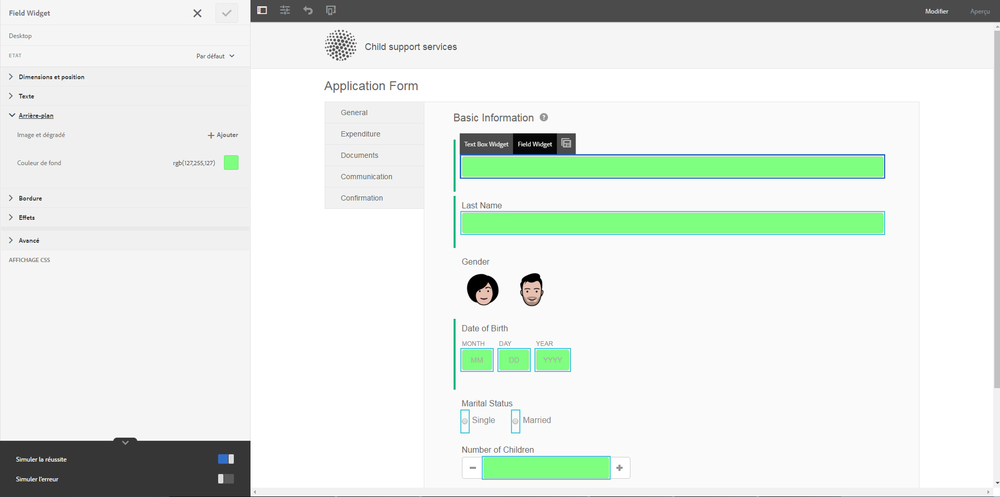

Personnalisation du style de réussite du composant Widget de zone de texte dans l’éditeur de thème. Le composant est sélectionné dans la zone de travail, et son état est sélectionné dans l’encadré. Les options de mise en forme disponibles dans l’encadré sont utilisées pour personnaliser l’aspect d’un composant.

### Utilisation de la zone de travail {#using-canvas}

Le thème est créé à l’aide du formulaire prêt à l’emploi ou du formulaire ou de la communication interactive de votre choix. La zone de travail affiche un aperçu du formulaire ou de la communication interactive utilisé(e) pour créer le thème avec les personnalisations spécifiées dans le thème. La règle au-dessus du formulaire est utilisée pour déterminer la mise en page selon la taille de l’affichage de votre périphérique.

Dans la barre d’outils de la zone de travail se trouvent les éléments suivants :

* **Activer/désactiver le panneau** bascule-côté-panneau: Permet d’afficher ou de masquer la barre latérale.
* **Thème**  : Fournit trois options

   * Configurer : Fournit des options permettant de sélectionner le formulaire de prévisualisation ou la configuration de communication interactive, clientlib de base et Adobe Fonts.
   * Afficher le thème CSS : génère des CSS pour le thème sélectionné.
   * Gérer les styles : fournit des options de gestion des styles de texte et d’images
   * Aide : exécute une visite guidée de l’image de l’éditeur de thèmes.

* ****  : Émule l’aspect de votre thème pour différentes tailles d’affichage. La taille d’affichage est traitée comme un point d’arrêt dans l’émulateur. Vous pouvez sélectionner un point d’arrêt et spécifier un style pour ce point. Par exemple, le Bureau et la Tablette sont deux points d’arrêt. Vous pouvez spécifier différents styles pour chaque point d’arrêt.

Lorsque vous sélectionnez un composant dans la zone de travail, vous voyez la barre d’outils de composant dessus. La barre d’outils de composant vous permet de sélectionner des composants ou de passer aux composants génériques. Par exemple, vous sélectionnez une zone de texte numérique dans un panneau. Vous verrez les options suivantes dans la barre d’outils de composant :

* **Widget de zone numérique** : vous permet de sélectionner le composant pour personnaliser son aspect dans l’encadré.
* **Widget de champ** : vous permet de sélectionner le composant générique pour la mise en forme. Dans cet exemple, tous les composants de saisie de texte (zone de texte/zone numérique/exécution numérique pas à pas/saisie de date) sont sélectionnés pour la mise en forme.

*  du champ : Permet de passer au composant générique pour la mise en forme. Si vous sélectionnez la zone numérique et appuyez sur cette icône, le composant de champ est sélectionné. Si vous sélectionnez le composant de champ et appuyez sur cette icône, le panneau est sélectionné. Si vous continuez à appuyer sur cette icône pour la sélection, vous finissez par sélectionner le style de la mise en forme.

>[!NOTE]
>
>Les options disponibles dans la barre d’outils de composants varient en fonction du composant sélectionné.

Barre d’outils de composants sur la zone numérique dans la zone de travail

### Utilisation de l’encadré {#using-rail}

L’encadré dans l’éditeur de thèmes fournit des options pour personnaliser les styles pour les composants d’un thème et pour utiliser des sélecteurs. Les sélecteurs vous permettent de sélectionner un groupe de composants ou des composants individuels ; vous pouvez également rechercher des sélecteurs dans l’encadré. Vous pouvez saisir des sélecteurs pour les composants personnalisés.

Lorsque vous sélectionnez un composant dans la zone de travail ou des sélecteurs dans l’encadré, ce dernier affiche toutes les options vous permettant de personnaliser les styles.
Vous trouverez ci-dessous les options affichées dans la barre latérale lorsque vous sélectionnez un composant :

* État
* Feuille de propriété
* Simuler une erreur/la réussite

#### État {#state}

Un état est un indicateur d’interaction utilisateur avec un composant. Par exemple, lorsqu’un utilisateur saisit des données erronées dans une zone de texte, l’état des modifications de la zone de texte passe à un état d’erreur. L’éditeur de thèmes vous permet de spécifier un état spécifique.

Les options de personnalisation des styles d’état varient en fonction des différents composants.

#### Feuille de propriété {#property-sheet}

<table>
 <tbody>
  <tr>
   <td><strong>Propriété</strong></td>
   <td><strong>Utilisez</strong></td>
  </tr>
  <tr>
   <td>
Dimensions et position
 </td>
   <td>
Vous permet de mettre en forme l’alignement, la taille, le positionnement et le placement de composants dans le thème. 
 
Les options disponibles sont les paramètres d’affichage, le remplissage, la marge, la largeur, la hauteur et l’indice Z.
 
Vous pouvez également utiliser le mode Mise en page pour définir la largeur des composants à l’aide d’une interface simple par glisser-déposer. Pour plus d’informations, voir <a href="../../forms/using/resize-using-layout-mode.md">Utilisation du mode Mise en page pour redimensionner les composants</a>.
 </td>
  </tr>
  <tr>
   <td>
Text (Texte)
 </td>
   <td>
Vous permet de personnaliser les styles de texte dans le composant du thème.
 
Par exemple, vous souhaitez modifier l’aspect du texte saisi dans la zone de texte.
 
Vos options sont les suivantes : famille de polices, épaisseur, couleur, taille, hauteur de ligne, alignement du texte, espacement, interlettrage, retrait du texte, surlignement, italique, transformation de texte, alignement vertical, ligne de base et orientation. 
 </td>
  </tr>
  <tr>
   <td>
Arrière-plan 
 </td>
   <td>
Vous permet de remplir l’arrière-plan du composant par une image ou une couleur. 
 </td>
  </tr>
  <tr>
   <td>
 de la bordure
 </td>
   <td>
Vous permet de choisir l’aspect de la bordure du composant. Par exemple, vous souhaitez que la zone de texte ait une bordure rouge foncé épaisse, avec une ligne en pointillé. 
 
Les options disponibles sont : largeur, style, rayon et couleur de la bordure.
 </td>
  </tr>
  <tr>
   <td>
Effets
 </td>
   <td>
Vous permet d’ajouter des effets spéciaux aux composants, tels que l’opacité, le mode de fusion et les ombres. 
 </td>
  </tr>
  <tr>
   <td>
Avancé
 </td>
   <td>
Permet d’ajouter des :

    <ul>
     <li>Propriétés des pseudo-éléments <code>::before</code> et <code>::after</code> pour ajouter du contenu après ou avant le contenu par défaut dans le sélecteur et lui appliquer un style.  Voir <a href="https://www.w3schools.com/css/css_pseudo_elements.asp" target="_blank">Pseudo-éléments CSS</a>.</li>
     <li>Personnalisez du code CSS intégré à un composant, puis saisissez des sélecteurs personnalisés. </li>
    </ul> 
Lorsque vous ajoutez un code CSS personnalisé, il remplace la personnalisation que vous avez ajoutée à l’aide des options de l’encadré. 
 </td>
  </tr>
 </tbody>
</table>

#### Simuler une erreur/la réussite {#simulate-error-success}

Les options Simuler une erreur et une réussite sont situées en bas de la barre latérale.  Vous pouvez les afficher à l’aide de la flèche afficher/masquer visible en bas de la barre latérale. À l’aide de l’éditeur de thème, vous pouvez définir le style des différents états d’un composant.

Par exemple, vous ajoutez un champ numérique dans votre formulaire, puis indiquez son style dans l’éditeur de thème. Lorsque les utilisateurs saisissent une valeur alphanumérique dans le champ, vous souhaitez que la couleur d’arrière-plan de la zone de texte change. Sélectionnez le champ numérique dans le thème, et utilisez l’option d’état dans la barre latérale. Vous sélectionnez l’état d’erreur dans la barre latérale et modifiez la couleur d’arrière-plan en rouge. Pour prévisualiser le comportement, vous pouvez utiliser l’option Simuler une erreur disponible dans la barre latérale. Les options Simuler une erreur et une réussite sont décrites en détails ci-dessous :

* **Simuler la réussite **: vous permet de voir à quoi ressemble un composant si vous spécifiez sa mise en forme pour l’état de réussite. Par exemple, dans un formulaire, les clients définissent le mot de passe. Les utilisateurs peuvent définir un mot de passe en fonction des directives que vous donnez. Lorsqu’un utilisateur saisit un mot de passe en suivant tous les conseils que vous avez fournis, la zone de texte se met en vert. Lorsque la zone de texte passe au vert, elle est en état de réussite. Vous pouvez spécifier la mise en forme d’un composant dans l’état de réussite et simuler son aspect à l’aide de l’option Simuler la réussite. 

* **Simuler une erreur **: vous permet de voir à quoi ressemble un composant si vous spécifiez sa mise en forme pour l’état d’erreur. Par exemple, dans un formulaire, les clients définissent le mot de passe. Les utilisateurs peuvent définir un mot de passe en fonction des directives que vous donnez. Lorsqu’un utilisateur saisit un mot de passe qui ne suit pas toutes les directives données, la zone de texte passe au rouge. Lorsque la zone de texte passe au rouge, elle est en état d’erreur. Vous pouvez spécifier la mise en forme d’un composant à l’état d’erreur, et simuler son aspect à l’aide de l’option Simuler une erreur.

### Mise en forme d’un composant  {#styling-a-component}

Par exemple, dans votre formulaire, vous disposez de deux types de zones de texte : une qui accepte uniquement les valeurs numériques et d’autres qui acceptent des valeurs alphanumériques. Vous pouvez personnaliser la mise en forme de la zone de texte acceptant les valeurs numériques uniquement (une zone numérique).

Effectuez les étapes suivantes pour personnaliser la mise en forme d’un composant particulier (une zone numérique dans cet exemple) :

1. Dans l’éditeur de thème, sélectionnez la zone numérique dans la zone de travail.
1. Lorsque vous sélectionnez la zone numérique, vous pouvez afficher la barre d’outils des composants avec trois options :

   * **Widget de zone numérique**
   * **Field** 

1. Sélectionnez **Widget de zone numérique**.
1. Le titre de l’encadré passe à Widget de zone numérique et affiche des options pour personnaliser son aspect.
Utilisez l&#39;option **Dimension et position** dans la barre latérale pour personnaliser la taille du composant. Vérifiez que l’état est bien **Par défaut**.

Au lieu de sélectionner **Widget de zone numérique**, sélectionnez **Widget de champ** dans la barre d’outils du composant et effectuez les étapes ci-dessus. Lorsque vous sélectionnez des dimensions pour l’option **Widget de champ**, toutes les zones de texte, à l’exception de la zone numérique, ont la même taille.

### Mise en forme des champs pour un état donné {#styling-fields-given-state}

Avec la barre d’outils de composants, vous pouvez également spécifier la mise en forme des composants pour les différents états. Par exemple, si un composant est désactivé, il est à l’état désactivé. Les états généralement utilisés d’un composant que vous pouvez mettre en forme dans l’éditeur de thème sont les suivants : Par défaut, Désactivé, Erreur et Survol. Vous pouvez sélectionner un composant dans la zone de travail et utiliser l’option Etat de l’encadré pour personnaliser son aspect.

Effectuez les étapes suivantes pour personnaliser la mise en forme d’un composant à un état spécifique :

1. Sélectionnez un composant dans la zone de travail, puis sélectionnez l’option appropriée dans la barre d’outils de composants.
L’encadré affiche les options de personnalisation de la mise en forme du composant.
1. Sélectionnez un état dans l’encadré. Par exemple, l’état Erreur.
1. Utilisez des options telles que **Bordure, Arrière-plan** dans la barre latérale pour personnaliser l’aspect du composant.
1. Utilisez l’option **Simuler une erreur** en bas de la barre latérale pour voir à quoi ressemble la mise en page lors de la modification.

Lorsque vous personnalisez la mise en forme d’un composant après avoir spécifié son état, la personnalisation s’affiche pour le composant uniquement pour l’état spécifié. Par exemple, si vous personnalisez la mise en forme du composant alors que l’état Survol est sélectionné. La personnalisation s’affiche pour le composant lorsque vous déplacez le pointeur de la souris sur le composant du formulaire ou de la communication interactive rendu(e) auquel/à laquelle vous appliquez le thème.

Pour simuler le comportement d’états autres que l’erreur et la réussite, utilisez le mode Aperçu. Pour utiliser le mode Prévisualisation, cliquez sur **Prévisualisation** dans la barre d’outils de la page.

### Mise en forme des mises en page pour des écrans de plus petite taille {#styling-layouts-for-smaller-displays}

Utilisez la règle dans la zone de travail pour sélectionner des points d’arrêt pour les périphériques équipés de plus petits écrans. Cliquez sur l’émulateur  dans la zone de travail sur la règle de vue et les points d’arrêt. Les points d’arrêt vous permettent de prévisualisation d’un formulaire ou d’une communication interactive pour des tailles d’affichage correspondant à différents périphériques tels que les téléphones et les tablettes. Plusieurs formats d’affichage sont pris en charge dans l’éditeur de thème.

Pour mettre en forme des composants pour différents points d’arrêt :

1. Dans la zone de travail, sélectionnez un point d’arrêt au-dessus de la règle.
Un point d’arrêt représente un périphérique mobile et sa taille d’affichage.
1. Utilisez la barre latérale pour personnaliser le style des composants du formulaire ou de la communication interactive dans le thème pour le format d’affichage sélectionné.
1. Vérifiez que la personnalisation est enregistrée.

Vous pouvez définir le style des composants de formulaire ou de communication interactive pour plusieurs périphériques. Les composants de formulaire et de communication interactive pour les ordinateurs de bureau et les périphériques mobiles ont parfois des styles totalement différents.

### Utilisation des polices web dans un thème {#using-web-fonts-in-a-theme}

Vous pouvez désormais utiliser les polices disponibles dans un service Web dans un formulaire adaptatif ou une communication interactive. [Adobe Fonts](https://fonts.adobe.com/), service de police Web de Adobe prêt à l’emploi, est disponible en tant que configuration. Pour utiliser Adobe Fonts, créez un kit, ajoutez-y des polices et obtenez l’identifiant du kit auprès de [Adobe Fonts](https://fonts.adobe.com/).

Effectuez les étapes suivantes pour configurer Adobe Fonts dans AEM :

1. Dans l’instance d’auteur, cliquez sur Adobe Experience Manager > Outils  > Déploiement > Cloud Services.
1. Sur la page **Cloud Services**, accédez à l’option **Adobe Fonts** et ouvrez-la. Ouvrez le dossier de configuration, puis cliquez sur **Créer**.
1. Dans la boîte de dialogue **Créer une configuration**, indiquez un titre pour la configuration et cliquez sur **Créer**.

   Vous êtes redirigé sur la page de configuration.

1. Dans la boîte de dialogue Modifier le composant qui s’affiche, indiquez votre ID de kit et cliquez sur **OK**.

Effectuez les étapes suivantes pour configurer un thème afin d’utiliser la configuration Adobe Fonts :

1. Dans l’instance de l’auteur, ouvrez un thème dans l’éditeur de thèmes.
1. Dans l’éditeur de thème, accédez à **Options de thème**  > **Configurer**.
1. Dans le champ **Configuration Adobe Fonts**, sélectionnez un kit, puis cliquez sur **Enregistrer**.

   Maintenant, vous pouvez voir que les polices sont ajoutées à la propriété font-family du thème.

### Énumération et sélection des polices dans l’éditeur de thèmes  {#listing-and-selecting-fonts-in-theme-editor}

Vous pouvez utiliser le service de configuration de thèmes pour ajouter plus de polices à l’éditeur de thèmes. Effectuez les opérations suivantes pour ajouter les polices :

1. Connectez-vous à la console Web AEM avec les droits d’administrateur. L&#39;URL de la console Web AEM est `https://'[server]:[port]'/system/console/configMgr`.
1. Ouvrez **le service de configuration des thèmes de formulaire adaptatif**.

   

1. Cliquez sur +, spécifiez le nom de la police et cliquez sur **Enregistrer**. La police est ajoutée et disponible dans l’éditeur de thèmes.

#### Sélection de polices dans l’éditeur de thèmes  {#selecting-fonts-in-theme-editor}

Vous pouvez utiliser le bouton + pour ajouter une police. Lorsque vous ajoutez une police, elle est répertoriée dans la barre latérale.

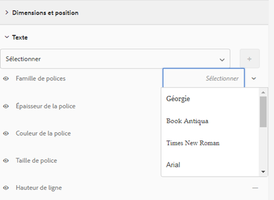

En plus de l’option de configuration de thème, vous pouvez également ajouter votre police à partir de l’éditeur de thèmes. Saisissez la police que vous souhaitez utiliser dans le champ de la famille de police sous la barre latérale et appuyez sur la touche Retour de votre clavier.

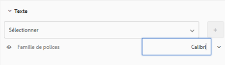

Lorsque vous sélectionnez une police, elle est ajoutée à la liste des familles de polices. Vous pouvez utiliser l’option Masque de l’éditeur de thèmes pour désactiver ou activer les polices répertoriées.

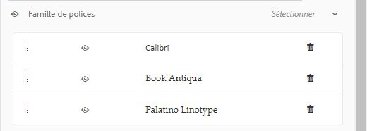

Vous pouvez voir la modification de la police du composant.

Le champ Famille de polices prend en charge plusieurs polices. Lorsque vous saisissez une police, le navigateur la recherche et l’applique au composant sélectionné. Si le navigateur ne trouve pas la police, il recherche une police à côté de celle-ci dans la famille. Vous pouvez commencer par saisir la police spécifique que vous recherchez. Si vous ne trouvez pas la police que vous voulez utiliser, vous pouvez saisir une police générique dans la famille et l’utiliser.

#### Masquer les styles appliqués dans l’éditeur de thèmes  {#mask-styles-applied-in-theme-editor}

Vous pouvez masquer les styles appliqués dans un thème. Dans la barre latérale de l’éditeur de thème, vous pouvez utiliser l’icône pour désactiver un style appliqué. Par exemple, si vous modifiez les dimensions d’un composant dans un formulaire ou une communication interactive, vous pouvez utiliser le bouton de masquage situé à gauche d’une propriété pour la désactiver. Lorsque vous enregistrez un thème, les options de masquage sélectionnées sont conservées.

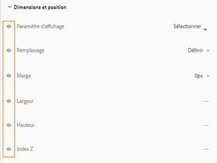

L’exemple ci-dessous montre des styles masqués et non masqués dans un thème.

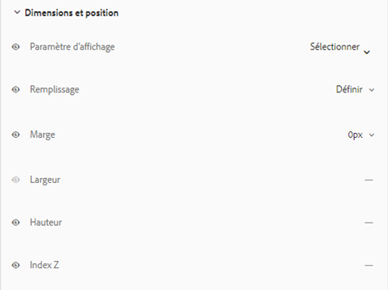

## Application d&#39;un thème à un formulaire ou à une communication interactive {#applying-a-theme-to-a-form-or-interactive-communication-br}

Pour appliquer un thème à un formulaire adaptatif :

1. Ouvrez votre formulaire en mode d’édition. Pour ouvrir un formulaire en mode d’édition, sélectionnez-le et cliquez sur **Ouvrir**.
1. En mode d’édition, sélectionnez un composant, puis cliquez sur  > **Conteneur de formulaire adaptatif**, puis sur .

   Vous pouvez modifier les propriétés de votre formulaire dans la barre latérale.

1. Dans l’encadré, cliquez sur **Mise en forme**.
1. Sélectionnez votre thème dans la liste déroulante **Thème de formulaire adaptatif** et cliquez sur **Terminé** .

Pour appliquer un thème à une communication interactive :

1. Ouvrez votre communication interactive en mode d’édition. Pour ouvrir une communication interactive en mode d’édition, sélectionnez-la et cliquez sur **Ouvrir**.
1. En mode d’édition, sélectionnez un composant, puis cliquez sur  >**Conteneur de Document**, puis sur .

   Vous pouvez modifier les propriétés de votre formulaire dans la barre latérale.

1. Dans la barre latérale, sous **Basic**, sélectionnez votre thème dans la liste déroulante **Thème** et cliquez sur **Terminé** .

### Modifier le thème d’un formulaire au moment de l’exécution {#change-theme-of-a-form-at-runtime}

Un thème définit le style de différents composants d’un formulaire. Vous pouvez utiliser la propriété `themeOverride` pour modifier le thème d’un formulaire de façon dynamique. L’URL type d’un formulaire est la suivante :

`https://<server>:<port>/content/forms/af/test.html`

Vous pouvez utiliser le paramètre themeOverride pour appliquer un thème au moment de l’exécution.

`https://<server>:<port>/content/forms/af/test.html?themeOverride=/content/dam/formsanddocuments-themes/simpleEnrollmentTheme`

L’option `themeOverride` vous permet de fournir un chemin d’accès à un thème. Elle modifie le thème du formulaire et l’actualise avec des styles mis à jour.

## Obtention d’un aspect spécifique à l’aide de Thèmes {#specific-af-appearance}

Avec AEM Forms et le thème de la zone de travail prête à l’emploi par défaut, il existe de nombreux autres thèmes. Si vous souhaitez concevoir votre formulaire ou communication interactive à l’aide d’autres thèmes, avec des modifications supplémentaires, copiez le thème à partir du dossier de la bibliothèque des thèmes. Collez les thèmes copiés en dehors du dossier de la bibliothèque des thèmes et modifiez le thème copié selon les modifications que vous souhaitez.

Pour copier un thème, procédez comme suit :

1. Dans l’instance de création, accédez à **Adobe Experience Manager > Formulaires > Thèmes**.
1. Ouvrez le dossier de la bibliothèque des thèmes.
1. Dans ce dossier, déplacez le pointeur de la souris sur le thème prêt à l’emploi correspondant, puis appuyez sur **Copier**.
1. Collez le thème copié en dehors du dossier de la bibliothèque des thèmes.
1. Personnalisez le thème copié.

Après avoir personnalisé le thème, appliquez-le à votre formulaire ou à votre communication interactive.

>[!NOTE]
>
>Ne modifiez pas les thèmes disponibles dans le dossier Bibliothèque de thèmes. Ce dossier contient des thèmes système. Toute modification apportée à ces thèmes est remplacée lors de l’installation d’une version plus récente ou d’un correctif logiciel d’AEM Forms.

## Impact sur d’autres cas d’utilisation de formulaire adaptatif {#impact-on-other-adaptive-form-use-cases}

* **Publication/annulation de la publication d’un formulaire :** Lors de la publication d’un formulaire, le thème appliqué est également publié (s’il n’est pas déjà publié).
* **Importer/Exporter un formulaire :** Lors de l’importation ou de l’exportation d’un formulaire, son thème associé est également automatiquement importé ou exporté.
* **Références d’un formulaire :** la section Fait référence dans les références de formulaire contient une entrée supplémentaire pour le thème.
* **Heure de la dernière modification d’un formulaire :** Mise à jour lorsque le thème associé est modifié.
* **Test A/B :** vous pouvez appliquer un thème différent à deux versions du formulaire dans le test A/B. Les informations des deux thèmes sont stockées individuellement stockées sur les deux conteneurs de guide.

## Séquence de génération CSS {#css-generation-sequence}

Lorsque vous sélectionnez la vue CSS, l’éditeur de thèmes collecte toutes les informations de mise en forme et crée un fichier CSS. Il collecte des informations dans l’ordre suivant :

1. La mise en forme définie dans la bibliothèque client de base du thème.
1. La mise en forme définie par l’utilisateur, spécifiée à l’aide des propriétés dans la barre latérale.
1. Le style CSS fourni à l’aide de l’option de remplacement de CSS.

Par exemple, la couleur d’arrière-plan d’une zone de texte est bleue dans la bibliothèque client de base. Vous la remplacez par la couleur rose à l’aide des propriétés de la barre latérale. Lorsque vous générez un fichier CSS, la couleur d’arrière-plan de la zone de texte est rose. Après la modification de la couleur d’arrière-plan à l’aide des propriétés, un autre auteur utilise l’option de remplacement de CSS pour modifier la zone de texte de couleur d’arrière-plan en blanc. Lorsque vous générez des fichiers CSS, la couleur d’arrière-plan blanche apparaît dans le CSS généré.

## Débogage des styles {#debugging-styles}

Lorsque vous spécifiez des styles pour les composants dans l’éditeur de thèmes, un fichier CSS est généré. Lorsque vous définissez le style d’un composant générique, plusieurs composants intégrés sont également mis en forme. Par exemple, lorsque vous définissez le style d’un champ, la zone de texte et l’étiquette qu’elle contient sont également mises en forme.  Lorsque vous mettez en forme la zone de texte dans le champ, elle obtient son propre CSS. Si vous souhaitez déboguer le CSS généré pour le champ et le composant, l’éditeur de thème fournit des options qui vous permettent d’afficher le CSS.

Vous pouvez voir le fichier CSS généré à l’aide des options suivantes :

* Option **Affichage CSS** dans la barre latérale : lorsque vous sélectionnez un composant dans le thème, vous pouvez voir l’option AFFICHAGE CSS dans la barre latérale. Il affiche le fichier CSS généré, y compris le fichier CSS pour les pseudo-éléments `::before` et `::after`.
* **Option** CSS du thème de vue dans la barre d’outils de la zone de travail : Dans la barre d’outils de la zone de travail, cliquez sur   > Thème de  **Vue CSS**. Vous pouvez voir tout le thème CSS généré à partir des propriétés que vous définissez dans l’éditeur de thèmes.

## Dépannage, recommandations et bonnes pratiques {#troubleshooting-recommendations-and-best-practices}

* **Eviter les actifs d’un autre thème**

   Lorsque vous modifiez un thème, vous pouvez parcourir et ajouter des fichiers (tels que des images) d’autres thèmes. Par exemple, vous pouvez modifier l’arrière-plan d’une page. Par exemple, lorsque vous sélectionnez **Page** 

* Vous pouvez rencontrer des problèmes avec votre thème actuel si un actif est ajouté à partir d’un autre thème et l’autre thème est déplacé ou supprimé. Nous vous recommandons d’éviter de parcourir les actifs d’autres thèmes et de les ajouter.
* **Utilisation de la bibliothèque de clients de base, de l’éditeur de thème et de la mise en forme intégrée**

   * **Base clientlib** :

      La bibliothèque cliente de base contient des informations de style. Pour utiliser des informations de mise en forme dans les bibliothèques côté client des thèmes.

      1. Accédez à **Experience Manager > Formulaires > Thèmes**.
      1. Dans la page Thèmes, sélectionnez un thème, puis cliquez sur **Afficher les propriétés**.
      1. Dans la page des propriétés qui s’ouvre, cliquez sur **Avancé**.
      1. Dans le champ Emplacement de la bibliothèque client de l’onglet Avancé, recherchez et sélectionnez la bibliothèque client à utiliser.
      1. Cliquez sur **Enregistrer**.

      La mise en forme que vous spécifiez dans la bibliothèque client est importée dans le thème qui l’utilise. Par exemple, vous spécifiez mise en page pour la zone de texte, la zone numérique et le basculement dans la bibliothèque client. Lorsque vous importez votre bibliothèque client dans le thème, la mise en page pour la zone de texte, la zone numérique et le basculement dans la bibliothèque client. Vous pouvez alors mettre en forme d’autres composants à l’aide de l’éditeur de thème.
Vous pouvez également créer un thème, créer des copies de ce thème, puis modifiez la mise en forme fournie dans les thèmes copiés pour des cas d’utilisation similaires.
Voir [Obtention d’un aspect spécifique à l’aide des thèmes](#specific-af-appearance)

   * **Éditeur de thème:**

      L’éditeur de thème vous permet de créer des thèmes pour mettre en forme votre formulaire ou votre communication interactive. Vous pouvez spécifier le style de composants dans un thème, ce qui permet d’assurer la cohérence de l’apparence parmi les multiples formulaires ou communications interactives que vous développez. Il est recommandé de spécifier les informations de style dans un thème, puis d’appliquer le thème à un formulaire.

   * **Style en ligne :**

      Vous pouvez mettre en forme des composants à l’aide du mode Style dans l’éditeur multicanal de formulaire ou de communication interactive lorsque vous travaillez avec un formulaire. L’utilisation du mode Style pour modifier la mise en forme d’un composant de formulaire remplace la mise en forme indiquée dans le thème. Si vous choisissez de modifier le style de certains composants d’un formulaire spécifique, voir [Style intégré de composants](../../forms/using/inline-style-adaptive-forms.md).

* **Utilisation des bibliothèques côté client**

   Si vous souhaitez créer des bibliothèques clientes pour importer des informations de style, voir [Utilisation de bibliothèques côté client](/help/sites-developing/clientlibs.md). Après avoir créé une bibliothèque client, vous pouvez l’importer dans votre thème à l’aide des étapes mentionnées ci-dessus.

* **Modification de la largeur de disposition du panneau conteneur**

   Il n’est pas recommandé de modifier la largeur de disposition du panneau conteneur. Lorsque vous spécifiez la largeur d’un panneau de contenu, il devient statique et ne s’adapte pas aux différents affichages.

* **Utilisation de l’éditeur de formulaire ou de l’éditeur de thème pour l’utilisation de l’en-tête et du pied de page**

   Utilisez l’éditeur de thème si vous souhaitez mettre en forme l’en-tête et le pied de page à l’aide d’options de style telles que le style de police, l’arrière-plan et la transparence.
Si vous souhaitez fournir des informations comme une image de logo, le nom de l’entreprise dans l’en-tête et des informations de copyright dans le pied de page, utilisez les options de l’éditeur de formulaire.
