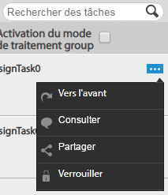
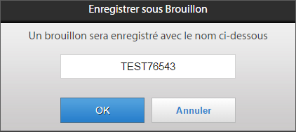
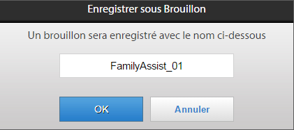
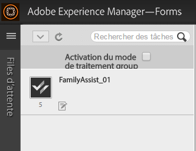
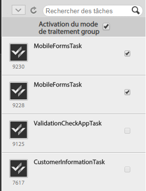
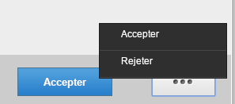

# Utiliser les listes de tâches{#working-with-to-do-lists}

Lorsque vous affichez vos listes de tâches, vous pouvez visualiser les tâches d’un processus d’entreprise qui vous sont affectées, ou qui sont affectées à des groupes auxquels vous appartenez, ou qui sont les tâches partagées d’autres utilisateurs. Vous pouvez ouvrir, modifier et effectuer les tâches selon vos besoins, par exemple en approuvant ou en rejetant une demande ou en ajoutant davantage d’informations. Après avoir terminé une tâche, elle est envoyée à la personne suivante dans le cadre du processus de gestion commerciale.

## À propos des listes de tâches {#about-todo-lists}

L’espace de travail AEM Forms comporte les trois types de listes de tâches suivants :

* Listes individuelles, qui contiennent des tâches qui vous sont directement affectées.
* Listes de groupe, qui contiennent des tâches affectées à un groupe. Tout membre du groupe peut ouvrir et exécuter les tâches. Pour ouvrir une tâche, une personne membre d’un groupe doit d’abord demander la tâche.
* Listes partagées, qui contiennent des tâches affectées à un utilisateur ayant partagé sa liste de tâches avec vous et probablement avec d’autres utilisateurs. Toute personne partageant une liste peut demander, ouvrir et exécuter des tâches.

Vous pouvez effectuer certaines actions sans ouvrir la tâche, en cliquant sur les icônes qui s’affichent lorsque vous placez le pointeur de la souris sur une tâche.

>[!NOTE]
>
>Une icône en point d’exclamation indique que la tâche a une priorité élevée.

## Tâches types {#typical-tasks}

Lors de l’ouverture et de l’utilisation d’une tâche, les outils disponibles dépendent de la tâche. Des tâches différentes nécessitent d’effectuer des actions différentes, par conséquent certains outils peuvent être disponibles ou non. Les tâches types que vous pouvez recevoir sont décrites ci-dessous.

* **Fournir des informations** : vous recevez une tâche nécessitant de renseigner et d’envoyer un formulaire.

* **Réviser des informations** : vous recevez une tâche nécessitant de réviser des informations et de valider le contenu.

* **Révision multi-utilisateurs** : vous recevez une tâche en même temps que d’autres utilisateurs. Vous devez, ainsi que les autres utilisateurs, fournir des informations, réviser le contenu ou les deux. Les outils suivants peuvent être disponibles avec ce type de tâche :

   * Affichage des instructions pour la tâche
   * Affichage du statut d’exécution de toutes les personnes auxquelles la tâche est affectée
   * Affichage des commentaires de toutes les personnes auxquelles la tâche est affectée
   * Ajout personnel de commentaires à la tâche

Voici d’autres outils qui peuvent être disponibles avec les tâches ci-dessus :

* Transférer
* Partager
* Consulter
* Retourner
* Remarques
* Pièces jointes

## Ouverture de tâches {#opening-tasks}

Vous pouvez ouvrir et verrouiller des tâches à partir de votre liste de tâches ou demander et ouvrir des tâches à partir de la liste de tâches d’un groupe ou partagée. Lorsque vous ouvrez une tâche, elle s’affiche sur le panneau principal. Les autres tâches s’affichent dans la liste en regard de la liste des tâches.

S’il existe une URL Résumé de la tâche, la vue Résumé de la tâche s’ouvre par défaut, au lieu du formulaire associé à une tâche. Même lorsqu’une personne active l’option Ouvrir le formulaire en mode agrandi dans Affecter une tâche, le formulaire ne s’ouvre pas en mode agrandi.

>[!NOTE]
>
>Lorsque vous ouvrez une tâche, selon ses paramètres par défaut, le formulaire associé peut s’afficher en plein écran.

### Ouvrir et verrouiller une tâche depuis votre liste {#open-and-lock-a-task-from-your-list}

Lorsque vous ouvrez une tâche à partir de votre liste de tâches, si votre liste est partagée, vous pouvez verrouiller la tâche pour empêcher une autre personne ayant accès à votre liste d’utiliser la tâche.

1. Sur la page des tâches, dans le volet de gauche, sélectionnez votre liste de tâches individuelle. Toutes vos tâches s’affichent sur le panneau central.

   >[!NOTE]
   >
   >Vous pouvez filtrer les tâches en sélectionnant le type de processus dans la liste de tâches. Vous pouvez y sélectionner votre liste de tâches, pour visualiser de nouveau toutes les tâches de la liste de tâches.

1. Si nécessaire, verrouillez votre tâche. Pour verrouiller une tâche, cliquez sur l’icône Toutes les options sur la tâche et sélectionnez Verrouiller. Placez le pointeur de la souris sur la tâche pour activer l’option.

   >[!NOTE]
   >
   >Vous pouvez également verrouiller ou déverrouiller une tâche sur n’importe quel onglet lorsque celle-ci est ouverte.

   

   Menu Toutes les options sur une tâche

1. Ouvrez la tâche en cliquant dessus.

### Ouvrir et demander une tâche à partir d’une liste de groupe ou partagée {#open-and-claim-a-task-from-a-shared-or-group-list}

Lorsque vous ouvrez et demandez une tâche à partir de la liste d’un groupe ou partagée, la tâche est déplacée de la liste du groupe ou de la liste partagée vers votre liste de tâches individuelle. Les autres personnes ayant accès à la liste ne sont pas autorisées à travailler sur la tâche.

1. Sur la page des tâches, dans le volet de gauche, sélectionnez la liste des tâches d’un groupe ou partagée. Toutes les tâches sont affichées dans le panneau central.
1. Exécutez l’une des étapes suivantes :

   * Pour demander une tâche, sans l’ouvrir, à partir de la liste de tâches d’un groupe ou partagée, cliquez sur **Demander** en plaçant le pointeur de la souris sur la tâche. Lorsque la tâche est ouverte, le bouton Demander est disponible également dans la barre d’actions située sous le volet des tâches. Lors de la demande, une tâche est déplacée de la liste de tâches du groupe ou partagée vers votre liste.
   * Pour demander et ouvrir une tâche à partir de la liste de tâches d’un groupe ou partagée, cliquez sur **Demander et ouvrir**.

## Utiliser les tâches {#working-with-tasks}

Après l’ouverture d’une tâche, les onglets qui s’affichent dans le volet principal et les outils disponibles dépendent de la tâche. Les onglets que vous pouvez voir sont décrits ci-dessous.

* **Résumé de la tâche** : lorsqu’une tâche s’ouvre, le panneau Résumé de la tâche vous permet d’afficher des informations sur la tâche, le cas échéant, à l’aide d’une URL spécifiée dans le processus à l’étape Affecter une tâche. Le volet Résumé de la tâche permet d’afficher des informations pertinentes supplémentaires, afin d’augmenter l’intérêt d’AEM Forms Workspace pour l’utilisateur final. Cet onglet n’est pas disponible si l’URL Résumé de la tâche n’existe pas.

* **Détails** : donne des informations sur la tâche en cours et sur le processus auquel elle appartient.

* **Formulaire** : affiche le formulaire associé à la tâche. Le formulaire peut correspondre à de nombreux types de fichier, y compris PDF, HTML, Guide et fichier SWF. Le formulaire peut ressembler à un formulaire Web ou à un formulaire classique imprimable, ou peut vous guider à travers une série de panneaux de type assistant nécessaires à la collecte d’informations.

* **Historique** : répertorie les tâches qui font partie de l’instance de processus, ainsi que le formulaire, les affectations de tâche et les pièces jointes en lien avec chaque tâche.

* **Pièces jointes** : affiche les pièces jointes existantes associées à la tâche et ajoute des pièces jointes, le cas échéant.

* **Notes** : affiche les notes existantes associées à la tâche et ajoute des notes, le cas échéant.

Lorsque vous travaillez sur une tâche, les outils disponibles et les actions possibles sont décrits ci-dessous.

### Transférer, partager ou consulter une tâche {#forward-share-or-consult-on-a-task}

Vous pouvez transférer une tâche accompagnée de notes ou de pièces jointes à un autre utilisateur, partager la tâche avec un autre utilisateur, ou consulter un autre utilisateur à propos de la tâche. Si vous modifiez les données de formulaire associées à une tâche, enregistrez le formulaire en tant que brouillon avant de transférer la tâche, de la partager ou de la consulter. Dans le cas contraire, la tâche sera envoyée sans le formulaire mis à jour. Après avoir transféré la tâche ou l’avoir partagée, l’utilisateur qui reçoit la tâche peut la demander et l’exécuter ou vous la renvoyer. Si vous consultez une tâche, la personne ne peut que vous renvoyer la tâche.

1. Si vous modifiez un formulaire associé à une tâche que vous souhaitez conserver, cliquez sur **Enregistrer**. L’option Enregistrer est disponible dans la barre d’action située dans la partie inférieure de chaque onglet. Dans le cas contraire, la tâche sera envoyée sans le formulaire mis à jour.

   >[!NOTE]
   >
   >Le bouton Enregistrer n’est pas disponible pour certains formulaires selon le processus sur lequel vous travaillez.

1. Sur n’importe quel onglet, cliquez sur l’un des boutons suivants :

   * **Transférer**
   * **Partager**
   * **Consulter**

   >[!NOTE]
   >
   >Selon la tâche, vous pouvez également effectuer ces actions à partir de la liste des tâches sans ouvrir la tâche.

1. Dans la boîte de dialogue contextuelle, recherchez et sélectionnez le nom de la personne à laquelle transférer la tâche. Vous pouvez également la partager ou la consulter.

### Renvoyer une tâche {#return-a-task}

1. Sur n’importe quel onglet, cliquez sur **Renvoyer**. La tâche est renvoyée vers la liste des tâches de la personne qui vous a transféré cette tâche, qui a partagé cette tâche avec vous ou que vous avez consultée à propos de cette tâche.

### Mettre une tâche hors ligne {#take-a-task-offline}

Vous pouvez être autorisé à travailler sur une tâche hors ligne puis à envoyer ultérieurement son formulaire à partir d’Adobe® Reader® ou Adobe® Acrobat® Professional ou Adobe® Acrobat® Standard. L’envoi du formulaire déclenche le démarrage de votre client de messagerie avec l’adresse électronique de serveur appropriée. Vous pouvez ensuite envoyer le formulaire complété au serveur par e-mail.

1. Sur n’importe quel onglet, cliquez sur **Hors connexion**.
1. Spécifiez un nom de fichier pour l’enregistrement du formulaire et cliquez sur **Enregistrer**. Le formulaire associé à la tâche est enregistré localement et la tâche reste dans votre liste de tâches jusqu’à ce que le formulaire soit envoyé.

### Utiliser des pièces jointes {#work-with-attachments}

Vous pouvez avoir l’autorisation d’ajouter, de mettre à jour, de supprimer ou d’enregistrer les pièces jointes localement.

**Ajouter une pièce jointe**

1. Dans l’onglet **Pièces jointes**, cliquez sur **Parcourir** pour sélectionner le fichier à joindre.
1. Sélectionnez le niveau des **Autorisations** relatives à la pièce jointe pour les autres utilisateurs participant au processus. Si vous sélectionnez **Lecture**, d’autres utilisateurs peuvent enregistrer le fichier localement. Si vous sélectionnez l’une des autorisations de modification, d’autres personnes peuvent également charger un nouveau fichier pour remplacer votre pièce jointe.

   >[!NOTE]
   >
   >Vous pouvez également ajouter des commentaires avec vos pièces jointes.

1. Cliquez sur **Charger**. Le fichier est attaché au formulaire.

**Afficher une pièce jointe**

1. Dans l’onglet **Pièces jointes**, cliquez sur le nom de fichier de la pièce jointe à afficher.

**Enregistrer une pièce jointe localement**

1. Cliquez sur une pièce jointe pour l’ouvrir. Enregistrez la pièce jointe ouverte localement.

**Mettre à jour une pièce jointe**

1. Cliquez sur **Modifier** pour la pièce jointe. Sélectionnez le fichier à utiliser en remplacement de la pièce jointe existante, en cliquant sur **Parcourir**.

**Supprimer une pièce jointe**

1. Cliquez sur **Supprimer** pour une pièce jointe.

### Enregistrer votre travail sans terminer la tâche {#save-your-work-without-completing-the-task}

1. Sur n’importe quel onglet, sélectionnez **Enregistrer**.

   La boîte de dialogue Enregistrer comme brouillon s’affiche. Le nom par défaut du brouillon est le nom de la tâche du modèle de la tâche.

   

   >[!NOTE]
   >
   >vous pouvez configurer l’espace de travail afin qu’il enregistre automatiquement les informations saisies par l’utilisateur en tant que brouillon. Si l’enregistrement automatique est activé et qu’un utilisateur travaille sur un brouillon, ce dernier est enregistré de manière périodique. Si l’enregistrement automatique est activé, le nom par défaut de la tâche est automatiquement utilisé.
   >
   >
   >Pour en savoir plus, consultez Enregistrer régulièrement le brouillon dans [Gestion des préférences](/help/forms/using/getting-started-livecycle-html-workspace.md).

1. Dans la boîte de dialogue Enregistrer comme brouillon, spécifiez un nom unique pour la tâche et sélectionnez **OK**.

   

   Le brouillon est enregistré avec le nom spécifié. La tâche demeure dans votre liste de tâches et les modifications que vous avez effectuées dans le formulaire sont enregistrées dans le dossier Brouillons. De plus, dans votre liste de tâches, vous pouvez rechercher le brouillon à l’aide du nom du brouillon pour reprendre à travailler dessus.

   

## Exécuter des tâches {#completing-tasks}

La manière dont vous exécutez une tâche dépend de la tâche et de votre rôle dans le processus. Il pourra vous être demandé d’approuver ou de rejeter une demande, de fournir du contenu, de réviser et de vérifier des informations ou d’indiquer que vous avez effectué une action.

Vous pouvez effectuer une tâche de différentes manières :

* En utilisant les actions disponibles dans les onglets
* En utilisant les actions intégrées au formulaire lui-même
* Dans votre liste de tâches, sans ouvrir la tâche

>[!NOTE]
>
>Cette option est disponible si le champ `isMustOpenToComplete` n’est pas sélectionné à l’étape `Assign Task` dans Workbench, lors de la conception d’un processus.

* Par e-mail, si vous recevez des notifications par e-mail.

Lorsque vous terminez une tâche, selon la tâche, une boîte de dialogue de confirmation peut apparaître pour confirmer votre action. Par exemple, vous pouvez voir apparaître une boîte de dialogue qui vous invite à attester la validité des informations que vous avez fournies.

>[!NOTE]
>
>Si vous avez modifié une tâche, mais n’êtes pas prêt ou prête à la terminer, vous pouvez enregistrer votre travail en tant que brouillon en cliquant sur Enregistrer et le reprendre plus tard.

### Exécuter une tâche {#complete-a-task}

1. Effectuez l’une des étapes suivantes :

   * Sélectionnez la tâche et cliquez sur le bouton approprié pour l’étape suivante requise dans le processus en bas de la liste.
   * Si le formulaire ne comporte aucun bouton et que le bouton Terminer de l’espace de travail d’AEM Forms est disponible, cliquez sur **Terminer**.
   * Si le formulaire comporte des boutons et que le bouton Terminer de l’espace de travail d’AEM Forms n’est pas disponible, cliquez sur le bouton approprié du formulaire pour passer à l’étape suivante du processus.

   Si le formulaire ne comporte aucun bouton et que le bouton Terminer de l’espace de travail d’AEM Forms n’est pas disponible, un message s’affiche, indiquant que le formulaire ne peut pas être envoyé.

1. Si une boîte de dialogue de confirmation s’affiche, effectuez l’une des actions suivantes :

   * Cliquez sur **OK** si vous avez terminé la tâche et êtes prêt ou prête à la valider.
   * Cliquez sur **Annuler** si vous souhaitez revenir à la tâche et n’êtes pas prêt ou prête à la valider.

>[!NOTE]
>
>Un bouton d’envoi peut s’afficher dans les formulaires HTML lorsque les propriétés de processus sont utilisées dans un formulaire. Ce bouton n’est pas visible lorsque le même formulaire est rendu au format PDF. Pour exécuter une tâche, cliquez sur le bouton Envoyer, situé dans la partie inférieure de l’espace de travail d’AEM Forms en dehors du formulaire, et non sur le bouton Envoyer du formulaire.

### Approbation de tâches en bloc {#bulk-approve-tasks}

Vous pouvez envoyer plusieurs tâches dans votre liste des tâches. Seules les tâches du même processus, avec le même nom de tâche et les mêmes options de routage peuvent être envoyées ensemble.

>[!NOTE]
>
>Cette option est disponible si le champ isMustOpenToComplete n’est pas sélectionné à l’étape Affecter une tâche dans Workbench, lors de la conception d’un processus.

1. Sur la page des tâches, dans le volet de gauche, sélectionnez votre liste de tâches individuelle. Toutes vos tâches s’affichent sur le panneau central.
1. Sélectionnez **Activer le mode bloc**. Les cases à cocher s’affichent devant les tâches de la liste.

   >[!NOTE]
   >
   >Cette option n’est pas disponible pour les tâches pour lesquelles le champ isMustOpenToComplete est sélectionné à l’étape Affecter une tâche dans Workbench, lors de la conception d’un processus. Les cases ces tâches dans la LISTE DE TÂCHES restent toujours désactivées.

1. Sélectionnez des tâches pour approbation en bloc. Plusieurs tâches du même processus, avec le même nom de tâche et les mêmes options de routage peuvent être sélectionnées. Une fois que vous sélectionnez une tâche à approuver, seules les tâches avec le même processus, les mêmes noms de tâche et les mêmes options de routage restent activées. Le reste est désactivé.

   

1. Cliquez sur l’option Envoyer disponible. Les tâches sélectionnées sont envoyées.

   

## Participation aux tâches par e-mail {#participating-in-tasks-through-email}

Vous pouvez recevoir et effectuer les tâches par courrier électronique. La participation aux tâches par e-mail vous évite d’avoir à consulter régulièrement votre liste de tâches afin de vérifier l’existence de nouvelles tâches ou la page Suivi pour vérifier le statut d’une tâche.

Tout d’abord, configurez vos préférences d’espace de travail d’AEM Forms de façon à recevoir des notifications par e-mail. L’espace de travail d’AEM Forms peut envoyer des notifications par e-mail pour les tâches de votre liste de tâches ou de la liste de tout groupe auquel vous appartenez. L’administrateur ou l’administratrice détermine le moment d’envoi des e-mails de notification, ainsi que leurs destinataires.

Les courriers électroniques peuvent contenir un lien qui ouvre la tâche dans AEM Forms Workspace, une pièce jointe du formulaire utilisé pour la tâche, ou des actions pour exécuter la tâche par courrier électronique. Si un formulaire est inclus dans le courrier électronique, vous pouvez ouvrir le formulaire et exécuter la tâche si les boutons nécessaires sont intégrés dans le formulaire. Si les actions pour exécuter la tâche sont incluses dans l’e-mail, vous pouvez effectuer la tâche en cliquant sur les actions dans l’e-mail ou en répondant à l’e-mail avec l’action saisie en tant que première ligne dans le corps de l’e-mail.

>[!NOTE]
>
>* Pour configurer l’espace de travail de façon à utiliser les modèles d’e-mail appropriés, consultez le [Guide de l’administrateur d’AEM Forms JEE](https://help.adobe.com/fr_FR/AEMForms/6.1/AdminHelp/index.html).
>
>* Si vous transférez des brouillons après l’envoi de la tâche dans l’espace de travail AEM Forms, des notifications par e-mail sont envoyées. Si vous transférez des brouillons à partir du point de départ de l’espace de travail AEM Forms, aucune notification par e-mail n’est envoyée.

Lorsque vous exécutez une tâche par courrier électronique, la tâche est supprimée de votre liste de tâches dans AEM Forms Workspace.

>[!NOTE]
>
>Si l’utilisateur n’est pas connecté à l’espace de travail AEM Forms dans le navigateur et qu’il ouvre un lien vers une tâche de la liste des tâches, le lien direct ne parvient pas à s’ouvrir et affiche une exception. Connectez-vous à l’espace de travail AEM Forms avant de cliquer sur des liens dans les e-mails.

>[!NOTE]
>
>Vous ne pouvez pas transférer une notification par courrier électronique pour affecter une tâche à une autre personne. Vous pouvez uniquement transférer des tâches à d’autres utilisateurs ou utilisatrices depuis l’espace de travail AEM Forms.

### Réception de notifications par e-mail {#receive-email-notification-messages}

1. Cliquez sur **Préférences**.
1. Dans la liste **Notifier les événements de tâche par e-mail**, sélectionnez **Oui**.
1. Pour inclure le formulaire et les données dans l’e-mail, dans la liste **Joindre les formulaires dans un e-mail**, sélectionnez **Oui**.

## Participation à des tâches par le biais d’appareils mobiles {#participating-in-tasks-through-mobile-devices}

Vous pouvez utiliser l’application d’espace de travail AEM Forms pour participer à des tâches à partir de votre appareil mobile. Avant d’installer l’application, vérifiez auprès de votre administrateur ou administratrice système que votre société prend en charge l’utilisation de l’application d’espace de travail AEM Forms.

## À propos des échéances et des rappels {#about-deadlines-and-reminders}

Une *échéance* détermine la date et l’heure à laquelle vous devez avoir terminé une tâche. Lorsqu’une échéance est passée, le serveur achemine la tâche vers l’étape suivante du processus (la liste de tâches d’un autre utilisateur, par exemple), puis l’icône d’échéance s’affiche sur la tâche. L’icône d’échéance s’affiche, quelles que soient les règles associées au processus.

Un *rappel* vous informe qu’une tâche requiert votre attention. Les rappels surviennent à un moment prédéterminé, puis à intervalles réguliers, jusqu’à ce que la tâche associée soit terminée. Lorsque vous recevez un rappel, l’icône de rappel s’affiche sur la tâche.

C’est le processus d’entreprise qui détermine le comportement et la durée des échéances et des rappels. Tous les processus ne possèdent pas d’échéances et de rappels. L’administrateur définit si des courriers électroniques de notification sont envoyés pour les échéances et les rappels. Vous pouvez définir vos préférences pour recevoir ou non des notifications par e-mail.

## Utilisation des tâches des files d’attente de groupe et partagées {#working-with-tasks-from-group-and-shared-queues}

Toutes les tâches qui vous sont affectées apparaissent dans votre liste de tâches (file d’attente).

Toutes les listes de tâches de groupe ou partagées auxquelles vous avez accès s’affichent également dans le volet gauche de la page des tâches. Vous pouvez exécuter les tâches de toutes les listes de tâches auxquelles vous avez accès.

Une liste de tâches de groupe peut comporter plusieurs membres. Un administrateur définit les listes de tâches de groupe en fonction des besoins spécifiques de votre entreprise. Ces listes de tâches de groupe permettent de répartir un travail entre plusieurs personnes partageant les mêmes responsabilités.

Par exemple, chaque membre de votre équipe traite des formulaires de demande de prêt. Toutes ces tâches sont envoyées à une liste de tâches de groupe accessible à chaque membre de votre groupe. Chaque membre de votre groupe peut accéder aux tâches de cette liste de tâches.

Une liste de tâches partagée s’affiche lorsqu’un autre utilisateur partage sa liste avec vous, ou partage de façon explicite une tâche avec vous. Vous pouvez alors afficher les tâches de la liste de tâches de cet utilisateur et les exécuter à sa place. Par exemple, si vous partez en congés, vous pouvez partager votre liste de tâches avec un ou une collègue qui exécute vos tâches en votre absence.

>[!NOTE]
>
>Vous pouvez également spécifier des paramètres d’absence du bureau pour que les tâches soient transférées à d’autres utilisateurs ou utilisatrices pendant vos congés.

Pour travailler sur une tâche de la liste de tâches d’un groupe ou partagée, demandez d’abord la tâche. Vous devenez alors propriétaire de la tâche jusqu’à ce que vous l’ayez terminée ou transférée à un autre utilisateur ou à une autre utilisatrice.

### Partage des files d’attente {#sharing-queues}

Vous pouvez partager votre liste de tâches avec un autre utilisateur, qui peut alors afficher les nouvelles tâches de votre liste de tâches et agir sur celles-ci pour vous. Si votre liste de tâches comporte des tâches avant son partage, l’autre utilisateur ne peut pas les afficher. L’utilisateur ou l’utilisatrice peut afficher et demander uniquement les tâches arrivées dans votre liste de tâches après avoir obtenu l’autorisation d’accès de votre part.

N’oubliez pas que pour qu’un utilisateur ou une utilisatrice affiche une tâche dans une file d’attente partagée, la personne concevant les processus doit activer l’option Add ACL for Shared Queue sur l’onglet Task Access Control List (ACL) du service User.

>[!NOTE]
>
>Si vous envisagez de vous absenter du bureau, vous pouvez également spécifier des paramètres d’absence du bureau pour que les tâches soient transférées à d’autres utilisateurs ou utilisatrices pendant vos congés, au lieu de partager toute votre liste de tâches.

**Partage de votre file d’attente**

1. Dans l’onglet **File d’attente** de l’onglet **Préférences**, cliquez sur l’icône « + » pour « Utilisateurs ou utilisatrices partageant actuellement ma file d’attente ».
1. Recherchez et sélectionnez le nom de l’utilisateur ou de l’utilisatrice.
1. Cliquez sur le bouton **Partager** pour partager votre file d’attente avec la personne sélectionnée.
1. Sélectionnez le nom de l’utilisateur ou de l’utilisatrice, puis cliquez sur **Partager**.

   >[!NOTE]
   >
   >Vous pouvez empêcher un utilisateur ou une utilisatrice de partager votre liste de tâches en cliquant sur l’icône **X** au bout de la ligne dans laquelle la personne est répertoriée.

### Accès à d’autres files d’attente {#accessing-other-queues}

Vous pouvez demander l’accès à la liste des tâches d’un autre utilisateur ou d’une autre utilisatrice pour afficher et demander de nouvelles tâches dans la liste de tâches de l’utilisateur ou de l’utilisatrice.

Dans ce cas, l’utilisateur reçoit une tâche dans sa liste de tâches pour approuver ou refuser votre demande. Dès que la personne a terminé la tâche, vous recevez une notification dans votre liste de tâches.

Si vous avez accès à la liste des tâches d’un autre utilisateur, vous ne pouvez pas afficher les tâches qui figuraient dans cette liste avant votre autorisation d’accès. Vous pouvez afficher les tâches arrivées dans la liste de tâches de la personne uniquement après avoir obtenu son autorisation d’accès.

**Accès à une autre file d’attente**

1. Dans l’onglet **Préférences**, ouvrez l’onglet **Files d’attente**.
1. Cliquez sur « + » pour les « Files d’attente d’utilisateurs auxquelles j’ai accès ». Recherchez le nom de l’utilisateur dans la boîte de dialogue pop-up.
1. Sélectionnez le nom de la personne et cliquez sur **Demander**.

   >[!NOTE]
   >
   >Vous pouvez supprimer votre accès à une autre liste de tâches en sélectionnant le nom d’utilisateur dans la liste Files d’attente d’utilisateurs auxquelles j’ai accès et en cliquant sur **X** au bout de la ligne mentionnant le nom de l’utilisateur. Vous ne pouvez pas supprimer votre accès à une autre liste de tâches lorsque la demande d’accès à la liste de tâches est encore en attente.

## Configuration des préférences d’absence du bureau {#setting-out-of-office-preferences}

Si vous envisagez de vous absenter du bureau, vous pouvez spécifier les actions à entreprendre pour les tâches qui vous sont affectées pendant cette période.

Vous pouvez spécifier une date et une heure de début, ainsi qu’une date et une heure de fin, pour l’application de vos paramètres d’absence du bureau. Si vous êtes dans un fuseau horaire différent de celui du serveur, le fuseau horaire utilisé est celui du serveur.

Vous pouvez définir une personne par défaut à laquelle toutes vos tâches sont envoyées. Vous pouvez également spécifier des exceptions pour que des tâches issues de processus spécifiques soient envoyées à un utilisateur différent ou pour qu’elles restent dans votre liste de tâches jusqu’à votre retour. Si la personne désignée est également absente du bureau, la tâche passe à l’utilisateur qu’elle a désigné. Si la tâche ne peut pas être affectée à une personne présente, elle demeure dans votre liste de tâches.

>[!NOTE]
>
>Lorsque vous ne vous trouvez pas au bureau, toutes les tâches qui se trouvaient dans votre liste de tâches y demeurent et ne sont pas transférées à d’autres personnes.

### Définition de préférences d’absence du bureau {#set-out-of-office-preferences}

1. Cliquez sur **Préférences** et cliquez sur **Absence du bureau**.
1. Pour spécifier les périodes pendant lesquelles vous êtes absent du bureau, effectuez l’une des étapes suivantes :

   * Pour indiquer que vous êtes actuellement absent du bureau, et ce pour une durée indéterminée, dans la liste **Je suis actuellement**, sélectionnez **Absence du bureau** mais n’ajoutez pas de plage de dates.
   * Pour spécifier une date et une heure de début auxquelles vous êtes absent du bureau, cliquez sur « + » pour **Programme d’absence du bureau**. Utilisez le calendrier et la liste des heures pour indiquer la date et l’heure de début. Si vous ne spécifiez pas de date et d’heure de fin, votre durée d’absence est considérée comme indéfinie, à partir de la date et de l’heure indiquant le début de votre absence, jusqu’à ce que vous ayez modifié vos préférences.

1. Pour spécifier comment vos tâches seront gérées par défaut, sélectionnez l’une des options suivantes dans la liste **En cas d’absence du bureau : Utilisateur par défaut pour les tâches en cas d’absence du bureau** :

   * Sélectionnez **Ne pas affecter** pour conserver les tâches dans votre liste de tâches jusqu’à votre retour.
   * Sélectionnez **Rechercher un utilisateur** pour rechercher un utilisateur à qui affecter vos tâches. Lorsque vous sélectionnez une personne, vous pouvez également afficher son planning d’absence du bureau.

1. Pour définir des exceptions aux paramètres par défaut, cliquez sur + pour **Traiter les exceptions**, sélectionnez le processus pour lequel créer une exception, puis sélectionnez une autre personne ou sélectionnez **Ne pas affecter** dans la liste **est affecté à**.

   >[!NOTE]
   >
   >La personne concevant des processus peut spécifier que les tâches issues de certains processus doivent rester privées et qu’elles ne doivent pas être transférées à d’autres personnes. Ce paramètre remplace tous ceux que vous avez définis.

1. Lorsque vous avez terminé de définir les préférences, cliquez sur **Enregistrer**. Si vos paramètres indiquent que vous êtes actuellement absent du bureau, vos modifications prennent immédiatement effet. Sinon, elles prennent effet à la date et à l’heure de début spécifiées. Si vous vous connectez pendant que vous êtes absent du bureau, vous êtes toujours considéré comme absent du bureau jusqu’à ce que vous ayez modifié vos paramètres.
