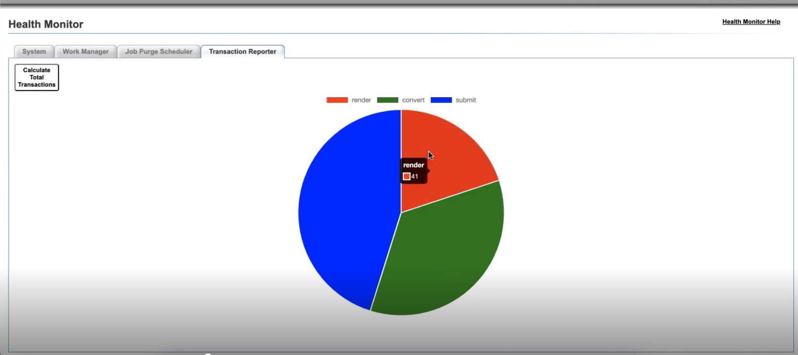

# Activation et affichage des rapports de transaction pour AEM Forms sur JEE {#transaction-reports-overview}

<span> La fonctionnalité de rapport de transaction est introduite pour AEM Forms on JEE à partir d’AEM Forms 6.5.20.0. Cette fonctionnalité est désactivée par défaut et peut être activée à partir de l’interface utilisateur d’administration.</span>

Les rapports de transaction dans AEM Forms on JEE vous permettent de tenir le compte de toutes les transactions effectuées sur votre déploiement AEM Forms. L’objectif est de fournir des informations sur l’utilisation des produits et d’aider les parties prenantes à comprendre leurs volumes de traitement numérique. Voici quelques exemples d’une transaction :

* Soumission d&#39;un document
* Rendu d’un document
* Conversion d’un document d’un format de fichier à un autre.

Pour plus d’informations sur ce qui est considéré comme une transaction, voir [API facturables](../../forms/using/transaction-reports-billable-apis-jee.md).

## Activer les rapports de transaction {#enable-transaction-reporting}

Par défaut, l’enregistrement des transactions est désactivé. Pour activer les rapports de transaction, procédez comme suit :

1. Accédez à `/adminui` sur votre instance AEM Forms sur JEE, par exemple `http://10.14.18.10:8080/adminui`.
1. Connectez-vous en tant qu’**administrateur ou administratrice**.
1. Accédez à **Paramètres** > **Paramètres de Core System** > **Configurations**.
1. Cochez la case pour **Activer la création de rapports de transactions**, puis cliquez sur **Enregistrer** pour enregistrer les paramètres.

   

1. Redémarrez le serveur.
1. Outre les modifications apportées au serveur, côté client, vous devez mettre à jour le fichier `adobe-livecycle-client.jar` de votre projet, si vous utilisez le même.

<!--
* You can [enable transaction recording](../../forms/using/viewing-and-understanding-transaction-reports.md#setting-up-transaction-reports) from AEM Web Console. view transaction reports on author, processing, or publish instances. View transaction reports on author or processing instances for an aggregated sum of all transactions. View transaction reports on the publish instances for a count of all transactions that take place only on that publish instance from where the report is run.
-->

<!--Do not author content (Create adaptive forms, interactive communication, themes, and other authoring activities) and process documents (Use workflows, document services, and other processing activities) on the same AEM instance. Keep the transaction recording disabled for AEM Forms servers used to author content. Keep the transaction recording enabled for AEM Forms servers used to process documents.-->

## Affichage du rapport de transaction {#view-transaction-report}

Lorsque vous activez la création de rapports de transactions, les informations sur le nombre de transactions sont accessibles à l’aide du [rapport de transaction via le tableau de bord](#transaction-report-dashboard) et un [rapport de transaction détaillé via le fichier journal](#transaction-report-logfile). Les deux sont expliqués ci-dessous :

### Rapport des transactions via un tableau de bord {#transaction-report-dashboard}

Le rapport sur les transactions, accessible par le biais d’un tableau de bord, indique le nombre total de transactions pour chaque type de transaction. Par exemple, vous obtenez des informations sur le nombre total de formulaires rendus, convertis et envoyés, comme illustré dans l’image. Pour obtenir le rapport de transaction, procédez comme suit :

1. Accédez à `/adminui` sur votre instance AEM Forms sur JEE, par exemple : `http://10.13.15.08:8080/adminui`.
1. Connectez-vous en tant qu’**administrateur ou administratrice**.
1. Cliquez sur Health Monitor.
1. Accédez à l’onglet **Transaction Reporter**, cliquez sur **Calculate Total Transactions**, et vous voyez maintenant un graphique circulaire représentant le nombre de formulaires PDF - envoyés, rendus ou convertis.




### Rapport de transaction via un fichier journal {#transaction-report-logfile}

Le rapport de transactions via un fichier journal fournit des informations détaillées sur chaque transaction. Pour accéder aux journaux des transactions, suivez le chemin du contexte relatif au démarrage du serveur. Par défaut, les transactions sont capturées dans un fichier journal distinct `transaction_log.log`. Le **chemin d’accès au fichier** est relatif au contexte de démarrage du serveur. Le chemin par défaut des différents serveurs est indiqué ci-dessous :

```
For Jboss Turnkey:
"<AEM_Forms_Installation>/jboss/bin/transaction_log.log"

For IBM Websphere: 
"<IBM_WAS_Profile_path>/transaction_log.log"

For Oracle Weblogic:
"<Weblogic_Domain_path>/transaction_log.log"

For Jboss Cluster:
"<Jboss home>/transaction_log.log"
```

Exemple d’un échantillon d’enregistrement de transaction :
`[2024-02-28 06:11:27] [INFO] TransactionRecord{service='GeneratePDFService', operation='HtmlFileToPDF', internalService='GeneratePDFService', internalOperation='HtmlFileToPDF', transactionOperationType='CONVERT', transactionCount=1, elapsedTime=1906, transactionDate=Wed Feb 28 06:11:25 UTC 2024}`

#### Enregistrement de transaction {#transaction-record-structure-jee}

La structure du journal des transactions définit la manière dont chaque transaction est enregistrée au moyen de ses différents paramètres, tels que le service, l’opération, le type de transaction, etc. Chacun de ces paramètres est expliqué en détails ci-dessous. La structure de l’enregistrement de transaction est la suivante :

```
TransactionRecord
{
    service='...', 
    operation='...', 
    internalService='...', 
    internalOperation='...', 
    transactionOperationType='...', 
    transactionCount=..., 
    elapsedTime=..., 
    transactionDate=...
}
```

* **service** : nom du service.
* **operation** : nom de l’opération.
* **internalService** : nom de la cible de l’appel en cas d’appel interne, sinon identique au nom du service.
* **internalOperation** : nom de la cible de l’appel en cas d’appel interne, sinon identique au nom de l’opération.
* **transactionOperationType** : type de transaction (envoi, rendu, conversion).
* **transactionCount** : nombre total de transactions.
* **elapsedTime** : temps entre le lancement de l’appel et la réponse reçue.
* **transactionDate** : horodatage indiquant quand le service a été appelé.

**Exemple de journal de transaction** :

```
[2024-02-14 14:23:25] [INFO] TransactionRecord
{
    service='BarcodedFormsService', 
    operation='decode', 
    internalService='BarcodedFormsService', 
    internalOperation='decode', 
    transactionOperationType='CONVERT', 
    transactionCount=1, 
    elapsedTime=47405, 
    transactionDate=Wed Feb 14 14:22:37 UTC 2024
}
```

## Fréquence d’enregistrement des transactions {#transaction-recording-frequency}

<!--Transaction persistence involves updating the total transaction count for SUBMIT, CONVERT, and RENDER operations on the server periodically: -->

La fréquence d’enregistrement des transactions est déterminée par les opérations de mise à jour sur le serveur pour chaque formulaire qui est envoyé, rendu ou converti avec succès.

* Dans le **tableau de bord**, le nombre de transactions est mis à jour régulièrement, la valeur par défaut est définie sur 1 minute. Vous pouvez mettre à jour la fréquence en définissant la propriété système sur `"com.adobe.idp.dsc.transaction.recordFrequency"`. Par exemple, sur AEM Forms pour JEE sur JBoss®, ajoutez `-Dcom.adobe.idp.dsc.transaction.recordFrequency=5` dans `JAVA_OPTS` pour définir la fréquence de mise à jour sur 5 minutes.

* Dans les **journaux des transactions**, la mise à jour de chaque transaction se produit instantanément lorsqu’un formulaire est envoyé, rendu ou converti avec succès.

<!-- A transaction remains in the buffer for a specified period (Flush Buffer time + Reverse replication time). By default, it takes approximately 90 seconds for the transaction count to reflect in the transaction report.

Actions like submitting a PDF Form, using Agent UI to preview an interactive communication, or using non-standard form submission methods are not accounted as transactions. AEM Forms provides an API to record such transactions. Call the API from your custom implementations to record a transaction.

## Supported Topology {#supported-topology}

Transaction reports are available only on AEM Forms on OSGi environment. It supports author-publish, author-processing-publish, and only processing topologies. For example, topologies, see [Architecture and deployment topologies for AEM Forms](../../forms/using/transaction-reports-overview.md).

The transaction count is reverse replicated from publish instances to author or processing instances. An indicative author-publish topology is displayed below:


>[!NOTE]
>
>AEM Forms transaction reports does not support topologies that contain only publish instances.

### Guidelines for using transaction reports {#guidelines-for-using-transaction-reports}

* Disable transaction reports on all author instances as reports on author instances includes transactions registered during authoring activities.
* Enable the **Show transactions from publish only** option on the author instance to view cumulative transactions from all publish instances. You can also view transaction reports on each publish instance for actual transactions on that particular publish instance only.
* Do not use author instances to run workflows and process documents.
* Before using transaction reporting, if you are have a toplogy with publish servers, ensure that the reverse replication is enabled for all the publish instances.
* Transaction data is reverse-replicated from a publish instance to only corresponding author or processing instance. The author or processing instance cannot further replicate data to another instance. For example, if you have author-processing-publish topology, aggregated transaction data is replicated only to the processing instance.-->

## Articles connexes {#related-articles}

* [Liste des API facturables pour AEM Forms sur JEE](../../forms/using/transaction-reports-billable-apis-jee.md)
* [Enregistrement d’une transaction pour les API de composant personnalisées pour AEM Forms sur OSGi](/help/forms/using/record-transaction-custom-component-jee.md)
