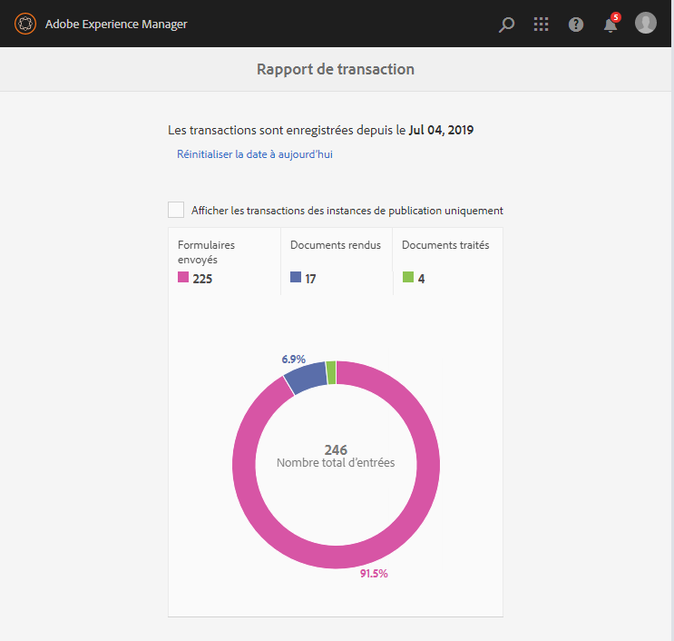
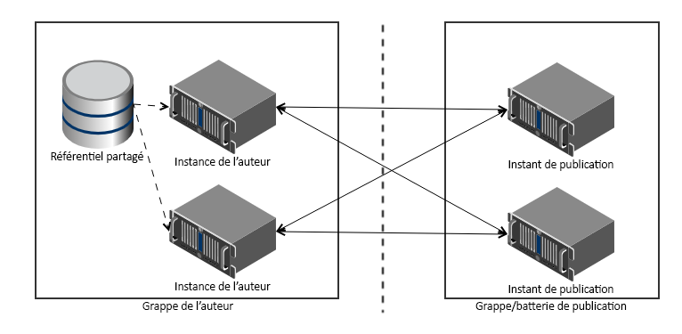

# Aperçu des rapports de transaction{#transaction-reports-overview}

## Présentation {#introduction}

Les rapports de transactions dans AEM Forms vous permettent de conserver le nombre de toutes les transactions effectuées depuis une date spécifiée dans votre déploiement AEM Forms. L’objectif est de fournir des informations sur l’utilisation des produits et d’aider les parties prenantes à comprendre leurs volumes de traitement numérique. Voici quelques exemples d’une transaction :

* Envoi d’un formulaire adaptatif, d’un formulaire HTML5 ou d’un jeu de formulaires
* Rendu d’une version imprimée ou Web d’une communication interactive
* Conversion d’un document d’un format de fichier à un autre

Pour plus d’informations sur ce qui est considéré comme une transaction, voir API [facturables](../../forms/using/transaction-reports-billable-apis.md).

L’enregistrement des transactions est désactivé par défaut. Vous pouvez [activer l’enregistrement](../../forms/using/viewing-and-understanding-transaction-reports.md#setting-up-transaction-reports) des transactions à partir de la console Web AEM. Vous pouvez afficher les rapports de transaction sur les instances d’auteur, de traitement ou de publication. Affichez les rapports de transaction sur les instances d’auteur ou de traitement pour obtenir une somme agrégée de toutes les transactions. Affichez les rapports de transaction sur les instances de publication pour obtenir le nombre de toutes les transactions qui ont lieu uniquement sur cette instance de publication à partir de laquelle le rapport est exécuté.

Ne créez pas de contenu (créez des formulaires adaptatifs, des communications interactives, des thèmes et d’autres activités de création) et traitez des documents (utilisez des processus, des services de document et d’autres activités de traitement) sur la même instance AEM. Conservez l’enregistrement des transactions désactivé pour les serveurs AEM Forms utilisés pour créer du contenu. Activez l’enregistrement des transactions pour les serveurs AEM Forms utilisés pour traiter les documents.

Une transaction reste dans la mémoire tampon pendant une période spécifiée (durée de la mémoire tampon de vidage + temps de réplication inverse). Par défaut, il faut environ 90 secondes pour que le nombre de transactions soit reflété dans le rapport de transactions.

Les actions telles que l’envoi d’un formulaire PDF, l’utilisation de l’interface utilisateur de l’agent pour prévisualiser une communication interactive ou l’utilisation de méthodes d’envoi de formulaire non standard ne sont pas comptabilisées comme des transactions. AEM Forms fournit une API pour enregistrer ces transactions. Appelez l’API depuis vos implémentations personnalisées pour enregistrer une transaction.

## Topologie prise en charge {#supported-topology}

Les rapports de transaction sont disponibles uniquement dans l’environnement AEM Forms sur OSGi. Il prend en charge les topologies de création-publication, de création-traitement-publication et de traitement uniquement. For example topologies, see [Architecture and deployment topologies for AEM Forms](../../forms/using/transaction-reports-overview.md).

Le nombre de transactions est répliqué à l’inverse des instances de publication vers les instances d’auteur ou de traitement. Une topologie de publication/auteur indicative s’affiche ci-dessous :

>[!NOTE]
>
>Les rapports de transaction AEM Forms ne prennent pas en charge les topologies qui contiennent uniquement des instances de publication.

### Instructions relatives à l&#39;utilisation des rapports de transaction {#guidelines-for-using-transaction-reports}

* Désactivez les rapports de transaction sur toutes les instances d’auteur, car les rapports sur les instances d’auteur incluent les transactions enregistrées pendant les activités de création.
* Activez l’option **Afficher les transactions de publication uniquement** sur l’instance d’auteur pour afficher les transactions cumulatives de toutes les instances de publication. Vous pouvez également afficher les rapports de transactions sur chaque instance de publication pour les transactions réelles sur cette instance de publication spécifique uniquement.
* N’utilisez pas d’instances d’auteur pour exécuter des processus et traiter des documents.
* Avant d’utiliser les rapports de transaction, si vous disposez d’une stratégie avec les serveurs de publication, assurez-vous que la réplication inverse est activée pour toutes les instances de publication.
* Les données de transaction sont répliquées inversement d’une instance de publication à une instance d’auteur ou de traitement correspondante uniquement. L’auteur ou l’instance de traitement ne peut pas répliquer davantage les données vers une autre instance. Par exemple, si vous disposez de la topologie de création-traitement-publication, les données de transaction agrégées sont répliquées uniquement sur l’instance de traitement.

## Related Articles {#related-articles}

* [Affichage et compréhension des rapports de transaction](../../forms/using/viewing-and-understanding-transaction-reports.md)
* [API facturables des rapports de transaction](../../forms/using/transaction-reports-billable-apis.md)
* [Enregistrer une transaction pour les implémentations personnalisées](/help/forms/using/record-transaction-custom-implementation.md)

