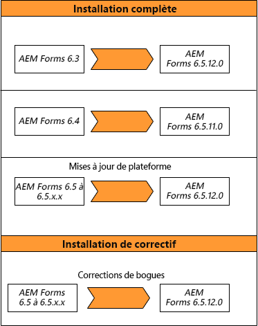

# Mettre à niveau vers AEM 6.5 Forms on JEE {#upgrade-to-aem-forms-jee}

AEM 6.5.18.0 Forms on JEE fournit deux types de programme d’installation : le programme d’installation complet et le programme d’installation des correctifs.

**Programme d’installation complet**: vous pouvez utiliser la variable [Programme d’installation complet d’AEM 6.5.18.0 on JEE](https://experienceleague.adobe.com/docs/experience-manager-release-information/aem-release-updates/forms-updates/aem-forms-releases.html?lang=fr) pour configurer de nouvelles instances AEM Forms ou effectuer des mises à niveau d’AEM Forms on JEE 6.5.x.x vers AEM 6.5.18.0 Forms on JEE.

**Programme d’installation de correctifs** : le [programme d’installation de correctifs d’AEM 6.5.18.0 on JEE](https://experienceleague.adobe.com/docs/experience-manager-release-information/aem-release-updates/forms-updates/aem-forms-releases.html?lang=fr) s’adresse aux client(e)s qui utilisent déjà les versions AEM 6.5.x.x. Vous pouvez utiliser le programme d’installation des correctifs pour effectuer la mise à niveau vers la dernière version d’AEM Forms.

Le tableau suivant illustre les scénarios d’utilisation du programme d’installation complet et de correctifs.

Procédez comme suit pour utiliser le programme d’installation complet afin de mettre à niveau AEM Forms 6.5.x.x sur JEE vers AEM 6.5.18.0 Forms on JEE :

1. Téléchargez le programme d’installation d’AEM 6.5 Forms on JEE à partir de la [Distribution logicielle](https://experience.adobe.com/#/downloads/content/software-distribution/en/aem.html). Pour télécharger le programme d’installation, vous devez disposer d’un contrat de Maintenance &amp; Support.
1. Voir [Aide-mémoire et planification de la mise à niveau](https://www.adobe.com/go/learn_aemforms_upgrade_checklist_65_fr) pour découvrir les vérifications à effectuer pour une mise à niveau réussie.
1. Voir [Préparation de la mise à niveau vers AEM Forms](https://www.adobe.com/go/learn_aemforms_prepareupgrade_65_fr) pour découvrir et exécuter les tâches permettant d’effectuer correctement la mise à niveau pour un temps d’arrêt du serveur minimal.
1. En fonction de votre environnement et de votre serveur d’application, sélectionnez l’un des documents suivants et suivez les instructions.

   * [Mise à niveau d’AEM 6.3 Forms ou d’AEM 6.4 Forms vers AEM 6.5 Forms pour JBoss](https://www.adobe.com/go/learn_aemforms_upgradeJBoss_65_fr)
   * [Mise à niveau d’AEM 6.3 Forms ou d’AEM 6.4 Forms vers AEM 6.5 Forms pour WebSphere](https://www.adobe.com/go/learn_aemforms_upgradeWebSphere_65_fr)
   * [Mise à niveau d’AEM 6.3 Forms ou d’AEM 6.4 Forms vers AEM 6.5 Forms pour JBoss clé en main](https://www.adobe.com/go/learn_aemforms_upgradeTurnkey_65_fr)

La mise à niveau directe de LiveCycle ES2, LiveCycle ES3, AEM 6.0 Forms, AEM 6.1 Forms et AEM 6.2 Forms vers AEM 6.5 Forms n’est pas disponible. Vous pouvez effectuer une mise à niveau intermédiaire vers une ou plusieurs versions de LiveCycle ou AEM Forms, puis effectuer une mise à niveau vers AEM 6.5 Forms. Pour la liste des versions intermédiaires et les instructions de mise à niveau correspondantes, voir [Sélectionner un chemin de mise à niveau](upgrade.md).
