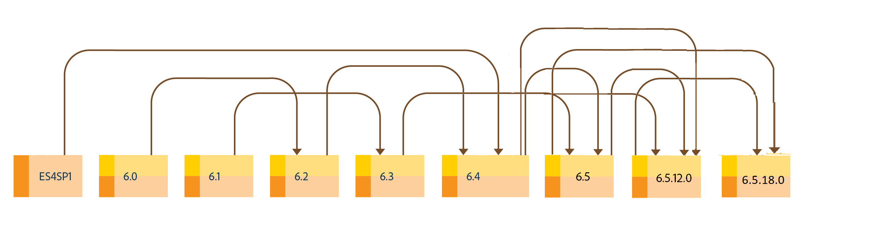

# Mise à niveau vers AEM 6.5 Forms {#upgrade-to-aem-forms}

| Version | Lien de l’article |
| -------- | ---------------------------- |
| AEM as a Cloud Service | [Cliquez ici](https://experienceleague.adobe.com/docs/experience-manager-cloud-service/content/forms/setup-configure-migrate/migrate-to-forms-as-a-cloud-service.html) |
| AEM 6.5 | Cet article |

AEM 6.5 Forms comporte plusieurs nouvelles fonctionnalités et améliorations qui optimisent la création, la gestion et la convivialité des formulaires et correspondances. Pour en savoir plus sur toutes les nouvelles fonctionnalités et améliorations d’AEM 6.5 Forms, voir [Résumé des nouvelles fonctionnalités](../../forms/using/whats-new.md).

Vous pouvez mettre à niveau votre installation LiveCycle ou AEM Forms pour obtenir les nouvelles fonctionnalités et améliorations proposées dans AEM 6.5 Forms tout en conservant intactes les données, processus et actifs existants. Lors de la mise à niveau, les métadonnées et l’état des processus sont également conservés. Vous pouvez choisir un chemin de mise à niveau pour commencer la mise à niveau.

Le diagramme suivant affiche les chemins de mise à niveau disponibles pour AEM Forms on OSGi :

Vous pouvez effectuer une mise à niveau directe depuis :

* AEM 6.3 Forms on OSGi
* AEM 6.4 Forms on OSGi

Vous pouvez également effectuer une mise à niveau en plusieurs étapes depuis

* AEM 6.0 Forms on OSGi
* AEM 6.1 Forms on OSGi
* AEM 6.2 Forms on OSGi

Le diagramme suivant affiche les chemins de mise à niveau disponibles pour AEM Forms on JEE :

Vous pouvez effectuer une mise à niveau directe depuis :

* AEM 6.3 Forms on JEE
* AEM 6.4 Forms on JEE
* AEM 6.5.x.x Forms on JEE

Vous pouvez également effectuer une mise à niveau en plusieurs étapes depuis

* LiveCycle ES4 SP1
* AEM 6.0 Forms on JEE
* AEM 6.1 Forms on JEE
* AEM 6.2 Forms on JEE

AEM 6.5.18.0 Forms on JEE fournit deux types d’installation : [Programme d’installation complet](https://experienceleague.adobe.com/docs/experience-manager-release-information/aem-release-updates/forms-updates/aem-forms-releases.html?lang=fr) et [Programme d’installation des correctifs](https://experienceleague.adobe.com/docs/experience-manager-release-information/aem-release-updates/forms-updates/aem-forms-releases.html?lang=fr).

**Programme d’installation complet**: vous pouvez utiliser le programme d’installation complet pour configurer de nouvelles instances AEM Forms ou effectuer des mises à niveau d’AEM Forms on JEE 6.5.x.x vers AEM 6.5.18.0 Forms on JEE.

**Programme d’installation des correctifs** : le programme d’installation des correctifs s’adresse aux client(e)s qui utilisent déjà les versions AEM 6.5.x.x. Vous pouvez utiliser le programme d’installation des correctifs pour effectuer la mise à niveau vers la dernière version d’AEM Forms.

L’image suivante illustre les scénarios d’utilisation du programme d’installation complet et des correctifs.

Voir [Instructions d’installation d’AEM 6.5 Service Pack Forms](https://experienceleague.adobe.com/docs/experience-manager-65/release-notes/aem-forms-current-service-pack-installation-instructions.html?lang=fr) article pour installer le dernier Service Pack pour l’environnement JEE.

<!--
[Work in Progress]

Migration involves moving only assets (PDF, XDP, images, adaptive forms, correspondence management assets) from one server to another - processes (LCA), settings, configurations, and a few other pieces of metadata are not migrated. Perform the following steps to migrate to AEM 6.3 Forms:

1. Set up a fresh environment of [AEM 6.3 Forms](https://adobe.com/go/learn_aemforms_documentation_63).
1. Move XDP or other compatible assets to the freshly set instance. For detailed instructions, see [Importing and exporting assets to AEM Forms](../../forms/using/import-export-forms-templates.md). 
1. Build the required services, if any.

   For example, if you are using AEM Forms on JEE Document Services, changes are required in the code to use document services available in AEM Forms on OSGi.

1. Perform post-installation activities:

    * **Run Migration Utility**

      The migration utility makes the adaptive forms and correspondence management assets of earlier versions compatible with AEM 6.3 forms. You can download the utility from AEM Software Distribution. For step-by-step information to configure and use the migration utility, see [migration utility](../../forms/using/migration-utility.md) documentation.

    * **Reconfigure Adobe Sign**

      If you had Adobe Sign configured in the previous version of AEM Forms, then reconfigure Adobe Sign from AEM Cloud services. For more details, see [Integrate Adobe Sign with AEM Forms](../../forms/using/adobe-sign-integration-adaptive-forms.md).

      Moreover, AEM 6.3 Forms release has introduced many new Adobe Sign features. For step-by-step information to use Adobe Sign, see [Using Adobe Sign in an adaptive form](../../forms/using/working-with-adobe-sign.md).

    * **Reconfigure analytics and reports**

      In AEM 6.3 Forms, traffic variable for source and success event for impression are not available. So, when you upgrade to AEM 6.3 Forms, AEM Forms stops sending data to Adobe Analytics server and analytics reports for adaptive forms are not available. Moreover, AEM 6.3 Forms introduces traffic variable for the version of form analytics and success event for the amount of time spent on a field. So, reconfigure analytics and reports for your AEM Forms environment. For detailed steps, see [Configuring analytics and reports](../../forms/using/configure-analytics-forms-documents.md).

      Methods to calculate average fill time for forms and average read time for have changed. So, when you upgrade to AEM 6.3 forms, older data (data from previous AEM Forms release) for these metrics is available only in Adobe Analytics. It is not visible in AEM Forms analytics reports. For these metrics, AEM Forms analytics reports display data which is captured after performing the upgrade.
      
      -->

