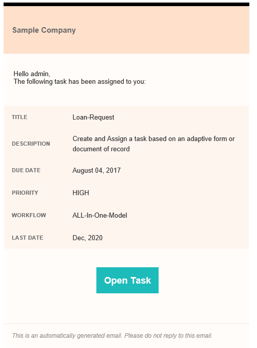

# Utilisation de métadonnées dans une notification électronique {#use-metadata-in-an-email-notification}

Vous pouvez utiliser l’étape Affecter une tâche pour créer et affecter des tâches à un utilisateur ou à un groupe. Lorsqu’une tâche est affectée à un utilisateur ou à un groupe, une notification électronique est envoyée à l’utilisateur défini ou à chaque membre du groupe défini. Une [notification électronique](../../forms/using/use-custom-email-template-assign-task-step.md) contient généralement le lien de la tâche affectée et des informations relatives à la tâche.

Vous pouvez utiliser des métadonnées dans un modèle de courrier électronique pour remplir de manière dynamique des informations dans une notification électronique. Par exemple, la valeur du titre, de la description, de la date d’échéance, de la priorité, du processus et de la dernière date dans la notification électronique est sélectionnée de manière dynamique au moment de l’exécution (lorsqu’une notification électronique est générée).



Les métadonnées sont stockées dans des paires clé-valeur. Vous pouvez spécifier la clé dans le modèle de courrier électronique et la clé est remplacée par une valeur au moment de l’exécution (lorsqu’une notification électronique est générée). Par exemple, dans l’exemple de code ci-dessous, la clé est « $ {workitem_title}  ». Elle est remplacée par la valeur « Demande-Prêt » à l’exécution.

```xml
subject=Task Assigned - ${workitem_title}

message=<html><body>\n\
 <table style="width: 480px; font-family: Helvetica, Arial, sans-serif; border: 0; padding: 0; vertical-align: top; text-align: left; word-wrap: break-word; margin: 16px auto; color:#323232; background-color:#FFFCF9; border-collapse: collapse;">\n\
  <tbody>\n\
   <tr>\n\
    <td style="height: 100px; width: 480px; background-color: #FFE0CB; border-top: 5pt solid black; font-family: Helvetica, Arial, sans-serif; font-weight: bold; font-size: 15px; line-height: 20px; padding: 12px; color: #707070;">\n\
      Sample Company\n\
    </td>\n\
   </tr>\n\
   <tr>\n\
    <td style="font-family: Helvetica, Arial, sans-serif; height: auto; background-color: #FFFCF9; padding: 32px 16px 20px 16px; ">\n\
     <pre style="font-size: 13px; font-family: Helvetica, Arial, sans-serif;  font-weight: normal; color: #323232;"> Hello ${workitem_assignee},\n\
 The following task has been assigned to you:</pre>\n\
    </td>\n\
   </tr>\n\
   <tr>\n\
    <td style="width: 480px;">\n\
     <table style="height: auto; width: 480px; background-color:#FFFBF9; font-family: Helvetica, Arial, sans-serif; border-collapse: collapse;">\n\
      <tbody>\n\
       <tr style="border-bottom: solid 2px #FFFCF9;">\n\
        <td style="font-family: Helvetica, Arial, sans-serif; width: auto; height: auto; background-color:#FFF5EF; font-weight: bold; font-size: 11px; line-height: 20px; padding: 12px; color: #707070;"> TITLE</td>\n\
        <td style="font-family: Helvetica, Arial, sans-serif; background-color:#FFF5EF; text-align: left; vertical-align: middle; height: auto; font-weight: normal; font-size: 13px; line-height: 20px; padding: 10px 16px 10px 32px; color: #323232;">\n\
         <p>${workitem_title}</p>\n\
        </td>\n\
       </tr>\n\
                            <tr style="border-bottom: solid 2px #FFFCF9;">\n\
        <td style="font-family: Helvetica, Arial, sans-serif; width: auto; height: auto; background-color:#FFF5EF; font-weight: bold; font-size: 11px; line-height: 20px; padding: 12px; color: #707070;"> DESCRIPTION</td>\n\
        <td style="font-family: Helvetica, Arial, sans-serif; background-color:#FFF5EF; text-align: left; vertical-align: middle; height: auto; font-weight: normal; font-size: 13px; line-height: 20px; padding: 10px 16px 10px 32px; color: #323232;">\n\
         <p>${workitem_description}</p>\n\
        </td>\n\
       </tr>\n\
       <tr style="border-bottom: solid 2px #FFFCF9;">\n\
        <td style="font-family: Helvetica, Arial, sans-serif; width: auto; height: auto; background-color:#FFF5EF; font-weight: bold; font-size: 11px; line-height: 20px; padding: 12px; color: #707070;"> DUE DATE</td>\n\
        <td style="font-family: Helvetica, Arial, sans-serif; background-color:#FFF5EF; text-align: left; vertical-align: middle; height: auto; font-weight: normal; font-size: 13px; line-height: 20px; padding: 10px 16px 10px 32px; color: #323232;">\n\
         <p>${workitem_due_date}</p>\n\
        </td>\n\
       </tr>\n\
       <tr style="border-bottom: solid 2px #FFFCF9;">\n\
        <td style="font-family: Helvetica, Arial, sans-serif; width: auto; height: auto; background-color:#FFF5EF; font-weight: bold; font-size: 11px; line-height: 20px; padding: 12px; color: #707070;"> PRIORITY</td>\n\
        <td style="font-family: Helvetica, Arial, sans-serif; background-color:#FFF5EF; text-align: left; vertical-align: middle; height: auto; font-weight: normal; font-size: 13px; line-height: 20px; padding: 10px 16px 10px 32px; color: #323232;">\n\
         <p>${workitem_priority}</p>\n\
        </td>\n\
       </tr>\n\
       <tr>\n\
        <td style="font-family: Helvetica, Arial, sans-serif; width: auto; height: auto; background-color:#FFF5EF; font-weight: bold; font-size: 11px; line-height: 20px; padding: 12px; color: #707070;"> WORKFLOW</td>\n\
        <td style="font-family: Helvetica, Arial, sans-serif; background-color:#FFF5EF; text-align: left; vertical-align: middle; height: auto; font-weight: normal; font-size: 13px; line-height: 20px; padding: 10px 16px 10px 32px; color: #323232;">\n\
         <p>${workitem_workflow}</p>\n\
        </td>\n\
       </tr>\n\
      </tbody>\n\
     </table>\n\
    </td>\n\
   </tr>\n\
   <tr style = "text-align: center; vertical-align: middle;">\n\
    <td style="padding:48px 0 72px 0;"> \n\
     <a href="${workitem_url}" target="_blank" style="background-color: #1EBBBB; font-size: 18px; line-height: 25px; font-weight: bold; color: #FFFFFF; text-decoration: none; padding: 15px 15px 15px 15px;">Open Task</a>\n\
    </td>\n\
   </tr>\n\
   <tr>\n\
    <td style="border-top: solid 1px #EDEAE7; padding: 16px;">\n\
     <p><span style="font-size: 12px; font-weight: normal; font-style: italic; color: #919191;">This is an automatically generated email. Please do not reply to this email.</code></p>\n\
    </td>\n\
   </tr>\n\
  </tbody>\n\
 </table>\n\
</body>\n\
</html>\n\
```

## Utilisation des métadonnées générées par le système dans une notification électronique {#using-system-generated-metadata-in-an-email-notification}

Une application AEM Forms fournit plusieurs variables de métadonnées (paires clé-valeur) prêtes à l’emploi. Vous pouvez utiliser ces variables dans un modèle de courrier électronique. La valeur de la variable est basée sur une application de formulaires associés. Le tableau suivant répertorie toutes les variables de métadonnées disponibles prêtes à l’emploi :

<table>
 <tbody> 
  <tr> 
   <td>Clé</td> 
   <td>Description</td> 
  </tr> 
  <tr> 
   <td>workitem_title</td> 
   <td>Titre de l’application de formulaires associés.</td> 
  </tr> 
  <tr> 
   <td>workitem_url</td> 
   <td>URL permettant d’accéder à l’application de formulaires associés.</td> 
  </tr> 
  <tr> 
   <td>workitem_description</td> 
   <td>Description de l’application de formulaires associés.</td> 
  </tr> 
  <tr> 
   <td>workitem_priority</td> 
   <td>Priorité spécifique pour l’application de formulaires associés.</td> 
  </tr> 
  <tr> 
   <td>workitem_due_date</td> 
   <td>La dernière date d’action sur l’application de formulaires associés.</td> 
  </tr> 
  <tr> 
   <td>workitem_workflow</td> 
   <td>Nom du processus associé à l’application de formulaires.</td> 
  </tr> 
  <tr> 
   <td>workitem_assign_timestamp</td> 
   <td>Date et heure auxquelles l’élément de processus a été affecté à la personne désignée actuelle.</td> 
  </tr> 
  <tr> 
   <td>workitem_assignee</td> 
   <td>Nom de la personne désignée actuelle.</td> 
  </tr> 
  <tr> 
   <td>host_prefix</td> 
   <td>URL du serveur d’auteur. Par exemple, https://10.41.42.66:4502<br /> </td> 
  </tr> 
  <tr> 
   <td>publish_prefix</td> 
   <td>URL du serveur de publication. Par exemple, https://10.41.42.66:4503</td> 
  </tr> 
 </tbody> 
</table>

## Utilisation des métadonnées personnalisées dans une notification électronique {#using-custom-metadata-in-an-email-notification}

Vous pouvez également utiliser des métadonnées personnalisées dans une notification électronique. Les métadonnée personnalisées contiennent des informations en plus des métadonnées générées par le système ; par exemple, les informations de stratégie récupérées à partir d’une base de données. Vous pouvez utiliser un lot ECMAScript ou OSGi pour ajouter des métadonnées personnalisées dans crx-repository :

### Utilisation de ECMAScript pour ajouter des métadonnées personnalisées  {#use-ecmascript-to-add-custom-metadata}

[ECMAScript](https://en.wikipedia.org/wiki/ECMAScript) est un langage de script. Il est utilisé pour les scripts et les applications serveur côté client. Procédez comme suit pour utiliser ECMAScript afin d’ajouter des métadonnées personnalisées pour un modèle de courrier électronique :

1. Connectez-vous à CRX DE à l’aide d’un compte administratif. The URL is https://&#39;[server]:[port]&#39;/crx/de/index.jsp

1. Accédez au site /apps/fd/dashboard/scripts/metadataScripts. Créez un fichier avec l’extension .ecma. Par exemple, usermetadata.ecma

   Si le chemin indiqué ci-dessus n’existe pas, créez-le.

1. Ajoutez le code dans le fichier.ecma comportant une logique pour générer des métadonnées personnalisées dans les paires clé-valeur. Par exemple, le code ECMAScript suivant produit des métadonnées personnalisées pour une police d’assurance :

   ```
   function getUserMetaData()  {
       //Commented lines below provide an overview on how to set user metadata in map and return it.
       var HashMap = Packages.java.util.HashMap;
       var valuesMap = new HashMap();
       valuesMap.put("policyNumber", "2017568972695");
       valuesMap.put("policyHolder", "Adobe Systems");
   
       return valuesMap;
   }
   ```

1. Cliquez sur Enregistrer tout. Désormais, le script est disponible pour la sélection dans le modèle de processus AEM.

   

1. (Facultatif) Spécifiez le titre du script :

   Si vous ne spécifiez pas le titre, le champ Métadonnées personnalisées affiche le chemin complet du fichier ECMAScript. Effectuez les étapes suivantes pour spécifier un titre significatif pour le script :

   1. Développez le nœud du script, cliquez avec le bouton droit de la souris sur **[!UICONTROL jcr:content]**, puis cliquez sur **[!UICONTROL Mixins]**.
   1. Saisissez mix:title dans la boîte de dialogue Modifier les mixins et cliquez sur **+**.
   1. Ajoutez une propriété avec les valeurs suivantes.

      | Nom | jcr:title |
      |---|---|
      | Type | Chaîne |
      | Valeur | Indiquez le titre du script. Par exemple, Métadonnées personnalisées pour le titulaire de la police. La valeur spécifiée s’affiche à l’étape Affecter une tâche. |

### Utilisation d’un bundle OSGi et d’une interface Java pour ajouter des métadonnées personnalisées {#use-an-osgi-bundle-and-java-interface-to-add-custom-metadata}

Vous pouvez utiliser l’interface Java WorkitemUserMetadataService pour ajouter des métadonnées personnalisées aux modèles de courrier électronique. Vous pouvez créer un bundle OSGi qui utilise l’interface Java WorkitemUserMetadataService et le déployer sur le serveur AEM Forms. Il rend les métadonnées disponibles pour la sélection à l’étape Affecter une tâche.

Pour créer un bundle OSGi avec une interface Java, ajoutez les fichiers .jar [SDK client AEM Forms](https://helpx.adobe.com/aem-forms/kb/aem-forms-releases.html) et [granite jar](https://repo.adobe.com/nexus/content/groups/public/com/adobe/granite/com.adobe.granite.workflow.api/1.0.2/) en tant que dépendances externes au projet de bundle OSGi. Vous pouvez utiliser n’importe quel IDE Java pour créer un bundle OSGi. La procédure suivante fournit des étapes pour l’utilisation de Eclipse afin de créer un bundle OSGi :

1. Ouvrez l’IDE Eclipse. Accédez à Fichier > Nouveau projet.

1. Sur l’écran de sélection de l’assistant, sélectionnez Projet Maven puis cliquez sur Suivant.

1. Sur le nouveau projet Maven, conservez les valeurs par défaut, puis cliquez sur Suivant. Sélectionnez un archétype et cliquez sur Suivant. Par exemple, maven-archetype-quickstart. Spécifiez l’ID du groupe, l’ID de l’artefact, la version et le package pour le projet et cliquez sur Terminer. La du projet est créée.

1. Ouvrez le fichier pom.xml pour modifier et remplacer tout le contenu du fichier par ce qui suit :

   ```
   
   ```

1. Ajoutez le code source qui utilise l’interface Java WorkitemUserMetadataService pour ajouter des métadonnées personnalisées aux modèles de courrier électronique. Un exemple de code est indiqué ci-dessous :

   ```java
   package com.aem.impl;
   
   import com.adobe.fd.workspace.service.external.WorkitemUserMetadataService;
   import org.apache.felix.scr.annotations.Component;
   import org.apache.felix.scr.annotations.Properties;
   import org.apache.felix.scr.annotations.Property;
   import org.apache.felix.scr.annotations.Service;
   import org.osgi.framework.Constants;
   
   import java.util.HashMap;
   import java.util.Map;
   
   @Component
   @Service
   @Properties({
           @Property(name = Constants.SERVICE_DESCRIPTION, value = "A sample implementation of a user metadata service."),
           @Property(name = WorkitemUserMetadataService.SERVICE_PROPERTY_LABEL, value = "Default User Metadata Service")})
   
   public class WorkitemUserMetadataServiceImpl
     implements WorkitemUserMetadataService
   {
     public WorkitemUserMetadataServiceImpl() {}
   
     public Map<String, String> getUserMetadataMap()
     {
       HashMap<String, String> metadataMap = null;
       metadataMap = new HashMap();
       metadataMap.put("test_metadata", "tested-interface implementation");
       return metadataMap;
     }
   }
   ```

1. Ouvrez une invite de commande et accédez au répertoire contenant le projet de bundle OSGi. Utilisez la commande suivante pour créer le bundle OSGi :

   `mvn clean install`

1. Chargez le bundle sur un serveur AEM Forms. Vous pouvez utiliser AEM Package Manager pour importer le bundle sur le serveur AEM Forms.

Une fois le bundle importé, vous pouvez sélectionner les métadonnées dans l’étape Affecter une tâche et les utiliser dans un modèle de courrier électronique.
