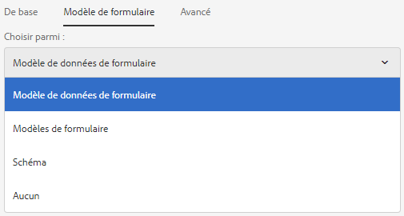
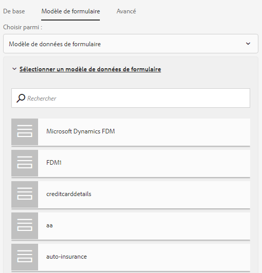
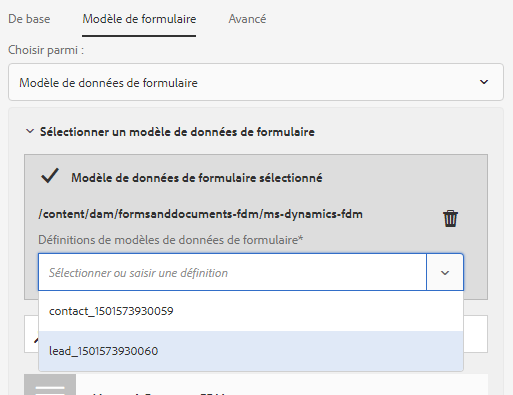
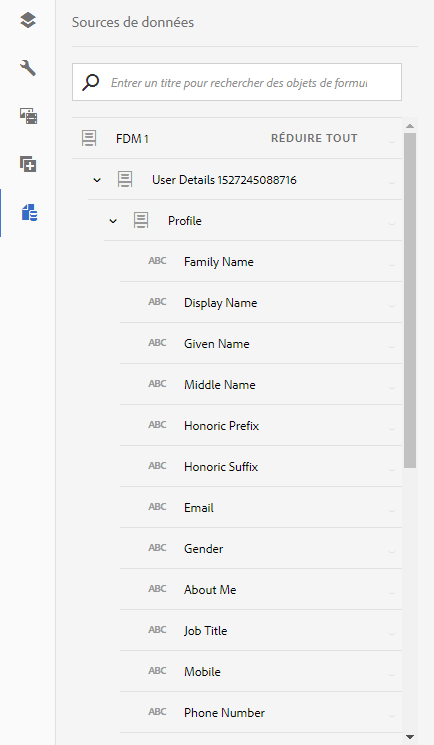
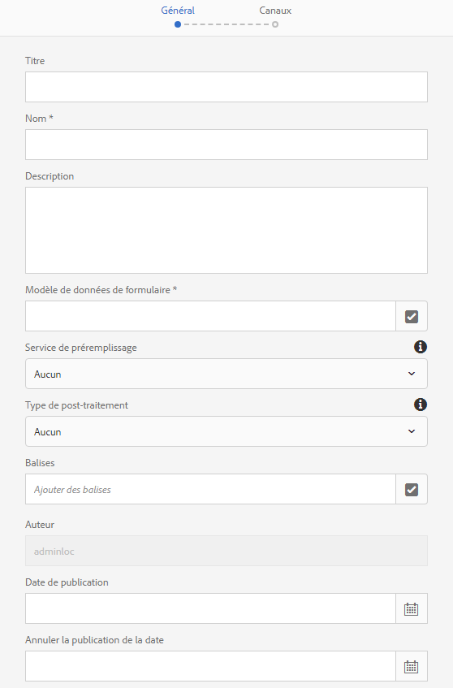
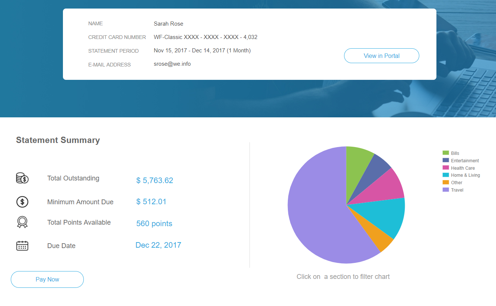
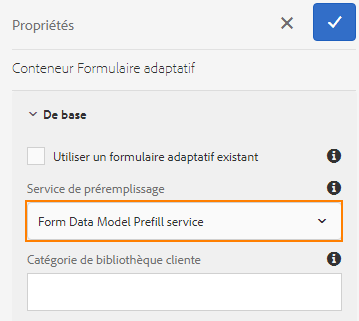
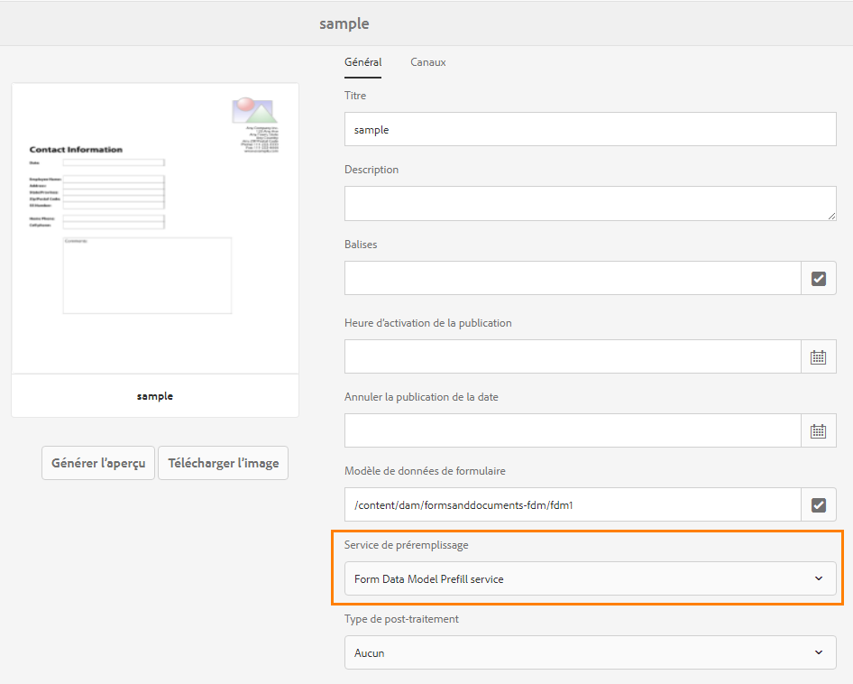
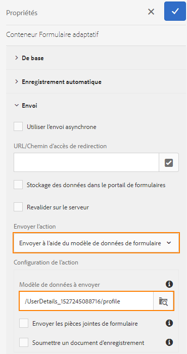
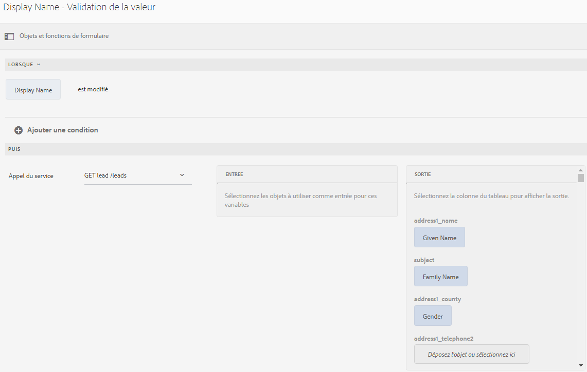

# Utilisation d’un modèle de données de formulaire{#use-form-data-model}

L’intégration de données d’AEM Forms vous permet d’utiliser des sources de données backend pour créer un modèle de données de formulaire que vous pouvez utiliser comme schéma dans divers processus de formulaires adaptatifs et de communications interactives. Elle nécessite la configuration des sources de données et la création d’un modèle de données de formulaire basé sur les objets et services de modèle de données disponibles dans les sources de données. Pour plus d’informations, consultez les sections suivantes :

* [Intégration des données AEM Forms](../../forms/using/data-integration.md)
* [Configurer les sources de données](../../forms/using/configure-data-sources.md)
* [Créer un modèle de données de formulaire](../../forms/using/create-form-data-models.md)
* [Utilisation du modèle de données du formulaire](../../forms/using/work-with-form-data-model.md)

Un modèle de données de formulaire est une extension du schéma JSON que vous pouvez utiliser pour :

* [Créer des formulaires adaptatifs et des fragments](#create-af)
* [Créer des communications interactives et des blocs de construction, comme des fragments de texte, de liste et de condition](#create-ic)
* [Prévisualiser des communications interactives avec exemples de données](#preview-ic)
* [Préremplir des formulaires adaptatifs et des communications interactives](#prefill)
* [Écrire les données de formulaires adaptatifs envoyés dans les sources de données](#write-af)
* [Appeler les services à l’aide des règles de formulaire adaptatif](#invoke-services)

## Créer des formulaires adaptatifs et des fragments {#create-af}

Vous pouvez créer des [formulaires adaptatifs](../../forms/using/creating-adaptive-form.md) et des [fragments de formulaire adaptatif](../../forms/using/adaptive-form-fragments.md) en fonction du modèle de données de formulaire. Procédez comme suit pour utiliser un modèle de données du formulaire lors de la création d’un formulaire adaptatif ou d’un fragment de formulaire adaptatif :

1. Dans l’onglet Modèle de formulaire de l’écran Ajouter des propriétés, sélectionnez **[!UICONTROL Modèle de données de formulaire]** dans la liste déroulante **[!UICONTROL Sélectionner à partir de]**.

   

1. Appuyez pour développer le **[!UICONTROL modèle de données de formulaire sélectionné]**. Tous les modèles de données de formulaire disponibles sont répertoriés.

   Sélectionnez un modèle de données de formulaire.

   

1. (**Fragments de formulaire adaptatif uniquement**) Vous pouvez créer un fragment de formulaire adaptatif basé sur un seul objet de modèle de données dans un modèle de données de formulaire. Développez la liste déroulante **[!UICONTROL Définitions de modèle de données de formulaire]**. Elle répertorie tous les objets de modèle de données dans le modèle de données de formulaire spécifié. Sélectionnez un objet de modèle de données dans la liste.

   

Une fois le formulaire adaptatif ou le fragment de formulaire adaptatif basé sur un modèle de données de formulaire créé, les objets de modèle de données de formulaire apparaissent dans l’onglet **[!UICONTROL Objets de modèle de données]** de l’explorateur de contenu dans l’éditeur de formulaires adaptatifs.

>[!NOTE]
>
>Pour un fragment de formulaire adaptatif, seul l’objet de modèle de données sélectionné au moment de la création et les objets de modèle de données associés apparaissent dans l’onglet Objets de modèle de données.

Vous pouvez glisser-déposer des objets de modèle de données sur le formulaire adaptatif ou le fragment pour ajouter des champs de formulaire. Les champs de formulaire ajoutés conservent les propriétés des métadonnées et la liaison avec les propriétés de l’objet de modèle de données. La liaison garantit que les valeurs de champ sont mises à jour dans les sources de données correspondantes lors de l’envoi du formulaire et préremplies lorsque le formulaire est rendu.

## Créer des communications interactives  {#create-ic}

Vous pouvez créer une communication interactive basée sur un modèle de données de formulaire que vous pouvez utiliser pour préremplir une communication interactive avec des données provenant de sources de données configurées. En outre, les blocs de construction d’une communication interactive, tels que les fragments de texte, de liste et de condition, peuvent se baser sur un modèle de données de formulaire.

Vous pouvez choisir un modèle de données de formulaire lors de la création d’une communication interactive ou d’un fragment de document. L’image suivante représente l’onglet Général de la boîte de dialogue Créer une communication interactive.

Onglet Général de la boîte de dialogue Créer une communication interactive

Pour en savoir plus, voir:

[Créer une communication interactive](../../forms/using/create-interactive-communication.md)

[Texte dans les communications interactives](/help/forms/using/texts-interactive-communications.md)

[Conditions dans les communications interactives](/help/forms/using/conditions-interactive-communications.md)

[Fragments de liste](/help/forms/using/lists.md)

## Aperçu contenant des exemples de données  {#preview-ic}

L’éditeur de modèle de données de formulaire vous permet de générer et de modifier des exemples de données pour les objets de modèle de données dans le modèle de données de formulaire. Vous pouvez utiliser ces données pour prévisualiser et tester les communications interactives et les formulaires adaptatifs. Vous devez générer les exemples de données avant la prévisualisation, comme décrit dans la section [Utilisation d’un modèle de données du formulaire](../../forms/using/work-with-form-data-model.md#sample).

Pour prévisualiser une communication interactive avec des exemples de données du modèle de données de formulaire :

1. Dans l’instance d’auteur AEM, accédez à **[!UICONTROL Formulaires > Formulaires et documents]**.
1. Sélectionnez une communication interactive et appuyez sur **[!UICONTROL Aperçu]** dans la barre d’outils pour sélectionner **[!UICONTROL Canal web]**, **[!UICONTROL Canal d’impression]** ou **[!UICONTROL Les deux canaux]** pour prévisualiser la communication interactive.
1. Dans la boîte de dialogue Prévisualisation [*canal*], vérifiez que **[!UICONTROL Tester les données du modèle de données de formulaire]** est sélectionné et appuyez sur **[!UICONTROL Prévisualisation]**.

La communication interactive s’ouvre avec des exemples de données préremplies.

De même, pour prévisualiser un formulaire adaptatif avec des exemples de données, ouvrez le formulaire adaptatif en mode création et appuyez sur **[!UICONTROL Aperçu]**.

## Pré-remplir à l’aide du service de modèle de données de formulaire {#prefill}

AEM Forms fournit un service de préremplissage de modèle de données de formulaire prêt à l’emploi que vous pouvez activer pour les formulaires adaptatifs et les communications interactives basé(e)s sur un modèle de données de formulaire. Le service de préremplissage récupère les sources de données des objets de modèle de données dans le formulaire adaptatif et la communication interactive et préremplit les données en conséquence lors du rendu du formulaire ou de la communication.

Pour activer le service de préremplissage de modèle de données de formulaire pour un formulaire adaptatif, ouvrez les propriétés du conteneur de formulaire adaptatif et sélectionnez **[!UICONTROL Service de préremplissage de modèle de données de formulaire]** dans la liste déroulante **[!UICONTROL Service de préfiltrage]** de l’accordéon De base. Ensuite, enregistrez les propriétés.

Pour configurer le service de préremplissage du modèle de données de formulaire dans une communication interactive, vous pouvez sélectionner le Service de préremplissage de modèle de données de formulaire dans le menu déroulant Service de préremplissage lors de sa création ou par la suite, en modifiant les propriétés.

Boîte de dialogue Modifier les propriétés pour une communication interactive

## Écrire les données de formulaires adaptatifs envoyés dans les sources de données  {#write-af}

Lorsqu’un utilisateur envoie un formulaire basé sur un modèle de données de formulaire, vous pouvez configurer le formulaire pour écrire les données envoyées pour un objet de modèle de données dans ses sources de données. Pour réaliser ce cas d’utilisation, AEM Forms fournit une [action d’envoi de modèle de données de formulaire](../../forms/using/configuring-submit-actions.md), disponible par défaut uniquement pour les formulaires adaptatifs basés sur un modèle de données de formulaire. Elle écrit les données envoyées pour un objet de modèle de données dans sa source de données.

Pour configurer l’action d’envoi Modèle de données de formulaire, ouvrez les propriétés du Conteneur de formulaire adaptatif et sélectionnez **[!UICONTROL Envoyer à l’aide du modèle de données de formulaire]** dans la liste déroulante Action d’envoi sous l’accordéon Envoi. Ensuite, recherchez et sélectionnez un objet de modèle de données dans la liste **[!UICONTROL Nom de l’objet de modèle de données à envoyer]** Enregistrez les propriétés.

Lors de l’envoi d’un formulaire, les données de l’objet de modèle de données configuré sont écrites dans la source de données respectives.

Vous pouvez également envoyer des pièces jointes de formulaire à une source de données à l’aide de la propriété d’objet de modèle de données binaire. Procédez comme suit pour envoyer des pièces jointes à une source de données JDBC :

1. Ajoutez un objet de modèle de données qui inclut une propriété binaire dans le modèle de données de formulaire.
1. Dans le formulaire adaptatif, faites glisser et déposez le composant **[!UICONTROL Pièce jointe]** du navigateur Composants sur le formulaire adaptatif.
1. Appuyez sur pour sélectionner le composant ajouté et appuyez sur  pour ouvrir l’explorateur de propriétés du composant.
1. Dans le champ Référence de liaison, appuyez sur  et naviguez pour sélectionner la propriété binaire que vous avez ajoutée dans le modèle de données de formulaire. Configurez d’autres propriétés en fonction de vos besoins.

   Appuyez sur  pour enregistrer les propriétés. Le champ de pièce jointe est maintenant lié à la propriété binaire du modèle de données de formulaire.

1. Dans la section Envoi des propriétés du conteneur de formulaire adaptatif, activez l’option **[!UICONTROL Envoyer les pièces jointes de formulaire]**. Elle permet d’envoyer la pièce jointe du champ de propriété binaire à la source de données lors de l’envoi du formulaire.

## Appeler des services dans des formulaires adaptatifs à l’aide de règles  {#invoke-services}

Dans un formulaire adaptatif basé sur un modèle de données de formulaire, vous pouvez [créer des règles](../../forms/using/rule-editor.md) pour appeler les services configurés dans le modèle de données de formulaire. L&#39;opération **[!UICONTROL Appeler les services]** dans une règle liste tous les services disponibles dans le modèle de données de formulaire et vous permet de sélectionner les champs d&#39;entrée et de sortie pour le service. Vous pouvez également utiliser le type de règle **Définir la valeur** pour appeler un service de modèle de données de formulaire et définir la valeur d’un champ sur la sortie renvoyée par le service.

Par exemple, la règle suivante appelle un service get qui utilise l’ID d’employé comme entrée et les valeurs renvoyées sont renseignées dans les champs ID, Nom, Prénom et Sexe correspondants du formulaire.

En outre, vous pouvez utiliser l&#39;API `guidelib.dataIntegrationUtils.executeOperation` pour écrire un code JavaScript dans l&#39;éditeur de code de l&#39;éditeur de règles. Pour plus d’informations sur l’API, voir [API pour appeler le service de modèle de données de formulaire](/help/forms/using/invoke-form-data-model-services.md).
