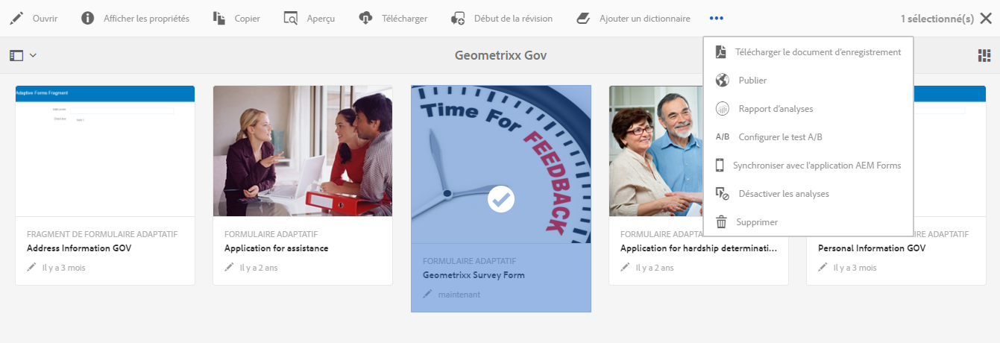
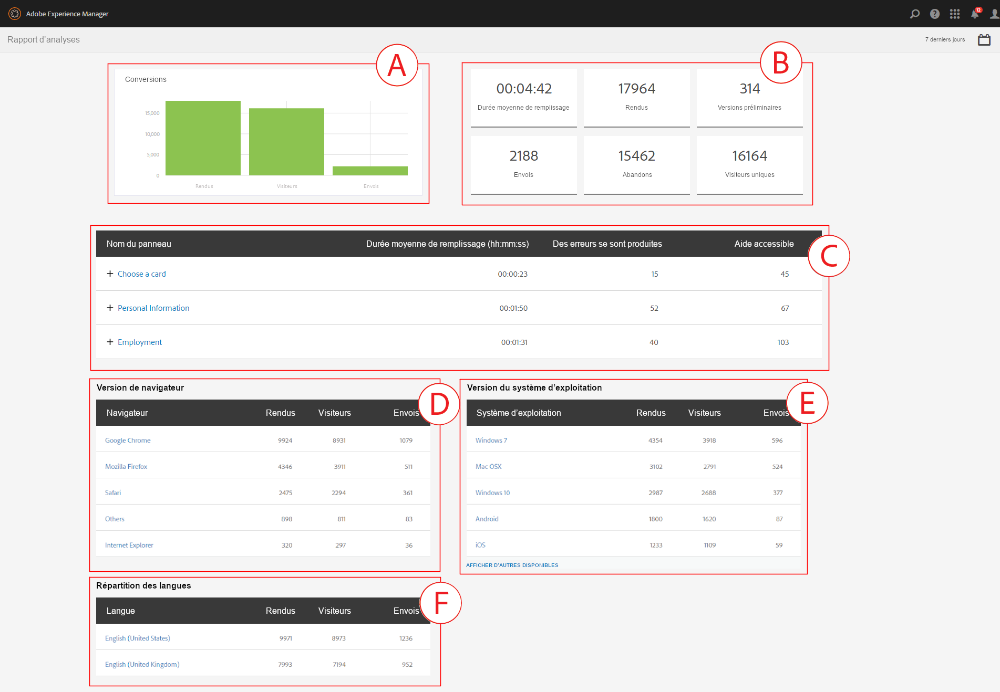
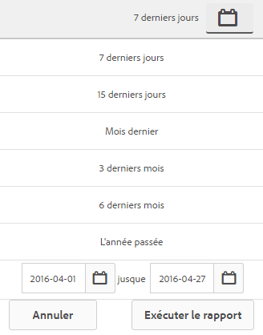
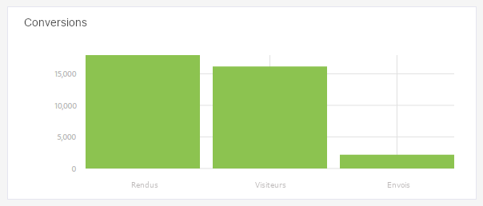
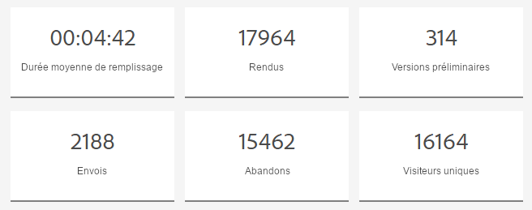
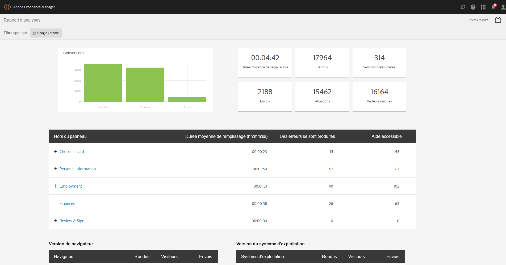
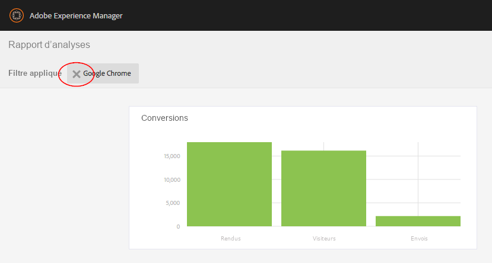

# Consultation et compréhension des rapports d’analyse d’AEM Forms {#view-and-understand-aem-forms-analytics-reports}

Adobe Experience Manager Forms s’intègre à Adobe Analytics, ce qui permet la capture et le suivi des mesures de performances des formulaires et des documents que vous avez publiés. L’analyse de ces mesures contribue à une prise de décisions éclairée fondée sur les données, eu égard aux modifications requises pour concevoir des formulaires ou des documents plus faciles à utiliser.

## Configuration de l’analyse  {#setting-up-analytics}

La fonctionnalité d’analyse des formulaires AEM est disponible dans le module complémentaire des formulaires AEM. Pour plus d’informations sur l’installation du module complémentaire, voir [Installation et configuration d’AEM Forms](../../forms/using/installing-configuring-aem-forms-osgi.md).

Outre le module complémentaire, vous devez disposer d’un compte Adobe Analytics. Pour plus d’informations sur la solution, voir [Adobe Analytics](https://www.adobe.com/solutions/digital-analytics.html).

Une fois que vous disposez du module complémentaire AEM Forms et d’un compte Adobe Analytics, intégrez le compte Adobe Analytics à AEM Forms et activez le suivi sur vos formulaires ou documents comme décrit à la section [Configuration des analyses et des rapports](../../forms/using/configure-analytics-forms-documents.md).

### Enregistrement des informations d’interaction utilisateur  {#how-user-interaction-information-is-recorded}

Lorsqu’un utilisateur interagit avec le formulaire, les interactions sont enregistrées et envoyées au serveur d’analyse. La liste suivante indique les appels de serveur pour différentes activités utilisateur :

* 2 appels par champ par visite
* 1 pour la visite de panneau
* 1 pour l’enregistrement
* 2 pour l’envoi
* 2 pour l’enregistrement
* 1 pour l’aide
* 1 pour chaque erreur de validation
* 1 pour le rendu du formulaire + 1 pour la visite de panneau par défaut + 1 pour la première visite de champ par défaut
* 2 pour l’abandon du formulaire

>[!NOTE]
>
>Cette liste n’est pas exhaustive.

### Affichage des rapports d’analyse {#summary-report}

Pour afficher les rapports d’analyse, procédez comme suit :

1. Connectez-vous au portail AEM à l’adresse `https://[hostname]:'port'`
1. Cliquez sur **Formulaires > Formulaires &amp; Documents**.
1. Sélectionnez le formulaire pour lequel vous souhaitez afficher les rapports d’analyse.
1. Sélectionnez **Plus > Rapports Analytics**.

**Rapport A.** Analytics, commande

AEM Forms affiche des rapports d’analyse pour le formulaire et chaque panneau de celui-ci, comme illustré dans le rapport de synthèse ci-dessous.

**A.** Conversions  **B.** Résumé au niveau du formulaire  **C.** Résumé au niveau du panneau  **D.** Navigateurs de visiteurs - filtrer E.OS de visiteurs - filtrer la langue de visiteur - filtrer la langue de  - filtrer ********

Par défaut, le rapport affiche l’analyse des sept derniers jours. Vous pouvez afficher des récapitulatifs pour les 15 derniers jours, le dernier mois et ainsi de suite, ou bien indiquer une période.

>[!NOTE]
>
>Les options telles que 7 derniers jours et 15 derniers jours n’incluent pas les données pour le jour où vous générez le rapport d’analyse. Pour inclure les données d’aujourd’hui, vous devez spécifier la plage de dates incluant le jour d’aujourd’hui, puis exécuter le rapport.

### Graphique des conversions pour les formulaires adaptatifs et HTML5 {#conversions-graph-for-adaptive-and-html-forms}

Le graphique de conversions de niveau formulaire donne des informations sur les performances du formulaire par le biais des indicateurs de performances clés (IPC) suivants :

* **Rendus** : nombre de fois qu’un formulaire est ouvert
* **Visiteurs** : nombre de visiteurs au formulaire
* **Envois** : nombre de fois qu’un formulaire est envoyé

### Rapport d’analyse pour les formulaires adaptatifs et HTML5 {#analytics-report-for-adaptive-and-html-forms}

La section de synthèse de niveau formulaire donne des informations sur les performances du formulaire par le biais des indicateurs de performances clés (IPC) suivants :

* **Durée moyenne de remplissage** : temps moyen passé au remplissage du formulaire. Lorsque les utilisateurs passent du temps sur le formulaire sans toutefois l’envoyer, ce temps n’est pas inclus dans le calcul.
* **Rendus** : nombre de fois que le formulaire a été affiché ou ouvert.
* **Brouillons** : nombre de fois que le formulaire a été enregistré en tant que brouillon. 
* **Envois** : nombre de fois que le formulaire a été envoyé.
* **Abandons** : nombre de fois que les utilisateurs ont commencé à remplir le formulaire sans le compléter.
* **Visiteurs** uniques : Nombre de fois où le formulaire est &quot;rendu par des visiteurs uniques&quot;. Pour plus d’informations sur les visiteurs uniques, voir [Visiteurs uniques, visites et comportement des clients](https://www.adobe.com/fr/marketing-cloud/social-media-marketing.html). 

### Rapport Panneau {#bottom-summary-report}

La section synthèse de niveau panneau fournit les informations suivantes sur chaque panneau du formulaire :

* **Durée moyenne de remplissage** : temps moyen passé au remplissage du panneau, que le formulaire soit soumis ou non
* **Erreurs rencontrées** : nombre moyen d’erreurs rencontrées par les utilisateurs sur des champs d’un panneau. Les erreurs rencontrées sont survenues en divisant le nombre total d’erreurs dans un champ par le nombre de rendus du formulaire.
* **Aide accessible** : nombre moyen de fois qu’un utilisateur a accédé à l’aide contextuelle pour les champs du panneau. L’aide accessible est obtenue en divisant le nombre total d’accès à l’aide pour un champ par le nombre de rendus du formulaire.

#### Rapport détaillé de panneau {#detailed-panel-report}

Vous pouvez également afficher les détails de chaque panneau en cliquant sur le nom d’un panneau dans le rapport Panneau.

Le rapport détaillé affiche les valeurs de tous les champs du panneau.

Le rapport Panneau se compose de trois onglets :

* **Rapport** de temps (par défaut) : Affiche le temps, en nombre de secondes, passé à remplir chacun des champs du panneau.
* **Rapport d’erreurs** : nombre d’erreurs générées par les utilisateurs qui remplissent les champs
* **Rapport sur l’aide** : nombre de fois que l’aide d’un champ en particulier a été affiché

Vous pouvez naviguer entre les panneaux, si plusieurs panneaux sont disponibles. 

### Filtres : navigateur, système d’exploitation et langue {#filters-browser-os-and-language}

Les tableau de répartition des navigateurs, des systèmes d’exploitation et des langues affichent les rendus, les visiteurs et les envois selon les navigateurs, le système d’exploitation et la langue des utilisateurs de formulaire. Ces tableaux affichent au maximum cinq entrées, par défaut. Cliquez sur Afficher plus afficher plus d’entrées. Cliquez sur Afficher moins pour revenir à cinq entrées normales ou moins.

Pour filtrer davantage les données d’analyse, vous pouvez cliquer sur une entrée de l’un des tableaux. Par exemple, si vous cliquez sur Google Chrome dans le tableau des navigateurs, le rapport est rendu avec les données en fonction du navigateur Google chrome comme suit :

Si vous consultez le rapport Panneau après l’application d’un filtre, les données des rapports sont également affichées selon le filtre appliqué.

  Lorsqu’un filtre est appliqué :

* Les tableaux de répartition sont à présent en lecture seule, car un seul filtre ne peut être appliqué à la fois.
* Le tableau du filtre appliqué disparaît.
* Vous pouvez cliquer sur le bouton Fermer (mis en évidence ci-dessous) pour supprimer le filtre appliqué.

### Tests A/B {#a-b-testing}

Si vous avez activé et configuré le test A/B pour le formulaire, la page du rapport affiche une liste déroulante que vous pouvez utiliser pour l’affichage du rapport de test A/B. Le rapport de test A/B affiche la performances comparatives deux versions du formulaire que vous avez définis.

Pour plus d’informations sur les tests A/B, voir [Création et gestion des tests A/B pour les formulaires adaptatifs](../../forms/using/ab-testing-adaptive-forms.md).
