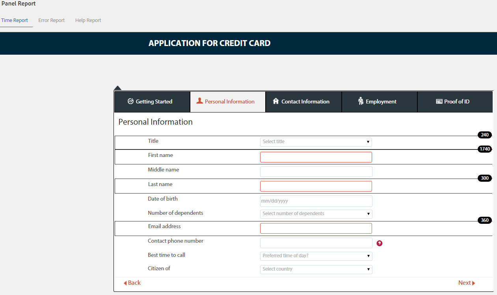

# Consulter et comprendre les rapports d’analyse d’AEM Forms {#view-and-understand-aem-forms-analytics-reports}

Adobe Experience Manager Forms s’intègre à Adobe Analytics qui vous permet de capturer et de suivre les mesures de performances des formulaires et documents que vous avez publiés. L’analyse de ces mesures contribue à une prise de décisions éclairée fondée sur les données, eu égard aux modifications requises pour concevoir des formulaires ou des documents plus faciles à utiliser.

## Configuration des analyses {#setting-up-analytics}

La fonctionnalité d’analyse d’AEM Forms est disponible dans le package complémentaire d’AEM Forms. Pour plus d’informations sur l’installation du package de modules complémentaires, voir [Installation et configuration d’AEM Forms](../../forms/using/installing-configuring-aem-forms-osgi.md).

Outre le module complémentaire, vous avez besoin d’un compte Adobe Analytics. Pour plus d’informations sur la solution, voir [Adobe Analytics](https://www.adobe.com/fr/solutions/digital-analytics.html).

Une fois que vous disposez du module complémentaire AEM Forms et d’un compte Adobe Analytics, intégrez le compte Adobe Analytics à AEM Forms et activez le suivi sur vos formulaires ou documents, comme décrit à la section [Configuration des analyses et des rapports](../../forms/using/configure-analytics-forms-documents.md).

### Enregistrement des informations sur l’interaction utilisateur {#how-user-interaction-information-is-recorded}

Lorsqu’un utilisateur interagit avec le formulaire, les interactions sont enregistrées et envoyées au serveur Analytics. La liste suivante indique les appels au serveur pour diverses activités utilisateur :

* 2 appels par champ par visite
* 1 pour la visite de panneau
* 1 pour l’enregistrement
* 2 pour envoi
* 2 pour l’enregistrement
* 1 pour obtenir de l’aide
* 1 pour chaque erreur de validation
* 1 pour le rendu de formulaire + 1 pour la visite de panneau par défaut + 1 pour la première visite de champ par défaut
* 2 pour l’abandon de formulaire

>[!NOTE]
>
>Cette liste n&#39;est pas exhaustive.

### Affichage des rapports d’analyse {#summary-report}

Pour afficher les rapports d’analyse, procédez comme suit :

1. Connectez-vous au portail AEM à l’adresse `https://[hostname]:'port'`
1. Cliquez sur **Formulaires > Formulaires &amp; Documents**.
1. Sélectionnez le formulaire pour lequel vous souhaitez afficher les rapports d’analyse.
1. Sélectionnez **Plus > Rapports Analytics**.

**A.** Commande de rapport d’analyse

AEM Forms affiche des rapports d’analyse pour le formulaire et chaque panneau de celui-ci, comme illustré dans le rapport de synthèse ci-dessous.

**A.** Conversions **B.** Synthèse de niveau formulaire **C.** Synthèse de niveau panneau **D.** Navigateurs des visiteurs - filtre **E.** Système d’exploitation des visiteurs - filtre **F.** Langue des visiteurs - filtre

Par défaut, le rapport d’analyse des sept derniers jours s’affiche. Vous pouvez afficher des rapports pour les 15 derniers jours, le dernier mois, etc., ou spécifier une période.

>[!NOTE]
>
>Les options telles que 7 derniers jours et 15 derniers jours n’incluent pas de données pour le jour où vous générez le rapport d’analyse. Pour inclure les données du jour actuel, vous devez spécifier la période incluant le jour actuel, puis exécuter le rapport.

### Graphique de conversions pour les formulaires adaptatifs et de HTML5 {#conversions-graph-for-adaptive-and-html-forms}

Le graphique de conversions au niveau du formulaire vous donne des informations sur les performances du formulaire par le biais des indicateurs de performances clés (IPC) suivants :

* **Rendus**: nombre d’ouvertures d’un formulaire
* **Visiteurs**: nombre de visiteurs dans le formulaire.
* **Envois**: nombre de fois que le formulaire est envoyé

### Rapport d’analyse pour les formulaires adaptatifs et de HTML5 {#analytics-report-for-adaptive-and-html-forms}

La section de synthèse de niveau formulaire donne des informations sur les performances du formulaire à l’aide des indicateurs de performances clés (IPC) suivants :

* **Durée moyenne de remplissage** : temps moyen passé au remplissage du formulaire. Lorsque les utilisateurs passent du temps sur le formulaire sans toutefois l’envoyer, ce temps n’est pas inclus dans le calcul.
* **Rendus** : nombre de fois que le formulaire a été affiché ou ouvert.
* **Brouillons**: nombre de fois que le formulaire a été enregistré en tant que brouillon
* **Envois**: nombre de fois que le formulaire a été envoyé
* **Abandonner**: nombre de fois où les utilisateurs ont commencé à remplir le formulaire, puis l’ont quitté sans l’avoir rempli
* **Visiteurs uniques :** nombre de fois que le formulaire est généré par des visiteurs uniques. Pour plus d’informations sur les visiteurs uniques, voir [Visiteurs uniques, visites et comportement des clients](https://helpx.adobe.com/fr/analytics/kb/unique-visitors-visitor-behavior.html). 

### Rapport Panneau {#bottom-summary-report}

La section de résumé au niveau du panneau fournit les informations suivantes sur chaque panneau du formulaire :

* **Durée moyenne de remplissage** : temps moyen passé au remplissage du panneau, que le formulaire soit soumis ou non
* **Erreurs rencontrées** : nombre moyen d’erreurs rencontrées par les utilisateurs sur des champs d’un panneau. La valeur Erreurs rencontrées est calculée en divisant le nombre total d’erreurs rencontrées dans un champ par le nombre de rendus du formulaire.
* **Aide accessible** : nombre moyen de fois qu’un utilisateur a accédé à l’aide contextuelle pour les champs du panneau. La valeur Aide accessible est calculée en divisant le nombre total d’accès à l’aide pour un champ par le nombre de rendus du formulaire.

#### Rapport détaillé de panneau {#detailed-panel-report}

Vous pouvez également afficher les détails de chaque panneau en cliquant sur le nom d’un panneau dans le rapport Panneau.

Le rapport détaillé affiche les valeurs de tous les champs du panneau.

Le rapport Panneau comporte trois onglets :

* **Rapport de temps** (par défaut) : affiche le temps, en nombre de secondes, passé à remplir chacun des champs du panneau.
* **Rapport d’erreurs** : nombre d’erreurs générées par les utilisateurs qui remplissent les champs
* **Rapport sur l’aide** : nombre de fois que l’aide d’un champ en particulier a été affiché

Vous pouvez naviguer entre les panneaux, si plusieurs panneaux sont disponibles. 

### Filtres : navigateur, système d’exploitation et langue {#filters-browser-os-and-language}

Les tableaux Répartition de navigateur, Répartition du système d’exploitation et Répartition des langues affichent les rendus, les visiteurs et les envois selon les navigateurs, le système d’exploitation et la langue des utilisateurs de formulaire. Par défaut, ces tableaux affichent cinq entrées au maximum. Vous pouvez cliquer sur Afficher plus pour afficher plus d’entrées, puis sur Afficher moins pour revenir aux cinq entrées normales ou moins.

Pour filtrer davantage les données d’analyse, vous pouvez cliquer sur une entrée dans l’un des tableaux. Par exemple, si vous cliquez sur Google Chrome dans le tableau de distribution du navigateur, le rapport est rendu avec les données relatives au navigateur Google Chrome, comme suit :

Si vous consultez le rapport Panneau après l’application d’un filtre, les données des rapports sont également affichées selon le filtre appliqué.

Lorsqu’un filtre est appliqué :

* Les tableaux de distribution deviennent en lecture seule, car un seul filtre peut être appliqué à la fois.
* Le tableau du filtre appliqué disparaît.
* Vous pouvez cliquer sur le bouton Fermer (mis en surbrillance ci-dessous) pour supprimer le filtre appliqué.

### Tests A/B {#a-b-testing}

Si le test A/B est activé et configuré pour le formulaire, la page du rapport comporte une liste déroulante que vous pouvez utiliser pour afficher le rapport de test A/B. Le rapport de test A/B affiche la performances comparatives deux versions du formulaire que vous avez définis.

Pour plus d’informations sur les tests A/B, voir [Création et gestion des tests A/B pour les formulaires adaptatifs](../../forms/using/ab-testing-adaptive-forms.md).
