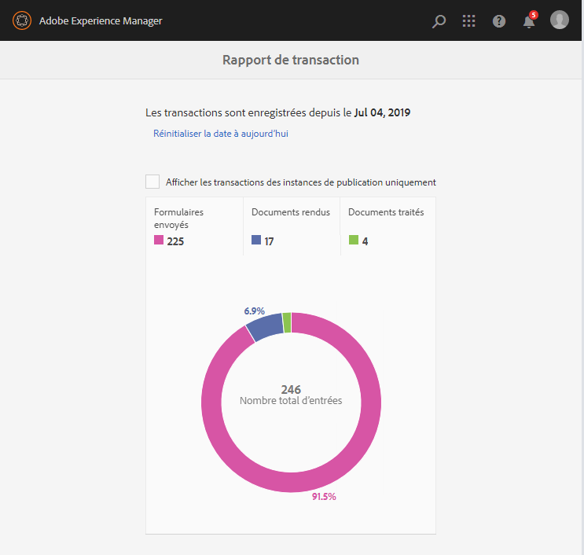

# Affichage et compréhension des rapports de transaction{#viewing-and-understanding-transaction-reports}

Les rapports de transaction vous permettent de capturer et de suivre le nombre de formulaires envoyés, de documents traités et de documents rendus. L’objectif du suivi de ces transactions est de prendre une décision éclairée sur l’utilisation du produit et de rééquilibrer les investissements en matériel et en logiciels. Pour plus d’informations, voir [Présentation des rapports de transaction AEM Forms](../../forms/using/transaction-reports-overview.md).

## Configuration des rapports de transaction {#setting-up-transaction-reports}

La fonction Rapports de transaction est disponible dans le cadre du module complémentaire d’AEM forms. Pour plus d’informations sur l’installation du module complémentaire sur toutes les instances de création et de publication, voir [Installation et configuration d’AEM forms](/help/forms/using/installing-configuring-aem-forms-osgi.md). Une fois que vous avez installé le module complémentaire AEM forms, procédez comme suit :

* Activation de la réplication inverse sur toutes les instances de publication
* Activer les rapports de transaction
* Fournir des droits pour afficher un rapport de transaction
* (Facultatif) Configuration de la période de purge des transactions et des boîtes de réception 

>[!NOTE]
>
>* Les rapports de transaction AEM Forms ne prennent pas en charge les topologies qui contiennent uniquement des instances de publication.
>* Avant d’utiliser les rapports de transaction, assurez-vous que la réplication inverse est activée pour toutes les instances de publication.
>* Les données de transaction sont répliquées à l’inverse d’une instance de publication vers une instance de création ou de traitement correspondante. L’instance d’auteur ou de traitement ne peut pas répliquer davantage les données vers une autre instance.

>

### Activer la réplication inverse sur toutes les instances de publication {#enable-reverse-replication-on-all-the-publish-instances}

Les rapports de transaction utilisent la réplication inverse pour consolider le nombre de transactions entre les instances de publication et les instances d’auteur. Configurez la réplication inverse sur toutes les instances de publication. Pour obtenir des instructions détaillées sur la configuration de la réplication inverse, voir [réplication](/help/sites-deploying/replication.md).

### Activer les rapports de transaction {#enable-transaction-reports}

Les rapports de transaction sont désactivés par défaut. Vous pouvez activer les rapports à partir de la console Web d’AEM. pour activer les rapports de transaction dans un environnement AEM Forms, effectuez les étapes suivantes sur toutes les instances de création et de publication :

1. Connectez-vous à une instance AEM en tant qu’administrateur. Accédez à **Outils** > **Opérations** > **Console web**.
1. Recherchez et ouvrez le service **Forms Transaction Reporting**.
1. Cochez la case Enregistrer les transactions . Cliquez sur **Enregistrer**.

   Répétez les étapes 1 à 3 sur toutes les instances d’auteur et de publication.

### Fournir des droits pour afficher un rapport de transaction {#provide-rights-to-view-a-transaction-report}

Seuls les membres du groupe administrateur-fd peuvent afficher les rapports sur les transactions. Pour permettre à un utilisateur d’afficher les rapports de transaction, faites de ces utilisateurs des membres du groupe administrateur-fd. Pour plus d’informations sur la façon de faire d’un utilisateur un membre d’un groupe AEM, voir [Administration des utilisateurs, des groupes et des droits d’accès](/help/sites-administering/user-group-ac-admin.md).

### (Facultatif) Configuration de la période de purge des transactions et des boîtes de réception {#optional-configure-transaction-flush-period-and-outboxes}

Les transactions sont mises en cache en mémoire avant d’être stockées dans le référentiel. Par défaut, la période de mise en cache (période de purge des transactions) est définie sur 60 secondes. Effectuez les étapes suivantes pour modifier la période de mise en cache par défaut :

1. Connectez-vous aux instances d’auteur en tant qu’administrateur. Accédez à **Outils** > **Opérations** > **Console web**.
1. Recherchez et ouvrez le service **Fournisseur de stockage du référentiel de transaction Forms**.
1. Indiquez le nombre de secondes dans le champ **Période de purge des transactions**. Cliquez sur **Enregistrer**.

La réplication inverse copie les données de transaction dans la boîte d’envoi par défaut des instances d’auteur. Vous pouvez placer les données de transaction dans une boîte d’envoi personnalisée. Effectuez les étapes suivantes pour spécifier une boîte d’envoi personnalisée :

1. Connectez-vous aux instances d’auteur en tant qu’administrateur. Accédez à **Outils** > **Opérations** > **Console web**.
1. Recherchez et ouvrez le service **Fournisseur de stockage du référentiel de transaction Forms**.
1. Indiquez le nom de la boîte d’envoi personnalisée dans le champ **Boîtes d’envoi** . Cliquez sur **Enregistrer**. Une boîte d’envoi avec le nom spécifié est créée sur toutes les instances d’auteur.

## Consultation du rapport de transaction {#viewing-the-transaction-report}

Vous pouvez afficher les rapports de transaction sur les instances d’auteur ou de publication. Le rapport de transaction sur l’instance d’auteur fournit une somme globale de toutes les transactions qui ont lieu sur les instances d’auteur et de publication configurées. Le rapport de transaction sur l’instance de publication fournit un décompte des transactions qui ont lieu uniquement sur l’instance de publication sous-jacente. Pour afficher le rapport, procédez comme suit :

1. Connectez-vous au serveur AEM Forms à l’adresse `https://[hostname]:'port'`.
1. Accédez à **Outils** > **Forms****Afficher le rapport de transaction**.

## Comprendre le rapport {#understanding-the-report}

AEM Forms affiche les rapports de transaction depuis la date configurée, comme dans un rapport récapitulatif ci-dessous :

* Utilisez les options **Réinitialiser la date à aujourd’hui** pour réinitialiser les enregistrements de transaction. Lorsque vous réinitialisez la date à aujourd’hui, tous les enregistrements de transaction précédents sont perdus. Lorsque vous réinitialisez la date sur une instance d’auteur, la modification n’a aucune incidence sur les rapports de transaction sur les instances de publication et à l’inverse.
* Utilisez **Afficher les transactions des seules instances de publication** pour afficher toutes les transactions qui se sont produites uniquement sur l’instance de publication ou la ferme de publication configurée.
* Utilisez les catégories : **Document traité**, **Documents rendus** et **Forms soumis** pour afficher les transactions correspondantes. Pour connaître le type des transactions prises en compte dans ces catégories, voir [API de rapports sur les transactions facturables](../../forms/using/transaction-reports-billable-apis.md).

## Afficher les logs de rapports de transaction {#view-transaction-reporting-logs}

Le rapport des transactions place toutes les informations affichées dans le rapport ainsi que certaines informations supplémentaires dans les journaux. Les informations fournies dans les journaux sont utiles aux utilisateurs avancés. Par exemple, les journaux divisent les transactions en plusieurs catégories granulaires par rapport à trois catégories consolidées affichées dans le rapport. Les journaux sont disponibles dans le fichier `error.log` du répertoire `/crx-repository/logs/`. Les logs sont disponibles même si vous n’activez pas les rapports de transaction à partir de la console web AEM.

## Articles connexes {#related-articles}

* [Présentation des rapports de transaction](../../forms/using/transaction-reports-overview.md)
* [API facturables des rapports de transaction](../../forms/using/transaction-reports-billable-apis.md)
* [Enregistrer une transaction pour les implémentations personnalisées](/help/forms/using/record-transaction-custom-implementation.md)
