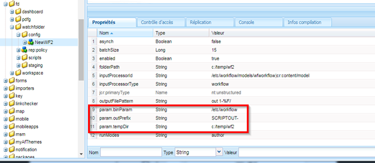
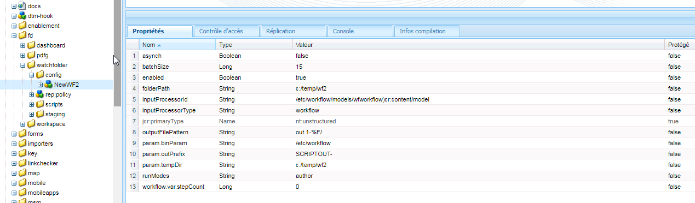
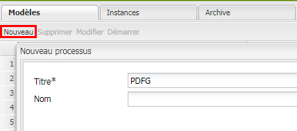
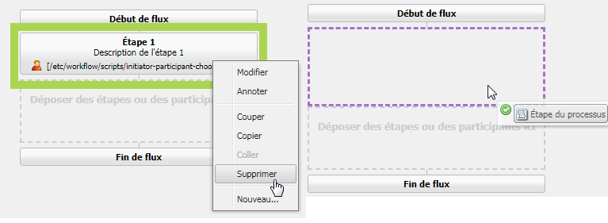
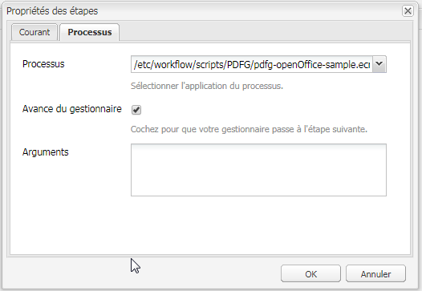
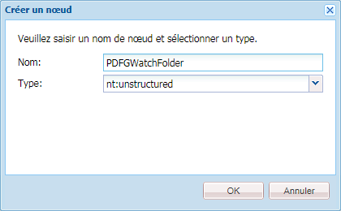

# Dossier de contrôle dans AEM Forms{#watched-folder-in-aem-forms}

Un administrateur peut configurer un dossier réseau, appelé dossier de contrôle (en anglais Watched Folder), de sorte que lorsqu’un utilisateur y place un fichier (par exemple un fichier PDF), un flux de travail, un service ou une opération d’exécution de script démarre pour le traitement du fichier ajouté. Après que le service a effectué l’opération spécifiée, il enregistre le fichier obtenu dans un dossier de sortie spécifié. Pour plus d’informations sur le flux, le service et le script, voir [Diverses méthodes pour traiter les fichiers](#variousmethodsforprocessingfiles).

## Création d’un dossier de contrôle {#create-a-watched-folder}

Vous pouvez utiliser l’une des méthodes suivantes pour créer un dossier de contrôle sur le système de fichiers :

* Lors de la configuration des propriétés d’un noeud de configuration du dossier de contrôle, saisissez le chemin d’accès complet du répertoire parent dans la propriété folderPath et ajoutez le nom du dossier de contrôle à créer, comme indiqué dans l’exemple suivant : `C:/MyPDFs/MyWatchedFolder`
Le 
`MyWatchedFolder`n’existe pas, les AEM Forms tentent de créer le dossier à l’emplacement spécifié.

* Créez un dossier dans le système de fichiers avant de configurer un point de fin Watched Folder, puis indiquez son chemin d’accès complet dans la propriété folderPath (chemin de fichier). Pour plus d’informations sur la propriété folderPath, voir [Propriétés de dossier de contrôle](#watchedfolderproperties).

>[!NOTE]
>
>Dans un environnement de grappes de serveur, le dossier à utiliser comme dossier de contrôle doit être accessible, modifiable et partagé sur le système de fichiers ou le réseau. Dans ce cas, chaque instance du serveur d’applications de la grappe doit avoir accès au même dossier partagé. Sous Windows, créez un lecteur réseau mappé sur tous les serveurs et spécifiez le chemin d’accès du lecteur réseau mappé dans la propriété folderPath (chemin fichier).

## Créez un nœud de configuration du dossier de contrôle {#create-watched-folder-configuration-node}

Pour configurer un dossier de contrôle, créez un nœud de configuration du dossier de contrôle. Effectuez les étapes suivantes pour créer le noeud de configuration :

1. Connectez-vous à CRX DE Lite en tant qu’administrateur et accédez au dossier de /etc/fd/watchfolder/config.

1. Créer un nœud de type `nt:unstructured`. Par exemple, watchedfolder

   >[!NOTE]
   >
   >Le nom de nœud de Watched Folder ne peut pas contenir d’espaces ni de caractères spéciaux.

1. Ajoutez les propriétés suivantes au nœud  :

   * `folderPath`
   * `inputProcessorType`
   * `inputProcessorId`
   * `outputFilePattern`

   Pour obtenir la liste complète des prises en charge, voir [Propriétés du dossier de contrôle](#watchedfolderproperties).

1. Cliquez sur **Enregistrer tout**. Après la création du nœud et l’enregistrement des propriétés. Les `input`dossiers, `result`, `failure``preserve`et `stage`dossiers sont créés à l’emplacement spécifié dans la propriété `folderPath` .

   La tâche de numérisation démarre l’analyse du dossier de contrôle dans un laps de temps défini.

## Propriétés du dossier de contrôle {#watchedfolderproperties}

Vous pouvez configurer les propriétés suivantes d’un dossier de contrôle.

* **folderPath (chaîne)** : le chemin du dossier à numériser à des créneaux horaires définis. Pour un environnement organisé en grappes, le dossier doit se trouver à un emplacement partagé par tous les serveurs disposant d’un accès complet au serveur. Il s’agit d’une propriété obligatoire.
* **inputProcessorType (chaîne)** : le type du processus à démarrer. Vous pouvez spécifier le flux, le script, ou le service. Il s’agit d’une propriété obligatoire.
* **inputProcessorId (chaîne)** : le comportement de la propriété inputProcessorId repose sur la valeur spécifiée pour la propriété inputProcessorType. Il s’agit d’une propriété obligatoire. La liste suivante détaille toutes les valeurs possibles de la propriété d’inputProcessorType et de la condition requise correspondante pour la propriété d’inputProcessorType :

   * Pour le flux de travail, spécifiez le modèle de flux de travail à exécuter. Par exemple, /etc/workflow/models/ &lt;workflow_name>/jcr:content/model
   * Pour le script, indiquez le chemin JCR du script à exécuter. Par exemple, /etc/fd/watchfolder/test/testScript.ecma
   * Pour le service, spécifiez le filtre utilisé pour localiser un service OSGi. Le service est enregistré comme une implémentation de l’interface de com.adobe.aemfd.watchfolder.service.api.ContentProcessor.

* **runModes (chaîne)** : liste séparée par des virgules de modes d’exécution autorisés pour l’exécution du flux de travaux. Voici quelques exemples :

   * Auteur 

   * publish

   * author, publish

   * publier, auteur

>[!NOTE]
>
>Si le serveur qui héberge le dossier Watched Folder ne dispose pas d’un mode d’exécution spécifié, le dossier est toujours activé, sans tenir compte des modes d’exécution sur le serveur.

* **outputFilePattern (chaîne)** : motif du fichier de sortie. Vous pouvez spécifier un motif de dossier ou de fichier. Si un modèle de dossier est spécifié, les fichiers de sortie portent des noms comme décrit dans les flux de travaux. Si un modèle de fichier est spécifié, les fichiers de sortie portent des noms comme décrit dans le modèle de fichier. [Le modèle de fichiers et de dossiers](../../forms/using/watched-folder-in-aem-forms.md#p-file-and-folder-patterns-p) peut également indiquer une structure de répertoires pour les fichiers de sortie. Il s’agit d’une propriété obligatoire.

* **stageFileExpirationDuration (long, -1 par défaut)** : Le nombre de secondes à attendre pour qu’un fichier/dossier d’entrée ayant déjà été collecté pour traitement soit traité comme ayant expiré et défini comme étant un échec. Ce mécanisme d’expiration s’active uniquement lorsque la valeur de cette propriété est un nombre positif.

>[!NOTE]
>
>Même lorsqu’une entrée est marquée comme ayant expiré à l’aide de ce mécanisme, elle peut toujours être traitée en arrière-plan, mais prend tout simplement plus de temps que prévu. Si le contenu d’entrée a été consommé avant le déclenchement du mécanisme d’expiration, le traitement peut même se terminer ultérieurement et la sortie être transférée vers le dossier de résultats. Si le contenu n’a pas été consommé avant l’expiration, il est très probable que le traitement se soldera par une erreur ultérieurement en tentant de consommer le contenu, et cette erreur sera également consignée dans le dossier des erreurs pour la même entrée. En revanche, si le traitement de l’entrée ne s’est jamais activé en raison d’une tâche intermittente/d’un échec de déclenchement de flux de travail (ce qui constitue le scénario que le mécanisme d’expiration vise à résoudre), naturellement aucune de ces deux éventualités ne se produisent. Par conséquent, pour les entrées figurant dans le dossier des erreurs et ayant été marquées comme échecs en raison d’une expiration (recherchez les messages tels que « Fichiers non traités après un laps de temps considérable, marqués comme échec. » dans le journal des erreurs), il est conseillé d’analyser le dossier des résultats (ainsi que le dossier des erreurs lui-même pour une autre entrée pour la même entrée) afin de vérifier si les éventualités décrites auparavant se sont vraiment produites.

* **deleteExpiredStageFileOnlyWhenThrottled (Boolean, valeur par défaut true) :** si le mécanisme d’expiration doit ou non s’activer uniquement lorsque le dossier de contrôle est ralenti. Ce mécanisme est plus approprié pour les dossiers de contrôle ralentis car un petit nombre de fichiers qui traînent à l’état non traité (en raison d’une tâche intermittente/d’un échec de déclenchement de flux de travail) risquent potentiellement de freiner le traitement du lot entier lorsque l’option de ralentissement est activée. Si cette propriété est conservée sur true (valeur par défaut), le mécanisme d’expiration ne s’active pas pour les dossiers de contrôle qui ne sont pas ralentis. Si la propriété est conservée sur false, le mécanisme s’active toujours tant que la propriété stageFileExpirationDuration est un nombre positif.

* **pollInterval (Long)** : le laps de temps en secondes pour l’analyse du dossier de contrôle en sortie. A moins que le paramètre Ralentissement ne soit activé, l’attribut Intervalle de répétition doit être supérieur à la durée du traitement d’une tâche moyenne, faute de quoi le système risque d’être surchargé. La valeur par défaut est 5. Pour plus d’informations, voir la description du paramètre Taille du lot. La valeur de pollinterval doit être supérieure ou égale à un.
* **excludeFilePattern (chaîne)** : une liste dont les éléments sont séparés par des points-virgules (;) qu’un dossier de contrôle utilise pour déterminer les fichiers et les dossiers à analyser et à sélectionner. Les fichiers ou les dossiers pourvus de ce modèle ne sont pas analysés en vue d’être traités. Ce paramètre est utile lorsque l’entrée est un dossier contenant plusieurs fichiers. Vous pouvez copier le contenu du dossier dans un dossier dont le nom sera choisi par le dossier de contrôle. Ceci empêche le dossier de contrôle de sélectionner un dossier en vue de le traiter avant qu’il ne soit complètement copié dans le dossier d’entrée. La valeur par défaut est « null ».
You can use [file patterns](../../forms/using/watched-folder-in-aem-forms.md#p-file-and-folder-patterns-p) to exclude:

   * Fichiers possédant des extensions particulières, par exemple *.dat, *.xml, .pdf, *.*
   * Fichiers portant des noms spécifiques ; par exemple, data* exclurait les fichiers et les dossiers nommés data1, data2, etc.
   * Fichiers contenant des expressions composites dans leur nom et leur extension, comme dans les exemples suivants :

      * Données[0-9][0-9][0-9].[dD][aA]&#39;port&#39;
      * *.[dD][Aa]&#39;port&#39;
      * *.[Xx][Mm][Ll]

Pour plus d’informations sur les modèles de fichiers, voir [À propos des modèles de fichier](../../forms/using/watched-folder-in-aem-forms.md#p-file-and-folder-patterns-p).

* **includeFilePattern (chaîne)** : liste dont les éléments sont séparés par des points-virgules (;) utilisés par le dossier de contrôle pour déterminer les dossiers et les fichiers à analyser et à sélectionner. Ainsi, si l’attribut IncludeFilePattern a la valeur input*, tous les fichiers et les dossiers correspondant à input* sont sélectionnés. Cela concerne les fichiers et les dossiers nommés input1, input2, etc. La valeur par défaut est * et elle désigne tous les fichiers et dossiers. Vous pouvez utiliser des modèles de fichiers pour inclure les types de fichiers suivants :

   * Fichiers possédant des extensions particulières, par exemple *.dat, *.xml, .pdf, *.*
   * Fichiers portant des noms spécifiques, par exemple data.* à savoir les fichiers et les dossiers nommés data1, data2, etc.

* Fichiers contenant des expressions composites dans leur nom et leur extension, comme dans les exemples suivants :

   * Données[0-9][0-9][0-9].[dD][aA]&#39;port&#39;

      * *.[dD][Aa]&#39;port&#39;
      * *.[Xx][Mm][Ll]

Pour plus d’informations sur les modèles de fichiers, voir [À propos des modèles de fichier](../../forms/using/watched-folder-in-aem-forms.md#p-file-and-folder-patterns-p)

* **waitTime (Long)** : le temps d’attente (en millisecondes) avant de pouvoir analyser un fichier ou un dossier après sa création. Par exemple, si la durée d’attente est de 3 600 000 millisecondes (une heure) et que le fichier a été créé il y a une minute, ce dernier sera sélectionné à l’issue d’un laps de temps de 59 minutes ou plus. La valeur par défaut est 0. Ce paramètre assure la copie intégrale d’un fichier ou d’un dossier dans le dossier d’entrée. Par exemple, si vous devez traiter un fichier volumineux dont le téléchargement dure dix minutes, définissez une durée d’attente de 10*60 *1 000 millisecondes, Cela évite que le dossier de contrôle analyse le fichier s’il a été créé il y a moins de dix minutes.
* **purgeDuration (Long)** : les fichiers et les sous-dossiers du dossier Résultats sont vidés lorsqu’ils sont plus anciens que cette valeur. Cette valeur est mesurée en jours. Grâce à ce paramètre, le dossier obtenu n’est jamais plein. La valeur -1 jour indique de ne jamais supprimer le dossier result. La valeur par défaut est -1.
* **resultFolderName (chaîne)** : le dossier dans lequel les résultats enregistrés sont stockés. Si les résultats ne s’affichent pas dans ce dossier, vérifiez le dossier des échecs. Les fichiers en lecture seule ne sont pas traités ; ils sont enregistrés dans le dossier des échecs. Il peut s’agir d’un chemin d’accès vide, relatif ou absolu répondant aux modèles de fichiers suivants :

   * %F = préfixe du nom du fichier
   * %E = extension du nom du fichier
   * %Y = année (complète)
   * %y = année (deux derniers chiffres)
   * %M = mois
   * %D = jour du mois
   * %d = jour de l’année
   * %H = heure (horloge 24 heures)
   * %h = heure (horloge 12 heures)
   * %m = minute
   * %s = seconde
   * %l = milliseconde
   * %R = nombre aléatoire (entre 0 et 9)
   * %P = ID de processus ou de travail

   Par exemple, s’il est 20 h, que nous sommes le 17 juillet 2009 et que vous définissez C:/Test/WF0/failure/%Y/%M/%D/%H/, le dossier de résultat est alors C:/Test/WF0/failure/2009/07/17/20

   Si le chemin d’accès n’est pas absolu mais relatif, le dossier est créé dans le dossier de contrôle. La valeur par défaut est result/%Y/%M/%D/, qui correspond au dossier des résultats dans le dossier de contrôle. Pour plus d’informations sur les modèles de fichiers, voir [A propos des modèles de fichier](../../forms/using/watched-folder-in-aem-forms.md#p-file-and-folder-patterns-p).

>[!NOTE]
>
>Plus les dossiers de résultats sont petits, plus les performances de Watched Folder augmentent. Par exemple, si la charge estimée pour le dossier de contrôle est de 1 000 fichiers par heure, utilisez un modèle de type result/%Y%M%D%H, afin qu’un nouveau sous-dossier soit créé toutes les heures. Si la charge est moindre (par exemple, 1 000 fichiers par jour), vous pouvez utiliser un modèle de type result/%Y%M%D.

* **failureFolderName (chaîne)** : le dossier dans lequel les fichiers d’échec sont enregistrés. Cet emplacement est toujours lié au dossier de contrôle. Vous pouvez utiliser des modèles de fichiers, comme indiqué pour le dossier result. Les fichiers en lecture seule ne sont pas traités ; ils sont enregistrés dans le dossier des échecs. La valeur par défaut est failure/%Y/%M/%D/.
* **preserveFolderName (chaîne) :** l’emplacement où les fichiers sont stockés après un traitement réussi. Ce chemin d’accès de répertoire peut être absolu, relatif ou null. Vous pouvez utiliser des modèles de fichiers, comme indiqué pour le dossier result. La valeur par défaut est preserve/%Y/%M/%D/.
* **batchSize (Long)** : le nombre de fichiers ou de dossiers à sélectionner par analyse. Ce paramètre permet d’éviter une surcharge du système, car l’analyse simultanée d’un trop grand nombre de fichiers peut provoquer une panne. La valeur par défaut est 2.  

   Les paramètres Intervalle de répétition et Taille du lot permettent de déterminer le nombre de fichiers sélectionnés par Watched Folder pour chaque analyse. Watched Folder utilise un pool de threads Quartz pour analyser le dossier input. Le pool de threads est partagé avec d’autres services. Si l’intervalle d’analyse défini est court, les threads analysent fréquemment le dossier input. Si des fichiers sont déposés régulièrement dans le dossier de contrôle, il est préférable que l’intervalle d’analyse soit court. Si au contraire, des fichiers y sont déposés peu fréquemment, utilisez un intervalle d’analyse plus long afin que les autres services puissent utiliser les threads. 

   Si un gros volume de fichiers est déposé, définissez une grande taille de lot. Si par exemple, le service exécuté par le point de fin Watched Folder peut traiter 700 fichiers par minute et que les utilisateurs déposent des fichiers dans le dossier d’entrée à la même fréquence, la définition de la Taille du lot sur 350 et de l’Intervalle de répétition sur 30 secondes permet de maintenir les performances de Watched Folder sans avoir à subir les conséquences d’une analyse du dossier de contrôle trop fréquente.

     Lorsque des fichiers sont déposés dans le dossier de contrôle, ce dernier les répertorie dans les entrées, ce qui réduit parfois les performances si l’analyse s’effectue toutes les secondes. L’allongement de l’intervalle d’analyse permet d’améliorer les performances. Si le volume des fichiers déposés est réduit, ajustez la Taille du lot et l’Intervalle de répétition en conséquence. Par exemple, si 10 fichiers sont déposés toutes les secondes, essayez de définir l’Intervalle de répétition sur 1 et la Taille du lot sur 10

* **throttleOn (Boolean)** : lorsque cette option est sélectionnée, elle permet de limiter le nombre de tâches du dossier de contrôle qu’AEM Forms peut traiter en une seule fois. La valeur Taille du lot détermine le nombre maximal de tâches. La valeur par défaut est true. Voir [A propos du ralentissement ](../../forms/using/watched-folder-in-aem-forms.md#p-about-throttling-p).

* **overwriteDuplicateFilename (booléen)** : lorsque cet attribut est défini sur True, les fichiers du dossier des résultats et du dossier de fichiers conservés sont remplacés. Lorsqu’il est défini sur false, les fichiers et les dossiers pourvus d’un suffixe d’index numérique sont utilisés pour le nom. La valeur par défaut est False.
* **preserveOnFailure (Booléen)** : conserve les fichiers d’entrée en cas d’échec de l’exécution de l’opération sur un service. La valeur par défaut est true.
* **inputFilePattern (chaîne)** : spécifie le modèle des fichiers d’entrée pour un dossier de contrôle. Crée une liste autorisée des fichiers.
* **asynch (booléen)** : identifie le type d’appel comme étant asynchrone ou synchrone. La valeur par défaut est True (asynchrone). Le traitement du fichier est une tâche qui mobilise des ressources, maintenez la valeur de l’indicateur d’asynch sur True pour éviter d’étouffer le thread principal de la tâche de numérisation. Dans un environnement organisé en grappes, il est essentiel de maintenir l’indicateur True pour activer l’équilibrage de charge pour les fichiers en cours de traitement sur les serveurs disponibles. Si l’indicateur est défini sur False, la tâche d’analyse tente de procéder à un traitement pour chaque fichier/dossier de premier niveau de manière séquentielle dans son propre thread. Ne définissez pas l’indicateur sur False sans raison particulière, par exemple, traitement sur flux selon une configuration sur un serveur unique.

>[!NOTE]
>
>Les flux de travail sont par essence asynchrones. Même si vous définissez la valeur sur False, les flux sont déclenchés en mode asynchrone.

* **enabled (booléen)** : désactive et active la numérisation d’un dossier de contrôle. Définissez enabled sur True pour commencer à analyser le dossier de contrôle. La valeur par défaut est true.
* **payloadMapperFilter :** lorsqu’un dossier est configuré comme dossier de contrôle, une structure de dossiers est créée dans le dossier de contrôle. La structure comporte des dossiers pour fournir des entrées, recevoir des sorties (résultats), sauvegarder les données en cas de défaillance, préserver les données pour les processus de longue durée et sauvegarder les données des différentes étapes. La structure de dossiers d’un dossier de contrôle peut servir de charge utile des processus basés sur l’utilisation de Forms. Un mappeur de charge utile vous permet de définir la structure d’une charge utile qui utilise un dossier de contrôle pour l’entrée, la sortie et le traitement. For example, if you use the default mapper, it maps content of Watched Folder with [payload]\input and [payload]\output folder. Deux implémentations de mappeur de charge prêtes à l’emploi sont disponibles. Si vous ne disposez pas d’[une implémentation personnalisée](../../forms/using/watched-folder-in-aem-forms.md#creating-a-custom-payload-mapper-filter), utilisez l’une des implémentations prêtes à l’emploi :

   * **Mappeur par défaut :** utilisez le mappeur de charge par défaut pour conserver les contenus d’entrée et de sortie des dossiers de contrôle dans des dossiers d’entrée et de sortie distincts dans la charge utile. Also, in payload path of a workflow, use [payload]/input/ and [payload]/output paths to retrive and save content.

   * **Mappeur de charge basé sur des fichiers simples :** utilisez le mappeur de charge basé sur des fichiers simples pour conserver les contenus d’entrée et de sortie directement dans le dossier de charge utile. Tout comme pour le mappeur par défaut, aucune hiérarchie supplémentaire n’est créée.

### Paramètres de configuration personnalisés {#custom-configuration-parameters}

En plus des propriétés de configuration du dossier de contrôle répertoriées ci-dessus, vous pouvez également spécifier des paramètres de configuration personnalisés. Les paramètres personnalisés sont transmis au code de traitement des fichiers. Cela permet au code de modifier son comportement à partir de la valeur du paramètre. Pour définir un paramètre :

1. Connectez-vous à CRXDE Lite et accédez au nœud de configuration du dossier de contrôle.
1. Ajout d’un paramètre de propriété&lt;nom_de_propriété> au nœud de configuration du dossier de contrôle. Le type de la propriété peut être Boolean (booléen), Date, Decimal, Double, Long et String (chaîne). Vous pouvez spécifier des propriétés simples et de plusieurs valeurs.

>[!NOTE]
>
>Si le type de données de la propriété est Double, spécifiez une virgule dans la valeur de ces propriétés. Pour toutes les propriétés, si le type de données est Double et qu’aucune virgule n’est spécifiée dans la valeur, le type est converti en Long.

Ces propriétés sont transmises sous forme de carte inaltérable de type Map&lt;String,Object> au code de traitement. Le code de traitement peut être un ECMAScript, un flux de travail ou un service. Les valeurs des propriétés fournies sont disponibles sous la forme de paires clé-valeur dans la carte. La touche est le nom de la propriété et la valeur est la valeur de la propriété. Pour plus d’informations sur les paramètres de configuration personnalisés, voir l’image suivante : 



Un nœud de configuration du dossier de contrôle possédant des propriétés obligatoires, certaines propriétés facultatives, certains paramètres de configuration.

#### Variables mutables pour les flux de travaux {#mutable-variables-for-workflows}

Vous pouvez créer des variables mutables pour des méthodes basées sur un flux de traitement des fichiers. Ces variables servent de conteneur aux données de flux entre les étapes d’un flux de travaux. Pour créer ces variables :

1. Connectez-vous à CRXDE Lite et accédez au nœud de configuration du dossier de contrôle.

1. Ajouter une propriété workflow.var.&lt;variable_name> au nœud de configuration du dossier de contrôle.

   Le type de la propriété peut être Boolean (booléen), Date, Decimal, Double, Long et String (chaîne). Les propriétés à plusieurs valeurs sont également prises en charge. Pour les propriétés à plusieurs valeurs, la valeur disponible pour l’étape du flux de travail est un tableau de type spécifié.

   >[!NOTE]
   >
   >Si le type de données de la propriété est Double, spécifiez une virgule dans la valeur de ces propriétés. Pour toutes les propriétés, si le type de données est Double et qu’aucune virgule n’est spécifiée dans la valeur, le type est converti en Long.

>[!NOTE]
>
>La spécification JCR requiert une valeur par défaut pour les propriétés. Les valeurs par défaut sont disponibles aux étapes d’un flux de travail pour traitement. Vous devez donc spécifier les valeurs par défaut appropriées.



## Diverses méthodes pour traiter les fichiers {#variousmethodsforprocessingfiles}

Vous pouvez lancer un flux de travail, un service, ou un script pour traiter les emplacements de documents dans un dossier de contrôle.

### Utilisation d’un service pour traiter les fichiers d’un dossier de contrôle   {#using-a-service-to-process-files-of-a-watched-folder-nbsp}

Un service est une implémentation personnaliséede l’interface `com.adobe.aemfd.watchfolder.service.api.ContentProcessor`. Il est enregistré avec OSGi tout comme certaines propriétés personnalisées. Les propriétés personnalisées de l’implémentation le rendent unique et contribuent à l’identification de l’implémentation.

#### Implémentation personnalisée de l’interface ContentProcessor {#custom-implementation-of-the-contentprocessor-interface}

L’implémentation personnalisée accepte un contexte de traitement (un objet de type com.adobe.aemfd.watchfolder.service.api.ProcessorContext), lit les documents d’entrée et les paramètres de configuration du contexte, traite les entrées et ajoute de nouveau la sortie de contexte. Le ProcessorContext dispose des API suivants :

* **** getWatchFolderId : renvoie l’ID du dossier de contrôle.
* **getInputMap** : renvoie un mappage de type Map. Les clés de la carte constituent le nom du fichier d’entrée et un objet de document avec le contenu du fichier. Utilisez l’API getinputMap pour lire les fichiers d’entrée.
* **getConfigParameters** : renvoie un mappage inaltérable de type Map. La carte contient les paramètres de configuration d’un dossier de contrôle.

* **setResult** : l’implémentation de ContentProcessor utilise l’API pour passer le document de sortie au dossier de résultats. Vous pouvez indiquer un nom de fichier de sortie sur l’API setResult. L’API peut choisir d’utiliser ou d’ignorer le fichier fourni en fonction du dossier de sortie ou du modèle de fichier spécifié. Si un modèle de dossier est spécifié, les fichiers de sortie portent des noms comme décrit dans les flux de travaux. Si un modèle de fichier est spécifié, les fichiers de sortie portent des noms comme décrit dans le modèle de fichier.

Par exemple, le code suivant est une implémentation personnalisée de l’interface ContentProcessor avec une propriété foo=bar personnalisée.

```java
@Component(metatype = true, immediate = true, label = "WF Test Service", description = "WF Test Service")
@Service(value = {OutputWriter.class, ContentProcessor.class})
@Property(name = "foo", value = "bar")
public class OutputWriter implements ContentProcessor {
```

Lors de la [configuration d’un dossier de contrôle](../../forms/using/watched-folder-in-aem-forms.md#p-create-watched-folder-configuration-node-p), si vous spécifiez une propriété inputProcessorId (foo=bar) et la propriété inputProcessorType en tant que service, le service en question (implémentation personnalisée) est alors utilisé pour traiter les fichiers d’entrée du dossier de contrôle.

L’exemple suivant est également une implémentation personnalisée de l’interface de ContentProcessor. Dans l’exemple, le service accepte des fichiers d’entrée, copie les fichiers vers un emplacement temporaire, et renvoie un objet document avec le contenu du fichier. Le contenu de l’objet document est enregistré dans le dossier de résultats. Le chemin d’accès physique du dossier result est défini dans le [nœud de configuration du dossier de contrôle](../../forms/using/watched-folder-in-aem-forms.md#p-create-watched-folder-configuration-node-p).

```java
@Component(immediate = true)
@Service(value = ContentProcessor.class)
@Property(name = "serviceSelector", value = "testProcessor1")
public class TestContentProcessor1 implements ContentProcessor {
    @Override
    public void processInputs(ProcessorContext context) throws Exception {
        Map.Entry<String, Document> e = context.getInputMap().entrySet().iterator().next();
        File f = new File((String) context.getConfigParameters().get("tempDir"),
                context.getConfigParameters().get("outPrefix") + e.getKey());
        e.getValue().copyToFile(f);
        context.setResult(f.getName(), new Document(f, true));
    }
}
```

### Utilisation des scripts pour traiter les fichiers d’un dossier de contrôle {#using-scripts-to-process-files-of-a-watched-folder}

Les scripts constituent le code personnalisé conforme ECMAScript écrit dans les documents de processus placés dans le dossier de contrôle. Un script est représenté sous forme d’un nœud JCR. Outre les variables ECMAScript standard (journal, chaîne et plus), le script dispose d’une variable processorContext. La variable est de type ProcessorContext. Le ProcessorContext dispose des API suivants :

* **** getWatchFolderId : renvoie l’ID du dossier de contrôle.
* **getInputMap** : renvoie un mappage de type Map. Les clés de la carte constituent le nom du fichier d’entrée et un objet de document avec le contenu du fichier. Utilisez l’API getinputMap pour lire les fichiers d’entrée.
* **getConfigParameters** : renvoie un mappage inaltérable de type Map. La carte contient les paramètres de configuration d’un dossier de contrôle.
* **setResult** : l’implémentation de ContentProcessor utilise l’API pour passer le document de sortie au dossier de résultats. Vous pouvez indiquer un nom de fichier de sortie sur l’API setResult. L’API peut choisir d’utiliser ou d’ignorer le fichier fourni en fonction du dossier de sortie ou du modèle de fichier spécifié. Si un modèle de dossier est spécifié, les fichiers de sortie portent des noms comme décrit dans les flux de travaux. Si un modèle de fichier est spécifié, les fichiers de sortie portent des noms comme décrit dans le modèle de fichier.

Le code suivant est un exemple ECMAScript. Il accepte les fichiers d’entrée, copie les fichiers vers un emplacement temporaire et renvoie un objet de document avec le contenu du fichier. Le contenu de l’objet document est enregistré dans le dossier de résultats. Le chemin d’accès physique du dossier result est défini dans le [nœud de configuration du dossier de contrôle](../../forms/using/watched-folder-in-aem-forms.md#p-create-watched-folder-configuration-node-p).

>[!NOTE]
>
>Le préfixe du dossier de sortie et du nom de fichier sont définis en fonction des paramètres de configuration du dossier de contrôle.

```java
var inputMap = processorContext.getInputMap();
var params = processorContext.getConfigParameters();
var entry = inputMap.entrySet().iterator().next();
var tempFile = new Packages.java.io.File(params.get("tempDir"), params.get("outPrefix") + entry.getKey());
entry.getValue().copyToFile(tempFile);
processorContext.setResult(tempFile.getName(), new Packages.com.adobe.aemfd.docmanager.Document(tempFile, true));
```

#### Emplacement des scripts et considérations sur la sécurité {#location-of-scripts-and-security-considerations}

Par défaut, un dossier conteneur (/etc/fd/watchfolder/scripts) est fourni, dans lequel les clients peuvent placer leurs scripts ; l’utilisateur du service par défaut utilisé par la structure du Watch Folder dispose des autorisations nécessaires pour lire des scripts depuis cet emplacement.

Si vous prévoyez de placer vos scripts à un emplacement personnalisé, il est probable que l’utilisateur du service par défaut ne dispose pas d’autorisations de lecture sur l’emplacement personnalisé. Pour ce type de scénario, procédez aux étapes suivantes pour fournir les autorisations nécessaires pour l’emplacement personnalisé :

1. Create a system user programmatically or via the console https://&#39;[server]:[port]&#39;/crx/explorer. Vous pouvez également utiliser un utilisateur système existant. Ici, il est important de travailler avec des utilisateurs système plutôt qu’avec des utilisateurs disposant de licences ordinaires.
1. Fournissez des autorisations de lecture à l’utilisateur système existant ou qui vient d’être créé pour l’emplacement personnalisé dans lequel les scripts sont stockés. Vous pouvez disposer de plusieurs emplacements personnalisés. Fournissez au moins des autorisations de lecture pour tous les emplacements personnalisés.
1. Dans la console de configuration Felix (/system/console/configMgr), recherchez le mappage de l’utilisateur de service pour les dossiers Watch Folder. Ce mappage ressemble à ce qui suit : ’Mapping: adobe-aemds-core-watch-folder=...’.
1. Cliquez sur le mappage. Pour l’entrée &quot;adobe-aemds-core-watch-folder:scripts=fd-service&quot;, remplacez fd-service par l’ID de l’utilisateur système personnalisé. Cliquez sur Enregistrer.

Vous pouvez désormais utiliser l’emplacement personnalisé et configuré pour enregistrer les scripts.

### Utilisation d’un flux de travail pour traiter les fichiers d’un dossier de contrôle {#using-a-workflow-to-process-files-of-a-watched-folder}

Les flux de travaux permettent d’automatiser les activités d’Experience Manager. Les flux de travaux se composent d’une série d’étapes effectuées dans un ordre spécifique. Chaque étape effectue une action distincte telle que l’activation d’une page ou l’envoi d’un message électronique. Les flux de travaux peuvent interagir avec des actifs dans le référentiel, les comptes d’utilisateur, et dans les services d’Experience Manager. Par conséquent, les flux de travaux peuvent coordonner de façon complexe.

* Avant de créer un flux de travail, tenez compte des points suivants :
* La sortie d’une étape doit être disponible pour toutes les étapes suivantes.
Les étapes doivent pouvoir mettre à jour (ou même supprimer) des sorties existantes générées par les étapes précédentes.
* Les variables mutables sont utilisées pour transmettre les données dynamiques personnalisées entre les étapes.

Effectuez les étapes suivantes pour traiter des fichiers à l’aide des flux de travaux : 

1. Créez une implémentation de l’interface `com.adobe.aemfd.watchfolder.workflow.api.WorkflowContextProcessor`. Cette fonction est similaire à l’implémentation créée pour un service.

   >[!NOTE]
   >
   >Vous pouvez créer l’implémentation complète entièrement dans ECMAScript.

1. Dans une étape du flux de travail, recherchez le service OSGi de type com.adobe.aemfd.watchfolder.workflow.api.WorkflowContextService, puis appelez la méthode execute () du service avec les arguments suivants.

   * Votre implémentation personnalisée de l’interface de WorkflowContextProcessor
   * workItem
   * workflowSession
   * metadata

Si vous utilisez le langage de programmation Java pour implémenter le flux de travaux, le moteur de flux de travaux AEM fournit les valeurs de workItem, de workflowSession, et des variables de métadonnées. Ces variables sont transmises en tant qu’arguments à la méthode execute () de votre implémentation personnalisée de WorkflowProcess.

Si vous utilisez ECMAScript pour implémenter le flux, la recherche de flux de travaux AEM fournit la valeur du graniteWorkItem, le graniteWorkflowSession, et les variables de métadonnées. Ces variables sont transmises en tant qu’arguments à la méthode de WorkflowContextService.execute ().

L’argument du processWorkflowContext () est un objet de type com.adobe.aemfd.watchfolder.workflow.api.WorkflowContext. L’interface de WorkflowContext dispose des API suivants pour faciliter les remarques spécifiques à un flux de travaux mentionnées ci-dessus :

* getWorkItem : renvoie la valeur de la variable workItem. Les variables sont transmises à la méthode WorkflowContextService.execute (). 
* getWorkflowSession : renvoie la valeur de la variable WorkflowSession. Les variables sont transmises à la méthode WorkflowContextService.execute (). 
* getMetadata : renvoie la valeur de la variable de métadonnées. Les variables sont transmises à la méthode WorkflowContextService.execute (). 
* getCommittedVariables : renvoie un mappage d’objet en lecture seule représentant les variables définies par des étapes précédentes. Si une variable n’est modifiée dans aucune des étapes précédentes, la valeur par défaut spécifiée lors de la configuration du dossier de contrôle est renvoyée.
* getCommittedResults : renvoie un mappage en lecture seule du document. La carte représente les fichiers de sortie générés par les étapes précédentes.
* setVariable : l’implémentation de WorkflowContextProcessor utilise la variable pour manipuler les variables représentant les données dynamiques personnalisées qui transitent entre les étapes. Le nom et le type de variables sont identiques au nom de variables spécifié pendant la [configuration du dossier de contrôle](../../forms/using/watched-folder-in-aem-forms.md#p-configure-the-watched-folder-p). Pour modifier la valeur d’une variable, appelez l’API setVariable avec une valeur non nulle. Pour supprimer une variable, appelez setVariable () avec une valeur « null ».

Les API ProcessorContext suivants sont également disponibles :

* getWatchFolderId : renvoie l’ID du dossier de contrôle.
* getInputMap : renvoie un mappage de type Map&lt;String, Document>. Les clés de la carte constituent le nom du fichier d’entrée et un objet de document avec le contenu du fichier. Utilisez l’API getinputMap pour lire les fichiers d’entrée.
* getConfigParameters : renvoie un mappage inaltérable de type Map&lt;String, Object>. La carte contient les paramètres de configuration d’un dossier de contrôle.
* setResult : L’implémentation de ContentProcessor utilise l’API pour écrire dans le document de sortie le dossier de résultats. Vous pouvez indiquer un nom de fichier de sortie sur l’API setResult. L’API peut choisir d’utiliser ou d’ignorer le fichier fourni en fonction du dossier de sortie ou du modèle de fichier spécifié. Si un modèle de dossier est spécifié, les fichiers de sortie portent des noms comme décrit dans les flux de travaux. Si un modèle de fichier est spécifié, les fichiers de sortie portent des noms comme décrit dans le modèle de fichier

Considération pour l’API setResult, lorsqu’elle est utilisée dans les workflows :

* Pour ajouter un nouveau document de sortie qui contribue à la sortie globale de flux de travail, appelez l’API setResult avec un nom qui n’a été utilisé comme nom de sortie par une étape précédente.
* Pour mettre à jour un résultat généré par une étape précédente, appelez l’API setResult avec un nom déjà utilisé par une étape précédente.
* Pour supprimer un résultat généré par une étape précédente, appelez setResult avec un nom de fichier déjà utilisé par une étape précédente et « null » comme contenu.

>[!NOTE]
>
>L’appel de l’API setResult avec le contenu « null » dans tout autre scénario peut entraîner une erreur.

L’exemple suivant est implémenté comme étape du flux de travail. Dans cet exemple, ECMAscript utilise un stepCount variable pour suivre le nombre de fois qu’une étape est appelée dans l’occurrence active du flux de travaux.
Le nom du dossier de sortie est une combinaison de l’étape actuelle, du nom de fichier original et du préfixe spécifié dans le paramètre outPrefix.

ECMAScript obtient une référence du service de contexte du flux de travail et crée une implémentation de l’interface de WorkflowContextProcessor. L’implémentation de WorkflowContextProcessor accepte les fichiers d’entrée, copie le fichier à un emplacement temporaire, puis renvoie un document représentant le fichier copié. Selon la valeur de la variable booléenne purgePrevious, l’étape actuelle supprime la sortie générée la dernière fois par la même étape lorsque l’étape a été lancée dans l’instance active du flux de travaux. En fin de compte, la méthode wfSvc.execute est appelée pour l’implémentation de WorkflowContextProcessor. Le contenu de la sortie du document est enregistré dans le dossier de résultats au chemin d’accès physique mentionné dans le nœud de configuration du dossier de contrôle.

```java
log.error("Watch-folder workflow script called for step: " + graniteWorkItem.getNode().getTitle());
var wfSvc = sling.getService(Packages.com.adobe.aemfd.watchfolder.workflow.api.WorkflowContextService);
// Custom WorkflowContextProcessor implementation which defines the processWorkflowContext() method purely in JS
var impl = { processWorkflowContext: function (wfContext) {
    var wfId = wfContext.getWatchFolderId();
    var inputMap = wfContext.getInputMap();
    var paramMap = wfContext.getConfigParameters();
    var preResults = wfContext.getCommittedResults();
    var preVars = wfContext.getCommittedVariables();
    log.info("WF ID: " + wfId); // workflowId of type String
    log.info("Inputs: " + inputMap); // Input map of type Map<String, Document>
    log.info("Params: " + paramMap); // Config params of type Map<String, Object>
    log.info("Old results: " + preResults);
    log.info("Old variables: " + preVars);
    var currStepNumber = new Packages.java.lang.Long(new Packages.java.lang.Long(preVars.get("stepCount")).longValue() + 1);
    log.info("Current step number: " + currStepNumber);
    wfContext.setVariable("stepCount", currStepNumber);
    var entry = inputMap.entrySet().iterator().next();
    var tempFile = new Packages.java.io.File(paramMap.get("tempDir"), paramMap.get("outPrefix") + "STEP-" + currStepNumber + "-" + entry.getKey());
    entry.getValue().copyToFile(tempFile);
    var fName = tempFile.getName();
    var outDoc = new Packages.com.adobe.aemfd.docmanager.Document(tempFile, true);
    wfContext.setResult(tempFile.getName(), outDoc);
    var prevStepOutName = paramMap.get("outPrefix") + "STEP-" + (currStepNumber - 1) + "-" + entry.getKey();
    if (preResults.containsKey(prevStepOutName) && paramMap.get("purgePrevious").booleanValue()) {
        log.info("Purging previous step output " + prevStepOutName);
        wfContext.setResult(prevStepOutName, null);
    }
} }
wfSvc.execute(impl, graniteWorkItem, graniteWorkflowSession, metaData);
log.info("Exiting workflow script!")
```

### Créer un filtre de mappeur de charge pour mapper la structure d’un dossier de contrôle sur la charge utile d’un processus {#create-payload-mapper-filter-to-map-structure-of-a-watched-folder-to-the-payload-of-a-workflow}

Lorsque vous créez un dossier de contrôle, celui-ci crée une structure de dossiers dans le dossier contrôlé. La structure de dossiers est constituée de dossiers d’étapes, de résultats, de conservations, d’entrées et d’échecs. La structure de dossiers peut servir de charge d’entrée au processus et accepte la sortie d’un processus. Elle peut également répertorier les points d’échec, le cas échéant.

Si la structure d’une charge utile est différente de celle du dossier de contrôle, vous pouvez entrer des scripts personnalisés pour mapper la structure du dossier de contrôle vers la charge utile. Un tel script est appelé le filtre mappeur de charge. AEM Forms fournit un filtre de mappeur de charge prêt à l’emploi permettant d’associer la structure du dossier de contrôle à une charge.

#### Création d’un filtre personnalisé de mappeur de charge {#creating-a-custom-payload-mapper-filter}

1. Téléchargez le [SDK client d’Adobe](https://repo.adobe.com/nexus/content/groups/public/com/adobe/aemfd/aemfd-client-sdk/6.3.0/aemfd-client-sdk-6.3.0.jar).
1. Configurez le SDK client dans le chemin de génération du projet basé sur Maven. Pour commencer, vous pouvez télécharger et ouvrir le projet basé sur Maven suivant dans l’IDE de votre choix.
1. Modifiez le code du filtre du mappeur de charge disponible dans l’exemple de bundle en fonction de vos besoins.
1. Utilisez Maven pour créer un bundle de filtre personnalisé de mappeur de charge.
1. Utilisez la [console des bundles AEM](https://localhost:4502/system/console/bundles) pour installer le bundle.

   Désormais, le filtre personnalisé de mappeur de charge est répertorié dans l’interface utilisateur du dossier AEM contrôlé. Vous pouvez l’utiliser avec votre processus.

   L’exemple de code suivant implémente un mappeur simple basé sur un fichier pour les fichiers enregistrés par rapport à une charge utile. Vous pouvez l’utiliser pour commencer.

   ```java
   package com.adobe.aemfd.watchfolder.workflow;
   import com.adobe.aemfd.docmanager.Document;
   import com.adobe.aemfd.watchfolder.workflow.api.payload.PayloadMapper;
   import com.adobe.aemfd.watchfolder.workflow.api.payload.WorkflowExecutionContext;
   import com.adobe.aemfd.watchfolder.workflow.api.payload.WorkflowInitializationContext;
   import com.adobe.aemfd.watchfolder.workflow.api.payload.WorkflowVariable;
   import com.adobe.granite.workflow.exec.Workflow;
   import org.apache.felix.scr.annotations.Component;
   import org.apache.felix.scr.annotations.Service;
   import org.apache.sling.api.resource.ResourceResolver;
   import javax.jcr.Binary;
   import javax.jcr.Node;
   import java.util.Collection;
   import java.util.HashMap;
   import java.util.Map;
   @Component(immediate = true)
   @Service(value = PayloadMapper.class)
   public class SimpleFileBasedPayloadMapper implements PayloadMapper {
   @Override
   public Node createPayload(WorkflowInitializationContext wfInitCtxt, Node stagingFolder, String uniquePayloadName,
   Map<String, Binary> inputs, Collection<WorkflowVariable> variableDefs) throws Exception {
   Node dirNode = stagingFolder.addNode(uniquePayloadName, "sling:Folder");
   for (Map.Entry<String, Binary> bins: inputs.entrySet()) {
   Node fileNode = dirNode.addNode(bins.getKey(), "nt:file");
   Node resNode = fileNode.addNode ("jcr:content", "nt:resource");
   resNode.setProperty("jcr:data", bins.getValue());
   }
   return dirNode;
   }
   @Override
   public Map<String, Document> getInputs(WorkflowInitializationContext wfInitCtxt, WorkflowExecutionContext wfExecCtxt,
   Node payload, ResourceResolver resourceResolver) throws Exception {
   return null; //To change body of implemented methods use File | Settings | File Templates.
   }
   @Override
   public void setOutput(WorkflowInitializationContext wfInitCtxt, WorkflowExecutionContext wfExecCtxt, Node payload,
   String fileName, Binary contents, int outputMode) throws Exception {
   //To change body of implemented methods use File | Settings | File Templates.
   }
   @Override
   public Map<String, Document> getIntermediateOutputs(WorkflowInitializationContext wfInitCtxt,
   WorkflowExecutionContext wfExecCtxt, Node payload,
   ResourceResolver resourceResolver) throws Exception {
   return null; //To change body of implemented methods use File | Settings | File Templates.
   }
   @Override
   public Map<String, Document> getFinalOutputs(WorkflowInitializationContext wfInitCtxt, Workflow workflow, Node payload,
   ResourceResolver resourceResolver) throws Exception {
   Map<String, Object> params = wfInitCtxt.getConfigParameters();
   Map<String, Document> result = new HashMap<String, Document>();
   for (Map.Entry<String, Object> me: params.entrySet()) {
   String key = me.getKey();
   if (key.startsWith("pm.outfile.")) {
   String fName = (String) me.getValue();
   Document d = new Document(payload.getPath() + "/" + fName, resourceResolver);
   result.put(fName, d);
   }
   }
   return result;
   }
   @Override
   public void setVariable(WorkflowInitializationContext wfInitCtxt, WorkflowExecutionContext wfExecCtxt, Node payload,
   WorkflowVariable variable) throws Exception {
   //To change body of implemented methods use File | Settings | File Templates.
   }
   @Override
   public Map<String, Object> getVariables(WorkflowInitializationContext wfInitCtxt, WorkflowExecutionContext wfExecCtxt,
   Node payload) throws Exception {
   return null; //To change body of implemented methods use File | Settings | File Templates.
   }
   }
   ```

## Comment les utilisateurs interagissent avec un dossier de contrôle {#how-users-interact-with-a-watched-folder}

Pour un point de fin de dossier de contrôle, les utilisateurs peuvent lancer des opérations de traitement de fichiers en copiant ou en faisant glisser des fichiers ou des dossiers depuis le bureau vers un dossier de contrôle. Les fichiers sont traités dans l’ordre de leur arrivée.

Pour des points de fin de dossiers de contrôle, si le travail ne requiert qu’un fichier d’entrée, l’utilisateur peut le copier à la racine du dossier de contrôle.

Si le travail contient plusieurs fichiers d’entrée, l’utilisateur doit créer, hors de l’arborescence du dossier de contrôle, un dossier contenant tous les fichiers requis. Ce nouveau dossier doit inclure les fichiers d’entrée (et éventuellement un fichier DDX s’il est requis par le processus). Une fois le dossier de travail créé, l’utilisateur le copie dans le dossier Entrées du dossier de contrôle.

>[!NOTE]
>
>Vérifiez que le serveur d’applications a révoqué l’accès aux fichiers dans le dossier de contrôle. Si AEM Forms ne peut pas supprimer les fichiers du dossier de contrôle après leur analyse, le processus associé s’exécute indéfiniment.

## Informations complémentaires sur les dossiers de contrôle {#additional-information-about-the-watched-folders}

### A propos du ralentissement {#about-throttling}

Lorsque le ralentissement est activé au niveau du point de fin d’un dossier de contrôle, il permet de limiter le nombre de tâches du dossier de contrôle pouvant être traitées à un moment donné. La valeur Taille du lot détermine le nombre maximal de tâches, le tout pouvant être configuré dans le point de fin du dossier de contrôle. Lorsque la limite de ralentissement est atteinte, les documents arrivant dans le répertoire des entrées du dossier de contrôle ne sont pas interrogés. Ces documents resteront dans le répertoire des entrées jusqu’à ce que d’autres tâches du dossier de contrôle soient terminées et qu’une autre demande d’interrogation soit effectuée. Dans le cas d’un traitement synchrone, toutes les tâches traitées dans une interrogation tiendront compte de la limite de ralentissement, même si les tâches sont traitées les unes après les autres dans un seul thread.

>[!NOTE]
>
>aucune mise à l’échelle du ralentissement n’est effectuée dans une grappe. Lorsque l’option de ralentissement est activée, la grappe dans son ensemble ne traite pas plus de tâches que le nombre indiqué dans l’attribut Taille du lot. Cette limite est fixée par la grappe et n’est pas spécifique à chacun de ses nœuds. Par exemple, si l’attribut Taille du lot a pour valeur 2, la limite du ralentissement peut être atteinte avec le traitement de deux tâches sur un seul nœud et aucun autre nœud n’interrogera alors le répertoire des entrées tant que l’une des tâches n’est pas terminée.

#### Fonctionnement du ralentissement {#how-throttling-works}

Watched Folder analyse le dossier d’entrée à chaque intervalle de répétition, sélectionne le nombre de fichiers indiqués dans la Taille du lot, puis appelle le service cible pour chacun de ces fichiers. Par exemple, si l’attribut Taille du lot à pour valeur 4, Watched Folder sélectionnera quatre fichiers, créera quatre demandes d’appel et appellera le service cible. Avant que ces demandes ne soient terminées, si le service Watched Folder est appelé, il démarrera à nouveau quatre tâches, indépendamment du fait que les quatre tâches précédentes soient terminées ou non.

L’option de ralentissement empêche Watched Folder d’appeler de nouvelles tâches avant que les tâches précédentes ne soient terminées. Watched Folder détectera les tâches en cours et traitera les nouvelles tâches en fonction de l’attribut Taille du lot défini, moins les tâches en cours. Par exemple, dans le second appel, si le nombre de tâches terminées est de trois seulement et qu’une tâche est toujours en cours, Watched Folder appelle uniquement trois autres tâches.

* Watched Folder considère le nombre de fichiers présents dans le dossier des fichiers traités pour calculer le nombre de tâches en cours. Si les fichiers restent dans le dossier des fichiers traités sans être traités, Watched Folder n’appelle plus aucune tâche. Par exemple, si l’attribut Taille du lot a pour valeur 4 et que 3 tâches sont bloquées, Watched Folder appellera une seule tâche dans les appels suivants. Plusieurs raisons expliquent que des fichiers restent dans le dossier stage, sans être traités. Si les tâches sont bloquées, l’administrateur peut mettre un terme au traitement dans la page d’administration de Process Management et Watched Folder sortira alors les fichiers du dossier stage.
* Si le serveur AEM Forms tombe en panne avant que le dossier de contrôle ne puisse appeler les tâches, l’administrateur peut sortir les fichiers du dossier stage. Pour plus d’informations, voir [Points d’échec et récupération](../../forms/using/watched-folder-in-aem-forms.md#p-failure-points-and-recoveryfailure-points-and-recovery-p).
* Si le serveur AEM Forms fonctionne mais que le dossier de contrôle ne fonctionne pas lorsque le service Job Manager renouvelle son appel, ce qui arrive lorsque les services ne sont pas exécutés dans la séquence définie, l’administrateur peut sortir les fichiers du dossier stage. Pour plus d’informations, voir [Points d’échec et récupération](../../forms/using/watched-folder-in-aem-forms.md#p-failure-points-and-recoveryfailure-points-and-recovery-p).

### Points d’échec et récupération {#failure-points-and-recoveryfailure-points-and-recovery}

A chaque événement d’interrogation, Watched Folder verrouille le dossier input, déplace dans le dossier stage les fichiers correspondant au modèle de fichiers inclus, puis déverrouille le dossier input. Le verrouillage est nécessaire de sorte que deux threads ne sélectionnent pas le même jeu de fichiers et ne les traitent pas deux fois. La probabilité d’un traitement en double augmente lorsque l’intervalle de répétition est faible et que la taille du lot est importante. Une fois les fichiers déplacés dans le dossier stage, le dossier input est déverrouillé de sorte que d’autres threads puissent analyser le dossier. Cette étape offre un débit élevé du fait que d’autres threads peuvent effectuer une analyse pendant que l’un d’entre eux traite les fichiers.

Une fois les fichiers déplacés dans le dossier stage, les demandes d’appel sont créées pour chaque fichier et le service cible est appelé. Cependant, il arrive parfois que Watched Folder ne puisse pas récupérer les fichiers dans le dossier stage :

* Si une panne du serveur survient avant que Watched Folder n’ait eu le temps de créer la demande d’appel, les fichiers situés dans le dossier stage restent dans ce dossier et ne sont pas récupérés.

* Si Watched Folder a réussi à créer la demande d’appel pour chacun des fichiers du dossier stage et qu’une panne du serveur survient, deux comportements sont à noter, en fonction du type d’appel :

   * **Synchrone** : si Watched Folder est configuré pour appeler le service de manière synchrone, tous les fichiers du dossier stage restent dans ce dossier et ne subissent aucun traitement.
   * **Asynchrone** : dans ce cas, Watched Folder s’appuie sur le service Job Manager. Si le service Job Manager rappelle Watched Folder, les fichiers du dossier stage sont déplacés vers le dossier preserve ou le dossier failure, en fonction des résultats de l’appel. Si le service Job Manager ne rappelle pas Watched Folder, les fichiers restent dans le dossier stage et ne subissent aucun traitement. Cette situation survient lorsque Watched Folder n’est pas exécuté alors que Job Manager rappelle.

#### Récupération des fichiers source non traités dans le dossier Traités {#recover-unprocessed-source-files-in-the-stage-folder}

Lorsque Watched Folder ne peut pas traiter les fichiers source dans le dossier stage, vous avez la possibilité de récupérer les fichiers n’ayant fait l’objet d’aucun traitement.

1. Redémarrez le serveur d’applications ou le nœud.

1. Faites en sorte que Watched Folder ne traite plus aucun nouveau fichier d’entrée. Si vous ignorez cette étape, il vous sera plus difficile de déterminer les fichiers non traités dans le dossier stage. Pour empêcher que Watched Folder ne traite de nouveaux fichiers d’entrée, procédez comme suit :

   * Modifiez la propriété includeFilePattern du dossier de contrôle en une valeur ne correspondant à aucun nouveau fichier d’entrée (par exemple, entrez NOMATCH).
   * Mettez un terme au processus de création de nouveaux fichiers d’entrée.

   Patientez jusqu’à ce qu’AEM Forms récupère et traite tous les fichiers. La majorité des fichiers devra être récupérée et tous les nouveaux fichiers d’entrée correctement traités. Le temps nécessaire à Watched Folder pour récupérer et traiter les fichiers dépendra de la durée de l’opération pour l’appel, ainsi que du nombre de fichiers à récupérer.

1. Déterminez les fichiers ne pouvant pas être traités. Si vous avez suffisamment attendu, que vous avez terminé l’étape précédente et qu’il reste encore des fichiers non traités dans le dossier stage, passez à l’étape suivante.

   >[!NOTE]
   >
   >recherchez la date et l’horodatage des fichiers dans le dossier stage. En fonction du nombre de fichiers et du temps normal de traitement, vous pouvez déterminer les fichiers considérés comme étant bloqués.

1. Copiez les fichiers non traités du répertoire des fichiers traités dans le répertoire des entrées.

1. Si vous avez empêché Watched Folder de traiter de nouveaux fichiers d’entrée à l’étape 2, redonnez au paramètre Inclure le modèle de fichier son ancienne valeur ou réactivez le processus préalablement désactivé.

### Assemblez les dossiers de contrôle en chaînes {#chain-watched-folders-together}

Les dossiers de contrôle peuvent être assemblés en chaînes de sorte qu’un document de résultats d’un dossier de contrôle corresponde au document d’entrée du dossier de contrôle suivant. Chaque dossier de contrôle peut appeler un service différent. En configurant les dossiers de contrôle de la sorte, plusieurs services peuvent être appelés. Par exemple, un premier dossier de contrôle peut convertir des fichiers PDF au format Adobe PostScript®, et un second dossier de contrôle, des fichiers PostScript au format PDF/A. Pour ce faire, configurez le dossier de résultats du dossier de contrôle défini par votre premier point de fin, afin qu’il pointe vers le dossier de sortie du dossier de contrôle défini par votre second point de fin.

La sortie de la première conversion serait placée dans le dossier \path\result. Et le dossier d’entrée de la seconde conversion serait \chemin\result et le dossier de sortie de la seconde conversion serait \chemin\result\result (ou le dossier défini dans la zone du dossier de résultats pour la seconde conversion).

### Modèles de fichiers et de dossiers {#file-and-folder-patterns}

Les administrateurs peuvent indiquer le type du fichier servant à appeler un service. Il est possible d’établir plusieurs modèles de fichier pour chaque dossier de contrôle. Un modèle de fichier peut être du type suivant :

* Fichiers possédant des extensions particulières, par exemple *.dat, *.xml, .pdf, *.*
* Fichiers portant des noms spécifiques, par exemple data.*
* Fichiers contenant des expressions composites dans leur nom et leur extension, comme dans les exemples suivants :

   * Données[0-9][0-9][0-9].[dD][aA]&#39;port&#39;
   * *.[dD][Aa]&#39;port&#39;
   * *.[Xx][Mm][Ll]

* L’administrateur peut définir le modèle de fichier du dossier output dans lequel enregistrer les résultats. Concernant les dossiers output (result, preserve et failure), il peut indiquer l’un de modèles de fichier suivants :
* %Y = année (complète)
* %y = année (deux derniers chiffres)
* %M = mois
* %D = jour du mois
* %d = jour de l’année
* %h = heure
* %m = minute
* %s = seconde
* %R = nombre aléatoire (entre 0 et 9)
* %J = nom de la tâche

Par exemple, le chemin d’accès du dossier de résultats peut être C:\Adobe\Adobe LiveCycle ES4\BarcodedForms\%y\%m\%d.

Les mappages des paramètres de sortie peuvent également spécifier des modèles supplémentaires, du type :

* %F = nom du fichier source
* %E = extension du nom du fichier source

Si le modèle de mappage des paramètres de sortie se termine par « File.separator » (qui correspond au séparateur de chemin), un dossier est créé dans lequel le contenu est copié. Si le modèle ne se termine pas par « File.separator », le contenu (fichier ou dossier des résultats) est créé et utilise ce nom.

## Utilisation de PDF Generator avec un dossier de contrôle {#using-pdf-generator-with-a-watched-folder}

Vous pouvez configurer un dossier de contrôle pour lancer un flux de travaux, un service ou un script destiné à traiter les fichiers d’entrée. Dans la section suivante, nous configurerons un dossier de contrôle pour lancer ECMAScript. ECMAScript utilise normalement PDF Generator pour convertir des documents Microsoft Word (.docx) au format PDF.

Effectuez les étapes suivantes pour configurer un dossier de contrôle avec PDF Generator :

1. [Créer un ECMAScript](../../forms/using/watched-folder-in-aem-forms.md#p-create-an-ecmascript-p)
1. [Créer un flux de travaux](../../forms/using/watched-folder-in-aem-forms.md#p-create-a-workflow-p)
1. [Configuration du dossier de contrôle](../../forms/using/watched-folder-in-aem-forms.md#p-configure-the-watched-folder-p)

### Créer un ECMAScript {#create-an-ecmascript}

L’ECMAScript utilise normalement l’API createPDF de PDF Generator pour convertir les fichiers Microsoft Word (.docx) au format PDF. Effectuez les étapes suivantes pour créer le script :

1. Ouvrez CRXDX Lite dans une fenêtre de navigateur. The URL is https://&#39;[server]:[port]&#39;/crx/de.

1. Accédez à /etc/workflow/scripts et créez un dossier nommé PDFG.

1. Dans le dossier PDFG, créez un fichier nommé pdfg-openOffice-sample.ecma, et ajoutez le code suivant dans le fichier : 

   ```java
   var wfSvc = sling.getService(Packages.com.adobe.aemfd.watchfolder.workflow.api.WorkflowContextService);
   // Custom ContentProcessor implementation which defines the processInputs() method purely in JS
   var impl = { processWorkflowContext: function (wrkfContext) {
   
     //  var logger = Packages.org.slf4j.LoggerFactory.getLogger("cmb-mergeandprint-sample.ecma");
                   var inputMap=wrkfContext.getInputMap();
   
                   var distiller = sling.getService(com.adobe.pdfg.service.api.DistillerService);
                   var generatePDF = sling.getService(com.adobe.pdfg.service.api.GeneratePDFService);
                   var pdfgConfig = sling.getService(com.adobe.pdfg.service.api.PDFGConfigService);
       var result = new Packages.java.util.HashMap();
       var entry = inputMap.entrySet().iterator().next();
       var pdfgOut = generatePDF.createPDF(entry.getValue(), ".docx", "Standard OpenOffice", "Standard", "No Security", null, null);
                   var convertedDoc = pdfgOut.get("ConvertedDoc");
   //   logger.info("SuccessFully saved the document to Ouput Node");
       wrkfContext.setResult(entry.getKey().substring(0, entry.getKey().lastIndexOf('.'))+".pdf",convertedDoc); // Ownership flag set to true for auto temp-file deletion.
   
   } }
   
   wfSvc.execute(impl, graniteWorkItem, graniteWorkflowSession, metaData);
   ```

1. Enregistrez et fermez le fichier 

### Créer un flux de travaux {#create-a-workflow}

1. Ouvrez le flux de travaux AEM UI dans une fenêtre du navigateur.
https://[servername]:&#39;port&#39;/workflow

1. Dans la vue Modèles, cliquez sur **Nouveau**. Dans la boîte de dialogue Nouveau flux de travaux, indiquez le **Titre**, puis cliquez sur **OK**.

   

1. Sélectionnez le flux de travaux nouvellement créé et cliquez sur **Modifier**. Le flux de travaux s’ouvre dans une nouvelle fenêtre.

1. Supprimer l’étape de flux de travaux par défaut. Faites glisser l’étape du processus du Sidekick au flux de travaux.

   

1. Cliquez sur l’étape du processus et sélectionnez **Modifier**. La fenêtre Propriétés d’étape s’affiche.

1. Dans l’onglet Traitement, sélectionnez le script ECMAScript. For example, the pdfg-openOffice-sample.ecma script created in [Create an ECMAScript](#p-create-an-ecmascript-p). Activez l’option **Avance du gestionnaire** et cliquez sur **OK**.

   

### Configuration du dossier de contrôle {#configure-the-watched-folder}

1. Ouvrez CRXDX Lite dans une fenêtre de navigateur. https://&#39;[server]:[port]&#39;/crx/de/

1. Accédez au dossier /etc/fd/watchfolder/config/ et créez un noeud de type nt:unstructured.

   

1. Ajoutez les propriétés suivantes au nœud  :

   * folderPath (chaîne) : le chemin du dossier à numériser à des créneaux horaires définis. Ce dossier doit être un emplacement partagé avec tous les serveurs disposant d’un accès complet au serveur.
inputProcessorType (chaîne) : le type du processus à démarrer. Dans ce didacticiel, spécifiez le flux de travaux.

   * inputProcessorId (chaîne) : le comportement de la propriété inputProcessorId repose sur la valeur spécifiée pour la propriété inputProcessorType. Dans cet exemple, la valeur de la propriété inputProcessorType est un flux de travaux. Ainsi, pour la propriété inputProcessorId, spécifiez le chemin suivant du flux de travaux de PDFG : /etc/workflow/models/pdfg/jcr:content/model

   * outputFilePattern (chaîne) : motif du fichier de sortie. Vous pouvez spécifier un motif de dossier ou de fichier. Si un modèle de dossier est spécifié, les fichiers de sortie portent des noms comme décrit dans les flux de travaux. Si un modèle de fichier est spécifié, les fichiers de sortie portent des noms comme décrit dans le modèle de fichier.
   Outre les propriétés obligatoires mentionnées ci-dessus, les dossiers de contrôle prennent également en charge certaines propriétés facultatives. Pour obtenir une liste et une description complètes des propriétés facultatives, voir [Propriétés du dossier de contrôle](#watchedfolderproperties).

