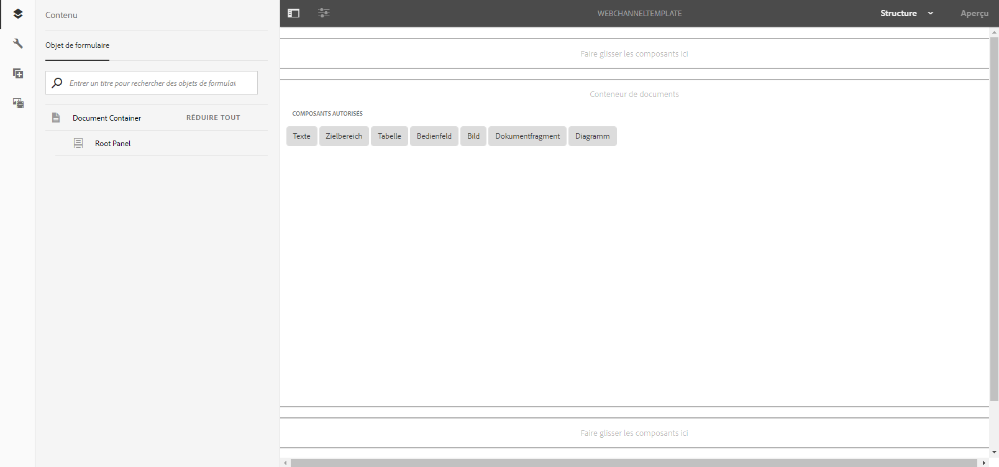
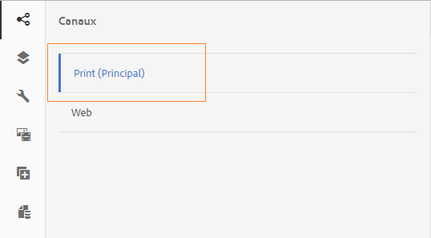
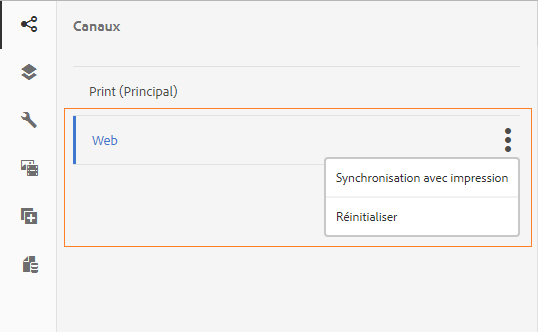

# Canal d’impression et canal web{#print-channel-and-web-channel}

Les communications interactives peuvent être fournies par deux canaux : impression et web. Le canal d’impression est utilisé pour créer des documents PDF et des communications papier, comme une lettre imprimée comme rappel pour le paiement de primes d’assurance, tandis que le canal web est utilisé pour fournir des expériences en ligne, comme un relevé de carte de crédit sur un site Web.

Les auteurs de communications interactives peuvent réutiliser des ressources telles que des fragments de document et des images pour créer des versions papier et Web d’Interactive Communication.

L&#39;une des conditions préalables à la création d&#39;une communication interactive ](../../forms/using/create-interactive-communication.md) est que les modèles pour l&#39;impression et/ou le canal Web soient disponibles sur le serveur. [ Alors que les auteurs de modèles créent le modèle de canal web dans AEM, le modèle de canal d’impression XDP est créé dans Adobe Forms Designer et téléchargé sur le serveur.

## Canal d’impression {#printchannel}

Le canal d’impression d’une communication interactive utilise le modèle de formulaire XFA, XDP. Les XDP sont conçus dans Adobe Forms Designer. Pour plus d’informations sur la création de modèles de canal d’impression, voir [Conception de la mise en page](../../forms/using/layout-design-details.md). Pour utiliser un modèle de canal d’impression dans votre communication interactive, vous devez télécharger le modèle sur le serveur AEM Forms.

### Télécharger le modèle de canal d’impression Communication interactive {#upload-interactive-communication-print-channel-template}

Pour télécharger le modèle, vous devez être membre du groupe forms-user. Suivez les étapes ci-dessous pour télécharger le modèle de canal d’impression (XDP) vers AEM Forms :

1. Sélectionnez **[!UICONTROL Formulaires]** > **[!UICONTROL Formulaires et documents]**.

1. Appuyez sur **[!UICONTROL Create]** (Créer) > **[!UICONTROL File Upload]** (Téléchargement de fichier). 

   Naviguez et sélectionnez le modèle de canal d’impression approprié (XDP), puis appuyez sur **[!UICONTROL Ouvrir]**.

## Canal web {#web-channel}

Les auteurs de modèles et les administrateurs peuvent créer, modifier et activer des modèles web. Pour autoriser d’autres utilisateurs à créer des modèles web, vous devez leur accorder des droits. Pour plus d’informations, voir [Administration des droits d’utilisateur, de groupe et d’accès](/help/sites-administering/user-group-ac-admin.md).

### Création de modèle de canal web {#authoring-web-channel-template}

Pour créer un modèle de canal web, vous devez d’abord créer un dossier modèle. Une fois que vous avez créé un modèle Web dans un dossier de modèle, vous devez activer ce modèle pour permettre aux utilisateurs de formulaires de créer un canal Web d’une communication interactive basée sur ce modèle.

Pour créer un modèle de canal Web, procédez comme suit :

1. Créez un dossier Modèle pour conserver vos modèles Web de communication interactive, si vous n’en avez pas encore. Pour plus d’informations, voir Dossiers de modèles dans [Modèles de page - modifiables](/help/sites-developing/page-templates-editable.md).

   1. Appuyez sur **[!UICONTROL Outils]**  > **[!UICONTROL Navigateur de configuration]**.
      * Pour plus d’informations, consultez la documentation de [Navigateur de configuration](/help/sites-administering/configurations.md).
   1. Dans la page Navigateur de configuration, appuyez sur **[!UICONTROL Créer]**.
   1. Dans la boîte de dialogue Créer une configuration, spécifiez un titre pour le dossier, cochez **[!UICONTROL Modèles modifiables]**, puis appuyez sur **[!UICONTROL Créer]**.

      Le dossier est créé et répertorié dans la page Navigateur de configuration.

1. Accédez au dossier de modèle approprié et créez un modèle web.

   1. Accédez au dossier de modèle approprié en sélectionnant **[!UICONTROL Outils]** > **[!UICONTROL Modèles]** > **`[Folder]`**.
   1. Appuyez sur **[!UICONTROL Créer]**.
   1. Sélectionnez **[!UICONTROL Communication interactive - Canal Web]** et appuyez sur **[!UICONTROL Suivant]**.
   1. Entrez un titre et une description de modèle, puis appuyez sur **[!UICONTROL Créer]**.

      Le modèle est créé et une boîte de dialogue s’affiche.

   1. Appuyez sur **[!UICONTROL Ouvrir]** pour ouvrir le modèle que vous avez créé dans l’éditeur de modèles.

      L’Éditeur de modèle s’affiche.

      

      Lors de la création ou de la modification d’un modèle, un auteur de modèles peut définir différents aspects. La création ou la modification d’un modèle est similaire à la création de pages. Pour plus d&#39;informations, voir Modification de modèles - Auteurs de modèles dans [Création de modèles de page](/help/sites-authoring/templates.md).

1. Pour permettre l’utilisation de ce modèle pour la création de communication interactive, activez le modèle.

   1. Appuyez sur **[!UICONTROL Outils]**  > **[!UICONTROL Modèles]**.
   1. Accédez au modèle approprié, sélectionnez-le, puis appuyez sur **[!UICONTROL Activer]** et, dans le message d’alerte, appuyez sur **[!UICONTROL Activer]**.

      Le modèle est activé et son statut s’affiche comme Activé. Vous pouvez maintenant créer une communication interactive dans laquelle vous pouvez utiliser le modèle de canal web nouvellement créé.

### Canal d’impression en tant que base du canal web {#print-channel-as-master-for-web-channel}

Lors de la création d’une communication interactive, les auteurs peuvent sélectionner cette option pour créer le canal web en synchronisation avec le canal d’impression. L’utilisation du canal d’impression comme base pour le canal web garantit que le contenu, l’héritage et la liaison des données du canal web sont dérivés du canal d’impression et que les modifications apportées au canal d’impression peuvent être répercutées sur le canal web. Les auteurs de communication interactive sont toutefois autorisés à interrompre l’héritage pour des composants spécifiques dans le canal web, selon les besoins.

 

