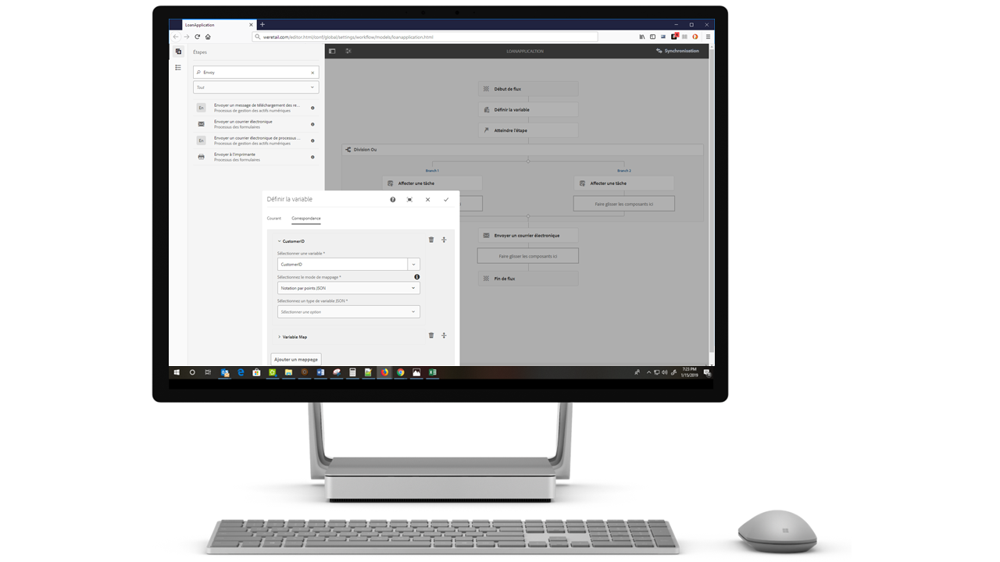

# Résumé des nouvelles fonctionnalités | AEM 6.5 Forms{#new-features-summary-aem-forms}

## Rapports de transactions {#transaction-reports}

Les rapports de transaction vous permettent de capturer et de suivre le nombre de formulaires envoyés, de  traités et de  générés. L&#39;objectif du suivi de ces transactions est de prendre une décision éclairée sur l&#39;utilisation des produits et de rééquilibrer les investissements dans le matériel et les logiciels. Voici quelques exemples de transactions :

* Envoi d’un formulaire adaptatif, d’un formulaire HTML5 ou d’un jeu de formulaires
* Rendu d’une version imprimée ou Web d’une communication interactive
* Conversion d’un  d’un format de fichier à un autre

Pour plus d&#39;informations sur la configuration et l&#39;utilisation des rapports de transaction, consultez Présentation [des rapports de](../../forms/using/transaction-reports-overview.md)transaction.

## Communications interactives {#interactive-communications}

**Définition de modèles d’affichage des données**

Les auteurs de communications interactives peuvent désormais définir des modèles [d’affichage de](create-interactive-communication.md#datadisplaypatterns) données pour les champs, les variables et les éléments de modèle de données de formulaire. Par exemple, les formats de date, de devise ou de téléphone.

**Utiliser de nouveaux types de graphiques**

Vous pouvez désormais ajouter des graphiques [quadrilatères et des diagrammes de plusieurs séries](../../forms/using/chart-component-interactive-communications.md) à Interactive Communications.

**Tri des colonnes d’un tableau**

Vous pouvez désormais [trier les colonnes d’un tableau](../../forms/using/create-interactive-communication.md#sortcolumns) dans Interactive Communication. Vous pouvez lier et trier des colonnes de tableau avec du texte statique ou des objets de modèle de données.

**Utilisation de nouveaux composants dans un Web**

Vous pouvez désormais ajouter des composants Bouton et Séparateur au Web. Pour plus d’informations, reportez-vous à la section Composant Bouton [Ajouter au composant](../../forms/using/create-interactive-communication.md#add-button-component-to-the-web-channel) Web et au composant [Séparateur dans les](../../forms/using/create-interactive-communication.md#separatorcomponent)Web.

**Mode Disposition pour redimensionner les composants**

Vous pouvez désormais passer en mode  Mise en page pour redimensionner les composants du Web à l’aide d’une interface WYSIWYG.

**Améliorations de la convivialité**

Les auteurs de communications interactives peuvent désormais utiliser diverses opérations faciles à utiliser lors de la création de correspondances. La  des opérations comprend :

* [Exécution d’actions Annuler-Rétablir dans les  Web et papier](../../forms/using/create-interactive-communication.md#undoredoactions)
* [Ajouter variables dans un fragment  à l’aide du symbole @](../../forms/using/texts-interactive-communications.md#searchvariables)
* [Ajouter des éléments de modèle de données dans un fragment  de à l’aide du symbole @](../../forms/using/texts-interactive-communications.md#searchdatamodelproperties)
* [Suppression ou ajout d’un  Web à une communication interactive existante](../../forms/using/create-interactive-communication.md#edit-interactive-communication-properties)
* [Liaison d’éléments de source de données à des champs et des variables à l’aide d’actions glisser-déposer](../../forms/using/create-interactive-communication.md#binddatasourceelements)
* [Mettre en surbrillance les champs et variables non liés lors de la création d’Interactive Communication](../../forms/using/create-interactive-communication.md#distinguishunboundfields)
* [Exécutez d’autres actions, telles que la copie, le groupe ou plus, sur les composants hérités dans un Web](../../forms/using/create-interactive-communication.md#componenttoolbar)

**Améliorations du processus de synchronisation**

Plusieurs améliorations ont été apportées à la disposition du Web  générée automatiquement à l’aide de l’ d’impression.

## Formulaires adaptatifs {#adaptive-forms}

### Utilisation des signatures numériques cloud d’Adobe Sign dans les formulaires adaptatifs {#use-adobe-sign-s-cloud-based-digital-signatures-in-adaptive-forms}

[Les signatures](https://helpx.adobe.com/sign/kb/digital-certificate-providers.html) numériques basées sur le cloud ou les signatures distantes constituent une nouvelle génération de signatures numériques qui fonctionnent sur les ordinateurs de bureau, les appareils mobiles et le Web. et respecter les niveaux de conformité et d’assurance les plus élevés pour l’authentification des signataires. Vous pouvez désormais [signer un formulaire](../../forms/using/working-with-adobe-sign.md) adaptatif avec des signatures numériques basées sur Cloud.

#### Embed an Adaptive Form or Interactive Communication in AEM Sites Single Page Applications {#embed-an-adaptive-form-or-interactive-communcation-in-aem-sites-single-page-applications}

AEM Forms vous permet d’incorporer [de manière transparente un formulaire](../../forms/using/embed-adaptive-form-aem-sites-spa.md) adaptatif ou une communication interactive dans une application d’une seule page de sites AEM. Le formulaire adaptatif incorporé et la communication interactive sont entièrement fonctionnels et les utilisateurs peuvent remplir et envoyer le formulaire sans quitter la page. Il permet à l’utilisateur de rester dans le contexte d’autres éléments de la page Web et d’interagir simultanément avec le formulaire adaptatif ou la communication interactive.

#### Tri des colonnes des tableaux de formulaires adaptatifs {#sort-columns-of-adaptive-form-tables}

Vous pouvez [trier n’importe quelle colonne d’un tableau](../../forms/using/adaptive-forms-tables.md#sortcolumnstable) de formulaire adaptatif dans un ordre croissant ou décroissant. Vous pouvez appliquer le tri aux colonnes du tableau avec du texte statique, des propriétés d’objet de modèle de données ou une combinaison de propriétés de texte statique et d’objet de modèle de données.

#### Limiter la disponibilité des modèles de formulaires adaptatifs à des chemins spécifiques {#restrict-the-availability-of-adaptive-forms-templates-to-specific-paths}

Les formulaires adaptatifs ont ajouté la prise en charge de la propriété cq:allowedPaths. La propriété [limite la disponibilité des modèles de formulaires adaptatifs à des chemins](creating-adaptive-form.md#adaptive-form-templates)spécifiques.

#### Ajouter les cases à cocher au formulaire adaptatif de manière dynamique {#add-check-boxes-to-the-adaptive-form-dynamically}

Vous pouvez désormais définir des règles pour [ajouter des cases à cocher au formulaire adaptatif de manière dynamique](../../forms/using/rule-editor.md#setpropertyrule) en fonction d’une fonction personnalisée, d’un objet de formulaire ou d’une propriété d’objet.

## Workflows AEM {#aem-workflows}

### Utilisation de variables dans le AEM {#use-variables-in-aem-workflows}

Les variables permettent aux étapes du processus de conserver et de transmettre des métadonnées entre les étapes du processus au moment de l’exécution. Vous pouvez créer différents types de variables pour stocker différents types de données. Par exemple, des entiers, des chaînes, des  de ou des instances de modèle de données de formulaire. En règle générale, vous utilisez une variable ou une collection de variables lorsque vous devez prendre une décision en fonction de la valeur qu’elle contient ou pour stocker des informations dont vous aurez besoin ultérieurement dans un processus.

Les variables sont une extension de l’interface [MetaDataMap](https://helpx.adobe.com/experience-manager/6-5/sites/developing/using/reference-materials/javadoc/com/adobe/granite/workflow/metadata/MetaDataMap.html) disponible dans la version précédente. Cela permet de gagner du temps lors du développement du code ECMAScript personnalisé utilisé pour récupérer et mettre à jour les valeurs de métadonnées. Vous continuez à utiliser l’interface MetaDataMap et le code ECMAScript pour manipuler les métadonnées. L’utilisation de variables sur MetaDataMap et ECMAScript présente certains avantages :

* Stockez, mettez à jour et utilisez dynamiquement les valeurs stockées dans une variable dans l’ensemble du flux de travaux sans dépendre du code personnalisé.
* Récupérer et mettre à jour les valeurs directement vers un modèle de données de formulaire et un fichier de données (XML/JSON) d’un formulaire envoyé
* Stocker le complet dans une variable pour effectuer le traitement 

L’étape Atteindre, OU Scinder, et toutes les étapes du processus AEM Forms prennent en charge les variables. Vous pouvez utiliser l’interface MetaDataMap pour accéder aux variables des étapes de flux de travail qui ne prennent pas en charge les variables de manière native. Pour plus d’informations, voir [Variables dans](../../forms/using/variable-in-aem-workflows.md)AEM.

#### Utilisation d’un processus avec différents formulaires adaptatifs {#use-a-workflow-with-different-adaptive-forms}

Vous pouvez [spécifier un formulaire adaptatif pour l’étape d’affectation des](../../forms/using/aem-forms-workflow-step-reference.md#assign-task-step) et des d’enregistrement de l’étape de l’ orientée formulaire au moment de l’exécution. Il permet à un flux de travail de fonctionner avec différents formulaires adaptatifs. Vous pouvez choisir la méthode de sélection d’un formulaire adaptatif lors de la conception du processus. Le formulaire adaptatif peut être situé à un chemin absolu, envoyé en tant que charge utile au flux de travail, ou disponible à un chemin calculé à l’aide d’une variable.

#### Utilisation des fonctionnalités de journalisation améliorées des étapes de flux de travaux orientées formulaires {#use-enhanced-logging-capabilities-of-forms-centric-workflow-steps}

Les fonctionnalités de journalisation des étapes de flux de travail centrées sur les formulaires sont normalisées. Désormais, toutes les étapes de processus centrées sur les formulaires produisent des journaux normalisés similaires. Cela permet d’améliorer la vitesse de débogage.

## Intégration de données {#data-integration}

Vous pouvez maintenant :

* [Validez les données](../../forms/using/work-with-form-data-model.md#automated-validation-of-input-data) d’entrée en fonction d’un de contraintes. Cela permet de s’assurer que seules les données valides sont envoyées à la source de données.
* [Remplacez le point de fin](../../forms/using/configure-data-sources.md#configure-soap-web-services) par défaut défini dans un fichier WSDL (Web Services Description Language).

* [Remplacez le](../../forms/using/configure-data-sources.md#configure-restful-web-services) schéma par défaut [, l’hôte et le chemin](../../forms/using/configure-data-sources.md#configure-restful-web-services) de base définis dans le fichier de définition Swagger.

## Mises à jour de la plateforme et de la sécurité {#platform-and-security-updates}

### Principales mises à jour des plateformes {#major-platform-updates}

AEM Forms peut être installé à l’aide de n’importe quelle combinaison de systèmes d’exploitation, serveurs d’applications, bases de données, pilotes de base de données, JDK, serveurs LDAP et serveurs de messagerie électronique pris en charge. The following are the major changes in [supported platforms](../../forms/using/aem-forms-jee-supported-platforms.md):

<table>
 <tbody>
  <tr>
   <td>Composant</td>
   <td>Prise en charge supprimée</td>
  </tr>
  <tr>
   <td>Systèmes d’exploitation</td>
   <td>
    <ul>
     <li>Microsoft Windows Server 2012 R2</li>
     <li>IBM AIX*</li>
     <li>Sun Solaris*</li>
    </ul> </td>
  </tr>
  <tr>
   <td>Serveurs d’applications  </td>
   <td>
    <ul>
     <li>Oracle Weblogic</li>
    </ul> </td>
  </tr>
  <tr>
   <td>Bases de données</td>
   <td>
    <ul>
     <li>IBM DB2   </li>
     <li>Oracle RAC</li>
    </ul> </td>
  </tr>
  <tr>
   <td>Serveurs LDAP</td>
   <td>
    <ul>
     <li>Microsoft Active Directory 2012</li>
     <li>Novell eDirectory 8.8.7 </li>
     <li>IBM Lotus Domino 8.5.0 </li>
    </ul> </td>
  </tr>
  <tr>
   <td>Serveurs de messagerie</td>
   <td>
    <ul>
     <li>IBM Lotus Domino 8.5.0 </li>
    </ul> </td>
  </tr>
  <tr>
   <td>Connecteurs</td>
   <td>
    <ul>
     <li>Connector for Microsoft Sharepoint 2013</li>
     <li>Connector for EMC Documentum 7.0</li>
    </ul> </td>
  </tr>
  <tr>
   <td>Application AEM Forms  </td>
   <td>
    <ul>
     <li>Prise en charge de Windows 8.1</li>
    </ul> </td>
  </tr>
  <tr>
   <td>Java </td>
   <td>
    <ul>
     <li>Java 11</li>
    </ul> </td>
  </tr>
 </tbody>
</table>

* Contactez le support technique d’Adobe pour plus d’informations sur la migration vers une autre plateforme.

#### Nouvelles interfaces utilisateur HTML5 {#new-html-based-uis}

Conformément à la version EOL d’Adobe Flash Player prévue et à l’orientation générale de la migration de contenu Flash vers des normes ouvertes, AEM Forms 6.5 a remplacé l’interface utilisateur Flash de Health Monitor, Process Management, Reader Extension et l’interface utilisateur de gestion des  d’AEM Forms sur JEE par l’interface utilisateur HTML5.

#### Amélioration de la sécurité {#security-improvements}

* L’interface utilisateur d’Administration Console d’AEM Forms 6.5 sur JEE est désormais basée sur Apache Struts 2.5.
* AEM Forms 6.5 utilise désormais jQuery vers la version 3.2.1 et l’interface utilisateur jQuery 1.12.1. Voir la documentation [de](/help/forms/home.md) mise à niveau pour connaître l’impact de la modification.

#### Améliorations de l’accessibilité {#accessibility-improvements}

AEM Forms 6.5 a amélioré l’accessibilité d’AEM Forms Workspace.
