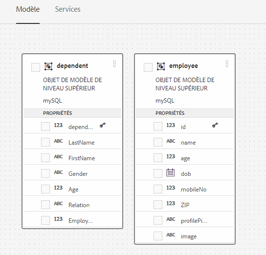

# Utilisation d’un modèle de données de formulaire{#work-with-form-data-model}


L’éditeur de modèle de données de formulaire fournit une interface utilisateur intuitive et des outils d’édition et de configuration d’un modèle de données de formulaire. L’éditeur vous permet d’ajouter et de configurer des objets, des propriétés et des services de modèles de données à partir de sources de données associées dans le modèle de données de formulaire. En outre, il vous permet de créer des objets et des propriétés de modèle de données sans sources de données et de les lier ultérieurement aux objets et propriétés de modèle de données respectifs. Vous pouvez également générer et modifier des exemples de données pour les propriétés d’objet de modèle de données que vous pouvez utiliser pour préremplir des formulaires adaptatifs et des communications interactives lors de la prévisualisation. Vous pouvez tester les objets et services de modèle de données configurés dans un modèle de données de formulaire afin de vous assurer de leur intégration correcte aux sources de données.

Si vous êtes novice en intégration de données Forms et n’avez pas configuré de source de données ou créé de modèle de données de formulaire, consultez les rubriques suivantes :

* [Intégration des données AEM Forms](/help/forms/using/data-integration.md)
* [Configurer les sources de données](/help/forms/using/configure-data-sources.md)
* [Créer un modèle de données de formulaire](/help/forms/using/create-form-data-models.md)

Lisez la suite pour plus de détails sur les diverses tâches et configurations que vous pouvez effectuer à l’aide de l’éditeur de modèle de données de formulaire.

>[!NOTE]
>
>You must be a member of both **fdm-author** and **forms-user** groups to be able to create and work with form data model. Contactez votre administrateur AEM pour devenir membre des groupes.

## Ajouter des objets et des services de modèle de données {#add-data-model-objects-and-services}

Si vous avez créé un modèle de données de formulaire avec des sources de données, vous pouvez utiliser l’éditeur de modèle de données de formulaire pour ajouter des objets et des services de modèle de données, configurer leurs propriétés, créer des associations entre les objets de modèle de données et tester le modèle de données de formulaire et les services.

Vous pouvez ajouter des objets et des services de modèle de données à partir des sources de données disponibles dans le modèle de données de formulaire. Lorsque des objets de modèle de données ajoutés apparaissent dans l’onglet Modèle, les services ajoutés apparaissent dans l’onglet Services.

Pour ajouter des objets et des services de modèle de données :

1. Connectez-vous à l’instance d’auteur AEM, accédez à **[!UICONTROL Formulaires > Intégrations de données]** et ouvrez le modèle de données du formulaire dans lequel vous souhaitez ajouter des objets de modèle de données.
1. Dans le volet Sources de données, développez les sources de données pour des objets et services de modèle de données disponibles.
1. Sélectionnez les objets et services de modèle de données que vous souhaitez ajouter au modèle de données de formulaire, puis appuyez sur **[!UICONTROL Ajouter la sélection]**.

   

   Objets et services de modèle de données sélectionnés

   L’onglet Modèle affiche une représentation graphique de tous les objets de modèle de données et de leurs propriétés ajoutées au modèle de données de formulaire. Chaque objet de modèle de données est représenté par une boîte dans le modèle de données de formulaire.

   

   L’onglet Modèle affiche les objets de modèle de données ajoutés

   >[!NOTE] {graybox=&quot;true&quot;}
   >
   >Vous pouvez conserver et faire glisser des boîtes d’objet de modèle de données pour les organiser dans la zone de contenu. Tous les objets de modèle de données ajoutés au modèle de données de formulaire sont grisés dans le volet Sources de données.

   L’onglet Services répertorie les services ajoutés.

   

   L’onglet Services affiche les services de modèle de données

   >[!NOTE]
   >
   >En plus des objets et services de modèle de données, le document de métadonnées de service OData inclut des propriétés de navigation qui définissent l’association entre deux objets de modèle de données. Pour plus d’informations, voir [Utilisation des propriétés de navigation des services OData](#navigation-properties-odata).

1. Appuyez sur **[!UICONTROL Enregistrer]** pour enregistrer l’objet modèle de formulaire.

   >[!NOTE] {graybox=&quot;true&quot;}
   >
   >Vous pouvez appeler les services que vous avez configurés dans l’onglet Services d’un modèle de données de formulaire à l’aide des règles de formulaire adaptatif. Les services configurés sont disponibles dans l’action Appeler les services de l’éditeur de règles. Pour plus d’informations sur l’utilisation de ces services dans des règles de formulaire adaptatif, voir les règles Appeler des services et Définir la valeur de dans l’[éditeur de règles](/help/forms/using/rule-editor.md).

## Créer des objets de modèle de données et des propriétés enfant {#create-data-model-objects-and-child-properties}

### Créer des objets de modèle de données {#create-data-model-objects}

Vous pouvez ajouter des objets de modèle de données à partir de sources de données configurées et vous pouvez également créer des objets ou des entités de modèle de données sans sources de données. C’est particulièrement utile si vous n’avez pas configuré de sources de données dans le modèle de données de formulaire.

Pour créer un objet de modèle de données sans sources de données :

1. Connectez-vous à l’instance d’auteur AEM, accédez à **[!UICONTROL Formulaires > Intégrations de données]** et ouvrez le modèle de données du formulaire dans lequel vous souhaitez créer un objet ou une entité de modèle de données.
1. Appuyez sur **[!UICONTROL Créer une entité]**.
1. Dans la boîte de dialogue Créer un modèle de données de formulaire, spécifiez un nom pour l’objet de modèle de données de formulaire et appuyez sur **[!UICONTROL Ajouter]**. Un objet de modèle de données est ajouté au modèle de données de formulaire. Notez que l’objet de modèle de données récemment ajouté n’est lié à aucune source de données et ne possède aucune propriété, comme illustré dans l’illustration suivante.

   

Ensuite, vous pouvez ajouter des propriétés enfant dans des objets de modèle de données non liés.

### Ajouter des propriétés enfant {#child-properties}

L’éditeur de modèle de données de formulaire vous permet de créer des propriétés enfant dans un objet de modèle de données. Lors de sa création, la propriété n’est liée à aucune propriété dans une source de données. Vous pouvez ensuite lier la propriété enfant à une autre propriété dans l’objet de modèle de données conteneur.

Pour créer une propriété enfant :

1. Dans un modèle de données de formulaire, sélectionnez un objet de modèle de données et appuyez sur **[!UICONTROL Créer une propriété enfant]**.
1. Dans la boîte de dialogue **[!UICONTROL Créer une propriété enfant]**, spécifiez un nom et un type de données pour la propriété dans les champs **[!UICONTROL Nom]** et **[!UICONTROL Type]** respectivement. Vous avez la possibilité d’indiquer un titre et une description pour la propriété.
1. Activez Calculé si la propriété est une propriété calculée. La valeur d’une propriété calculée est évaluée en fonction d’une règle ou d’une expression. Pour plus d’informations, voir [Modifier les propriétés](#edit-properties).
1. Si l’objet de modèle de données est lié à une source de données, la propriété enfant ajoutée est automatiquement liée à la propriété de l’objet de modèle de données parent avec le même nom et le même type de données.

   Pour lier manuellement une propriété enfant à une propriété d’objet de modèle de données, appuyez sur l’icône de navigation en regard du champ **[!UICONTROL Référence de liaison]**. La boîte de dialogue **[!UICONTROL Sélection d’objet]** répertorie toutes les propriétés de l’objet modèle de données parent. Sélectionnez une propriété à lier avec et appuyez sur l’icône en forme de coche. Notez que vous pouvez uniquement sélectionner une propriété du même type de données que la propriété enfant.

1. Appuyez sur **[!UICONTROL Terminé]** pour enregistrer la propriété enfant puis sur **[!UICONTROL Enregistrer]** pour enregistrer le modèle de données de formulaire. La propriété enfant est maintenant ajoutée à l’objet de modèle de données.

Après avoir créé des objets et des propriétés de modèle de données, vous pouvez continuer à créer des formulaires adaptatifs et des communications interactives basés sur le modèle de données de formulaire. Ultérieurement, lorsque des sources de données sont disponibles et configurées, vous pouvez lier le modèle de données de formulaire à des sources de données. La liaison sera automatiquement mise à jour dans les formulaires adaptatifs et les communications interactives associés. For more information about creating adaptive forms and interactive communications using form data model, see [Use form data model](/help/forms/using/using-form-data-model.md).

### Lier des objets et des propriétés de modèle de données {#bind-data-model-objects-and-properties}

When the data sources you want to integrate with the form data model are available, you can add them to the form data model as described in [Update data sources](/help/forms/using/create-form-data-models.md#update). Ensuite, procédez comme suit pour lier les objets et les propriétés du modèle de données non liés :

1. Dans le modèle de données de formulaire, sélectionnez la source de données non liée que vous souhaitez lier à une source de données.
1. Appuyez sur **[!UICONTROL Modifier les propriétés]**.
1. Dans le volet **[!UICONTROL Modifier les propriétés]**, appuyez sur l’icône de navigation en regard du champ **[!UICONTROL Liaison]**. Cette action ouvre la boîte de dialogue **[!UICONTROL Sélection d’objet]** qui répertorie les sources de données ajoutées dans le modèle de données de formulaire.

   

1. Développez l’arborescence des sources de données et sélectionnez un objet de modèle de données pour la liaison et appuyez sur l’icône en forme de coche.
1. Appuyez sur **[!UICONTROL Terminé]** pour enregistrer les propriétés puis sur **[!UICONTROL Enregistrer]** pour enregistrer le modèle de données de formulaire. L’objet de modèle de données est maintenant lié à une source de données. Notez que l’objet de modèle de données n’est plus marqué comme Non lié.

   

## Configuration de Services {#configure-services}

Pour lire et écrire des données pour un objet de modèle de données, procédez comme suit pour configurer les services en lecture et en écriture :

1. Cochez la case en haut d’un objet de modèle de données pour le sélectionner et appuyez sur **[!UICONTROL Modifier les propriétés]**.

   

   Modifier les propriétés pour configurer les services de lecture et d’écriture pour un objet de modèle de données

   La boîte de dialogue Modifier les propriétés s’ouvre.

   

   Boîte de dialogue Modifier les propriétés

   >[!NOTE]
   >
   >En plus des objets et services de modèle de données, le document de métadonnées de service OData inclut des propriétés de navigation qui définissent l’association entre deux objets de modèle de données. Lorsque vous ajoutez une source de données de service OData à un modèle de données de formulaire, un service est disponible dans Modèle de données de formulaire pour toutes les propriétés de navigation dans un objet de modèle de données. Vous pouvez utiliser ce service pour lire les propriétés de navigation de l’objet de modèle de données correspondant.
   >
   >
   >Pour plus d’informations sur l’utilisation du service, voir [Utilisation des propriétés de navigation des services OData](#navigation-properties-odata).

1. Activez/désactivez **[!UICONTROL Objet de niveau supérieur]** pour spécifier si l’objet de modèle de données est un objet de modèle de niveau supérieur.

   Les objets de modèle de données configurés dans un modèle de données de formulaire peuvent être utilisés dans l’onglet Objets de modèle de données de l’explorateur de contenu d’un formulaire adaptatif basé sur le modèle de données de formulaire. Lorsque vous ajoutez une association entre deux objets de modèle de données, l’objet de modèle de données à associer est imbriqué sous l’objet de modèle de données auquel vous l’associez dans l’onglet Objets de modèle de données. Si le modèle de données imbriqué est un objet de niveau supérieur, il apparaît également séparément dans l’onglet Objets de modèle de données. Par conséquent, vous en verrez deux entrées, l’une à l’intérieur et l’autre à l’extérieur de la hiérarchie imbriquée, ce qui pourrait perturber les auteurs de formulaires. Pour que l’objet de modèle de données associé apparaisse uniquement dans la hiérarchie imbriquée, désactivez la propriété Objet de niveau supérieur.

1. Sélectionnez les services de lecture et d’écriture pour les objets de modèle de données sélectionnés. Les arguments pour les services apparaissent.

   

   Services de lecture et d’écriture configurés pour la source de données des employés

1. Tap  for the read service argument to [bind the argument to a User Profile Attribute, Request Attribute, or Literal value](#bindargument) and specify the binding value.
1. Appuyez sur **[!UICONTROL Terminé]** pour enregistrer l’argument, **[!UICONTROL Terminé]** pour enregistrer les propriétés, puis sur **[!UICONTROL Enregistrer]** pour enregistrer le modèle de données de formulaire.

### Arguments du service Bind Read {#bindargument}

Lier l’argument du service Read à un attribut  utilisateur, un attribut de requête ou une valeur littérale en fonction d’une valeur de liaison. La valeur est transmise au service en tant qu’argument pour récupérer les détails associés à la valeur spécifiée à partir de la source de données.

#### Literal value {#literal-value}

Sélectionnez **[!UICONTROL Littéral]** dans le menu déroulant **[!UICONTROL Liaison à]** et entrez une valeur dans le champ Valeur **[!UICONTROL de]** liaison. Les détails associés à la valeur sont récupérés à partir de la source de données. Utilisez cette option pour récupérer les détails associés à une valeur statique.

Dans cet exemple, les détails associés à **4367655678**, en tant que valeur de l’ `mobilenum` argument, sont récupérés à partir de la source de données. Les détails associés si vous transmettez la valeur d’un argument de numéro de mobile peuvent inclure des propriétés telles que le nom du client, l’adresse du client et la ville.


#### Attribut du profil utilisateur {#user-profile-attribute}

Sélectionnez **[!UICONTROL Attribut]** de d’utilisateur dans le menu déroulant **[!UICONTROL Liaison à]** et saisissez le nom de l’attribut dans le champ Valeur **[!UICONTROL de]** liaison. Les détails de l’utilisateur connecté à l’instance AEM sont récupérés à partir de la source de données en fonction du nom d’attribut.

Le nom d’attribut spécifié dans le champ Valeur **[!UICONTROL de]** liaison doit inclure le chemin de liaison complet jusqu’au nom d’attribut de l’utilisateur. Ouvrez l’URL suivante pour accéder aux détails de l’utilisateur sur CRXDE :

https://&lt;nom du serveur>:&lt;numéro de port>/crx/de/index.jsp#/home/users/


Dans cet exemple, spécifiez `profile.empid` dans le champ Valeur **[!UICONTROL de]** liaison pour l’ `grios` utilisateur.


The `id` argument takes the value of the `empid` attribute of the user profile and pass it as an argument to the Read service. Il lit et renvoie les valeurs des propriétés associées à partir de l’objet de modèle de données employee pour l’utilisateur `empid` connecté.

#### Attributs de requête {#request-attribute}

Utilisez l’attribut request pour récupérer les propriétés associées à partir de la source de données.

1. Sélectionnez Attribut **[!UICONTROL de]** requête dans le menu déroulant **[!UICONTROL Liaison à]** et saisissez le nom de l’attribut dans le champ Valeur **[!UICONTROL de]** liaison.

1. Ouvrez head.jsp pour définir les détails d’attribut sur CRXDE :\
   `https://<server-name>:<port number>/crx/de/index.jsp#/libs/fd/af/components/page2/afStaticTemplatePage/head.jsp`

1. Insérez le texte suivant dans le fichier head.jsp :

   ```
   <%Map paraMap = new HashMap();
    paraMap.put("<request_attribute>",request.getParameter("<request_attribute>"));
    request.setAttribute("paramMap",paraMap);%>
   ```

Les détails sont récupérés à partir de la source de données en fonction du nom d’attribut spécifié dans la requête.

Par exemple, la spécification d’un attribut comme `petid=100` dans la requête récupère les propriétés associées à la valeur de l’attribut de la source de données.

## Ajouter des associations {#add-associations}

Généralement, des associations sont créées entre des objets de modèle de données dans une source de données. L’association peut lier un objet à un autre ou à plusieurs objets. Par exemple, plusieurs personnes à charge peuvent être associées à un employé. Il s’agit d’une association d’un objet à plusieurs objets, désignée par `1:n` sur la ligne reliant les objets de modèle de données associés. Toutefois, si une association renvoie un nom d’employé unique pour un ID d’employé donné, elle est appelée association un-à-un.

Lorsque vous ajoutez des objets de modèle de données associés dans une source de données à un modèle de données de formulaire, leurs associations sont conservées et affichées sous forme de lignes de flèche. Vous pouvez ajouter des associations entre des objets de modèle de données dans des sources de données disparates dans un modèle de données de formulaire.

>[!NOTE] {graybox=&quot;true&quot;}
>
>Les associations prédéfinies dans une source de données JDBC ne sont pas conservées dans le modèle de données de formulaire. Vous devez les créer manuellement.

Pour ajouter une association :

1. Cochez la case en haut d’un objet de modèle de données pour le sélectionner et appuyez sur **[!UICONTROL Ajouter une association]**. La boîte de dialogue Ajouter une association s’ouvre.

   

   >[!NOTE]
   >
   >En plus des objets et services de modèle de données, le document de métadonnées de service OData inclut des propriétés de navigation qui définissent l’association entre deux objets de modèle de données. Vous pouvez utiliser ces propriétés de navigation lors de l’ajout d’associations dans un modèle de données de formulaire. Pour plus d’informations, voir [Utilisation des propriétés de navigation des services OData](#navigation-properties-odata).

   La boîte de dialogue Ajouter une association s’ouvre.

   

   Boîte de dialogue Ajouter une association

1. Dans le volet Ajouter une association :

   * Spécifiez un titre pour l’association.
   * Sélectionnez le type d&#39;association — Un pour un ou un pour plusieurs.
   * Sélectionnez l’objet de modèle de données à associer.
   * Sélectionnez le service de lecture pour lire les données de l’objet de modèle sélectionné. L’argument de service de lecture apparaît. Modifiez l’argument, si nécessaire, et liez-le à la propriété de l’objet de modèle de données à associer.
   Dans l’exemple suivant, l’argument par défaut pour le service de lecture de l’objet de modèle de données Personnes à charge est `dependentid`.

   

   L’argument par défaut pour le service de lecture Personnes à charge est dependentid

   Toutefois, l’argument doit être une propriété commune entre l’objet de modèle de données associé, qui est `Employeeid` dans cet exemple. Therefore, the `Employeeid` argument must be bound to the `id` property of the Employee data model object to fetch the associated dependents details from the Dependents data model object.

   

   Argument mis à jour et liaison

   Appuyez sur **[!UICONTROL Terminé]** pour enregistrer l’argument.

1. Appuyez sur **[!UICONTROL Terminé]** pour enregistrer l’association, puis sur **[!UICONTROL Enregistrer]** pour enregistrer le modèle de données de formulaire.
1. Répétez les étapes pour créer plus d’associations si nécessaire.

>[!NOTE] {graybox=&quot;true&quot;}
>
>L’association ajoutée apparaît dans la zone d’objet de modèle de données avec le titre spécifié et une ligne reliant les objets de modèle de données associés.
>
>You can edit an association by selecting the checkbox against it and tap **[!UICONTROL Edit Association]**.


## Modification des propriétés {#properties}

Vous pouvez modifier les propriétés des objets de modèle de données, leurs propriétés et les services ajoutés dans le modèle de données de formulaire.

Pour modifier les propriétés :

1. Cochez la case en regard d’un objet de modèle de données, d’une propriété ou d’un service dans le modèle de données de formulaire.
1. Appuyez sur **[!UICONTROL Modifier les propriétés]**. Le volet **[!UICONTROL Modifier les propriétés]** de l’objet de modèle, de la propriété ou du service sélectionné s’ouvre.

   * **Objet de modèle de données** : spécifiez les services de lecture et d’écriture et modifiez les arguments.
   * **Propriété** : spécifiez le type, le sous-type et le format de la propriété. Vous pouvez également spécifier si la propriété sélectionnée est la clé principale de l’objet de modèle de données.
   * **Service** : spécifiez l’objet de modèle d’entrée, le type de sortie et les arguments du service. Pour un service Get, vous pouvez spécifier s’il doit renvoyer un tableau.
   

   Boîte de dialogue Modifier les propriétés pour un service get

1. Appuyez sur **[!UICONTROL Terminé]** pour enregistrer les propriétés, puis sur **[!UICONTROL Enregistrer]** pour enregistrer le modèle de données de formulaire.

### Créer des propriétés calculées {#computed}

Une propriété calculée est celle dont la valeur est calculée sur la base d’une règle ou d’une expression. À l’aide d’une règle, vous pouvez définir la valeur d’une propriété calculée sur une chaîne littérale, un nombre, le résultat d’une expression mathématique ou la valeur d’une autre propriété dans le modèle de données de formulaire.

Par exemple, vous pouvez créer une propriété calculée **FullName** dont la valeur est le résultat de la concaténation des propriétés existantes **FirstName** et **LastName**. Pour ce faire :

1. Create a new property with the name `FullName` whose data type is String.
1. Activez **[!UICONTROL Calculé]** et appuyez sur **[!UICONTROL Terminé]** pour créer la propriété.

   

   La propriété calculée FullName est créée. Identifiez l’icône en regard de la propriété comme illustration d’une propriété calculée.

   

1. Sélectionnez la propriété FullName et appuyez sur **[!UICONTROL Modifier la règle]**. Une fenêtre Editeur de règles s’ouvre.
1. Dans la fenêtre Editeur de règles, cliquez sur **[!UICONTROL Créer]**. Une fenêtre de règles **[!UICONTROL Définir la valeur]** s’ouvre.

   Dans la liste déroulante Sélectionner une option, sélectionnez **[!UICONTROL Expression mathématique]**. Les autres options disponibles sont **[!UICONTROL Objet de modèle de données de formulaire]** et **[!UICONTROL Chaîne]**.

1. Dans l’expression mathématique, sélectionnez **[!UICONTROL FirstName]** et **[!UICONTROL LastName]** dans les premier et second objets, respectivement. Sélectionnez **[!UICONTROL plus]** en tant qu’opérateur.

   Tap **[!UICONTROL Done]** and then tap **[!UICONTROL Close]** to close the rule editor window. La règle se présente comme suit :

   

1. Sur le modèle de données de formulaire, appuyez sur **[!UICONTROL Enregistrer]**. La propriété calculée est configurée.

## Utilisation des propriétés de navigation des services OData {#work-with-navigation-properties-of-odata-services}

Dans les services OData, les propriétés de navigation sont utilisées pour définir des associations entre deux objets de modèle de données. Ces propriétés sont définies sur un type d’entité ou un type complexe. For example, in the following extract from the metadata file of the sample [TripPin](https://www.odata.org/blog/trippin-new-odata-v4-sample-service/) OData sample services, the person entity contains three navigation properties - Friends, BestFriend, and Trips.

Pour plus d’informations sur les propriétés de navigation, voir la [documentation OData](https://docs.oasis-open.org/odata/odata/v4.0/errata03/os/complete/part3-csdl/odata-v4.0-errata03-os-part3-csdl-complete.html#_Toc453752536).

```xml
<edmx:Edmx xmlns:edmx="https://docs.oasis-open.org/odata/ns/edmx" Version="4.0">
<script/>
<edmx:DataServices>
<Schema xmlns="https://docs.oasis-open.org/odata/ns/edm" Namespace="Microsoft.OData.Service.Sample.TrippinInMemory.Models">
<EntityType Name="Person">
<Key>
<PropertyRef Name="UserName"/>
</Key>
<Property Name="UserName" Type="Edm.String" Nullable="false"/>
<Property Name="FirstName" Type="Edm.String" Nullable="false"/>
<Property Name="LastName" Type="Edm.String"/>
<Property Name="MiddleName" Type="Edm.String"/>
<Property Name="Gender" Type="Microsoft.OData.Service.Sample.TrippinInMemory.Models.PersonGender" Nullable="false"/>
<Property Name="Age" Type="Edm.Int64"/>
<Property Name="Emails" Type="Collection(Edm.String)"/>
<Property Name="AddressInfo" Type="Collection(Microsoft.OData.Service.Sample.TrippinInMemory.Models.Location)"/>
<Property Name="HomeAddress" Type="Microsoft.OData.Service.Sample.TrippinInMemory.Models.Location"/>
<Property Name="FavoriteFeature" Type="Microsoft.OData.Service.Sample.TrippinInMemory.Models.Feature" Nullable="false"/>
<Property Name="Features" Type="Collection(Microsoft.OData.Service.Sample.TrippinInMemory.Models.Feature)" Nullable="false"/>
<NavigationProperty Name="Friends" Type="Collection(Microsoft.OData.Service.Sample.TrippinInMemory.Models.Person)"/>
<NavigationProperty Name="BestFriend" Type="Microsoft.OData.Service.Sample.TrippinInMemory.Models.Person"/>
<NavigationProperty Name="Trips" Type="Collection(Microsoft.OData.Service.Sample.TrippinInMemory.Models.Trip)"/>
</EntityType>
```

Lorsque vous configurez un service OData dans un modèle de données de formulaire, toutes les propriétés de navigation d’un conteneur d’entité sont mises à disposition via un service dans le modèle de données de formulaire. In this example of TripPin OData service, the three navigation properties in the `Person` entity container can be read using one `GET LINK` service in the Form Data Model.

The following highlights the `GET LINK of Person /People` service in the Form Data Model, which is a combined service for the three navigation properties in the `Person` entity of the TripPin OData service.


Une fois que vous avez ajouté le service `GET LINK` à l’onglet Modèle de données de formulaire, vous pouvez modifier les propriétés pour choisir l’objet de modèle de sortie et la propriété de navigation à utiliser dans le service. For example, the following `GET LINK of Person /People` service in the following example uses Trip as the output model object and the navigation property as Trips.


>[!NOTE]
>
>The values available in the **Default Value** field of the **NavigationPropertyName** argument depend on the state of the **Return array?**. Lorsqu’il est activé, il affiche les propriétés de navigation du type Collection.

In this example, you can also choose the output model object as Person and navigation property argument as Friends or BestFriend (depending on whether **Return array?** est activé ou désactivé).


De même, vous pouvez choisir un service `GET LINK` et configurer ses propriétés de navigation lors de l’ajout d’associations dans le modèle de données de formulaire. Toutefois, pour pouvoir sélectionner une propriété de navigation, assurez-vous que le champ **** Liaison à est défini sur **Littéral**.


## Générer et modifier des exemples de données {#sample}

L’éditeur de modèle de données de formulaire vous permet de générer des exemples de données pour toutes les propriétés d’objet de modèle de données, y compris les propriétés calculées, dans un modèle de données de formulaire. Il s’agit d’un ensemble de valeurs aléatoires conformes au type de données configuré pour chaque propriété. Vous pouvez également modifier et enregistrer des données qui sont conservées même si vous régénérez les exemples de données.

Procédez comme suit pour générer et modifier des exemples de données :

1. Ouvrez un modèle de données de formulaire et appuyez sur **[!UICONTROL Modifier les exemples de données]**. Il génère et affiche les exemples de données dans la fenêtre Modifier les exemples de données.

   

1. Dans la fenêtre **[!UICONTROL Modifier les exemples de données]**, modifiez les données selon les besoins puis appuyez sur **[!UICONTROL Enregistrer]**.

Vous pouvez ensuite utiliser les exemples de données pour pré-remplir et tester des communications interactives basées sur le modèle de données de formulaire. Pour plus d’informations, reportez-vous à la section [Utilisation d’un modèle de données de formulaire](/help/forms/using/using-form-data-model.md).

## Tester les objets et les services de modèle de données {#test-data-model-objects-and-services}

Votre modèle de données de formulaire est configuré, mais avant de le mettre en service, vous pouvez vérifier si les objets et services de modèle de données configurés fonctionnent comme prévu. Pour tester les objets et les services de modèle de données :

1. Sélectionnez un objet ou service de modèle de données dans le modèle de données de formulaire et appuyez sur **[!UICONTROL Objet de modèle de test]** ou **[!UICONTROL Tester le service]**, respectivement.

   La fenêtre Tester le modèle de données de formulaire s’ouvre.

   

1. Dans la fenêtre Tester le modèle de données de formulaire, sélectionnez l’objet ou le service de modèle de données à tester dans le volet de saisie.

1. Indiquez une valeur d’argument dans le code de test et appuyez sur **[!UICONTROL Tester]**. Un test réussi renvoie la sortie dans le volet Sortie.

   

De même, vous pouvez tester d’autres objets et services de modèle de données dans le modèle de données de formulaire.

## Validation automatisée des données d’entrée {#automated-validation-of-input-data}

Le modèle de données de formulaire valide les données reçues en tant qu’entrées lors de l’appel de l’API DermisBridge (en fonction des critères de validation disponibles dans le modèle de données de formulaire). La validation est basée sur l’ `ValidationOptions` indicateur défini dans l’objet  utilisé pour appeler l’API.

L’indicateur peut être défini sur l’une des valeurs suivantes :

* **COMPLET**: FDM effectue la validation en fonction de toutes les contraintes
* **OFF**: Aucune validation
* **BASE**: FDM effectue la validation en fonction des contraintes &quot;obligatoires&quot; et &quot;nullable&quot;

Si aucune valeur n’est définie pour l’ `ValidationOptions`indicateur, la validation **BASIC** est effectuée sur les données d’entrée.

Voici un exemple de définition de l’indicateur de validation sur **PLEIN**:

```java
operationOptions.setValidationOptions(ValidationOptions.FULL);
```

>[!NOTE]
>
>La valeur fournie pour un attribut dans les données d’entrée doit correspondre au type de données défini pour l’attribut dans le de métadonnées.\
>Si la valeur ne correspond pas au type de données défini pour l’attribut, l’API DermisBridge affiche une exception quelle que soit la valeur de l’ `ValidationOptions` indicateur. Si le niveau du journal est défini sur Débogage, une erreur est consignée dans le fichier **error.log** .

Le modèle de données de formulaire valide les données d’entrée en fonction d’un de contraintes de type de données. Le de contraintes pour les données d’entrée peut varier en fonction de la source de données.

Le tableau suivant  les contraintes liées aux données d’entrée en fonction de la source de données :

<table>
 <tbody> 
  <tr> 
   <td>Contraintes</td> 
   <td>Description</td> 
   <td>Source de données d’entrée</td> 
  </tr> 
  <tr> 
   <td>requis</td> 
   <td>Si la valeur est true, le paramètre doit être inclus dans les données d’entrée.</td> 
   <td>Swagger, WSDL et base de données</td> 
  </tr> 
  <tr> 
   <td>nullable</td> 
   <td>Si la valeur est true, la valeur du paramètre peut être définie sur Null dans les données d’entrée.</td> 
   <td>WSDL, Odata et base de données</td> 
  </tr> 
  <tr> 
   <td>maximum</td> 
   <td>Indique la limite supérieure pour les valeurs numériques. La valeur maximale spécifiée comme limite supérieure peut également être affectée au paramètre dans les données d’entrée.</td> 
   <td>Swagger et WSDL</td> 
  </tr> 
  <tr> 
   <td>minimum</td> 
   <td>Indique la limite inférieure pour les valeurs numériques. La valeur minimale spécifiée comme limite inférieure peut également être affectée au paramètre dans les données d’entrée.</td> 
   <td>Swagger et WSDL</td> 
  </tr> 
  <tr> 
   <td>exclusiveMaximum </td> 
   <td>Indique la limite supérieure pour les valeurs numériques. La valeur maximale spécifiée comme limite supérieure ne doit pas être affectée au paramètre dans les données d’entrée.</td> 
   <td>Swagger et WSDL</td> 
  </tr> 
  <tr> 
   <td>exclusiveMinimum </td> 
   <td>Indique la limite inférieure pour les valeurs numériques. La valeur minimale spécifiée comme limite inférieure ne doit pas être affectée au paramètre dans les données d’entrée.</td> 
   <td>Swagger et WSDL</td> 
  </tr> 
  <tr> 
   <td>minLength </td> 
   <td>Indique la limite inférieure pour le nombre de caractères inclus dans une chaîne. La valeur minimale spécifiée comme limite inférieure peut également être affectée au paramètre dans les données d’entrée.</td> 
   <td>Swagger et WSDL</td> 
  </tr> 
  <tr> 
   <td>maxLength</td> 
   <td>Indique la limite supérieure du nombre de caractères inclus dans une chaîne. La valeur maximale spécifiée comme limite supérieure peut également être affectée au paramètre dans les données d’entrée.</td> 
   <td>Swagger, WSDL, Odata et base de données</td> 
  </tr> 
  <tr> 
   <td>pattern</td> 
   <td>Spécifie une séquence fixe de caractères. La chaîne d’entrée n’est validée correctement que si les caractères sont conformes au modèle spécifié.</td> 
   <td>Swagger</td> 
  </tr> 
  <tr> 
   <td>minItems</td> 
   <td>Indique le nombre minimum d’éléments dans un tableau. La valeur minimale spécifiée comme limite inférieure peut également être affectée au paramètre dans les données d’entrée.</td> 
   <td>Swagger et WSDL</td> 
  </tr> 
  <tr> 
   <td>maxItems</td> 
   <td>Indique le nombre maximal d’éléments dans un tableau. La valeur maximale spécifiée comme limite supérieure peut également être affectée au paramètre dans les données d’entrée.</td> 
   <td>Swagger et WSDL</td> 
  </tr> 
  <tr> 
   <td>uniqueItems</td> 
   <td>Si la valeur est true, tous les éléments du tableau doivent être uniques dans les données d’entrée.</td> 
   <td>Swagger</td> 
  </tr> 
  <tr> 
   <td>enum (chaîne)<br /><br /> </td> 
   <td>Limite la valeur d’un paramètre dans les données d’entrée à un ensemble fixe de valeurs de chaîne. Il doit s’agir d’un tableau comportant au moins un élément, où chaque élément est unique.</td> 
   <td>Swagger, WSDL et Odata</td> 
  </tr> 
  <tr> 
   <td>enum (nombre)<br /><br /> </td> 
   <td>Limite la valeur d’un paramètre dans les données d’entrée à un ensemble fixe de valeurs numériques. Il doit s’agir d’un tableau comportant au moins un élément, où chaque élément est unique.</td> 
   <td>WSDL</td> 
  </tr> 
 </tbody> 
</table>

Dans cet exemple, les données d’entrée sont validées en fonction des contraintes maximales, minimales et obligatoires définies dans le fichier Swagger. Les données d’entrée ne répondent aux critères de validation que si l’ID de commande est présent et que sa valeur est comprise entre 1 et 10.

```xml
parameters: [
{
name: "orderId",
in: "path",
description: "ID of pet that needs to be fetched",
required: true,
type: "integer",
maximum: 10,
minimum: 1,
format: "int64"
}
]
```

Une exception s’affiche si les données d’entrée ne répondent pas aux critères de validation. Si le niveau du journal est défini sur **Débogage**, une erreur est consignée dans le fichier **error.log** . Par exemple :

```java
21.01.2019 17:26:37.411 *ERROR* com.adobe.aem.dermis.core.validation.JsonSchemaValidator {"errorCode":"AEM-FDM-001-044","errorMessage":"Input validations failed during operation execution.","violations":{"/orderId":["numeric instance is greater than the required maximum (maximum: 10, found: 16)"]}}
```

## Étapes suivantes {#next-steps}

Vous disposez d’un modèle de données de formulaire fonctionnel pouvant à présent être utilisé dans les formulaires adaptatifs et les flux de communications interactives. Pour plus d’informations, reportez-vous à la section [Utilisation d’un modèle de données de formulaire](/help/forms/using/using-form-data-model.md).
