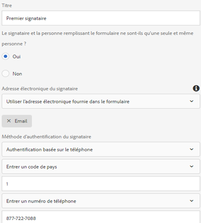

# Utilisation de [!DNL Adobe Sign] dans un formulaire adaptatif{#using-adobe-sign-in-an-adaptive-form}

[!DNL Adobe Sign] active les workflows de signature électronique pour les formulaires adaptatifs. Les signatures électroniques améliorent les processus de traitement des documents pour les services juridiques, commercial, des ressources humaines, etc.

Dans un scénario typique de [!DNL Adobe Sign] et de formulaires adaptatifs, un utilisateur remplit un formulaire adaptatif pour solliciter un service. Par exemple, une demande de prêt hypothécaire et de carte de crédit nécessite des signatures légales de tous les emprunteurs et codemandeurs. Pour activer les workflows de signature électronique pour des scénarios similaires, vous pouvez intégrer [!DNL Adobe Sign] à l’AEM [!DNL Forms]. Voici quelques autres exemples : vous pouvez utiliser [!DNL Adobe Sign] pour :

* Remportez des contrats à partir de tout appareil à l’aide de processus entièrement automatisés d’offre, de devis et de contrat.
* Terminez les processus de ressource humaine plus rapidement et offrez à vos employés une expérience numérique.
* Réduisez considérablement les durées des cycles en matière de contrat et intégrez plus rapidement vos fournisseurs.
* Créez des processus numériques pour automatiser les processus courants.

[!DNL Adobe Sign] intégration avec AEM  [!DNL Forms] prend en charge :

* Processus de signature utilisateur unique et multiutilisateur
* Processus de signature séquentiels et simultanés
* Expériences de signature dans le formulaire et hors du formulaire
* Signature de formulaires en tant qu’utilisateur anonyme ou connecté
* Processus de signature dynamique (intégration au flux de travail AEM [!DNL Forms])
* Authentification par le biais d’une base de connaissances, un téléphone et des profils de réseaux sociaux

Découvrez les [meilleures pratiques d’utilisation de Adobe Sign avec des formulaires adaptatifs](https://medium.com/adobetech/using-adobe-sign-to-e-sign-an-adaptive-form-heres-the-best-way-to-do-it-dc3e15f9b684) pour créer de meilleures expériences de signature.

## Conditions préalables {#prerequisites}

Avant d&#39;utiliser [!DNL Adobe Sign] dans un formulaire adaptatif :

* Assurez-vous que AEM service cloud [!DNL Forms] est configuré pour utiliser [!DNL Adobe Sign]. Pour plus de détails, voir [Intégrer Adobe Sign à AEM Forms](../../forms/using/adobe-sign-integration-adaptive-forms.md).
* Gardez la liste des signataires prête. Vous devez disposer d’au moins une adresse électronique pour chaque signataire.

## Configurer [!DNL Adobe Sign] pour un formulaire adaptatif {#configure-adobe-sign-for-an-adaptive-form}

Effectuez les étapes suivantes pour configurer [!DNL Adobe Sign] pour un formulaire adaptatif :

1. [Modification des propriétés du formulaire adaptatif pour le panneau Adobe](../../forms/using/working-with-adobe-sign.md#enableadobesign)
1. [Ajouter des champs Adobe Sign à un formulaire adaptatif](../../forms/using/working-with-adobe-sign.md#addadobesignfieldstoanadaptiveform)
1. [Activer Adobe Sign pour un formulaire adaptatif](../../forms/using/working-with-adobe-sign.md#enableadobsignforanadaptiveform)
1. [Sélectionner un service cloud Adobe Sign pour un formulaire adaptatif](../../forms/using/working-with-adobe-sign.md#selectadobesigncloudserviceforanadaptiveform)

1. [Ajouter des signataires Adobe Sign à un formulaire adaptatif](../../forms/using/working-with-adobe-sign.md#addsignerstoanadaptiveform)
1. [Sélectionner Envoyer l’action pour un formulaire adaptatif](../../forms/using/working-with-adobe-sign.md#selectsubmitactionforanadaptiveform)

### Modifier les propriétés de formulaire adaptatif pour [!DNL Adobe Sign] {#enableadobesign}

Configurez les propriétés de formulaire adaptatif pour [!DNL Adobe Sign] pour un formulaire adaptatif existant ou un nouveau formulaire adaptatif.

[Création d’un formulaire adaptatif pour Adobe ](../../forms/using/working-with-adobe-sign.md#create-an-adaptive-form-for-adobe-sign) Signated décrit les étapes de création d’un formulaire adaptatif de base. Voir [Création d’un formulaire adaptatif](../../forms/using/creating-adaptive-form.md) pour connaître les autres options disponibles lors de la création d’un formulaire adaptatif.

#### Créez un formulaire adaptatif pour [!DNL Adobe Sign] {#create-an-adaptive-form-for-adobe-sign}

Effectuez les étapes suivantes pour créer un formulaire adaptatif compatible avec la signature :

1. Accédez à **[!UICONTROL Adobe Experience Manager]** > **[!UICONTROL Forms]** > **[!UICONTROL Forms &amp; Documents]**.
1. Appuyez sur **[!UICONTROL Créer]** et sélectionner le **[!UICONTROL Formulaire adaptatif]**. Une liste de modèles s’affiche. Sélectionnez le modèle et appuyez sur **[!UICONTROL Suivant]**.
1. Dans l&#39;onglet **[!UICONTROL Basic]** :

   1. Spécifiez les **[!UICONTROL Nom]** et **[!UICONTROL Titre]** pour le formulaire adaptatif.

   1. Sélectionnez le [conteneur de configuration](../../forms/using/adobe-sign-integration-adaptive-forms.md#configure-adobe-sign-with-aem-forms) créé lors de la configuration de [!DNL Adobe Sign] avec l&#39;AEM [!DNL Forms].

      >[!NOTE]
      >
      >La liste déroulante **[!UICONTROL Cloud Service Adobe Sign]** affiche les services cloud configurés dans le conteneur de configuration que vous sélectionnez dans ce champ. La liste déroulante **[!UICONTROL Cloud Service Adobe Sign]** est disponible dans la section **[!UICONTROL Signature électronique]** des propriétés du formulaire adaptatif lorsque vous sélectionnez l’option **[!UICONTROL Activer Adobe Sign]**.

1. Dans l’onglet **[!UICONTROL Modèle de formulaire]**, sélectionnez l’une des options suivantes :

   * Sélectionnez l&#39;option **[!UICONTROL Associer le modèle de formulaire comme modèle de Document d&#39;enregistrement]** et sélectionnez un modèle de Document d&#39;enregistrement. Si vous utilisez un formulaire adaptatif basé sur un modèle de formulaire, les documents envoyés pour signature affichent uniquement les champs basés sur le modèle de formulaire associé. Il n’affiche pas tous les champs du formulaire adaptatif.

   * Sélectionnez l&#39;option **[!UICONTROL Générer le Document d&#39;enregistrement]**. Si vous utilisez une option Document d’enregistrement activée pour le formulaire adaptatif, le document envoyé pour signature affiche tous les champs du formulaire adaptatif.

1. Appuyez sur **[!UICONTROL Créer.]** Un formulaire adaptatif compatible avec la signature est créé, qui peut être utilisé pour ajouter  [!DNL Adobe Sign] des champs.

#### Modifier un formulaire adaptatif pour [!DNL Adobe Sign] {#editafsign}

Effectuez les étapes suivantes pour utiliser [!DNL Adobe Sign] dans un formulaire adaptatif existant :

1. Accédez à **[!UICONTROL Adobe Experience Manager]** > **[!UICONTROL Forms]** > **[!UICONTROL Forms &amp; Documents]**.
1. Sélectionnez le formulaire adaptatif et appuyez sur **[!UICONTROL Propriétés]**.
1. Dans l&#39;onglet **[!UICONTROL Basic]**, sélectionnez le [conteneur de configuration](../../forms/using/adobe-sign-integration-adaptive-forms.md#configure-adobe-sign-with-aem-forms) créé lors de la configuration de [!DNL Adobe Sign] avec l&#39;AEM [!DNL Forms].
1. Dans l’onglet **[!UICONTROL Modèle de formulaire]**, sélectionnez l’une des options suivantes :

   * Sélectionnez l&#39;option **[!UICONTROL Associer le modèle de formulaire comme modèle de Document d&#39;enregistrement]** et sélectionnez un modèle de Document d&#39;enregistrement. Si vous utilisez un formulaire adaptatif basé sur un modèle de formulaire, les documents envoyés pour signature affichent uniquement les champs basés sur le modèle de formulaire associé. Il n’affiche pas tous les champs du formulaire adaptatif.

   * Sélectionnez l&#39;option **[!UICONTROL Générer le Document d&#39;enregistrement]**. Si vous utilisez une option Document d’enregistrement activée pour le formulaire adaptatif, le document envoyé pour signature affiche tous les champs du formulaire adaptatif.

1. Appuyez sur **[!UICONTROL Save &amp; Close]** (Enregistrer et fermer). Le formulaire adaptatif est activé pour [!DNL Adobe Sign].

### Ajouter des champs Adobe Sign à un formulaire adaptatif {#addadobesignfieldstoanadaptiveform}

[!DNL Adobe Sign] dispose de plusieurs champs pouvant être placés sur un formulaire adaptatif. Ces champs acceptent divers types de données tels que les signatures, les initiales, la société ou le titre et aident à collecter des informations supplémentaires lors de la signature, ainsi que les signatures. Vous pouvez utiliser le composant de bloc [!DNL Adobe Sign] pour placer des champs [!DNL Adobe Sign] à divers emplacements dans un formulaire adaptatif.

Effectuez les étapes suivantes pour ajouter des champs à un formulaire adaptatif et personnaliser diverses options liées à ces champs :

1. Faites glisser et déposez le composant **[!UICONTROL Bloc Adobe Sign]** de l’explorateur de composants dans le formulaire adaptatif. Le composant de bloc [!DNL Adobe Sign] contient tous les champs [!DNL Adobe Sign] pris en charge. Par défaut, il ajoute un champ **Signature** au formulaire adaptatif.

   

   Par défaut, le bloc [!DNL Adobe Sign] n’est pas visible dans le formulaire adaptatif publié. Il est visible uniquement dans les documents de signature. Vous pouvez modifier la visibilité du bloc [!DNL Adobe Sign] à partir des propriétés du composant Bloc [!DNL Adobe Sign].

   >[!NOTE]
   >
   >    * L&#39;utilisation du bloc [!DNL Adobe Sign] n&#39;est pas obligatoire pour utiliser [!DNL Adobe Sign] dans un formulaire adaptatif. Si vous n’utilisez pas le bloc [!DNL Adobe Sign] et n’ajoutez pas de champs pour les signataires, le champ de signature par défaut s’affiche au bas des documents de signature.
   >    * Utilisez le bloc [!DNL Adobe Sign] uniquement pour les formulaires adaptatifs qui génèrent automatiquement un Document d&#39;enregistrement. Si vous utilisez un fichier XDP personnalisé pour générer un Document d’enregistrement ou un formulaire adaptatif basé sur un modèle de formulaire, le bloc [!DNL Adobe Sign] n’est pas pris en charge.

1. Sélectionnez le composant **[!UICONTROL Bloc d’Adobe Sign]** et appuyez sur l’icône **Modifier** . Il affiche des options pour ajouter des champs et mettre en forme l’apparence d’un champ.

   

   **A.** Sélectionnez et ajoutez  [!DNL Adobe Sign] des champs. **B.** Développez le  [!DNL Adobe Sign] bloc en vue plein écran.

1. Appuyez sur l’icône **[!UICONTROL Adobe Sign] Field** . Il affiche les options permettant de sélectionner et d&#39;ajouter des champs [!DNL Adobe Sign].

   Développez le champ déroulant **[!UICONTROL Type]** pour sélectionner un champ [!DNL Adobe Sign] et appuyez sur l’icône Terminé  pour ajouter le champ sélectionné au bloc [!DNL Adobe Sign]. Le champ déroulant **[!UICONTROL Type]** comprend les types de champs Signature, Informations sur le signataire et Données. [!DNL Adobe Sign] intégration avec les champs de  [!DNL Forms] prise en charge AEM répertoriés dans la liste déroulante   Type uniquement. Pour obtenir des informations détaillées sur les champs [!DNL Adobe Sign], consultez la [documentation Adobe Sign](https://helpx.adobe.com/sign/help/field-types.html).

   

   Il est obligatoire de fournir un nom unique pour un champ. Vous pouvez également sélectionner l’option requise pour marquer un champ comme obligatoire. En plus de l’option **[!UICONTROL Nom]** et **[!UICONTROL Obligatoire]**, certains champs ont plus d’options. [!DNL Adobe Sign] Par exemple, masque et multiligne. De plus, spécifiez un nom unique pour chaque champ [!DNL Adobe Sign], que les champs résident dans des blocs [!DNL Adobe Sign] identiques ou différents.

   Si vous sélectionnez **[!UICONTROL Signature numérique]** dans la liste déroulante, vous pouvez appliquer des signatures numériques au formulaire adaptatif :

   * En ligne, à l’aide de signatures cloud, vous pouvez signer avec un [ID numérique](https://helpx.adobe.com/sign/kb/digital-certificate-providers.html) hébergé par un prestataire d’approbation.
   * Localement, en téléchargeant le document avec Adobe Acrobat ou Reader à l’aide d’une carte à puce, d’un jeton USB ou d’un ID numérique basé sur des fichiers.

### Activer [!DNL Adobe Sign] pour un formulaire adaptatif {#enableadobsignforanadaptiveform}

[!DNL Adobe Sign] n’est pas activé pour un formulaire adaptatif. Effectuez les étapes suivantes pour l’activer :

1. Dans le navigateur de contenu, appuyez sur **[!UICONTROL Conteneur de formulaire]**, puis sur l’icône **[!UICONTROL Configurer]** . L’explorateur de propriétés s’ouvre et affiche les propriétés et affiche les propriétés du conteneur Formulaire adaptatif.
1. Dans l’explorateur de propriétés, développez l’accordéon **[!UICONTROL Signature électronique]** et sélectionnez l’option **[!UICONTROL Activer Adobe Sign]**. Il active [!DNL Adobe Sign] pour un formulaire adaptatif.

### Sélectionnez [!DNL Adobe Sign] Cloud Service et ordre de signature {#selectadobesigncloudserviceforanadaptiveform}

Vous pouvez configurer plusieurs services [!DNL Adobe Sign] pour une instance d&#39;AEM [!DNL Forms]. Il est conseillé d’avoir un ensemble distinct de services pour chaque fonction (ressources humaines, finances, etc.). Il facilite le suivi et le rapports des documents signés. Par exemple, une banque a plusieurs services. Vous pouvez avoir une configuration séparée pour chaque service pour un meilleur suivi des documents.

Un document peut également avoir plusieurs signataires. Par exemple, une demande de carte de crédit peut comporter plusieurs demandeurs. Une banque exige la signature de tous les demandeurs avant de commencer le traitement de la demande. Pour les scénarios multisignataires, vous pouvez choisir de signer le document dans un ordre séquentiel ou simultané.

Effectuez les étapes suivantes pour sélectionner un service cloud et un ordre de signature :

1. Dans le navigateur de contenu, appuyez sur **[!UICONTROL Conteneur de formulaire]**, puis sur l’icône **[!UICONTROL Configurer]** . L’explorateur de propriétés s’ouvre et affiche les propriétés et affiche les propriétés du conteneur Formulaire adaptatif.
1. Dans l’explorateur de propriétés, développez l’accordéon **[!UICONTROL Signature électronique]** et sélectionnez l’option **[!UICONTROL Activer Adobe Sign]**. Il active [!DNL Adobe Sign] pour un formulaire adaptatif.
1. Sélectionnez un service cloud à partir de la liste de Cloud Services [!DNL Adobe Sign] déjà configurée.

   Si la liste **[!UICONTROL Cloud Service Adobe Sign]** est vide, suivez l&#39;article [Configurer Adobe Sign avec AEM Forms](../../forms/using/adobe-sign-integration-adaptive-forms.md) pour configurer le service.

   La liste déroulante liste les services cloud qui existent dans le dossier `global` dans Outils > **[!UICONTROL Cloud Services]** > **[!UICONTROL Adobe Sign]**. En outre, la liste déroulante liste également les services cloud qui existent dans le dossier que vous sélectionnez dans le champ **[!UICONTROL Conteneur de configuration]** lorsque vous créez un formulaire adaptatif.

1. Sélectionnez l’ordre de signature dans la boîte de dialogue **[!UICONTROL Les signataires peuvent signer]**. [!DNL Adobe Sign]Les signataires peuvent signer un formulaire adaptatif de manière **[!UICONTROL séquentielle]** (l’un après l’autre) ou **[!UICONTROL simultanée]** (dans n’importe quel ordre).

   Dans un ordre séquentiel, un signataire à la fois reçoit le formulaire à signer. Une fois que le signataire a terminé la signature du document, le formulaire est envoyé au signataire suivant, et ainsi de suite.

   Dans l’ordre simultané, plusieurs signataires à la fois peuvent signer un formulaire.

1. [Ajoutez les signataires sur un ](../../forms/using/working-with-adobe-sign.md#addsignerstoanadaptiveform) formulaire adaptatif et appuyez sur l’icône Terminé   saveicon pour enregistrer les modifications.

### Ajouter des signataires à un formulaire adaptatif {#addsignerstoanadaptiveform}

Vous ne pouvez avoir qu’un seul signataire ou plusieurs signataires pour un formulaire adaptatif. Lorsque vous ajoutez un signataire, vous pouvez également configurer les détails d’authentification pour le signataire. Vous pouvez également sélectionner si le remplisseur du formulaire et le signataire sont la même personne. Effectuez les étapes suivantes pour ajouter et fournir divers détails sur un signataire :

1. Dans le navigateur de contenu, appuyez sur **[!UICONTROL Conteneur de formulaire]**, puis sur l’icône **[!UICONTROL Configurer]** . Il ouvre l’explorateur de propriétés avec les propriétés du conteneur Formulaire adaptatif.
1. Dans l’explorateur de propriétés, développez l’accordéon **[!UICONTROL Signature électronique]** et sélectionnez l’option **[!UICONTROL Activer Adobe Sign]**. Il active [!DNL Adobe Sign] pour un formulaire adaptatif.
1. Appuyez sur **[!UICONTROL Ajouter un signataire]** sous **[!UICONTROL Configuration du signataire]**. Il ajoute un signataire au formulaire adaptatif. Vous pouvez ajouter plusieurs signataires [!DNL Adobe Sign] à un formulaire adaptatif.
   

1. Cliquez sur l’icône **Modifier**  pour spécifier les informations suivantes sur le signataire :

   * **[!UICONTROL Titre] :** spécifiez un titre pour identifier de manière unique un signataire.

   * **[!UICONTROL Le signataire et la personne remplissant le formulaire sont-ils les mêmes ?]:** Sélectionnez  **Oui**, si l’utilisateur et le premier signataire sont les mêmes. Si l’option est définie sur **Non,** n’utilisez pas le composant d’étape de signature dans le formulaire adaptatif. Si le formulaire contient un composant Signature Step, le champ est automatiquement défini sur Yes.

   * **[!UICONTROL Adresse] électronique du signataire :** indiquez l’adresse électronique du signataire. Le signataire reçoit les documents/formulaires à signer à l’adresse électronique indiquée. Vous pouvez choisir d’utiliser une adresse électronique fournie dans un champ de formulaire, dans le profil utilisateur AEM de l’utilisateur connecté ou d’entrer manuellement une adresse électronique. C’est une étape obligatoire. Assurez-vous que l’adresse électronique du premier signataire ou du seul signataire (dans le cas d’un signataire unique) n’est pas identique au compte [!DNL Adobe Sign] utilisé pour configurer les services cloud AEM.

   * **[!UICONTROL Méthode] d’authentification du signataire :** spécifiez la méthode d’authentification d’un utilisateur avant d’ouvrir un formulaire pour la signature. Vous pouvez choisir entre le téléphone, la base de connaissances et l’authentification basée sur l’identité de réseau social.
   >[!NOTE]
   >
   >    * Par défaut, l’authentification basée sur l’identité de réseau social offre une option d’authentification via Facebook, Google et LinkedIn. Vous pouvez contacter l&#39;assistance [!DNL Adobe Sign] pour activer d&#39;autres fournisseurs d&#39;authentification sociale.

   * **[!DNL Adobe Sign]champs à remplir ou à signer :** sélectionnez  [!DNL Adobe Sign] les champs du signataire. Un formulaire adaptatif peut comporter plusieurs champs [!DNL Adobe Sign]. Vous pouvez choisir d’activer des champs spécifiques pour un signataire. Le champ affiche tous les blocs [!DNL Adobe Sign] disponibles. Lorsque vous sélectionnez un bloc, tous les champs du bloc sont sélectionnés. Vous pouvez utiliser l’icône X pour désélectionner un champ.

   

   L&#39;image ci-dessus contient deux exemples de blocs [!DNL Adobe Sign] : Informations personnelles et détails du bureau

   Appuyez sur l’icône Terminé . Le signataire est ajouté et configuré.

### Sélectionner Envoyer l’action pour un formulaire adaptatif {#selectsubmitactionforanadaptiveform}

Après avoir ajouté des champs [!DNL Adobe Sign] à un formulaire adaptatif, activé [!DNL Adobe Sign] à partir du conteneur de formulaire, sélectionné [!DNL Adobe Sign] Cloud Service et ajouté des signataires [!DNL Adobe Sign], sélectionnez une action d’envoi appropriée pour le formulaire adaptatif. Pour plus d’informations sur les actions d’envoi de formulaires adaptatifs, voir [Configuration de l’action d’envoi](../../forms/using/configuring-submit-actions.md).

En outre, un formulaire adaptatif [!DNL Adobe Sign] activé n’est envoyé qu’une fois que tous les signataires ont signé le formulaire. Vous pouvez trouver un formulaire partiellement signé dans la section En attente de signature du portail des formulaires. [!DNL Adobe Sign] Configuration Service conserve  [!DNL Adobe Sign] le serveur d’interrogation à des  [intervalles ](../../forms/using/adobe-sign-integration-adaptive-forms.md) réguliers pour vérifier l’état des signatures. Si tous les signataires terminent la signature du formulaire, le service d’action d’envoi est démarré et le formulaire est envoyé. Si vous utilisez une action d’envoi personnalisée et que le formulaire utilise [!DNL Adobe Sign], mettez à jour votre action d’envoi personnalisée afin d’utiliser le service d’action d’envoi.

<!-- Remove when forms portal goes live
>[!NOTE]
>
>Data of the adaptive form is stored temporarily on Forms Portal. It is recommended to use [custom storage for Forms Portal](/help/forms/using/configuring-draft-submission-storage.md). It ensures that the PII (personally identifiable information) data is not stored on AEM servers. 
-->

Votre expérience de signature de formulaire est prête. Vous pouvez prévisualiser le formulaire pour vérifier l’expérience de signature. Dans le formulaire publié, les champs de bloc [!DNL Adobe Sign] s’affichent lorsqu’un signataire reçoit le formulaire pour signature par courrier électronique. Cette expérience est également connue comme expérience de signature hors du formulaire. Vous pouvez également configurer une expérience de signature dans le formulaire pour le premier signataire. Pour les étapes détaillées, voir [Créer une expérience de signature dans le formulaire](../../forms/using/working-with-adobe-sign.md#create-in-form-signing-experience).

## Configurer les signatures de cloud pour un formulaire adaptatif {#configure-cloud-signatures-for-an-adaptive-form}

Les signatures numériques basées sur le cloud ou les signatures distantes sont une nouvelle génération de signatures numériques qui fonctionnent sur les ordinateurs de bureau, les appareils mobiles et le Web — et qui répondent aux niveaux de conformité et d’assurance les plus élevés pour l’authentification des signataires. Vous pouvez signer un formulaire adaptatif avec des signatures numériques basées sur le cloud.

Après avoir [modifié les propriétés du formulaire adaptatif pour le signe d’Adobe](../../forms/using/working-with-adobe-sign.md#enableadobesign), effectuez les étapes suivantes pour ajouter un champ de signature de cloud à un formulaire adaptatif :

1. Faites glisser et déposez le composant **[!UICONTROL Bloc Adobe Sign]** de l’explorateur de composants dans le formulaire adaptatif. Le composant [!UICONTROL Bloc d&#39;Adobe Sign] contient tous les champs [!DNL Adobe Sign] pris en charge. Par défaut, il ajoute un champ **[!UICONTROL Signature]** au formulaire adaptatif.

   

1. Sélectionnez le composant **[!UICONTROL Bloc d’Adobe Sign]** et appuyez sur l’icône **Modifier** . Il affiche des options pour ajouter des champs et mettre en forme l’apparence d’un champ.

   

   **A.** Sélectionnez et ajoutez  [!DNL Adobe Sign] des champs. **B.** Développez le  [!DNL Adobe Sign] bloc en vue plein écran.

1. Appuyez sur l’icône **[!UICONTROL Adobe Sign Field]** . Il affiche les options permettant de sélectionner et d&#39;ajouter des champs [!DNL Adobe Sign].

   Développez le champ déroulant **[!UICONTROL Type]** pour sélectionner **[!UICONTROL Signature numérique]** et appuyez sur l&#39;icône **Terminé** pour ajouter le champ sélectionné au bloc [!DNL Adobe Sign].

   

   Il est obligatoire de fournir un nom unique pour un champ.

   Appliquez des signatures numériques au formulaire adaptatif à l’aide des éléments suivants :

   * Signatures de cloud : Signez avec un [ID numérique](https://helpx.adobe.com/sign/kb/digital-certificate-providers.html) hébergé par un prestataire de confiance.
   * Adobe Acrobat ou Reader : Téléchargez et ouvrez le document avec Adobe Acrobat ou Reader pour le signer à l’aide d’une carte à puce, d’un jeton USB ou d’un ID numérique basé sur des fichiers.

   Après avoir ajouté le champ de signature du cloud au formulaire adaptatif, effectuez les étapes suivantes pour terminer le processus de configuration :

   * [Activer Adobe Sign pour un formulaire adaptatif](../../forms/using/working-with-adobe-sign.md#enableadobsignforanadaptiveform)
   * [Sélectionner un service cloud Adobe Sign pour un formulaire adaptatif](../../forms/using/working-with-adobe-sign.md#selectadobesigncloudserviceforanadaptiveform)
   * [Ajouter des signataires Adobe Sign à un formulaire adaptatif](../../forms/using/working-with-adobe-sign.md#addsignerstoanadaptiveform)
   * [Sélectionner Envoyer l’action pour un formulaire adaptatif](../../forms/using/working-with-adobe-sign.md#selectsubmitactionforanadaptiveform)

## Créer une expérience de signature dans le formulaire {#create-in-form-signing-experience}

Un utilisateur peut également signer un formulaire adaptatif lors du remplissage du formulaire. Cette expérience est également connue comme expérience de signature dans le formulaire. L’expérience de signature dans le formulaire est disponible uniquement pour le premier signataire dans un environnement à plusieurs signataires. Effectuez les étapes suivantes pour créer une expérience de signature dans le formulaire pour un formulaire adaptatif :

1. Ajoutez et configurez le composant [Étape de signature](../../forms/using/working-with-adobe-sign.md#add-and-configure-the-signature-step-component).
1. Ajoutez le composant [Étape de résumé](../../forms/using/working-with-adobe-sign.md#configure-the-thank-you-page-or-summary-step-component).

### Ajouter et configurer le composant Étape de signature {#add-and-configure-the-signature-step-component}

Utilisez le composant Étape de signature pour fournir une zone pour signer électroniquement le formulaire rempli. Lorsque la section contenant le composant Étape de signature est générée, elle affiche une version PDF à signer du formulaire rempli. Le composant Étape de signature prend toute la largeur disponible pour le formulaire. Il est recommandé de ne pas avoir d’autre composant sur la section contenant le composant Étape de signature.

Effectuez les étapes suivantes pour configurer le composant Étape de signature :

1. Glissez et déposez le composant **[!UICONTROL Étape de signature]** dans le formulaire à partir de l’explorateur de composants.
1. Sélectionnez le nouveau composant Signature et appuyez sur l&#39;icône **Configurer** . Elle ouvre l’explorateur de propriétés et affiche les propriétés Étape de signature. Configurez les propriétés suivantes :

   * **[!UICONTROL Nom]** : Spécifiez le nom du composant.

   * **[!UICONTROL Titre] :** indiquez le titre unique du composant.
   * **[!UICONTROL Message] modèle :** indiquez le message à afficher pendant le chargement de la signature PDF. [!DNL Adobe Sign]Les services mettent un certain temps à préparer et charger la signature PDF.
   * **[!UICONTROL Service] de signature :** sélectionnez l’ **[!DNL Adobe Sign]** option.

   * **[!UICONTROL Utiliser le composant de signature électronique hérité]** : si vous utilisez le formulaire adaptatif respectif dans [l’espace de travail AEM ](../../forms/using/introduction-html-workspace.md)[!DNL Forms], l’application AEM Forms ou que le formulaire adaptatif sous-jacent a un composant de signature électronique hérité, sélectionnez l’option **Utiliser le composant de signature électronique hérité**.

   * **[!UICONTROL Configuration]** : Sélectionnez une configuration ([!DNL Adobe Sign] Cloud Service). La liste déroulante n’est disponible que si l’option **Utiliser le composant de signature électronique** est activée.

   * **[!UICONTROL Classe]** CSS : Spécifiez la classe CSS pour le composant.

   Appuyez sur l’icône Terminé  pour enregistrer les modifications.

   

   >[!NOTE]
   >
   > * Lorsque vous faites glisser le composant **[!UICONTROL Étape de signature]** dans le formulaire, l’option **[!UICONTROL Le signataire et la personne remplissant le formulaire ne sont-ils qu’une seule et même personne ?]** est automatiquement définie sur **Oui**. Il est nécessaire pour que le formulaire fonctionne.
      >
      > 
   * Utilisez le composant Summary Step après le composant Signature Step pour une meilleure expérience. L’étape Résumé envoie automatiquement et immédiatement le formulaire après avoir signé un formulaire dans le composant Etape de signature. Si vous n’utilisez pas l’étape de résumé, un envoi automatique n’est déclenché qu’après l’intervalle défini à l’aide du [service de configuration Adobe Sign](../../forms/using/adobe-sign-integration-adaptive-forms.md#configure-adobe-sign-scheduler-to-sync-the-signing-status).
      > Voici quelques bonnes pratiques :
   > * Le panneau de formulaire adaptatif contenant l’étape Signature se trouve toujours dans le dernier ou le deuxième dernier panneau d’un formulaire adaptatif. Il peut s’agir du deuxième dernier panneau uniquement lorsque le dernier panneau contient l’étape Résumé.
   > * Le panneau contenant le composant d’étape Signature ou Résumé ne peut pas contenir d’autre composant.
   > * Les formulaires adaptatifs contenant l’étape de signature ne peuvent pas comporter de bouton d’envoi.
   > * L’envoi pour les formulaires adaptatifs contenant l’étape Signature est traité par le biais d’un service en arrière-plan ou de l’étape Résumé. Si un signataire configuré remplit également le formulaire, l’avantage de la gestion de l’envoi du formulaire adaptatif à l’aide de l’étape Résumé est qu’il évalue immédiatement que le signataire a signé le formulaire et appelle l’action d’envoi. Un service en arrière-plan prend plus de temps pour évaluer si tous les signataires configurés ont signé le formulaire et retarde l’envoi du formulaire adaptatif.
   > * Concevez le formulaire pour empêcher l’utilisateur de revenir d’un panneau contenant l’étape Signature ou Résumé.

### Configurer la page de remerciements ou le composant de l’étape de résumé {#configure-the-thank-you-page-or-summary-step-component}

Le composant **Étape de résumé** envoie automatiquement le formulaire, indique les informations dans la page Résumé personnalisée et affiche le résumé du formulaire envoyé. Il obtient également les informations requises dans le mappage de retour. Le composant Synthèse des étapes prend toute la largeur disponible pour le formulaire. Il est recommandé de ne pas avoir d&#39;autre composant sur la section contenant le composant Résumé de l&#39;étape.

Maintenant, l’expérience de signature dans le formulaire est prête. Vous pouvez prévisualiser le formulaire pour vérifier l’expérience de signature.

## Forum aux questions {#frequently-asked-questions}

**Q :** Vous pouvez incorporer un formulaire adaptatif dans un autre formulaire adaptatif. Le formulaire adaptatif incorporé peut-il être [!DNL Adobe Sign] activé ?
**Réponse :**[!DNL Forms] Non, AEM ne prend pas en charge l’utilisation d’un formulaire adaptatif incorporant un formulaire adaptatif activé pour à des fins de signature[!DNL Adobe Sign]

**Q :** Lorsque je crée un formulaire adaptatif à l’aide du modèle avancé et que je l’ouvre pour modification, un message d’erreur &quot;Signature électronique ou Signataires non configurés correctement&quot; s’affiche. s’affiche. Comment résoudre le message d’erreur ?
**Réponse :** Le formulaire adaptatif créé à l’aide du modèle avancé est configuré pour utiliser [!DNL Adobe Sign]. Pour résoudre l’erreur, créez et sélectionnez une configuration de cloud [!DNL Adobe Sign] et configurez un signataire [!DNL Adobe Sign] pour le formulaire adaptatif.

**Q :** Puis-je utiliser des balises  [!DNL Adobe Sign] de texte dans un composant de texte statique d’un formulaire adaptatif ?
**Réponse :**[!DNL Adobe Sign] Oui, vous pouvez utiliser des balises de texte dans un composant de texte pour ajouter des champs à un formulaire adaptatif doté de l’option [Document d’enregistrement](../../forms/using/generate-document-of-record-for-non-xfa-based-adaptive-forms.md) (option de document d’enregistrement généré automatiquement uniquement). Pour en savoir plus sur la procédure et les règles de création d’une balise de texte, voir la [documentation d’Adobe Sign](https://helpx.adobe.com/fr/sign/using/text-tag.html). Notez également que les formulaires adaptatifs offre une prise en charge limitée des balises de texte. Vous pouvez utiliser les balises de texte pour créer uniquement les champs pris en charge par le [bloc Adobe Sign](../../forms/using/working-with-adobe-sign.md#configure-cloud-signatures-for-an-adaptive-form).

**Q:** AEM  [!DNL Forms] fournit à la fois des composants  [!UICONTROL Adobe Sign ] blocket Signature step. Peut-on les utiliser simultanément dans un formulaire adaptatif ?
**Réponse** : Vous pouvez utiliser simultanément les deux composants dans un formulaire. Voici quelques recommandations relatives à l’utilisation des composants suivants :

**Bloc Adobe Sign :** vous pouvez utiliser le  [!UICONTROL bloc Adobe Sign ] pour ajouter des champs de  [!UICONTROL signature d’] Adobe n’importe où dans le formulaire adaptatif. Il permet également d’attribuer des champs spécifiques aux signataires. Par défaut, lorsqu’un formulaire adaptatif est prévisualisé ou publié, le bloc [!UICONTROL Adobe Sign] n’est pas visible. Ces blocs sont disponibles uniquement dans le document de signature. Dans le document de signature, seuls les champs affectés à un signataire sont activés. [!UICONTROL Le bloc Adobe Sign peut être utilisé avec les premiers et futurs signataires.]

**Composant d’étape de signature :** vous pouvez utiliser le composant d’étape de signature pour créer une expérience de signature dans le formulaire. Il permet uniquement au premier signataire de signer pendant que le formulaire est rempli. Lorsque la section contenant le composant Étape de signature est générée, elle affiche une version PDF à signer du formulaire. Il s’agit généralement de la dernière ou de l’avant-dernière section suivie du composant de résumé d’un formulaire.

## Résolution des problèmes {#troubleshoot}

### [!DNL Adobe Sign] échecs d&#39;accord  {#adobe-sign-agreement-failures}

****
ProblèmeLorsque  [!DNL Adobe Sign] le service est configuré pour un formulaire adaptatif, le service ne parvient pas à créer un  [!DNL Adobe Sign] accord pour le formulaire adaptatif sous-jacent.

**Résolution**

* Vérifiez la [configuration du service cloud Adobe Sign](../../forms/using/adobe-sign-integration-adaptive-forms.md) utilisé dans le formulaire adaptatif.
* Assurez-vous que l’application d’API sur le serveur [!DNL Adobe Sign] utilisé pour configurer le service [!DNL Adobe Sign] Cloud dispose des autorisations requises.
* Si vous utilisez plusieurs services [!DNL Adobe Sign] Cloud, pointez l’**[!UICONTROL URL d’authentification]** de tous les services vers le même **[!UICONTROL Adobe Sign Shard]**.

* Utilisez des adresses électroniques distinctes pour configurer le compte [!DNL Adobe Sign] et pour le premier signataire et le signataire unique. L’adresse électronique du premier signataire ou du seul signataire (dans le cas du signataire unique) ne peut pas être identique au compte [!DNL Adobe Sign] utilisé pour configurer les services cloud AEM.

### AEM processus [!DNL Forms] configuré pour un formulaire adaptatif [!DNL Adobe Sign] activé ne début pas {#adobe-sign-aem-form-workflow-failures}

****
ProblèmeLorsque  [!DNL Adobe Sign] est configuré pour un formulaire adaptatif, le processus configuré à l’aide de l’option Appeler un  [!DNL Forms] flux de travail ne s’début pas.

**Résolution**

* Lorsque vous utilisez [!DNL Adobe Sign] sans l&#39;étape Signature ou que le formulaire requiert des signatures de plusieurs personnes, AEM serveur [!DNL Forms] attend que le Planificateur confirme que toutes les personnes ont signé le formulaire. Le Planificateur n’envoie le formulaire adaptatif qu’une fois que toutes les personnes ont terminé la signature et les débuts de flux de travail après un envoi réussi du formulaire adaptatif. Vous pouvez raccourcir l’intervalle du [Planificateur](adobe-sign-integration-adaptive-forms.md) pour vérifier l’état de la signature du formulaire à intervalles rapides et faire en sorte que l’envoi du formulaire soit fastidieux.

## Articles connexes {#related-articles}

* [Incorporation d’Adobe Sign à AEM Forms](../../forms/using/adobe-sign-integration-adaptive-forms.md)
* [Recommandations relatives à l’utilisation d’Adobe Sign avec des formulaires adaptatifs](https://medium.com/adobetech/using-adobe-sign-to-e-sign-an-adaptive-form-heres-the-best-way-to-do-it-dc3e15f9b684)
* [Utilisation de Adobe Sign avec AEM Forms (vidéo)](https://helpx.adobe.com/experience-manager/kt/forms/using/adobe-sign-integration-feature-video.html)
