# Traduire le contenu {#translate-content}

Utilisez le connecteur et les règles de traduction pour traduire votre contenu sans interface utilisateur graphique.

## Un peu d’histoire...  {#story-so-far}

Dans le document précédent du parcours de traduction AEM, [Configuration des règles de traduction](translation-rules.md) vous avez appris à utiliser AEM règles de traduction pour identifier votre contenu de traduction. Vous devez maintenant :

* Comprendre ce que font les règles de traduction.
* Vous pouvez définir vos propres règles de traduction.

Maintenant que votre connecteur et vos règles de traduction sont configurés, cet article vous guide tout au long de l’étape suivante de la traduction de votre contenu sans interface.

## Objectif {#objective}

Ce document vous aide à comprendre comment utiliser AEM projets de traduction avec le connecteur et vos règles de traduction pour traduire le contenu. Après avoir lu ce document, vous devriez :

* Comprendre ce qu’est un projet de traduction.
* Vous pouvez créer de nouveaux projets de traduction.
* Utilisez des projets de traduction pour traduire votre contenu sans tête.

## Création d’un projet de traduction {#creating-translation-project}

Les projets de traduction permettent de gérer la traduction de contenu AEM sans interface utilisateur. Un projet de traduction rassemble le contenu à traduire dans d’autres langues à un emplacement donné pour une vue centrale de l’effort de traduction.

Lorsque du contenu est ajouté à un projet de traduction, une tâche de traduction est créée pour celui-ci. Les tâches comportent les commandes et les informations sur le statut utilisées pour gérer les processus de traduction humaine et automatique exécutés sur les ressources.

Les projets de traduction peuvent être créés de deux manières :

1. Sélectionnez la racine de langue du contenu et demandez à AEM de créer automatiquement le projet de traduction en fonction du chemin d’accès au contenu.
1. Créez un projet vide et sélectionnez manuellement le contenu à ajouter au projet de traduction.

Ces deux approches sont généralement uniquement valides en fonction du personnage qui effectue la traduction :

* Le gestionnaire de projet de traduction (TPM) a souvent besoin de la flexibilité de sélectionner manuellement le contenu du projet de traduction.
* Si le propriétaire du contenu est également responsable de la traduction, il est souvent plus facile de laisser AEM créer automatiquement le projet en fonction du chemin de contenu sélectionné.

Les deux approches sont explorées dans les sections suivantes.

### Création automatique d’un projet de traduction basé sur le chemin d’accès au contenu {#automatically-creating}

Pour les propriétaires de contenu qui sont également responsables de la traduction, il est souvent plus facile d’AEM créer automatiquement le projet de traduction. Pour que AEM crée automatiquement un projet de traduction en fonction de votre chemin d’accès au contenu :

1. Accédez à **Navigation** -> **Ressources** -> **Fichiers**. N’oubliez pas que le contenu sans interface dans AEM est stocké en tant que ressources appelées fragments de contenu.
1. Sélectionnez la racine de langue de votre projet. Dans ce cas, nous avons sélectionné `/content/dam/wknd/en`.
1. Appuyez ou cliquez sur le sélecteur de rail et affichez le **Références** du panneau.
1. Appuyez ou cliquez sur **Copies de langue**.
1. Vérifiez les **Copies de langue** .
1. Développer la section **Mise à jour des copies de langue** au bas du panneau des références.
1. Dans le **Projet** menu déroulant, sélectionnez **Créer un ou plusieurs projets de traduction**.
1. Attribuez un titre approprié à votre projet de traduction.
1. Appuyez ou cliquez sur **Début**.

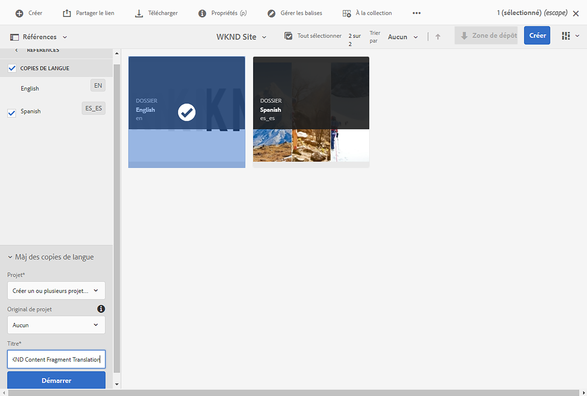

Vous recevez un message indiquant que le projet a été créé.

>[!NOTE]
>
>On suppose que la structure linguistique nécessaire pour les langues de traduction a déjà été créée dans le cadre de la [définition de votre structure de contenu.](getting-started.md#content-structure) Cela doit être fait en collaboration avec l’architecte de contenu.
>
>Si les dossiers de langue ne sont pas créés à l’avance, vous ne pourrez pas créer de copies de langue comme décrit dans les étapes précédentes.

### Création manuelle d’un projet de traduction en sélectionnant votre contenu {#manually-creating}

Pour les gestionnaires de projets de traduction, il est souvent nécessaire de sélectionner manuellement un contenu spécifique à inclure dans un projet de traduction. Pour créer un tel projet de traduction manuelle, vous devez commencer par créer un projet vide, puis sélectionner le contenu à y ajouter.

1. Accédez à **Navigation** -> **Projets**.
1. Appuyez ou cliquez sur **Créer** -> **Dossier** pour créer un dossier pour vos projets.
   * Ceci est facultatif, mais utile pour organiser vos efforts de traduction.
1. Dans le **Créer un dossier** , ajoutez une **Titre** pour le dossier, puis appuyez ou cliquez sur **Créer**.

   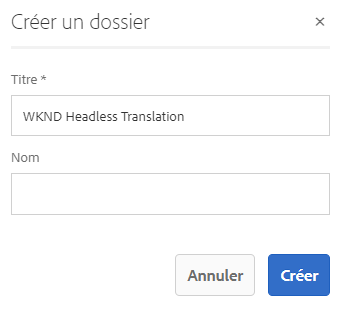

1. Appuyez ou cliquez sur le dossier pour ouvrir le dossier.
1. Dans le dossier du nouveau projet, appuyez ou cliquez sur **Créer** -> **Projet**.
1. Les projets sont basés sur des modèles. Appuyez ou cliquez sur le bouton **Projet de traduction** modèle pour le sélectionner, puis appuyez ou cliquez sur **Suivant**.

   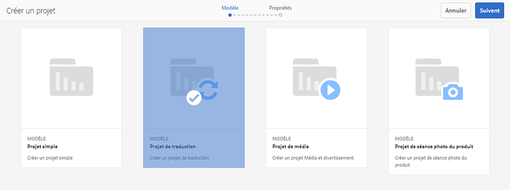

1. Sur le **De base** , saisissez un nom pour votre nouveau projet.

   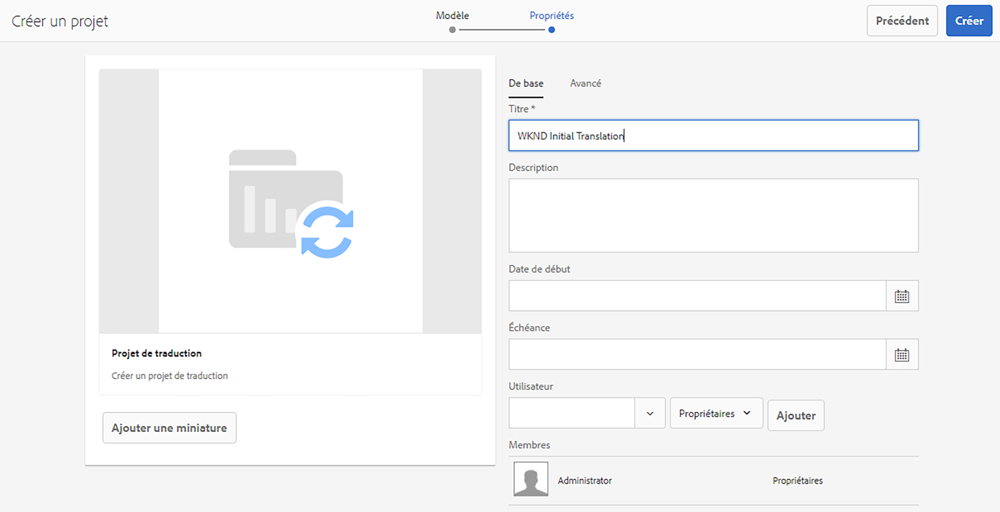

1. Sur le **Avancé** , utilisez l’onglet **Langue cible** pour sélectionner la ou les langues dans lesquelles votre contenu doit être traduit. Appuyez ou cliquez sur **Créer**.

   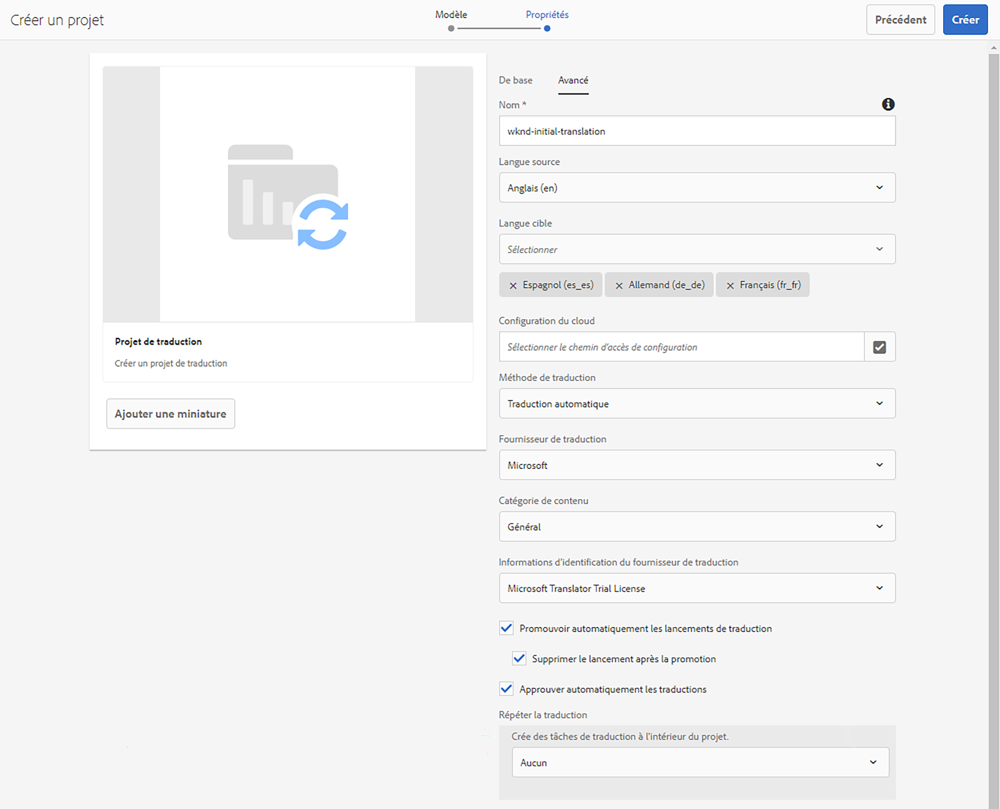

1. Appuyez ou cliquez sur **Ouvrir** dans la boîte de dialogue de confirmation.

   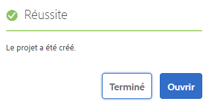

Le projet a été créé, mais ne contient aucun contenu à traduire. La section suivante décrit la structure du projet et comment ajouter du contenu.

## Utilisation d’un projet de traduction {#using-translation-project}

Les projets de traduction sont conçus pour collecter en un seul endroit l’ensemble du contenu et des tâches liés à un effort de traduction afin de rendre votre traduction simple et facile à gérer.

Pour afficher le projet de traduction :

1. Accédez à **Navigation** -> **Projets**.
1. Appuyez ou cliquez sur le projet qui a été créé dans la section précédente.

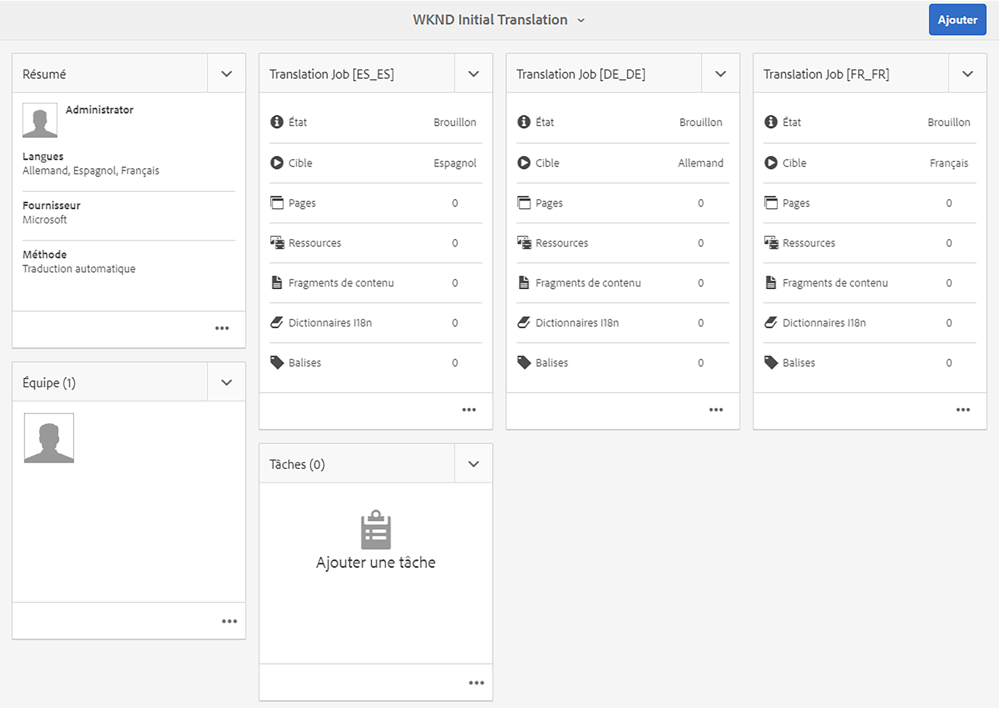

Le projet est divisé en plusieurs cartes.

* **Résumé** - Cette carte affiche les informations d’en-tête de base du projet, y compris le propriétaire, la langue et le fournisseur de traduction.
* **Tâche de traduction** - Cette carte ou ces cartes présentent un aperçu de la tâche de traduction proprement dite, y compris son état, le nombre de ressources, etc. En règle générale, il existe une tâche par langue avec le code de langue ISO-2 ajouté au nom de la tâche.
* **Équipe** - Cette carte montre les utilisateurs qui collaborent à ce projet de traduction. Ce parcours ne couvre pas cette rubrique.
* **Tâches** - Tâches supplémentaires associées à la traduction du contenu, telles que la réalisation d’éléments ou d’éléments de workflow. Ce parcours ne couvre pas cette rubrique.

La manière dont vous utilisez un projet de traduction dépend de la manière dont il a été créé : soit automatiquement par AEM, soit manuellement.

### Utilisation d’un projet de traduction créé automatiquement {#using-automatic-project}

Lors de la création automatique du projet de traduction, AEM évalue le contenu sans en-tête sous le chemin que vous avez sélectionné en fonction des règles de traduction que vous avez précédemment définies. Sur la base de cette évaluation, il extrait le contenu qui nécessite une traduction dans un nouveau projet de traduction.

Pour afficher le détail du contenu sans en-tête inclus dans ce projet :

1. Appuyez ou cliquez sur le bouton représentant des points de suspension en bas de la page **Tâche de traduction** carte.
1. Le **Tâche de traduction** répertorie tous les éléments de la tâche.
   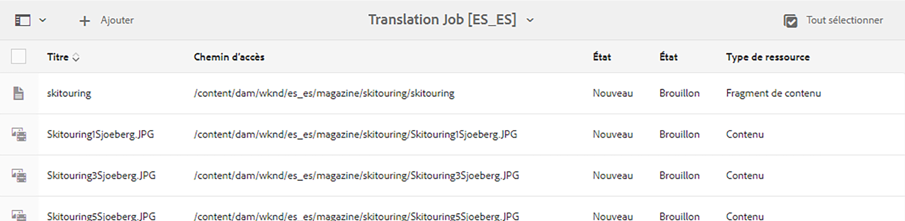
1. Appuyez ou cliquez sur une ligne pour afficher le détail de cette ligne, en gardant à l’esprit qu’une ligne peut représenter plusieurs éléments de contenu à traduire.
1. Appuyez ou cliquez sur la case à cocher de sélection d’un élément de ligne pour afficher d’autres options, telles que la possibilité de le supprimer de la tâche ou de l’afficher dans les consoles Fragments de contenu ou Ressources.
   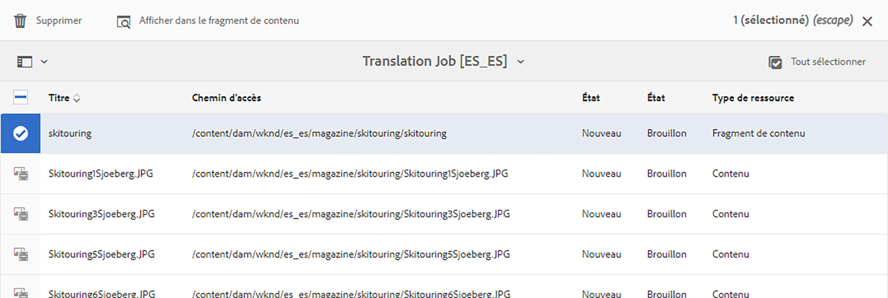

En règle générale, le contenu de la tâche de traduction commence dans le **Version préliminaire** comme indiqué par la variable **État** dans la colonne **Tâche de traduction** fenêtre.

Pour démarrer la tâche de traduction, revenez à la présentation du projet de traduction et appuyez ou cliquez sur le bouton chevron en haut de la page **Tâche de traduction** et sélectionnez **Début**.

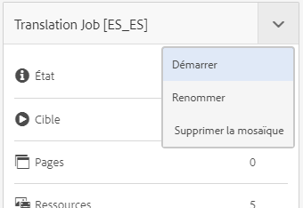

AEM communique maintenant avec votre configuration de traduction et votre connecteur pour envoyer le contenu au service de traduction. Vous pouvez afficher la progression de la traduction en revenant à la **Tâche de traduction** et d’afficher la **État** des entrées.

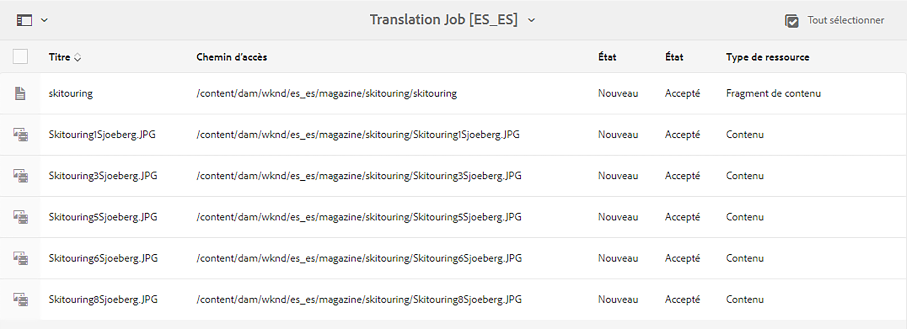

Les traductions automatiques sont automatiquement renvoyées avec un état de **Approuvé**. La traduction humaine permet plus d&#39;interaction, mais dépasse la portée de ce parcours.

### Utilisation d’un projet de traduction créé manuellement {#using-manual-project}

Lors de la création manuelle d’un projet de traduction, AEM crée les tâches nécessaires, mais ne sélectionne pas automatiquement le contenu à inclure. Cela permet au chef de projet de traduction de choisir le contenu à traduire.

Pour ajouter du contenu à une tâche de traduction :

1. Appuyez ou cliquez sur le bouton représentant des points de suspension au bas de l’une des options **Tâche de traduction** cartes.
1. Vérifiez que la tâche ne contient aucun contenu. Appuyez ou cliquez sur le bouton **Ajouter** en haut de la fenêtre, puis **Ressources/Pages** dans la liste déroulante.

   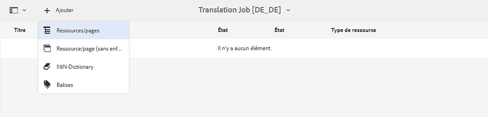

1. Un navigateur de chemins d’accès s’ouvre, vous permettant de sélectionner spécifiquement le contenu à ajouter. Recherchez votre contenu et appuyez ou cliquez dessus pour le sélectionner.

   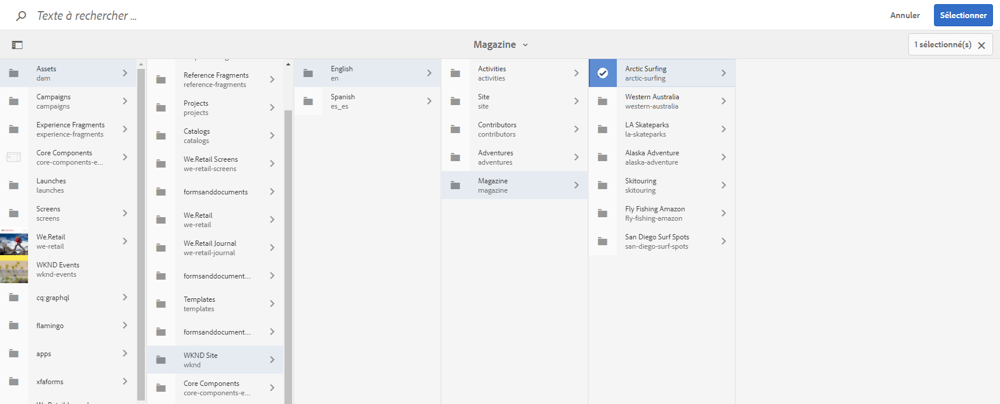

1. Appuyez ou cliquez sur **Sélectionner** pour ajouter le contenu sélectionné à la tâche.
1. Dans le **Traduire** , indiquez ce que vous souhaitez **Créer une copie de langue**.

   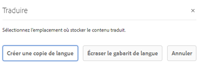

1. Le contenu est désormais inclus dans la tâche.

   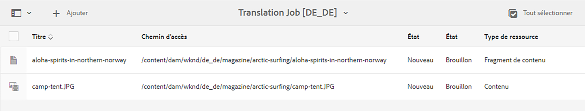

1. Appuyez ou cliquez sur la case à cocher de sélection d’un élément de ligne pour afficher d’autres options, telles que la possibilité de le supprimer de la tâche ou de l’afficher dans les consoles Fragments de contenu ou Ressources.
   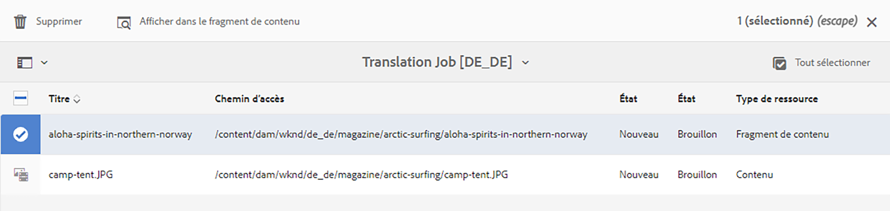

1. Répétez ces étapes pour inclure tout le contenu requis dans la tâche.

>[!TIP]
>
>L’explorateur de chemins d’accès est un outil puissant qui vous permet de rechercher, de filtrer et de parcourir votre contenu. Appuyez ou cliquez sur le bouton **Contenu uniquement/filtres** pour activer ou désactiver le panneau latéral et afficher les filtres avancés tels que **Date de modification** ou **État de traduction**.
>
>Pour en savoir plus sur l’explorateur de chemins d’accès, voir [ressources supplémentaires .](#additional-resources)

Vous pouvez utiliser les étapes précédentes pour ajouter le contenu nécessaire à toutes les langues (tâches) du projet. Une fois que vous avez sélectionné tout le contenu, vous pouvez commencer la traduction.

En règle générale, le contenu de la tâche de traduction commence dans le **Version préliminaire** comme indiqué par la variable **État** dans la colonne **Tâche de traduction** fenêtre.

Pour démarrer la tâche de traduction, revenez à la présentation du projet de traduction et appuyez ou cliquez sur le bouton chevron en haut de la page **Tâche de traduction** et sélectionnez **Début**.

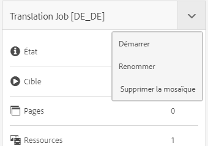

AEM communique maintenant avec votre configuration de traduction et votre connecteur pour envoyer le contenu au service de traduction. Vous pouvez afficher la progression de la traduction en revenant à la **Tâche de traduction** et d’afficher la **État** des entrées.

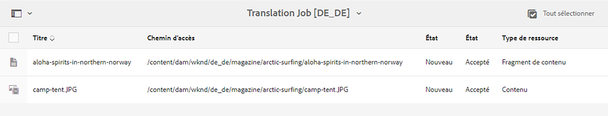

Les traductions automatiques sont automatiquement renvoyées avec un état de **Approuvé**. La traduction humaine permet plus d&#39;interaction, mais dépasse la portée de ce parcours.

## Vérification du contenu traduit {#reviewing}

[Comme nous l&#39;avons vu précédemment,](#using-translation-project) le contenu traduit par la machine revient en AEM avec l’état de **Approuvé** puisque l&#39;hypothèse est que la traduction automatique est utilisée, aucune intervention humaine n&#39;est nécessaire. Cependant, il est bien sûr toujours possible de consulter le contenu traduit.

Il vous suffit d’accéder à la tâche de traduction terminée et de sélectionner un élément de ligne en appuyant ou en cliquant sur la case à cocher. Icône **Affichage dans le fragment de contenu** s’affiche dans la barre d’outils.

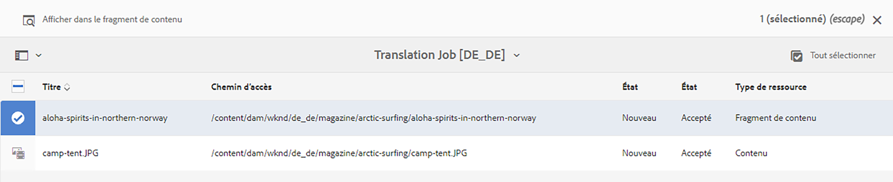

Appuyez ou cliquez sur cette icône pour ouvrir le fragment de contenu traduit dans sa console d’éditeur afin d’afficher les détails du contenu traduit.

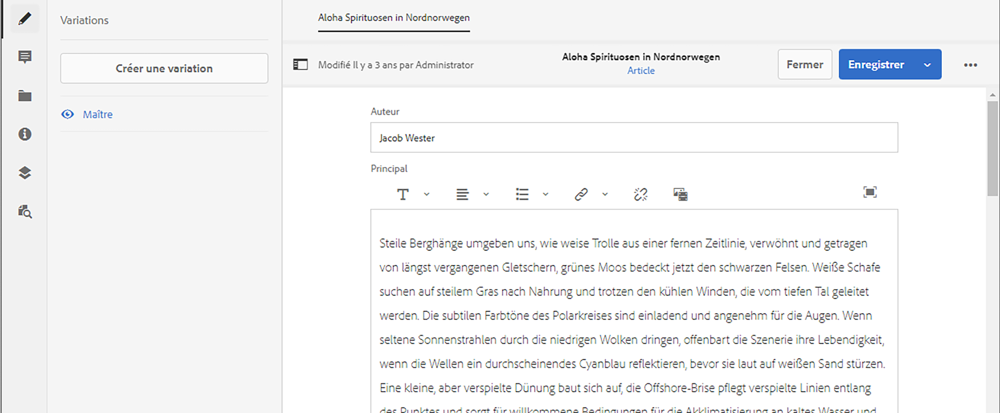

Vous pouvez modifier le fragment de contenu si nécessaire, à condition que vous disposiez des autorisations appropriées, mais la modification des fragments de contenu dépasse la portée de ce parcours. Veuillez consulter la [Ressources supplémentaires](#additional-resources) à la fin de ce document pour plus d’informations sur cette rubrique.

Le but du projet est de collecter toutes les ressources liées à une traduction en un seul endroit pour un accès facile et un aperçu clair. Cependant, comme vous pouvez le voir en affichant le détail d’un élément traduit, les traductions proprement dites sont renvoyées dans le dossier de ressources de la langue de traduction. Dans cet exemple, le dossier est

```text
/content/dam/wknd/es
```

Si vous accédez à ce dossier via **Navigation** -> **Ressources** -> **Fichiers**, le contenu traduit s’affiche.

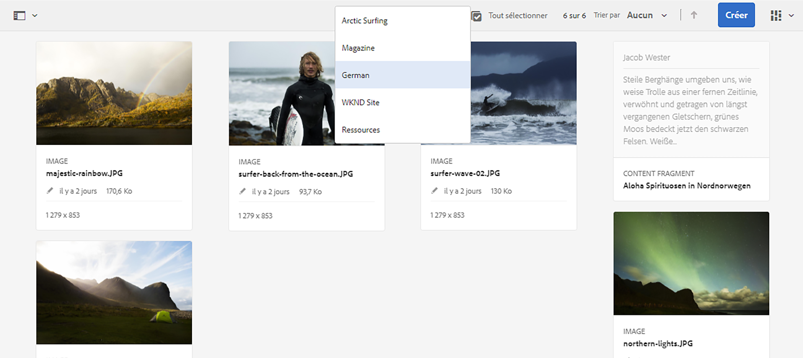

AEM structure de traduction reçoit les traductions du connecteur de traduction, puis crée automatiquement la structure de contenu en fonction de la racine de langue et à l’aide des traductions fournies par le connecteur.

Il est important de comprendre que ce contenu n’est pas publié et qu’il n’est donc pas disponible pour vos services sans interface utilisateur. Nous découvrirons cette structure de création et de publication et découvrirons comment publier notre contenu traduit à l’étape suivante du parcours de traduction.

## Traduction humaine {#human-translation}

Si votre service de traduction fournit une traduction humaine, le processus de révision offre d’autres options. Par exemple, les traductions reviennent dans le projet avec l’état **Version préliminaire** et doivent être examinés et approuvés ou rejetés manuellement.

La traduction humaine dépasse le cadre de ce parcours de localisation. Veuillez consulter la [Ressources supplémentaires](#additional-resources) à la fin de ce document pour plus d’informations sur cette rubrique. Au-delà des autres options de validation, le workflow des traductions humaines est le même que celui des traductions automatiques, comme décrit dans ce parcours.

## Et après ? {#what-is-next}

Maintenant que vous avez terminé cette partie du parcours de traduction sans interface utilisateur graphique, vous devez :

* Comprendre ce qu’est un projet de traduction.
* Vous pouvez créer de nouveaux projets de traduction.
* Utilisez des projets de traduction pour traduire votre contenu sans tête.

Tirez parti de ces connaissances et continuez votre parcours de traduction AEM sans interface utilisateur graphique en consultant le document. [Publier le contenu traduit](publish-content.md) où vous apprendrez à publier votre contenu traduit et comment mettre à jour ces traductions à mesure que votre contenu racine de langue change.

## Ressources supplémentaires {#additional-resources}

Bien qu’il soit recommandé de passer à la partie suivante du parcours de traduction sans interface utilisateur graphique en consultant le document [Publier le contenu traduit,](publish-content.md) vous trouverez ci-dessous des ressources facultatives supplémentaires qui approfondissent certains concepts mentionnés dans ce document, mais qui ne sont pas nécessaires pour continuer sur le parcours sans interface.

* [Gestion des projets de traduction](/help/sites-administering/tc-manage.md) - Découvrez les détails des projets de traduction et des fonctionnalités supplémentaires telles que les processus de traduction humaine et les projets multilingues.
* [Environnement et outils de création](/help/sites-authoring/author-environment-tools.md##path-selection) - AEM fournit divers mécanismes d’organisation et de modification de votre contenu, notamment un navigateur de chemins d’accès robuste.
