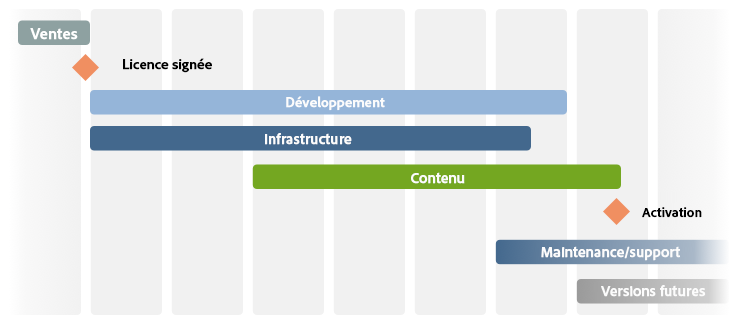
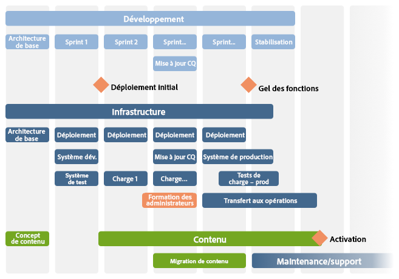

# La liste de contrôle – Référence supplémentaire{#the-checklist-further-reference}

Cette page fournit d’autres détails qui précisent et/ou enrichissent les documents et les principes couverts dans la section [Gestion des projets : liste de contrôle des meilleures pratiques](/help/managing/best-practices.md).

## AEM – Qu’allez-vous utiliser ? {#aem-what-will-you-be-using}

>[!CAUTION]
>
>Les listes de cette sous-section ne sont pas complètes, mais établies comme une introduction.

### Fonctions au sein d’AEM  {#features-within-aem}

Lors de la mise en oeuvre de l&#39;AEM (en particulier pour la première fois), vous devrez examiner les [capacités et workflows d&#39;AEM](https://www.adobe.com/fr/marketing/experience-manager.html) pour vous assurer des zones que vous souhaitez ou dont vous avez besoin.

Tenez compte des fonctions d’AEM que vous utiliserez et de l’impact sur votre travail de conception, par exemple :

* [Commerce](/help/sites-administering/ecommerce.md)
* [Screens](https://docs.adobe.com/content/help/fr-FR/experience-manager-screens/user-guide/aem-screens-introduction.html)
* [Ressources](/help/assets/assets.md)
* [Balises](/help/sites-administering/tags.md)
* [Gestion de sites multiples·et traduction](/help/sites-administering/msm-and-translation.md)
* [Formulaires](/help/forms/home.md)
* [Communities](/help/communities/deploy-communities.md)
* [Livefyre](https://answers.livefyre.com/product/livefyre-for-adobe-experience-manager-aem/livefyre-for-adobe-experience-manager/)

En outre, consultez les [notes de mise à jour](/help/release-notes/release-notes.md) pour les différentes versions d’AEM, afin de savoir quand de nouvelles fonctions ont été ajoutées.

### Intégrations  {#integrations}

AEM peut être intégré à d’autres produits Adobe et/ou services tiers. Ceux-ci peuvent augmenter la puissance et les fonctionnalités à votre disposition.

Voir [Intégration de solutions](/help/sites-administering/integration.md) pour obtenir des informations complètes.

## Migration ou mise à niveau ?  {#migrate-or-upgrade}

Il est important de déterminer si vous voulez :

* effectuer une mise à niveau de l’installation existante ; ou
* migrer le contenu du système actuel vers une nouvelle installation.

Lors du passage d’une version précédente à la version actuelle, il y a deux possibilités :

* Utiliser le [Gestionnaire de modules](/help/sites-administering/package-manager.md) pour exporter tous les contenus et le code d’application de l’ancien système vers le nouveau.
* [Mettre à niveau](/help/sites-deploying/upgrade.md) l’ancien système en place. Il s’agit de l’option recommandée dans la plupart des cas.

## Règles de base  {#basic-ground-rules}

Comme dans tout projet, il est essentiel d’établir des règles de base dès que possible. Celles-ci comprennent :

>[!NOTE]
>
>Ces points sont génériques, la [liste de vérification des meilleures pratiques](/help/managing/best-practices.md) traite des détails relatifs à l&#39;AEM.

* **Rôles**

   Ils doivent être définis clairement et connus de toutes les personnes impliquées dans le projet. En outre, il est recommandé d’insister sur les :

   * décideurs ;
   * points de contact.

* **Responsabilités**

   * Pour chaque rôle, une définition claire des responsabilités associées à votre projet permet d’éviter toute confusion.

* **Implication**

   En impliquant dès que possible les parties concernées, vous pouvez les inciter à devenir des *parties prenantes* dans le projet, et améliorer ainsi leur engagement dans sa réussite.

   * Du côté client, cela inclut les auteurs qui devront utiliser le système sur une base quotidienne.
   * Au sein de votre propre équipe de projet, cela inclut également les personnes chargées de l’assurance qualité. Mieux elles comprennent les exigences du client, mieux elles peuvent planifier les tests.

* **Voies de communication**

   * Bien que celles-ci ne doivent pas être trop formalisées, des définitions spécifiques doivent veiller à ce que les personnes principales soient toujours informées. Une attention toute particulière doit être portée à la communication avec les parties externes.

* **Processus**

   Les processus à définir varient selon votre projet particulier. Là encore, essayez de rester simple en considérant :

   * la définition des processus (ainsi que des voies de communication) pour interagir avec n’importe quel tiers, par exemple, les agences de conception et les fournisseurs de logiciels tiers, entre autres ;
   * que le client possédera souvent ses propres procédures de gestion des projets et de création de rapports, ainsi que ses propres outils.

* **Outils de suivi**

   Il existe de nombreux outils pour le suivi des informations sur les bogues, les tâches et d’autres aspects de votre projet. Voir [Présentation des outils potentiels](#overview-of-potential-tools) pour plus de détails.

   * Le point essentiel à noter ici est qu’il convient de conserver une seule copie des informations et de partager ces informations (et par conséquent, l’accès à l’outil utilisé). Cela facilite la maintenance et permet d’éviter les incohérences.

* **Portée**

   Définissez de façon précise ce qui doit être traité par le projet à différents niveaux :

   * les différentes versions (si un processus itératif de versions est utilisé, que les versions soient ou non livrées aux clients ou à votre équipe interne de test) ;
   * le projet AEM ;
   * le projet entier, y compris tout logiciel tiers, leur impact sur les tests, les problèmes organisationnels et bien d’autres ;
   * pour certains aspects, il peut également être utile d’indiquer ce qui ne fait *pas* partie de la portée du projet. Cela peut contribuer à éviter les confusions et les hypothèses erronées, bien qu’elle doit se limiter aux problèmes essentiels.

* **Création de rapports**

   Définissez clairement les informations que vous inclurez dans les rapports, leur format, leur fréquence et leurs destinataires.

* **Terminologie**

   * Définissez les abréviations et/ou la terminologie spécifique au client à utiliser.

* **Hypothèses**

   * Définissez toutes les hypothèses formulées.

Ces informations peuvent être définies dans un manuel de projet ; l’utilisation d’un wiki peut également vous assurer que les modifications en cours sont gérées efficacement. Où qu&#39;ils soient définis, les principaux facteurs sont les suivants :

* Les informations doivent être définies et mises à jour.
* Les informations doivent être communiquées clairement à toutes les personnes impliquées. Bien qu’il s’agisse d’une pratique standard de gestion de projet, on ne répétera jamais assez qu’une définition claire des rôles et une bonne communication peuvent déterminer la réussite ou l’échec d’un projet.
* Une seule version de toutes les informations suivies est conservée, par exemple, le suivi des bogues et des problèmes, etc.

## Indicateurs de performances clés et mesures cibles  {#key-performance-indicators-and-target-metrics}

Les organisations utilisent des indicateurs de performances clés (IPC) pour évaluer leur capacité à atteindre des cibles. Ces indicateurs sont des valeurs mesurables qui peuvent être utilisées pour montrer si les objectifs spécifiés sont satisfaits.

Ces indicateurs peuvent être :

* des indicateurs métier :

   * Utilisés pour mesurer les objectifs métier clés.
   * Il est important de sélectionner des IPC pertinents pour votre activité/scénario avec des définitions claires de leur nature, de la façon dont ils seront mesurés, de leur utilisation et des personnes qui les utiliseront.

* Performances:

   * Définissez comment mesurer la performance du système.
   * Il peut s’agir notamment du temps de chargement des pages, du temps de réponse du serveur, ainsi que de la performance des requêtes de la base de données.

Certains indicateurs, mais pas tous, peuvent reposer sur les mesures cibles que vous identifiez et définissez.

### Mesures cibles {#target-metrics}

Les mesures sont utilisées pour définir des mesures quantitatives de la qualité de votre site web. Elles sont essentiellement une définition des objectifs de performance à atteindre et peuvent être utilisées pour définir vos [IPC (indicateurs de performances clés)](#key-performance-indicators-and-target-metrics).

De nombreuses mesures peuvent être définies, mais celles que vous définissez sont souvent liées à vos objectifs en matière de performance et d’accès simultané. En particulier, des facteurs qu’il peut s’avérer difficile de mesurer et qui sont souvent évalués d’une façon *émotionnelle* :

* « Notre site web est *beaucoup trop lent* aujourd’hui. » : à partir de quel moment le site web est-il *lent* ?

* « Tout *s’arrête* lorsque mon collègue ouvre une session. » : combien d’utilisateurs simultanés le système peut-il prendre en charge ?
* « Lorsque j’effectue une recherche, le système *s’arrête*. » : quels sont les types de requêtes de recherche qui affectent le système ?
* « Le téléchargement du fichier prend une *éternité*. » : quelles sont les durées de téléchargement acceptables (avec des conditions normales de réseau) ?

Les mesures cibles sont définies au début d’un projet de façon à :

* indiquer les dimensions attendues du site web que vous proposerez ;
* indiquer la qualité minimale à atteindre ;
* définir la manière dont ces facteurs sont mesurés ;
* être utilisées comme base pour les [indicateurs de performances clés](#key-performance-indicators-and-target-metrics).

Comme toujours, les mesures cibles doivent être définies avec soin :

* Si leur valeur est trop élevée, elles peuvent être totalement inatteignables.
* Si leur valeur est trop faible, des fluctuations peuvent ne pas être mises en évidence.
* Cela permet de s’assurer qu’elles peuvent être mesurées à plusieurs reprises et de manière cohérente.
* Cela procure un équilibre entre les différents facteurs mesurés.
* Certaines mesures se rapportent à un environnement de test, tandis que d’autres doivent refléter des scénarios de la vie réelle, car elles doivent être mesurables et reproductibles, sur votre site web de production.
* Établissez la priorité des mesures en fonction de leur importance par rapport au site web.
* Limitez les mesures à un ensemble pouvant être raisonnablement contrôlé.

Au cours du développement du projet, elles peuvent être mises à jour et ajustées selon les besoins. Une fois le projet mis en œuvre, elles peuvent vous aider à contrôler votre installation et surveiller/maintenir les niveaux de service requis pour le fonctionnement courant.

Si elles sont correctement utilisées, ces mesures peuvent fournir un outil utile. En revanche, si elles sont utilisées de manière irresponsable, elles peuvent constituer une distraction et une perte de temps. Comme toujours, vous devez comprendre ce que vous mesurez, ainsi que comment et pourquoi vous le mesurez.

>[!NOTE]
>
>Cette section aborde les principes de base et les problèmes à prendre en compte. Chaque installation est différente, c’est pourquoi les valeurs à mesurer diffèrent.

### Tout repose sur la conception du projet  {#everything-rests-on-your-project-design}

Toutes les mesures sont, d’une manière ou d’une autre, affectées par la conception du projet. À l’inverse, le meilleur moyen de résoudre de nombreux problèmes consiste à modifier la conception.

Par conséquent, il est préférable de définir les mesures cibles *avant* de décider de la conception. Cela permet d’optimiser votre conception en fonction de ces facteurs. Une fois le projet développé, il sera difficile de modifier les principes de conception de base.

Lorsque vous créez la structure du site web, suivez la structure recommandée pour les sites web AEM. Veillez à bien comprendre les problèmes et/ou les principes suivants :

* Structuration du contenu du site web
* Fonctionnement des modèles et des composants
* Fonctionnement de la mise en cache
* Conséquences du contenu personnalisé
* Fonctionnement de la fonction de recherche
* Comment utiliser les feuilles de style en cascade CSS et les technologies associées pour créer du code HTML compact et non redondant

Si vous estimez que votre conception ne suit pas les consignes ou si vous n’êtes pas sûr de certaines des implications, clarifiez ces questions avant de débuter la phase de programmation ou d’ajouter le contenu.

### Infrastructure   {#infrastructure}

Pour définir ou évaluer l’infrastructure, il est utile de définir des valeurs cibles telles que :

* Visiteurs/jour (moyenne et maximum)
* Accès/jour (moyenne et maximum)
* Nombre de pages web disponibles
* Volume de contenu web

En fonction de votre situation et de la signification stratégique du site web, cela permet d’évaluer et de sélectionner votre infrastructure :

* Nombre de serveurs
* Nombre d’instances AEM (auteur et publication)

### Performances {#performance}

Il existe plusieurs facteurs de performance pouvant être évalués :

* Temps de réponse pour les pages individuelles, en tenant compte des éléments suivants :

   * Temps de réponse sur un environnement de création
   * Temps de réponse sur l’environnement de publication

* Temps de réponse pour les requêtes de recherche

Cette section peut être lue conjointement avec [Optimisation des performances](/help/sites-deploying/configuring-performance.md) qui développe les détails techniques de la mesure réelle des performances.

#### Temps de réponse pour les pages individuelles {#response-times-for-individual-pages}

Le temps que met votre site web pour répondre aux requêtes des visiteurs constitue l’un des problèmes majeurs.

Bien que cette valeur varie pour chaque demande, une valeur cible moyenne peut être définie. Une fois que cette valeur se révèle à la fois réalisable et gérable, elle peut être utilisée pour surveiller les performances du site web et indiquer le développement d’éventuels problèmes.

Cibles divergentes sur les environnements de création et de publication

Les temps de réponse que vous ciblerez seront différents sur les environnements de création et de publication, reflétant l’audience cible :

* **Environnement de création**

   Cet environnement est utilisé par les auteurs qui créent et mettent à jour du contenu ; il doit donc :

   * prendre en charge un petit nombre d’utilisateurs qui génèrent chacun un nombre élevé de demandes lors de la mise à jour des pages de contenu et des éléments individuels de ces pages ;
   * être aussi rapide que possible afin d’optimiser leur productivité pour que votre contenu arrive sur votre site web.

* **Environnement de publication**

   Cet environnement intègre le contenu que vous mettez à la disposition de vos utilisateurs :

   * La vitesse reste essentielle, mais il est souvent plus lent qu’un environnement de création.
   * Des mécanismes supplémentaires d’amélioration des performances sont souvent appliqués :

      * le contenu est mis en cache ;
      * l’équilibrage de charge est appliqué.

#### Définition des temps de réponse cibles  {#setting-target-response-times}

Comment puis-je décider des temps de réponse (moyens) atteignables ? Il s’agit souvent d’une question d’expérience :

* Expérience antérieure sur votre site web
* Expérience avec AEM
* Identification des pages complexes dont les temps de réponse sont supérieurs à la moyenne (elles doivent être optimisées individuellement, si possible)

Toutefois, dans des conditions contrôlées, les consignes suivantes peuvent être appliquées :

* 70 % des demandes de pages devraient répondre en moins de 100 ms.
* 25 % des demandes de pages devraient répondre en moins de 100 à 300 ms.
* 4 % des demandes de pages devraient répondre en moins de 300 à 500 ms.
* 1 % des demandes de pages devrait répondre en moins de 500 à 1 000 ms.
* Aucune page ne doit répondre en plus d’une seconde.

Les chiffres ci-dessus supposent les conditions suivantes :

* Mesures réalisées sur l’environnement de publication (et non celui de création et/ou la surcharge CFC)
* Mesure prise sur le serveur (pas de surcharge réseau)
* Pas de mise en cache (pas de cache de sortie AEM, pas de cache du Dispatcher)
* Uniquement pour les éléments complexes présentant de nombreuses dépendances (HTML, JS, PDF,...)
* Pas d’autre charge sur le système

Il existe plusieurs méthodes pour surveiller les temps de réponse :

* **Surveillance des temps de réponse avec le fichier request.log d’AEM**

   Le journal des requêtes est un point de départ intéressant pour l’analyse de performances. Entre autres informations, vous pouvez l’utiliser pour afficher les temps de réponse des requêtes isolées. Voir [Optimisation des performances](/help/sites-deploying/configuring-performance.md) pour plus d’informations.

* **Surveillance des temps de réponse à l’aide des commentaires HTML**

   Les commentaires HTML peuvent être utilisés pour inclure des informations sur le temps de réponse dans la source de chaque page :

   `</body> </html>v <-- Page took 58 milliseconds to be rendered by the server --> Response times for search requests`

#### Requêtes de recherche {#search-requests}

Les requêtes de recherche peuvent avoir un impact important sur votre site web, en termes de :

* temps de réponse de la recherche ;

   * Une fonction de recherche rapide est un objectif de qualité pour votre site web.

* impact sur les performances générales.

   * Une fonction de recherche devant analyser les sections (potentiellement de grande taille) du contenu ou d’un index extrait spécifiquement, cela peut altérer les performances du système s’il n’est pas optimisé.

La définition des cibles pour les requêtes de recherche est, là encore, une question d’expérience en fonction :

* de l’expérience d’AEM ;
* d’une estimation de la fréquence des recherches par rapport aux autres objectifs ;
* de votre gestionnaire de persistance ;
* de votre index de recherche ;
* de la complexité de la fonction de recherche ; une fonction de recherche de base permettant la saisie d’un seul terme de recherche sera plus rapide qu’une recherche avancée permettant à l’utilisateur de créer des instructions de recherche complexes avec ET/OU/SAUF.

Elles doivent être planifiées et intégrées dès le tout début du projet. Les mécanismes disponibles pour la surveillance incluent :

* **Surveillance des temps de réponse de recherche avec le fichier request.log d’AEM**

   Là encore, le fichier request.log peut être utilisé pour surveiller les temps de réponse des requêtes de recherche ; voir [Optimisation des performances](/help/sites-deploying/configuring-performance.md) pour plus d’informations.

* **Mécanismes programmés pour mesurer les temps de réponse des recherches**

   Pour personnaliser les informations que vous collectez sur les requêtes de recherche et leur performance, il est recommandé d’inclure la collecte d’informations dans le code source du projet ; voir [Optimisation des performances](/help/sites-deploying/configuring-performance.md) pour plus d’informations.

### Concurrence  {#concurrency}

Votre site web sera disponible pour un certain nombre d’utilisateurs/de visiteurs, dans les environnements de création et de publication. Les numéros sont souvent plus élevés que ceux utilisés lors du test, mais ils sont également fluctuants et difficiles à prévoir. Votre site web doit avoir été conçu pour qu’un nombre moyen d’utilisateurs/de visiteurs simultanés ne remarquent pas d’impact négatif sur les performances. Là encore, le fichier `request.log` peut être utilisé pour effectuer des tests d’accès simultané ; voir [Optimisation des performances](/help/sites-deploying/configuring-performance.md) pour plus d’informations.

Les cibles pour le nombre d’utilisateurs simultanés dépendent du type d’environnement :

* **Environnement de création**

   * Généralement, le nombre d’utilisateurs simultanés peut être estimé avec précision. Vous savez combien d’auteurs vous aurez au total, même s’ils ne seront (probablement) pas tous actifs en même temps.

* **Environnement de publication**

   * Il est plus difficile de prévoir, vous devez donc sélectionner une valeur cible. Ici encore, cela doit être basé sur les statistiques d’utilisation de votre site web en cours, ainsi que sur des attentes réalistes concernant votre nouveau site web.
   * Les événements spéciaux (par exemple, lorsque vous publiez du nouveau contenu très populaire) peuvent dépasser les attentes, voire même les capacités (comme lorsque les médias parlent des affolements lors la mise en vente des entrées pour certains événements).

### Capacité et volume  {#capacity-and-volume}

Avant de discuter des mesures relatives, une définition rapide des termes :

* **Volume**

   * La proportion de sortie qui est traitée et diffusée par le système.

* **Capacité**

   * La capacité du système à distribuer le volume.
   * À chaque étape, la capacité et le volume sont mesurés différemment, comme le montre le tableau ci-dessous. Pour optimiser les performances, assurez-vous que la capacité correspond au volume à chaque étape, et que la capacité et le volume sont partagés à travers toutes les étapes. Par exemple, vous pouvez calculer la navigation sur l’ordinateur client, ou la mettre dans le cache, au lieu de la calculer sur le serveur pour chaque requête.

* **Capacité et volume**

   | Quoi / Où | Capacité | Volume |
   |---|---|---|
   | Client | Puissance de calcul de l’ordinateur de l’utilisateur. | Complexité de la mise en page. |
   | Réseau | Bande passante réseau. | Taille de la page (code, images, etc.). |
   | Cache du répartiteur | Mémoire serveur du serveur Web (mémoire principale et disque dur). | Serveur Web (mémoire principale et disque dur). Nombre et taille des pages mises en cache. |
   | Cache de sortie | Mémoire serveur du serveur AEM (mémoire principale et disque dur). | Nombre et taille des pages du cache de sortie, nombre de dépendances par page. Le cache du Dispatcher réduit ce volume. |
   | Serveur web | Puissance de calcul du serveur Web. | Nombre de demandes. La mise en cache réduit ce volume. |
   | Template | Puissance de calcul du serveur Web. | Complexité des modèles. |
   | Référentiel | Performances du référentiel. | Nombre de pages chargées à partir du référentiel. |

### Autres mesures {#other-metrics}

Les sections précédentes présentent les principales mesures à définir.

Selon vos besoins spécifiques, il peut être utile de définir des mesures supplémentaires de façon isolée ou en prenant en compte les classifications ci-dessus.

Cependant, il est préférable de garder un ensemble réduit de mesures essentielles précises qui fonctionnent de manière simple et fiable, plutôt que de tenter de mesurer et de définir chaque aspect de votre site web. De par sa nature, votre site web commencera à changer et à évoluer dès qu’il sera remis à vos utilisateurs.

## Sécurité {#security}

La sécurité est cruciale et présente un défi toujours plus grand. Elle ***doit*** être considérée et planifiée dès les premières étapes de votre projet.

La [liste de contrôle de sécurité](/help/sites-administering/security-checklist.md) décrit les mesures à prendre pour s’assurer que votre installation d’AEM est sécurisée lors de son déploiement. D&#39;autres aspects de la sécurité sont couverts par [Sécurité (lors de son développement)](/help/sites-developing/security.md) et [Administration utilisateur et sécurité](/help/sites-administering/security.md).

## Tâches en parallèle et itératives {#parallel-and-iterative-tasks}

>[!NOTE]
>
>Notez les points suivants :
>
>* Offre un aperçu de la mise en oeuvre *première* d&#39;un projet AEM.
>* Il s’agit d’une présentation abstraite ; voir la [liste de contrôle de projet](/help/managing/best-practices.md) pour les phases/jalons/tâches spécifiques.
>* Toute échelle temporelle est théorique.

>

Pour une nouvelle implémentation d’un projet AEM standard, vous devrez tenir compte des tâches comme les suivantes :

* Transfert à partir du processus de vente
* Mise en œuvre de l’application du client (**développement**)
* Installation et configuration de l’infrastructure (et processus associés) sur le site client (**infrastructure**)
* Création (ou migration) du contenu (**contenu**)
* Transfert vers les opérations **(maintenance/assistance**)
* Versions suivantes

Pour tous les aspects, il est recommandé d’utiliser une approche itérative :

>[!NOTE]
>
>Divisez le lancement du projet en **prélancement(s)** (disponibilité réduite et itérations multiples) et en **lancement complet** (pleine disponibilité, complètement activé) afin de permettre l’ajustement, l’optimisation et la formation des utilisateurs dans des conditions réalistes au sein de l’environnement de production.

>[!NOTE]
>
>Voir la [liste de contrôle de projet](/help/managing/best-practices.md) pour consulter des exemples de tâches que vous devez effectuer (ou évaluer) pendant le cycle de vie de votre projet.

Voici quelques points à noter pour chaque catégorie :

* **Développement**

   * Définissez tout d’abord l’architecture de base.
   * Utilisez plusieurs itérations (sprints) pour le développement :

      * Le premier sprint correspond au premier cycle complet de développement.
      * Le premier sprint produit le premier déploiement sur votre environnement de test.
      * Chaque version a un résultat exécutable.
      * Chaque sprint obtient l’approbation du client (test structuré avec commentaires au minimum).
   * Planifiez l’éventualité d’une mise à jour de la version d’AEM disponible au cours du projet.
   * Planifiez les tests et l’optimisation pendant les sprints.
   * Planifiez les phases de stabilisation et d’optimisation.
   * Créez un journal des éléments à planifier pour les versions futures.
   * Planifiez la participation des partenaires et le transfert associé.

* **Infrastructure**

   * Définissez tout d’abord l’architecture de base :

      * Définissez les exigences de performance.
      * Définissez les objectifs de performance (c’est-à-dire, définissez clairement les attentes).
      * Définissez l’architecture du matériel et de l’infrastructure, notamment le dimensionnement.
      * Définissez le déploiement.
   * Utilisez plusieurs itérations. Pour le premier sprint et la configuration initiale, préparez les événements suivants :

      * Environnement de développement
      * Processus de développement
      * Environnement de test
      * Processus de déploiement (y compris la gestion de la configuration)
   * Planifiez plusieurs tests de charge.
   * Planifiez les tests et l’optimisation pendant les sprints.
   * Planifiez une phase de stabilisation et d’optimisation.
   * Déployez sur l’environnement de production dès que possible (laissez l’équipe des opérations installer le système pour acquérir l’expérience).
   * Utilisez dès que possible des utilisateurs nommés et des rôles définis.
   * Planifiez la formation (par exemple, la formation des administrateurs).
   * Planifiez le transfert à l’équipe des opérations.

* **Contenu**

   * L’architecture de base :
      * pilote la hiérarchie du contenu ;
      * aide à définir le concept de contenu ;
      * définit l’utilisation et la mise en page MSM ;
      * définit les rôles, les groupes, les workflows et les autorisations.
   * Déterminez si la création de pages hors ligne sera utile.
   * Planifiez la création anticipée des premières pages et du contenu (à utiliser dans les tests et les commentaires).
   * Planifiez la migration du contenu existant.
   * Planifiez la migration en cours de sprint après la refactorisation.
   * Planifiez l’avancement du contenu (plan de site pour le contenu publié).

## Estimation du temps et des efforts  {#estimating-time-and-effort}

Selon la liste de tâches obtenue, vous pouvez établir des estimations initiales de temps et d’efforts pour les définitions (de haut niveau) des tâches. Celles-ci doivent inclure une indication de qui, du client ou du partenaire, fera quoi et à quel moment.

La liste suivante présente des approximations standard et des corrélations entre les efforts nécessaires, et donc les coûts :

>[!CAUTION]
>
>Ces valeurs peuvent uniquement être utilisées pour les estimations initiales. Un développeur AEM expérimenté doit effectuer une analyse détaillée.

| Phase | Effort |
|---|---|
| Développement | Une estimation approximative de 2 à 4 heures pour chaque noeud de composant couvrira toutes les exigences de développement. |
| Test des développeurs | 15 % du développement |
| Suivi | 10 % du développement |
| Documentation | 15 % du développement |
| Documentation JavaDoc | 10 % du développement |
| Correction de bogues | 15 % du développement |
| Gestion de projets | 20 % des coûts du projet pour la gestion et la gouvernance continues du projet |

La planification détaillée peut ensuite associer les ressources disponibles ou requises aux échéances et aux coûts.

## Architecture de référence {#reference-architecture}

L’architecture de référence est fournie afin de fournir une solution de modèle pour l’architecture d’AEM. L’architecture de référence répond aux problèmes généralement rencontrés par les systèmes d’entreprise, y compris le dimensionnement, la fiabilité et la sécurité.

Les mesures de site suivantes doivent être définies :

| Classification | Définition |
|---|---|
| Nombre de sites Internet |  |
| Nombre de sites intranet |  |
| Nombre de bases de code (par exemple, si Internet et intranet diffèrent) |  |
| Nombre de pages individuelles |  |
| Nombre de visites du site / jour |  |
| Nombre de vues de page / jour |  |
| Volume (en Go) du transfert de données/jour |  |
| Nombre d’utilisateurs simultanés (groupe d’utilisateurs fermé) |  |
| Nombre de visiteurs simultanés (publication) |  |
| Nombre d&#39;auteurs simultanés |  |
| Nombre d&#39;auteurs enregistrés |  |
| Nombre d&#39;activations de page / jour ouvrable |  |
| Nombre d’activations de page pendant le déploiement |  |

## Présentation des outils potentiels {#overview-of-potential-tools}

La liste suivante est fournie pour vous informer des outils qui peuvent être utilisés. Elle a été établie pour servir d’introduction, ne constitue pas une liste exhaustive de recommandations et ne devrait certainement pas vous dissuader d’utiliser d’autres outils que vous pourriez préférer.

<table>
 <tbody>
  <tr>
   <td><strong>Produit</strong></td>
   <td><strong>Description</strong></td>
  </tr>
  <tr>
   <td>AEM</td>
   <td>
AEM fournit une gamme de mécanismes pour vous aider à surveiller, tester, rechercher et déboguer votre application ; y compris :

    <ul>
     <li><a href="/help/sites-developing/developer-mode.md">Mode Développeur</a></li>
     <li><a href="/help/sites-developing/hobbes.md">Console de test</a></li>
     <li><a href="/help/sites-administering/operations-dashboard.md">Tableau de bord des opérations</a></li>
     <li><a href="/help/sites-authoring/content-insights.md">Content Insight </a></li>
     <li>L'<a href="/help/sites-authoring/author-environment-tools.md#content-tree">arborescence de contenu</a></li>
    </ul> </td>
  </tr>
  <tr>
   <td> </td>
   <td> </td>
  </tr>
  <tr>
   <td>Selenium</td>
   <td> Seleniumis est un outil de test Open Source. Les tests s’exécutent directement dans le navigateur en émulant la façon dont les utilisateurs travaillent.</td>
  </tr>
  <tr>
   <td>Microsoft Project</td>
   <td>Outil de gestion de projet couramment utilisé.</td>
  </tr>
  <tr>
   <td>Jira</td>
   <td> Jirais est un outil Open Source pour le suivi et la gestion des détails de vos bogues logiciels. Des workflows peuvent être imposés sur les détails des bogues selon vos besoins.</td>
  </tr>
  <tr>
   <td>Git</td>
   <td> Gitis est un logiciel de contrôle de révision.</td>
  </tr>
  <tr>
   <td>Eclipse</td>
   <td>
Eclipse est un IDE Open Source, composé de divers projets. Ils sont concentrés sur la création d’une plate-forme de développement ouverte, composée de structures extensibles, d’outils et de runtimes pour la conception, le déploiement et la gestion des logiciels tout au long du cycle de vie.
 
Voir <a href="/help/sites-developing/howto-projects-eclipse.md">Comment développer des projets AEM à l’aide d’Eclipse</a> pour plus d’informations.
 </td>
  </tr>
  <tr>
   <td>IntelliJ</td>
   <td>
Un IDE professionnel (et donc susceptible de supporter les coûts de licence) offrant une gamme complète de fonctionnalités. 
 
Voir <a href="/help/sites-developing/ht-intellij.md">Comment développer des projets AEM à l'aide d'IntelliJ IDEA</a> pour plus d'informations.
 </td>
  </tr>
  <tr>
   <td>Maven</td>
   <td> Mavenis est un outil de gestion de projet logiciel et de compréhension qui peut gérer le processus de construction d'un projet (logiciel et documentation).</td>
  </tr>
 </tbody>
</table>

## Informations complémentaires {#further-reading}

En outre, les sections ci-après sont particulièrement intéressantes :

* [Prise en main](/help/sites-deploying/deploy.md#getting-started)
* [Exigences techniques](/help/sites-deploying/technical-requirements.md)
* [Surveillance et maintenance de votre instance](/help/sites-deploying/monitoring-and-maintaining.md)

### Bonnes pratiques {#best-practices}

Adobe propose d’autres meilleures pratiques pour toutes les phases et tous les publics :

* [Déploiement](/help/sites-deploying/best-practices.md)
* [Création  ](/help/sites-authoring/best-practices.md)
* [Administration](/help/sites-administering/administer-best-practices.md)
* [Développement](/help/sites-developing/best-practices.md)
* [Gestion de projets](/help/managing/best-practices.md)