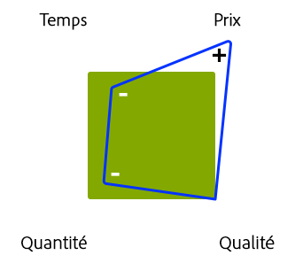

# Gestion des projets : liste de contrôle des meilleures pratiques{#managing-projects-best-practices-checklist}

La gestion d’un projet de mise en œuvre d’Adobe Experience Manager (AEM) nécessite planification et compréhension afin de vous assurer de connaître les problèmes et les décisions (associées) que vous devez prendre (avant et pendant la mise en œuvre du projet).

Pour vous aider, les meilleures pratiques se composent des éléments suivants :

* Une [liste de contrôle interactive](/help/managing/best-practices-checklist.md) qui permet de suivre et de surveiller votre progression par rapport à ces meilleures pratiques.

   * Définit les entrées et les éléments livrables selon la phase, le jalon et le personnage.
   * Offre des aperçus automatisés (qualité, état et complétude) pour indiquer la progression et l’état des projets.

* La documentation, fondée directement sur la [liste de contrôle](/help/managing/best-practices-checklist.md), qui décrit :

   * [Analyse des ](#projectheartbeat) pulsations du projet.
   * [État par ](#status-by-role) Roleoverview.
   * les [phases et jalons](#phases-and-milestones).
   * le [personnage principal](#persona) et sa participation à chaque étape (appropriée).
   * [Glossaire ](/help/managing/best-practices-glossary.md) des [documents et éléments livrables requis](#required-documents-and-deliverables).

* D’[autres documents de référence](/help/managing/best-practices-further-reference.md) pour fournir plus de détails sur des domaines spécifiques.

## Tableau de bord de pulsation du projet {#project-heartbeat-dashboard}

La feuille de calcul de **pulsation du projet** fournit un aperçu graphique des mesures essentielles de votre projet :

* **Qualité de la phase**

   * Indique la qualité des [documents et éléments livrables](#required-documents-and-deliverables) requis dans tout le projet.

* **État de la phase**

   * Indicateur d’état de niveau supérieur de votre projet, utile pour mettre en évidence les zones pouvant présenter un risque.

* **Complétude de la phase**

   * À tout moment au cours du projet, cela indique l’avancement de chaque phase de votre projet.

## État par rôle  {#status-by-role}

La feuille de calcul **État par rôle** indique le détail de l’[**état**, la **qualité** et la **complétude**](#projectheartbeat) par **[phase](#phases-and-milestones)** et **[personnage](#persona)**.

## Phases et jalons {#phases-and-milestones}

Le plan de projet est divisé en phases (de haut niveau) distinctes.

Chaque phase contient ses propres jalons. Pour chaque [personnage](#persona) (ou rôle), les jalons pertinents sont répertoriés, ainsi que les documents qui sont requis pour générer les éléments livrables définis.

>[!NOTE]
>
>Il n’y a pas de rapport de 1 à 1 direct entre les différents documents et éléments livrables requis.

### Préparation {#preparation}

La préparation de votre projet représente la base de l’ensemble du projet. Vous devez définir les principales exigences avec des objectifs et des attentes clairs pour les éléments suivants :

* **Justification commerciale**

   * Les raisons fondamentales et la justification de la mise en place du projet.

* **Portée et planification**

   * Une portée fondamentale et une planification approximative doivent être disponibles pour définir ce qui est obligatoire et dans quel laps de temps. Si cela permet de clarifier la situation, vous pouvez également définir ce qui se trouve en dehors de la portée du projet.

La façon dont vous préparez, planifiez et exécutez votre projet, et mettez en œuvre votre solution, sera affectée par les restrictions auxquelles vous faites face, par exemple, un budget déterminé, des échéances fixes, la quantité de contenu et la qualité requise.

Comme toujours, l’ajustement de l’un des facteurs aura un impact sur les autres. Par exemple, le fait de réduire le temps, tout en requérant le même niveau de qualité, augmentera probablement le prix tout en réduisant la quantité de contenu que vous pouvez prendre en compte. Le budget étant souvent un facteur clé, ces relations ne peuvent pas être omises.

Les quatre facteurs :

#### Jalons {#milestones}

* **Validation**

   Au cours de cette phase, vous devez valider et confirmer les objectifs du projet, par exemple :

   * Que voulez-vous réaliser/fournir ?
   * Qui en profitera ?
   * Quelle est la portée ?

      * Si cela vous aide à clarifier la situation, vous pouvez également définir ce qui se trouve en dehors de la portée du projet.
   * Comment définirez-vous la réussite du projet ?
   * Comment mesurerez-vous la réussite du projet ?
   * Quelles sont les exigences, commerciales et techniques ?
   * Existe-t-il des systèmes hérités à remplacer et, dans l’affirmative, y a-t-il des données à migrer ?
   * Qui sera impliqué ?
   * Comment mesurerez-vous la progression ?
   * Combien de fois évaluerez-vous la progression au cours de la vie du projet ?

* **Budget**

   Avant de lancer un projet, vous avez besoin d’une estimation fiable et réaliste de ce que sa mise en œuvre vous coûtera :

   * Utilisez les informations du jalon de validation comme base de vos estimations.
   * Soyez réaliste dans vos estimations.
   * Prenez en compte et respectez tous les processus et consignes du client, ainsi que les restrictions auxquelles le client peut être soumis.
   * Prévoyez les événements imprévus et des processus de révision dans le cas où une révision ou un ajustement du budget serait requis à un stade ultérieur.
   * N’oubliez pas que les coûts se présentent sous une multitude de formes, notamment l’utilisation des ressources et les frais.

### Planification {#planning}

La planification du projet consolide la préparation. Il s’agit ici de commencer à transformer vos objectifs et vos attentes en une feuille de route bien définie constituée de tâches concrètes, associées à une communication claire, avec des révisions strictes pour mesurer la progression.

#### Jalons  {#milestones-1}

* **Remise du projet**

   Une bonne remise de projet s’assure que les personnages/groupes appropriés sont informés de leurs responsabilités dans le projet.

   Des détails complets doivent être fournis/produits pour vérifier qu’ils comprennent pleinement tous les aspects pertinents, y compris la feuille de route, la portée du projet, les objectifs, les exigences et les indicateurs de performances clés (IPC).

* **Évaluation des risques**

   Pour éviter les mauvaises surprises, utilisez l’évaluation des risques afin d’identifier et de mesurer tout risque potentiel avec son impact et sa probabilité.

   Cela doit être effectué au cours des premières étapes du cycle de vie du projet pour vous assurer que toutes les vulnérabilités sont identifiées et évaluées. Selon les résultats, vous pouvez informer vos parties prenantes si l’intégralité des exigences peut être mise en œuvre et, le cas échéant, s’il est possible de planifier l’exécution et le suivi d’actions appropriées.

* **Communication**

   La communication constitue toujours la clé de la réussite d’un projet. Vous devez communiquer clairement et efficacement, et vous assurer que chacun :

   * travaille avec les mêmes objectifs de base
   * dispose de la même base d’informations
   * utilise les mêmes canaux.

* **Coup d’envoi**

   La réunion de coup d’envoi permet de signifier le début du projet. Il s’agit là d’une occasion pour :

   * inviter toutes les parties concernées (ou au moins les représentants des groupes) ;
   * présenter les faits essentiels concernant le projet ;
   * répondre aux questions ;
   * s’assurer que tout le monde dispose de la même base de connaissances ;
   * obtenir l’engagement de tous ceux qui seront impliqués – il vous faudra le gagner.

      * En impliquant des acteurs de qualité (y compris des auteurs potentiels) au début du projet, vous augmentez vos chances qu’ils s’engagent dans le projet.

### Préparation du développement {#development-preparation}

La planification du développement est essentielle pour vous assurer que votre projet est conçu sur des bases solides par une équipe qui dispose des connaissances requises.

#### Jalons  {#milestones-2}

* **Sélection et formation de l’équipe de développement**

   Avant de commencer un projet, quel qu’il soit, vous devez vous assurer que votre équipe de développement est correctement constituée et que tous les membres de l’équipe sont formés pour la tâche à réaliser.

* **Architecture de contenu**

   L’architecture de contenu définit notamment :

   * l’arborescence de contenu, y compris les ressources ;
   * les structures de base, y compris les campagnes, etc. ;
   * la structure multisite et multilingue (MSM, traduction, etc.) ;
   * le contenu de support (y compris les balises et les concepts de balisage) ;
   * les stratégies de mise en cache et de réutilisation du contenu.

* **Architecture du système**

   L’architecture du système définit la vue conceptuelle de votre système, y compris (entre autres informations) :

   * la [structure du système](/help/sites-deploying/recommended-deploys.md#deployment-scenarios) pour tous les environnements requis ;
   * les sous-systèmes ;
   * les systèmes tiers ;
   * les interfaces : matérielle, logicielle et interaction humaine ;
   * Serveurs pour chaque environnement ; voir [Exigences techniques](/help/sites-deploying/technical-requirements.md) et [Instructions de dimensionnement du matériel](/help/managing/hardware-sizing-guidelines.md)

   * les processus pour chaque environnement, par exemple, les exigences de déploiement et de maintenance ;
   * les activités de maintenance (GC de banque de données, optimisation TarPM, etc.) ;
   * Mise en cache du Dispatcher
   * [Mise en grappe de la publication/création partagée](/help/sites-deploying/recommended-deploys.md#deployment-scenarios)
   * la performance côté client (JS minify, concat, sprits CSS, nombre total de requêtes HTTP et autres).

* **Architecture d’applications**

   L’architecture d’applications définit et décrit le comportement des applications proposées.

   Notamment :

   * la façon dont elles interagiront les unes avec les autres et avec les utilisateurs ;
   * les données à consommer et générées par les applications, plutôt que leur structure interne.

   Les définitions doivent englober :

   * la structure du code de base pour le projet ;
   * les artefacts de code (regroupements, packages, etc.) ;
   * la répartition des modèles/composants et de leurs relations ;
   * les détails de haut niveau sur les personnalisations nécessaires (les recouvrements spécifiques suivront ultérieurement) ;
   * la conception des workflows requis par la solution (par exemple, la création de contenu, l’approbation, la publication, les transformations, les importations, les exportations, etc.) ;
   * une attention toute particulière aux éventuels modules complexes, tels que MSM, Commerce et intégration de tierce partie.

* **Intégration système**

   Pour l’intégration système, vous devez prévoir (et ensuite implémenter) :

   * la façon dont tous les sous-systèmes et [intégrations de solutions](/help/sites-administering/integration.md) seront assemblés pour fonctionner comme un système cohérent ;
   * Comment les systèmes tiers seront-ils intégrés ? ainsi que toutes les considérations spéciales, telles que la gestion hors ligne/en ligne, côté client/côté navigateur ou la gestion du basculement lorsqu’un système tiers est hors service

* **Concept de test**

   Avant de commencer le développement, vous devez développer un concept complet et en profondeur de toutes les conditions de [test](/help/sites-developing/planning.md) de votre projet.

   Ce concept doit inclure (entre autres) :

   * le détail de tous les tests à exécuter ;
   * la préparation de tout contenu requis pour ces tests ;
   * les informations sur les éventuels outils de test à utiliser ;
   * des indications de haut niveau sur les personnes impliquées dans le test, particulièrement les groupes en dehors de l’équipe d’assurance qualité ;
   * le détail de l’automatisation des tests, par exemple, avec Selenium ou le mode Développeur d’AEM.

* **Conception d’expérience**

   La conception d’expérience (XD, de l’anglais « Experience Design ») consiste à créer une expérience utilisateur pour la solution.

   L’expérience utilisateur doit être analysée et conçue à la fois pour les auteurs et les utilisateurs finaux de votre site web.

* **Configuration de support**

   Avant le développement, tous les processus de support, nécessaires pour déployer, publier, tester et signaler les problèmes doivent être en place.

   Voir aussi le [portail d’assistance d’Adobe](https://helpx.adobe.com/fr/marketing-cloud/contact-support.html).

### Les opérations et leur planification  {#operations-planning-and-operations}

De la même façon, les opérations doivent être correctement planifiées de manière à vous assurer de disposer des environnements dont vous avez besoin pour toutes les étapes du cycle de vie du projet. Vous avez également besoin des processus appropriés pour leur maintenance.

#### Jalons  {#milestones-3}

* **Autorisations**

   Vous devez planifier et mettre en œuvre un concept de rôles et de droits pour tous les utilisateurs/groupes qui utiliseront la solution.

   Par exemple :

   * Liste des rôles (c’est-à-dire des groupes) avec des définitions d’accès `read`/ `write` pour chaque

   * Définition de l’utilisation des privilèges qui affectent l’environnement de publication ; par exemple, `replicate`
   * Pour les utilisateurs qui disposent de privilèges minimaux, les processus doivent être définis
   * Les utilisateurs du groupe `editor` ne doivent pas disposer des droits `admin` ni faire partie du groupe `administrators` .

   Pour plus d’informations, voir [Administration et sécurité des utilisateurs](/help/sites-administering/security.md).

* **Surveillance et maintenance**

   La surveillance et la maintenance sont des aspects clés pour assurer le bon fonctionnement de votre solution une fois qu’elle est disponible. Pour cela, vous devez définir :

   * ce qui doit être surveillé ;
   * les tâches de maintenance, aussi bien la maintenance standard que les cas spéciaux.

   Voir également [Surveillance et maintenance](/help/sites-deploying/monitoring-and-maintaining.md) pour plus d’informations.

* **Migration**

   Tout contenu provenant du système hérité doit être passé en revue et validé pour la migration.

* **Plan de récupération**

   Assurez-vous que vous disposez d’un plan de récupération. En cas d’urgence, il doit être disponible pour sécuriser l’utilisation d’AEM en production. Il doit inclure des situations telles que la sauvegarde, la restauration et le basculement.

### Développement {#development}

Le développement est une étape essentielle nécessitant plus qu’un simple codage.

#### Jalons  {#milestones-4}

* **Environnement de développement**

   Planifiez et documentez votre environnement de développement, notamment :

   * Architecture
   * [les outils de développement.](/help/sites-developing/dev-tools.md)

      * Un environnement type se compose des éléments suivants :

         * un système de suivi des problèmes, comme Jira ;
         * un environnement de développement intégré (IDE), comme Eclipse ;
         * un outil de gestion des compilations, comme Maven ;
         * un outil d&#39;intégration continue; tels que Jenkins
         * un outil pour le contrôle de version, comme GIT/SVN ;
         * un gestionnaire de référentiel des artefacts de compilation, comme Archiva/Nexus ;
   * les dépendances/l’intégration des logiciels tiers ;
   * [l’intégration/les dépendances des solutions ;](/help/sites-administering/integration.md)
   * la cadence de déploiement.

* **Système de test**

   Planifiez et documentez votre environnement de test, notamment :

   * Architecture
   * les dépendances des compilations de développement, y compris les compilations nocturnes ;
   * les possibilités ou restrictions en termes de test de l’intégration/des dépendances de logiciels tiers ;
   * les outils de test ;
   * la stratégie de test automatisé.

* **Système de production**

   Planifiez et documentez votre environnement de production, notamment :

   * Architecture
   * la cadence de déploiement.
   * les dépendances/l’intégration des logiciels tiers ;
   * la configuration de la sécurité ;
   * Les performances de base sont vérifiées en exécutant les [tests Tough Day](/help/sites-developing/tough-day.md) sur la configuration de production.
   * les exigences des tests de performance ; voir [Meilleures pratiques pour l’assurance qualité](/help/sites-deploying/configuring-performance.md#best-practices-for-quality-assurance).

* **Intégration**

   Planifiez, documentez et testez tous les aspects du système et de l’[intégration de la solution](/help/sites-administering/integration.md), notamment :

   * une stratégie de test automatisé ;
   * les processus automatisés, pour [déplacer les applications du développement vers le test, et ensuite vers la production](/help/managing/enterprise-devops.md#code-movement) ;
   * les processus automatisés pour [déplacer le contenu de la production vers le test et le développement](/help/managing/enterprise-devops.md#content-movement).

* **Migration**

   Planifiez, documentez et testez tous les aspects de la migration de contenu, notamment :

   * l’architecture de contenu ;
   * la stratégie de migration.

* **Communication**

   Assurez-vous que tous les membres de l’équipe et personnages du projet sont informés suivant les besoins.

* **Documentation**

   Documentez la solution de manière complète, notamment :

   * un manuel des opérations ;
   * toute personnalisation qui peut affecter les mises à niveau ;
   * les notes de mise à jour.

### Performances et tests  {#performance-and-testing}

Une fois la nouvelle application disponible, elle doit subir des tests stricts, à la fois en matière de fonctionnalité et de [performance](/help/sites-deploying/configuring-performance.md).

>[!NOTE]
>
>N’importe quelle équipe de test devrait pouvoir rester neutre et fournir les résultats de test.
>
>Il est de la responsabilité du chef de projet d’évaluer toutes les implications des résultats et de décider de l’action appropriée.

#### Jalons {#milestones-5}

* **Test d’acceptation utilisateur final**

   Le [test d’acceptation utilisateur](/help/sites-developing/acceptance-signoff.md) (UAT, de l’anglais « User Acceptance Testing ») est essentiel pour garantir que :

   * la solution remplit les exigences des utilisateurs/clients ;
   * les clients/utilisateurs acceptent la solution (fonction, conception et performances) ;

   Il doit exister une liste de contrôle formalisée pour la remise au client, idéalement automatisée et exécutée la nuit sur un instantané. Les résultats doivent être envoyés au chef de projet et à l’équipe de développement.

* **Tests de performance et de charge**

   Les tests de performance et de charge servent à vérifier que la solution remplit les niveaux de performance requis, aux charges moyennes et maximales.

   Pour plus d’informations sur les tests de performance, voir :

   * [Test de performance](/help/sites-deploying/configuring-performance.md)
   * [Planification et exécution des tests](/help/sites-developing/planning.md)

   * [Consignes de performances de base](/help/sites-deploying/configuring-performance.md#basic-performance-guidelines)
   >[!NOTE]
   >
   >Ce processus doit être poursuivi pendant l’utilisation normale d’AEM, mais ces étapes initiales sont les plus cruciales.

### Déploiement {#rollout}

Le déploiement de votre nouvelle application nécessite une planification soigneuse pour garantir une activation sans heurt. Cela inclut d’assurer un haut niveau de sécurité, de former tous les utilisateurs potentiels et de réaliser plusieurs exécutions d’essai pour confirmer que tous les problèmes ont été traités.

#### Jalons  {#milestones-6}

* **Préparation**

   La préparation et la planification aideront à garantir la réussite du déploiement.

* **Formation**

   Assurez-vous que l’ensemble du personnel impliqué a été formé.

   Voir [Adobe Experience Manager](https://training.adobe.com/training/courses.html#solution=adobeExperienceManager) dans le catalogue de cours.

* **Administrateurs formés**

   Assurez-vous que les administrateurs de la solution ont :

   * été formés ;
   * reçu les supports de formation appropriés ;
   * reçu la documentation appropriée.

* **Utilisateurs formés**

   Assurez-vous que les utilisateurs ont :

   * été formés ;
   * reçu les supports de formation appropriés ;
   * reçu la documentation appropriée, par exemple, le guide de l’utilisateur.

* **Tests de pénétration**

   Les tests de pénétration simulent une attaque sur un système informatique afin d’identifier les failles de sécurité potentielles.

* **Tests de pénétration/sécurité**

   Pour garantir la sécurité de votre solution, exécutez des tests spécifiques de pénétration, ainsi qu’une gamme plus étendue de tests de sécurité.

   Voir la [Liste de contrôle de sécurité](/help/sites-administering/security-checklist.md) pour plus de détails.

### Activation  {#go-live}

Vous souhaitez que l’activation se déroule de la meilleure manière possible. Une nouvelle fois, les étapes finales doivent être planifiées pour une exécution soignée.

#### Jalons  {#milestones-7}

* **Préparation**

   La préparation et la planification aideront à garantir la réussite de l’activation.

* **Sécurité**

   Garantissez la sécurité de votre solution à la fois pour les utilisateurs internes et externes, et leur contenu.

* **Secours**

   Assurez-vous que tous les systèmes, procédures et mécanismes de secours sont en place avant l’activation.

* **Assistance**

   Assurez-vous que les services d’assistance sont prêts et en place.

* **Transition**

   Planifiez et exécutez la transition vers votre environnement de production et vos utilisateurs.

* **Déploiement**

   Préparez et exécutez vos tests de détection de fumée.

## Personnage {#persona}

Les listes de contrôle sont conçues par personnage. Il s’agit des rôles importants impliqués dans le cycle de vie du projet.

Il existe également d’[autres personnages](#other-persona) impliqués dans des tâches spécifiques.

### Sponsor de projet {#project-sponsor}

Le sponsor du projet est :

* chargé de fournir/présenter l’étude de cas pour le projet ;
* essentiel pour créer et définir la portée du projet, notamment :

   * la définition de la réussite et ses critères :
   * les principaux IPC.

* à l’origine des principaux jalons reposant sur la feuille de route du client.

### Chef de projet {#project-manager}

Le chef de projet est :

* responsable de la livraison globale du projet, en fonction des exigences (par exemple, la portée, les IPC, les critères de réussite et la définition) fournies par le sponsor du projet ;
* responsable de l’établissement du budget et de l’affectation des ressources du projet en fonction de ce budget ;
* le principal point de communication pour tout personnage impliqué dans le projet.

### Architecte {#architect}

L’architecte de la solution :

* est responsable de la conception de haut niveau de la solution et du système ;
* aide à définir la stratégie de mise en œuvre d’AEM (par exemple, pour déterminer si une installation en grappe, une reprise progressive ou un réseau de diffusion de contenu est nécessaire) ;
* définit l’architecture de la solution AEM en fonction des exigences du client. Cela peut comprendre le concept des rôles d’utilisateurs (avec les droits connexes), la relation entre les modèles et les composants ou quand utiliser la gestion de sites multiples.

### Analyste métier  {#business-analyst}

L’analyste métier :

* est principalement chargé de collecter et d’analyser les exigences de haut niveau, puis de les convertir en fonctionnalités :

   * pour que le chef de projet les utilise lors de la planification du développement ;
   * pour que l’équipe de développement s’en serve comme base au cours du développement et de la conception.

* travaille en étroite collaboration avec le client pour analyser les exigences. Ils les analysent par rapport :

   * à la définition de la réussite ;
   * aux critères de réussite ;
   * aux IPC (à la fois métier et basés sur les performances).

### Responsable du développement {#development-lead}

Le responsable du développement :

* est responsable de la diffusion technique du projet ;
* est responsable de sélectionner une méthode de développement conforme aux attentes des clients ;
* élabore la stratégie de développement :

   * en s’assurant qu’elle est alignée sur les IPC métier et de performance ;
   * en prenant en compte les critères et la définition de réussite.

* travaille en étroite collaboration avec l’architecte (notamment lors de l’établissement de la stratégie de développement pour AEM) afin de définir des aspects tels que la relation entre les modèles et les composants, la stratégie d’intégration des applications tierces et toute fonctionnalité spécifique.

### Responsable de la qualité  {#quality-lead}

Le responsable de la qualité :

* est chargé de la qualité de la livraison, en s’assurant qu’elle respecte les critères de réussite et tous les IPC définis par le client ;
* définit les mesures de qualité, s’aligne sur toutes les parties prenantes, élabore les plans de test et s’assure qu’ils sont exécutés ;
* crée et fournit des rapports aux parties prenantes du projet.

### Ingénieur système {#system-engineer}

L’ingénieur système :

* est chargé de superviser l’infrastructure du projet ;
* est responsable de :

   * la configuration du développement interne et des environnements de test ;
   * faire correspondre ces systèmes aux systèmes clients.

* fournit des recommandations matérielles, surveille les différentes mises en œuvre et assiste les opérations avant et après l’activation.

### Responsable de la sécurité {#security-lead}

Le responsable de la sécurité :

* est responsable du concept global de sécurité de la solution, afin qu’elle soit alignée sur toutes les exigences et stratégies du client ;
* fournit un concept de sécurité, des opérations de sécurité et des recommandations pour n’importe quel concept reposant sur le matériel, comme les zones et les pare-feu.

### Autre personnage  {#other-persona}

* Parties prenantes

   * Personnes (appartenant souvent à l’entreprise) qui ont un intérêt particulier dans la réussite du projet. Elles contribuent souvent au budget.

* Juridique

   * Les conseils juridiques sont requis lors de la négociation des contrats.

* Formateurs

   * En fonction de la portée et de la nature du projet, il est possible de faire appel à des formateurs spécialisés en vue de développer et de présenter des sessions de formation pour les groupes pertinents.

* Rédacteurs techniques

   * En fonction de la portée et de la nature du projet, il est possible de faire appel à des rédacteurs techniques spécialisés afin de rédiger des consignes et des manuels pour des groupes spécifiques, par exemple, un manuel de maintenance pour les administrateurs système ou un guide de l’utilisateur pour les auteurs.

* Administrateurs système

   * Responsables du fonctionnement continu du système.

* Auteurs et utilisateurs finaux

   * Personnes qui utilisent le système pour créer le contenu de votre site web et en effectuer la maintenance.

## Documents requis et éléments livrables  {#required-documents-and-deliverables}

Les listes de contrôle couvrent les **documents requis** et **éléments livrables** pour chaque jalon.

* Il n’existe pas de relation de 1 à 1 entre eux, par exemple, un groupe de documents requis peut correspondre à un seul élément livrable.
* Un élément livrable d’un personnage peut être un document requis pour un autre personnage lors du même jalon.

### Documents requis {#required-documents}

Les **documents requis** sont nécessaires pour le personnage approprié lors de la production de ses éléments livrables.

Pour chaque **document requis**, le persona doit indiquer :

* **O/N** : s’il a été reçu ;
* **1-3** : la qualité du document reçu.

### Éléments livrables {#deliverables}

Pour chaque jalon, le personnage approprié est chargé de livrer les documents spécifiques et donc d’accomplir ses responsabilités pour un jalon donné.

Pour chaque **livrable**, le persona doit indiquer :

* **O/N** : s’il est terminé.

Les éléments livrables sont souvent utilisés comme **documents requis** pour le jalon actuel ou ultérieur.

## Meilleures pratiques connexes {#related-best-practices}

Pour connaître les meilleures pratiques de déploiement, d’administration, de développement ou de création, consultez les liens suivants :

* Autres meilleures pratiques et consignes liées à la gestion d’un projet AEM:
   * [Consignes de dimensionnement du matériel](/help/managing/hardware-sizing-guidelines.md)
   * [Opérations de développement d’entreprise (DevOps)](/help/managing/enterprise-devops.md)
   * [Meilleures pratiques d’optimisation pour les moteurs de recherche et de gestion des URL](/help/managing/seo-and-url-management.md)
   * [AEM et les consignes pour l’accessibilité web](/help/managing/web-accessibility.md)
   * [Règlement général sur la protection des données](/help/managing/data-protection-and-privacy.md)*  [Bonnes pratiques de déploiement et de maintenance](/help/sites-deploying/best-practices.md)
* [Meilleures pratiques d’administration](/help/sites-administering/administer-best-practices.md)
* [Meilleures pratiques de développement](/help/sites-developing/best-practices.md)
* [Meilleures pratiques de création](/help/sites-authoring/best-practices.md)

## Principale documentation {#key-documentation-areas}

* Documentation AEM Les sections suivantes de la documentation AEM présentent un intérêt particulier (toutefois, cette liste n’est pas exhaustive) :

   * [Sécurité](/help/sites-developing/security.md)
   * [Déploiements recommandés](/help/sites-deploying/recommended-deploys.md)
   * [Opérations de développement d’entreprise (DevOps)](/help/managing/enterprise-devops.md)
   * [Dimensionnement matériel](/help/managing/hardware-sizing-guidelines.md)
   * Concepts AEM :

      * [Développement – les principes de base](/help/sites-developing/the-basics.md)
      * [Concepts MSM](/help/sites-administering/msm.md)
      * [Langage de modèle HTML (HTL)](https://docs.adobe.com/content/help/fr-FR/experience-manager-htl/using/overview.html)

* Documentation connexe

   * Adobe Experience Cloud – [Planification pour Adobe Experience Cloud](https://helpx.adobe.com/fr/marketing-cloud/how-to/planning.html)
