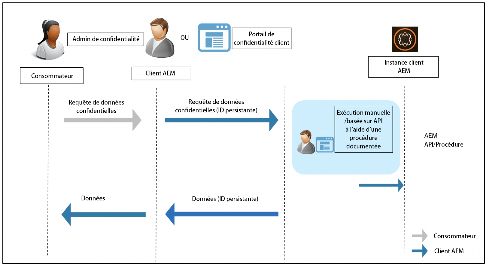

# Réglementation Adobe Experience Manager Readiness pour la protection des données et la confidentialité des données {#aem-readiness-for-data-protection-and-data-privacy-regulations}

>[!WARNING]
>
>Le contenu de ce document ne constitue pas un conseil juridique et ne se substitue pas à un conseil juridique.
>
>Veuillez consulter le service juridique de votre société pour obtenir des conseils sur les réglementations relatives à la protection des données et à la confidentialité des données.

>[!NOTE]
>
>Pour plus d&#39;informations sur la réponse des Adobes aux questions de confidentialité et sur ce que cela signifie pour vous en tant que client Adobe, consultez le Centre [de confidentialité des](https://www.adobe.com/privacy.html)Adobes.

Adobe fournit de la documentation et des procédures (avec des API lorsqu&#39;elles sont disponibles), pour que l&#39;administrateur de la protection des données des clients ou l&#39;administrateur de l&#39;AEM puisse traiter les demandes de protection des données et de confidentialité des données et aider nos clients à se conformer à ces règles. Les procédures documentées permettront aux clients d&#39;exécuter les demandes de réglementation manuellement ou en appelant les API, le cas échéant, à partir d&#39;un portail ou d&#39;un service externe.

>[!CAUTION]
>
>Les détails documentés ici sont limités à Adobe Experience Manager.
>
>Les données provenant d&#39;un autre service à la demande d&#39;Adobe, ainsi que toute demande de confidentialité connexe, exigeront que des mesures soient prises à l&#39;égard de ce service.
>
>Pour plus d&#39;informations, consultez le Centre [de confidentialité](https://www.adobe.com/privacy.html)des Adobes.

## Présentation {#introduction}

Les instances de Adobe Experience Manager, et les applications qui s&#39;exécutent sur elles, sont la propriété et l&#39;exploitation de nos clients.

En conséquence, les réglementations en matière de protection des données, telles que le RMPD, l&#39;ACCP et d&#39;autres, relèvent en grande partie de la responsabilité des clients.

En guise d&#39;introduction très brève, la réglementation relative à la protection et à la protection des données comporte de nouvelles règles qui seront suivies des rôles suivants :

* Entités commerciales (ACCP) et/ou contrôleurs de données (RMPD)

* prestataires (CCPA) et/ou processeurs de données (GDPR)

Les principales dispositions de ces règlements sont les suivantes :

1. Définition élargie des données à caractère personnel pour inclure tous les identifiants uniques ; comme dans les données directement et indirectement identifiables.

2. Renforcement des exigences en matière de consentement.

3. Accentuation des droits de suppression (effacement des données).

4. Exclusion de la vente de données.

Pour Adobe Experience Manager :

* Les instances et les applications qui s’exécutent sur elles sont détenues et exploitées par le client.

   * Cela signifie que le client gère efficacement les rôles de réglementation, notamment les entités commerciales et les Prestataires, le contrôleur de données et le processeur de données.

   * L’Adobe Experience Platform Privacy Service ne fera pas partie du processus d’AEM, comme illustré dans le diagramme ci-dessous.

* aem comprend la documentation et les procédures permettant à l&#39;administrateur de la protection des renseignements personnels du client et/ou à l&#39;administrateur AEM d&#39;exécuter les demandes de réglementation de la protection des renseignements personnels ; soit manuellement, soit par le biais d’API, si disponible.

* Aucun nouveau service ou interface utilisateur n&#39;a été ajouté.

   * En revanche, les procédures et les API sont documentées pour être utilisées par les interfaces utilisateur/portails client qui gèrent les demandes de réglementation de la confidentialité.

* aem n’inclut aucun outil prêt à l’emploi pour prendre en charge le processus de demande de confidentialité.

   * L&#39;Adobe fournira de la documentation et des procédures à l&#39;administrateur de la confidentialité du client et/ou à l&#39;administrateur AEM, leur permettant d&#39;exécuter manuellement les demandes liées à la réglementation sur la confidentialité.

Adobe fournit des procédures pour traiter les demandes de confidentialité liées à Access, Delete and Opt-Out for Adobe Experience Manager. Dans certains cas, des API peuvent être appelées à partir d’un portail développé par le client ou de scripts pour faciliter l’automatisation.

Le diagramme suivant illustre à quoi peut ressembler un processus de demande de confidentialité (illustré à l’aide de Adobe Experience Manager 6.5) :

## Adobe Experience Manager et préparation réglementaire {#aem-and-regulatory-readiness}

Consultez les sections ci-dessous pour obtenir de la documentation sur la réglementation des domaines d&#39;AEM des produits.

## AEM Foundation {#aem-foundation}

Voir [Traitement des demandes de protection des données et de confidentialité pour la Fondation](/help/sites-administering/handling-gdpr-requests-for-aem-platform.md)AEM.

## Souscription à la collecte de statistiques d’utilisation agrégées dans AEM {#aem-opting-into-aggregate-usage-statistics-collection}

Voir [Collecte de statistiques d’utilisation agrégées](/help/sites-deploying/opt-in-aggregated-usage-statistics.md).

## AEM Sites {#aem-sites}

Voir [AEM Sites - Protection des données et état de préparation à la confidentialité.](/help/sites-administering/gdpr-compliance-sites.md)

## AEM Commerce {#aem-commerce}

Reportez-vous à la page [AEM Commerce - Protection des données et état de préparation](/help/sites-administering/gdpr-compliance-commerce.md)à la confidentialité.

## AEM Mobile {#aem-mobile}

Voir [AEM Mobile - Protection des données et état de préparation](/help/mobile/aem-mobile-gdpr-compliance.md)à la confidentialité.

## Intégration d’AEM à Adobe Target et Analytics {#aem-integration-with-adobe-target-adobe-analytics}

Ces intégrations de Adobe Experience Manager s’inscrivent dans le cadre de services de protection des données et de protection de la vie privée (par exemple, RMMD ou ACCP). Aucune donnée personnelle provenant d&#39;Adobe Target ou d&#39;Adobe Analytics n&#39;est stockée en AEM par rapport aux intégrations.
Pour plus d’informations, voir :

* [Adobe Target - Présentation de la confidentialité](https://docs.adobe.com/content/help/en/target/using/implement-target/before-implement/privacy/privacy.html)

* [Processus de confidentialité des données Adobe Analytics](https://docs.adobe.com/content/help/en/analytics/admin/data-governance/an-gdpr-workflow.html)

## AEM Communities {#aem-communities}

AEM Communities accorde aux personnes concernées un droit sur la portabilité de leurs données, un droit à l’accès, ainsi qu’un droit à l’oubli à l’aide d’[API prêtes à l’emploi](/help/communities/user-ugc-management-service.md). Ces API permettent une suppression et une exportation en bloc du contenu généré par les utilisateurs, de même que la désactivation des comptes utilisateur identifiés par leur ID autorisable. Toutefois, la suppression définitive d’un compte utilisateur est réalisée par la suppression du nœud de l’utilisateur dans CRXDE Lite, ce qui satisfait la nécessité de disposer d’un moyen facile d’exclusion du système.

En outre, AEM Communities offre la confidentialité de par sa conception en raison de sa console de modération en masse, qui permet aux membres privilégiés de rechercher et de supprimer les contributions et les détails des utilisateurs. La console de gestion des membres permet une limitation pouvant aller jusqu’à l’interdiction d’un contributeur. De plus, elle permet aux personnes concernées de supprimer les contributions qu’elles ont écrites.

## AEM Forms {#aem-forms}

AEM Forms comprend des composants et des workflows qui capturent, traitent et stockent des données de manière à organiser les processus d’entreprise et à effectuer des transactions numériques. Les différents composants utilisent différents magasins de données et permettent également l’intégration avec des magasins de données personnalisés. La documentation suivante explique les procédures et les directives d’accès et de gestion des données utilisateur pour la protection des données et la protection de la vie privée (par exemple, RMMD ou ACCP) d’un composant.

* [Portail Formulaires](/help/forms/using/forms-portal-handling-user-data.md)
* [Correspondence Management](/help/forms/using/correspondence-management-handling-user-data.md)
* [Intégration à Adobe Sign](/help/forms/using/integration-adobe-sign-handling-user-data.md)
* [Workflows basés sur Forms sur OSGi](/help/forms/using/forms-workflow-osgi-handling-user-data.md)
* [Workflows Forms JEE](/help/forms/using/forms-workflow-jee-handling-user-data.md) (AEM Forms JEE uniquement)
* [Document Security](/help/forms/using/document-security-handling-user-data.md) (AEM Forms JEE uniquement)
* [User Management](/help/forms/using/user-management-handling-user-data.md) (AEM Forms JEE uniquement)
