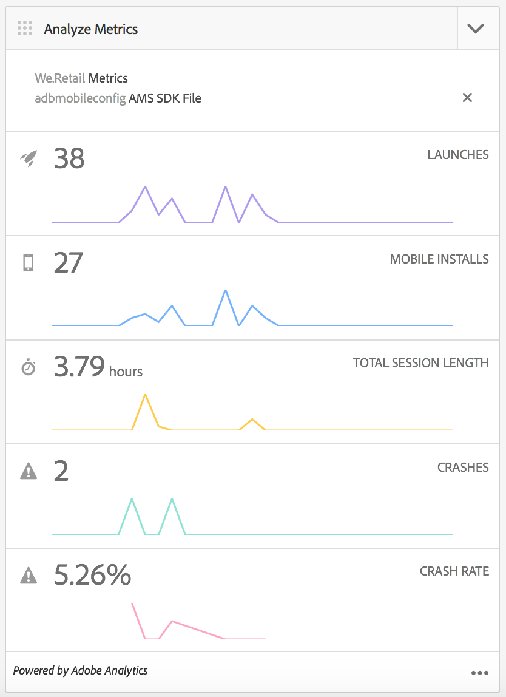

# Configuration de votre mot de Cloud Service Adobe Mobile Services {#configure-your-adobe-mobile-services-cloud-service}

{{ue-over-mobile}}

La **Mosaïque Mesures mobiles** du centre de commande fournit des analyses en temps réel pour votre application mobile.

Le SDK [Adobe Mobile Analytics](https://www.adobe.com/ca/solutions/digital-analytics/mobile-web-apps-analytics.html) est disponible via un plug-in PhoneGap. Les mesures sont collectées et mises en cache sur l’appareil jusqu’à la connexion de celui-ci. Les données sont ensuite transmises au cloud Mobile Services d’Adobe pour rapport et analyse.

Adobe Mobile Analytics SDK fournit les éléments suivants :

1. **Collecte de données pour les canaux mobiles** - Collectez des données complètes pour vos sites web et applications mobiles sur tous les principaux systèmes d’exploitation.
1. **Analyse de l’engagement mobile** - Comprenez l’engagement des utilisateurs dans votre application mobile, votre site web ou votre vidéo, y compris la fréquence à laquelle les consommateurs lancent le canal, s’ils y effectuent des achats, etc.
1. **Tableaux de bord et rapports des applications mobiles** - Obtenez des rapports d’utilisation qui incluent des mesures de cycle de vie pour vos applications et des mesures d’app store. Consultez les tendances pour les utilisateurs, les lancements, la durée de session moyenne, la durée de rétention et les blocages.
1. **Analyse des campagnes mobiles** - Quantifiez l’efficacité des campagnes spécifiques aux appareils mobiles telles que les SMS, les annonces de recherches mobiles, les annonces pour appareils mobiles et les codes QR.
1. **Analyse de géolocalisation** - Trouvez où les utilisateurs de votre application lancent et interagissent avec vos expériences mobiles par localisation GPS ou points ciblés.
1. **Analyse du cheminement** - Découvrez comment les utilisateurs naviguent dans votre application pour déterminer quels écrans et éléments d’interface interagissent avec les utilisateurs et lesquels provoquent le décrochage de ces derniers.

>[!CAUTION]
>
>La mosaïque **Analyser les mesures** s’affiche dans le tableau de bord uniquement si vous avez configuré les services cloud .

Mosaïque Mesures du centre de commande AEM

## Configuration du Cloud Service {#configuring-the-cloud-service}

Pour tirer parti d’Adobe Mobile Services Analytics, vous devez configurer le service AEM Mobile Analytics Cloud avec les informations de votre compte Adobe Analytics.

1. Cliquez sur l’icône en haut à droite pour ajouter ou modifier les Cloud Service de la mosaïque **Gérer les Cloud Service** du tableau de bord de l’application.

   

1. L’écran **Ajouter ou modifier des Cloud Service** s’affiche. Sélectionnez **Adobe Mobile Services** puis cliquez sur **Suivant**.

   

1. Sélectionnez une configuration existante dans la **Mobile Services** ou choisissez **Créer une configuration** pour en créer une.

   Pour une nouvelle configuration, saisissez le **Propriétés de Mobile Services**, puis cliquez sur **Vérifier**.

   

   Si les informations d’identification sont vérifiées, le bouton **Vérifier** devient **Vérifié**. Vous pouvez choisir une application de service mobile dans **Sélectionner un service d’application mobile**.

   Cliquez sur **Envoyer** pour configurer votre .

   

1. Une fois que vous avez configuré une configuration cloud, vous pouvez l’afficher dans votre tableau de bord.

   

   >[!NOTE]
   >
   >Une fois que vous avez configuré votre configuration cloud, vous pouvez afficher la mosaïque **Analyser les mesures** dans le tableau de bord de l’application.

   
