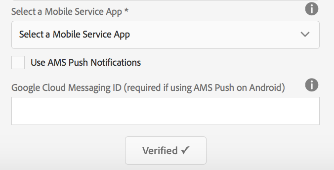

# Configuration de votre Cloud Service Mobile Services Adobe {#configure-your-adobe-mobile-services-cloud-service}

>[!NOTE]
>
>Adobe recommande d’utiliser l’éditeur SPA pour les projets nécessitant un rendu côté client, basé sur un framework, pour une application à une seule page (comme React). [En savoir plus](/help/sites-developing/spa-overview.md).

La variable **Mosaïque Mesures mobiles** sur le centre de commande fournit des analyses en temps réel pour votre application mobile.

La variable [Adobe Mobile Analytics](https://www.adobe.com/ca/solutions/digital-analytics/mobile-web-apps-analytics.html) Le SDK est rendu disponible par le biais d’un module externe PhoneGap. Les mesures sont collectées et mises en cache sur l’appareil jusqu’à ce que l’appareil soit connecté. Les données sont alors transmises à Adobe Mobile Services Cloud pour création de rapports et analyse.

Le SDK Adobe Mobile Analytics fournit les éléments suivants :

1. **Collecte de données pour les canaux mobiles** - collecter des données complètes pour vos sites web et applications mobiles sur tous les principaux systèmes d’exploitation ;
1. **Analyse de l&#39;engagement mobile** - Comprendre l’engagement des utilisateurs dans votre application mobile, votre site web ou votre vidéo, notamment la fréquence à laquelle les clients lancent le canal, s’ils effectuent des achats sur celui-ci, etc.
1. **Tableaux de bord et rapports d’applications mobiles** - Obtenez des rapports d’utilisation qui contiennent des mesures de cycle de vie pour vos applications et des mesures de boutique d’applications. Consultez les tendances pour les utilisateurs, les lancements, la durée de session moyenne, la durée de rétention et les blocages.
1. **Analyse de campagne mobile** - Quantifiez l’efficacité des campagnes spécifiques aux mobiles telles que les SMS, les annonces de recherche mobile, les annonces d’affichage mobile et les codes QR.
1. **Analyse de géolocalisation** - Déterminez où les utilisateurs de votre application lancent vos expériences mobiles et interagissent avec celles-ci par emplacement GPS ou points ciblés.
1. **Analyse du cheminement** - Découvrez comment les utilisateurs naviguent dans votre application pour déterminer les écrans et les éléments de l’interface utilisateur qui attirent les utilisateurs et qui provoquent l’abandon des utilisateurs.

>[!CAUTION]
>
>La variable **Analyse des mesures** La mosaïque s’affiche dans le tableau de bord, uniquement si vous avez configuré les services cloud.

AEM mosaïque Mesures du centre de commandes

## Configuration du Cloud Service {#configuring-the-cloud-service}

Pour tirer parti d’Adobe Mobile Services Analytics, vous devez configurer le service AEM Mobile Analytics Cloud avec les informations de votre compte Adobe Analytics.

1. Cliquez sur l’icône en haut à droite pour ajouter ou modifier les Cloud Service à partir du **Gestion des Cloud Service** du tableau de bord de l’application.

   

1. La variable **Ajout ou modification de Cloud Service** s’affiche. Sélectionner **Adobe Mobile Services** et cliquez sur **Suivant**.

   

1. Sélectionnez une configuration existante dans le **Mobile Services** ou choisissez **Créer une configuration** pour en créer un.

   Pour une nouvelle configuration, saisissez la variable **Propriétés Mobile Services** et cliquez sur **Vérifiez.**

   

   Si les informations d’identification sont vérifiées, la variable **Vérifier** modification du bouton **Vérifié**. Vous pouvez choisir une application de service mobile parmi **Sélection d’un service d’applications mobiles**.

   Cliquez sur **Envoyer** pour configurer votre configuration.

   

1. Une fois que vous avez configuré une configuration cloud, vous pouvez en afficher une dans votre tableau de bord.

   

   >[!NOTE]
   >
   >Une fois la configuration du cloud configurée, vous pouvez afficher la variable **Analyse des mesures** Mosaïque dans le tableau de bord de votre application.

   
