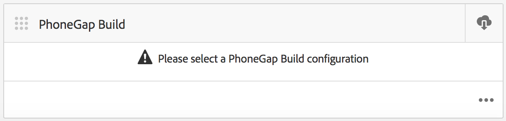

# Configuration de votre Cloud Service Adobe PhoneGap Build {#configure-your-adobe-phonegap-build-cloud-service}

>[!NOTE]
>
>Adobe recommande d’utiliser l’éditeur d’application d’une seule page (SPA) pour les projets nécessitant un rendu côté client basé sur la structure SPA (par exemple, React). [En savoir plus](/help/sites-developing/spa-overview.md).

Le **Mosaïque PhoneGap Build** Le tableau de bord de l’application permet de créer et de distribuer votre application mobile PhoneGap via le service Adobe PhoneGap Build.

Toutes les plateformes prises en charge définies dans la variable **Gérer l’application** La mosaïque sera créée avec le PhoneGap Build lors de l’envoi d’une version distante avec le **PhoneGap Build** Mosaïque.

Vous pouvez pousser une version distante vers `https://build.phonegap.com` ou télécharger la source à créer localement avec l’interface de ligne de commande PhoneGap à l’adresse `https://docs.phonegap.com/references/phonegap-cli/`.



## Configuration du Cloud Service {#configuring-the-cloud-service}

Pour tirer parti du PhoneGap Build, vous devez configurer le Cloud Service PhoneGap Build d’AEM avec les informations de votre compte PhoneGap Build.

Si vous ne possédez pas encore de compte, accédez à `https://build.phonegap.com` et inscrivez-vous ! Si vous disposez d’un abonnement Adobe Creative Cloud, vous pouvez prendre en charge jusqu’à 25 applications privées (applications non open source).

Une fois que vous avez vérifié que votre compte PhoneGap Build est principal, accédez à votre console AEM Cloud Management Console, en particulier à l’ [PhoneGap Build Cloud Service](http://localhost:4502/etc/cloudservices/phonegap-build.html) (http://localhost:4502/etc/cloudservices/phonegap-build.html).

Utilisez la variable **Gestion des Cloud Services** pour configurer une nouvelle configuration de service cloud.

### Utilisation de la mosaïque Gestion des Cloud Services {#using-manage-cloud-services-tile}

Avant de commencer à créer votre application à l’aide de **PhoneGap Build** , vous devez configurer vos services cloud à l’aide de la **Gestion des Cloud Services** à partir du tableau de bord AEM Mobile.

Pour configurer les services cloud pour votre application, procédez comme suit :

1. Cliquez sur dans le coin supérieur droit de la **Gestion des Cloud Services** mosaïque.

   

1. Choisir **PhoneGap Build** de l’option **Ajouter ou modifier un Cloud Service** écran.

   Cliquez sur **Suivant**.

   

1. Saisissez vos informations d’identification pour créer une configuration cloud.

   Une fois la vérification effectuée, cliquez sur **Envoyer**. Cette configuration de cloud configurée s’affiche désormais dans la variable **Gestion des Cloud Services** mosaïque.

   

### Création de votre application avec PhoneGap Build {#building-your-application-with-phonegap-build}

Une fois que vous avez configuré les services cloud, vous pouvez créer votre application avec **PhoneGap Build** mosaïque. Cliquez sur dans le coin supérieur droit pour choisir parmi les options **Créer à distance** ou **Source de téléchargement** options.


Pour appeler une version distante avec Adobe PhoneGap Build, cliquez sur **Créer à distance**.

>[!NOTE]
>
>Si la version échoue pour une raison quelconque (l’icône rouge iOS ci-dessous indique que la plateforme a échoué), vous pouvez pointer sur l’icône pour obtenir le message d’erreur. Vous pouvez également cliquer sur le point triple &quot;...&quot;. au bas de la mosaïque pour accéder directement à `https://build.phonegap.com` (vous devez vous authentifier), puis regarder et gérer directement votre version.

### Création de votre application avec l’interface de ligne de commande PhoneGap {#building-your-application-with-phonegap-cli}

PhoneGap fournit une interface de ligne de commande pour créer votre application localement.

Compilez l’application PhoneGap sur votre ordinateur à l’aide de l’interface de ligne de commande PhoneGap (CLI). Pour inclure le contenu AEM dans votre application, AEM crée un fichier ZIP qui contient le contenu de votre application mobile, les configurations de synchronisation de contenu et d’autres ressources requises. Téléchargez le fichier ZIP et incluez-le dans votre version.

Pour tirer parti de l’interface de ligne de commande de PhoneGap, vous devez configurer votre environnement local afin d’inclure :

1. SDK Platform (iOS, Android, Windows Phone, etc.) et,
1. Interface de ligne de commande de PhoneGap

Vous pouvez en lire plus ici : `https://docs.phonegap.com/references/phonegap-cli/`.

Une fois que vous avez installé les conditions préalables requises, effectuez un test simple en créant une application simple et en l’exécutant dans votre simulateur ou mieux encore sur votre appareil, à partir d’une tentative de terminal :

```xml
phonegap create myApp
cd myApp
phonegap run ios (or android, ...)
```

>[!NOTE]
>
>add —emulate à la fin de cette ligne si vous ne souhaitez pas l’exécuter sur votre appareil connecté.

Une fois que vous avez vérifié que les éléments ci-dessus fonctionnent, utilisez la variable **PhoneGap Build** Mosaïque pour **Source de téléchargement**. Enregistrez le fichier et décompressez-le sur votre système local. Une fois cette opération effectuée :

* accéder à ce fichier enregistré (dossier) ;
* run &#39;phonegap run ios&#39; (ou android, etc.)

### Ressources supplémentaires {#additional-resources}

Pour en savoir plus sur les rôles et les responsabilités d’un auteur et d’un développeur, consultez les ressources ci-dessous :

* [Développement pour Adobe PhoneGap Enterprise avec AEM](/help/mobile/developing-in-phonegap.md)
* [Création pour Adobe PhoneGap Enterprise dans AEM](/help/mobile/phonegap.md)
