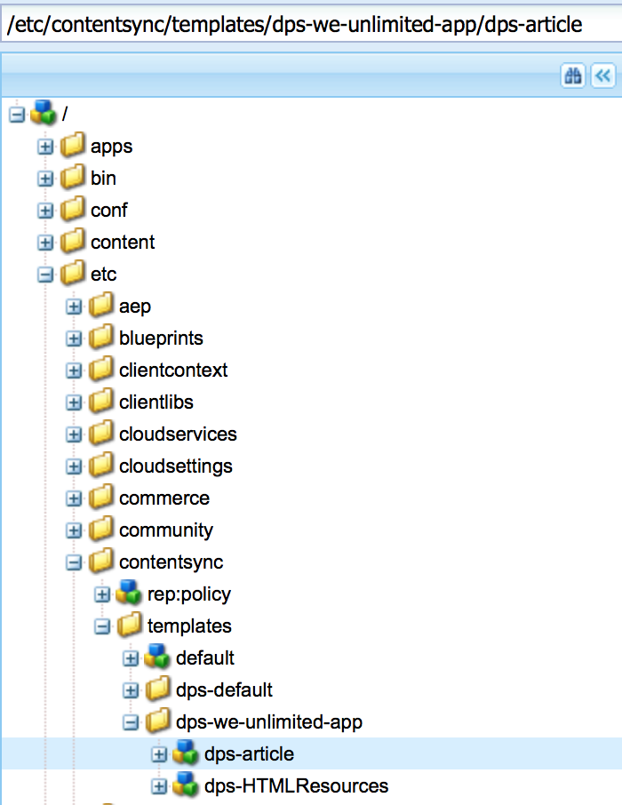

# Création d’une configuration d’exportation d’article{#creating-article-export-configuration}

>[!NOTE]
>
>Adobe recommande d’utiliser l’éditeur d’application d’une seule page (SPA) pour les projets nécessitant un rendu côté client basé sur la structure SPA (par exemple, React). [En savoir plus](/help/sites-developing/spa-overview.md).

>[!CAUTION]
>
>**Prérequis**:
>
>Avant d’en savoir plus sur la création et la modification de ressources partagées, voir [Synchronisation du contenu](/help/mobile/mobile-ondemand-contentsync.md) pour comprendre les concepts de base.

Les utilisateurs d’AEM Mobile utilisent la synchronisation de contenu pour exporter du contenu en direct vers du contenu statique en vue de l’utiliser dans les applications mobiles. Cet export se produit lorsque le contenu est chargé vers Mobile On Demand Services à partir d’AEM Mobile.

La propriété ***dps-exportTemplate*** mentionnée dans le tableau ci-dessus définit le chemin d’accès aux configurations d’exportation de l’application. Définissez cette propriété pour créer et modifier des ressources partagées.

Les ressources suivantes décrivent l’exportation de contenu d’Adobe Experience Manager (AEM) en vue d’un transfert vers AEM Mobile.

Les articles contiennent du contenu qui doit être exporté et chargé. Une partie de ce contenu peut être partagée entre les articles.

Utilisez [ContentSync](/help/mobile/mobile-ondemand-contentsync.md) pour rassembler le contenu et créer un module ***Ressources partagées***.

La configuration ContentSync de **&lt;dps-exportTemplate>/dps-article>** doit être configurée pour exporter tout le contenu nécessaire au rendu statique des propriétés sur l’appareil.

>[!CAUTION]
>
>Vous pouvez effectuer les étapes ci-dessous pour afficher les exemples de ressources partagées, uniquement si vous disposez des éléments suivants :
>
>* installation de l’exemple de contenu
>* exécution de l’instance AEM
>* aucun contexte personnalisé configuré ou port différent

>

Pour afficher un exemple de ressource partagée, procédez comme suit :

1. Ouvrez le CRXDE Lite sur votre serveur AEM.
1. Accédez à ce chemin [/etc/contentsync/templates/dps-we-unlimited-app/dps-article](http://localhost:4502/crx/de/index.jsp#/etc/contentsync/templates/dps-we-unlimited-app/dps-article), pour afficher les exemples de ressources partagées.

   Vous pouvez afficher toutes les propriétés requises pour créer vos ressources partagées, comme illustré dans la figure ci-dessous :

   

>[!NOTE]
>
>Les articles doivent être transférés ou exportés vers AEM Mobile On-demand Services lorsqu’un contenu d’article change.
