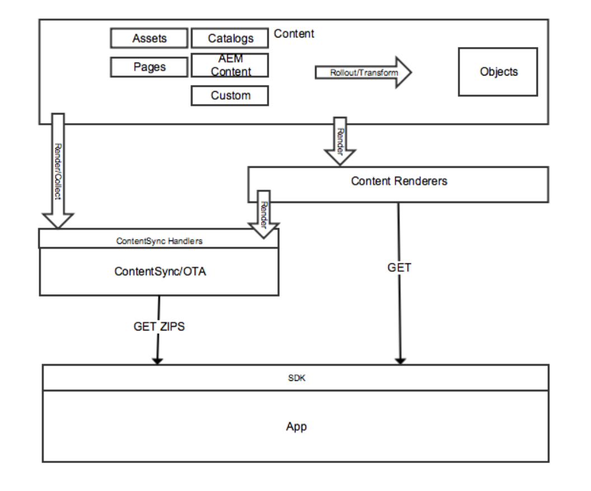

# Diffusion de contenu{#content-delivery}

>[!NOTE]
>
>Adobe recommande d’utiliser l’éditeur d’application d’une seule page (SPA) pour les projets nécessitant un rendu côté client basé sur la structure SPA (par exemple, React). [En savoir plus](/help/sites-developing/spa-overview.md).

Les applications mobiles doivent pouvoir utiliser tout le contenu d’AEM si nécessaire pour offrir l’expérience de l’application ciblée.

Cela inclut l’utilisation de ressources, de contenu de site, de contenu CaS (en direct) et de contenu personnalisé pouvant avoir sa propre structure.

>[!NOTE]
>
>**Le** contenu en direct peut provenir de n’importe lequel des éléments ci-dessus via les gestionnaires ContentSync . Il peut être utilisé pour le lot et la diffusion via des fichiers ZIP, ainsi que pour gérer les mises à jour de ces packages.

Content Services fournit trois types principaux de contenu :

1. **Ressources**
1. **Contenu HTML compressé (HTML/CSS/JS)**
1. **Contenu indépendant des canaux**

## Assets {#assets}

Les collections de ressources sont des éléments AEM qui contiennent des références à d’autres collections.

Une collection de ressources peut être exposée via Content Services. L’appel d’une collection de ressources dans une requête renvoie un objet qui est une liste des ressources, y compris leurs URL. Les ressources sont accessibles via une URL. L’URL est fournie dans un objet . Par exemple :

* Une entité de page renvoie un objet JSON (objet de page) qui comprend une référence d’image. La référence d’image est une URL utilisée pour obtenir le binaire de ressource de l’image.
* Une demande de liste de ressources dans un dossier renvoie JSON avec des détails sur toutes les entités contenues dans ce dossier. Cette liste est un objet. Le fichier JSON comporte des références d’URL qui sont utilisées pour obtenir le binaire de ressource pour chaque ressource de ce dossier.

### Optimisation des ressources {#asset-optimization}

L’une des principales valeurs de Content Services est la possibilité de renvoyer des ressources optimisées pour l’appareil. Cela réduit les besoins de stockage de l’appareil local et améliore les performances de l’application.

L’optimisation des ressources sera une fonction côté serveur, basée sur les informations fournies dans la requête API. Dans la mesure du possible, les rendus de ressource doivent être mis en cache afin que des requêtes similaires ne nécessitent pas une nouvelle génération du rendu de ressource.

### Processus des ressources {#assets-workflow}

Le workflow de la ressource est le suivant :

1. Référence des ressources disponible dans AEM prêtes à l’emploi
1. Créer une entité de référence de ressource selon son modèle
1. Modifier l’entité

   1. Sélectionner une ressource ou collection de ressources
   1. Personnalisation du rendu JSON

Le diagramme suivant présente le **Workflow de référence des ressources** :

### Gestion des ressources {#managing-assets}

Content Services permet d’accéder à AEM ressources gérées qui ne peuvent pas être référencées par le biais d’un autre contenu AEM.

#### Ressources gérées existantes {#existing-managed-assets}

Un utilisateur d’AEM Sites et d’Assets existant utilise AEM Assets pour gérer l’ensemble de son matériel numérique pour tous les canaux. Ils développent une application mobile native et doivent utiliser plusieurs ressources gérées par AEM Assets. Par exemple logos, images d&#39;arrière-plan, icônes de bouton, etc.

Actuellement, elles sont réparties dans le référentiel Assets. Les fichiers que l’application doit référencer sont les suivants :

* /content/dam/geometrixx-outdoors/brand/logo_light.png
* /content/dam/geometrixx-outdoors/brand/logo_dark.png
* /content/dam/geometrixx-outdoors/styles/backgrounds/grey_blue.jpg
* /content/dam/geometrixx-outdoors/brand/icons/app/cart.png
* /content/dam/geometrixx-outdoors/brand/icons/app/home.png

#### Accès aux entités de ressources CS {#accessing-cs-asset-entities}

Mettons de côté les étapes de mise à disposition de la page par le biais de l’API pour l’instant (elle sera couverte par la description de l’interface utilisateur d’AEM) et supposons qu’elle ait été effectuée. Les entités de ressources ont été créées et ajoutées à l’espace &quot;appImages&quot;. D’autres dossiers ont été créés sous l’espace à des fins d’organisation. Ainsi, les entités de ressources sont stockées dans le JCR AEM comme suit :

* /content/entities/appImages/logos/logo_light
* /content/entities/appImages/logos/logo_dark
* /content/entities/appImages/bkgnd/dark_blue
* /content/entities/appImages/icons/cart
* /content/entities/appImages/icons/home

#### Obtention d’une liste des entités de ressources disponibles {#getting-a-list-of-available-asset-entities}

Un développeur d’applications peut obtenir une liste des ressources disponibles en récupérant les entités de ressources. Le point d’entrée de l’espace Content Services peut fournir ces informations par le biais du SDK de l’API du service Web.

Le résultat serait un objet au format JSON qui fournirait une liste des ressources du dossier &quot;icons&quot;.

#### Obtention d’une image {#getting-an-image}

Le fichier JSON fournit une URL pour chaque image, générée par Content Services à l’image.

Pour obtenir le binaire de l’image &quot;panier&quot;, la bibliothèque cliente est de nouveau utilisée.

## Contenu HTML compressé {#packaged-html-content}

Le contenu HTML est nécessaire pour les clients qui doivent conserver la mise en page du contenu. Cela s’avère utile pour les applications natives qui utilisent un conteneur web (un affichage web Cordova, par exemple) pour afficher le contenu.

AEM Content Services pourra fournir du contenu HTML à l’application mobile via l’API. Les clients qui souhaitent exposer AEM contenu au format HTML créent une entité de page HTML pointant vers la source de contenu AEM.

Les options suivantes sont prises en compte :

* **Fichier zip :** pour avoir la meilleure chance de s’afficher correctement sur l’appareil, tous les éléments de la page référencés (css, JavaScript, ressources, etc.). - sera inclus dans un seul fichier compressé avec la réponse . Les références dans la page HTML seront ajustées afin d’utiliser un chemin relatif vers ces fichiers.
* **Diffusion en continu :** Obtention d’un manifeste des fichiers requis à partir d’AEM. Utilisez ensuite ce manifeste pour demander tous les fichiers (HTML, CSS, JS, etc.) avec les requêtes suivantes.

## Contenu indépendant des canaux {#channel-independent-content}

Le contenu indépendant d’un canal est un moyen d’exposer les éléments de contenu AEM, tels que les pages, sans se soucier de la mise en page, des composants ou d’autres informations spécifiques à un canal.

Ces entités de contenu sont générées à l’aide d’un modèle de contenu afin de traduire les structures AEM au format JSON. Les données JSON résultantes contiennent des informations sur les données du contenu, qui sont découplées du référentiel AEM. Cela inclut le renvoi de métadonnées et de liens de référence d’AEM aux ressources, ainsi que les relations entre les structures de contenu, y compris la hiérarchie des entités.

### Gestion du contenu indépendant du canal {#managing-channel-independent-content}

Le contenu peut accéder à l’application de plusieurs façons.

1. ZIPS de contenu GET via AEM en vol

   * Les gestionnaires de synchronisation de contenu peuvent mettre à jour directement le package zip ou en appelant les rendus de contenu existants.

      * Gestionnaires de plateformes
      * Gestionnaires AEM
      * Gestionnaires personnalisés

1. GET du contenu directement via les moteurs de rendu de contenu

   * Rendu Sling par défaut prêt à l’emploi
   * Rendu de contenu AEM Mobile/Content Services
   * Rendu personnalisé
