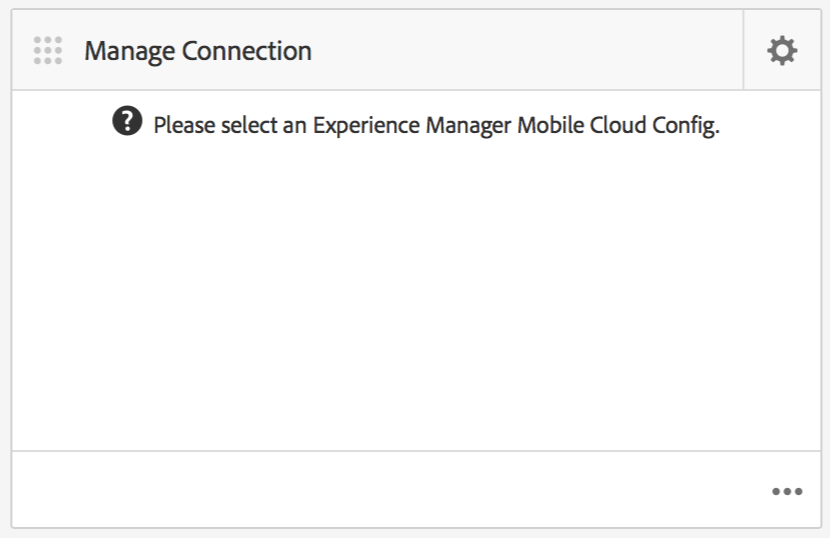

# tableau de bord d’application AEM Mobile {#aem-mobile-application-dashboard}

>[!NOTE]
>
>Adobe recommande d’utiliser l’éditeur d’application d’une seule page (SPA) pour les projets nécessitant un rendu côté client basé sur la structure SPA (par exemple, React). [En savoir plus](/help/sites-developing/spa-overview.md).

Vous pouvez gérer le contenu de votre application et de votre application mobile depuis AEM Mobile Application Tableau de bord ou Control Center.

Vous pouvez passer en revue chaque mosaïque du Centre de contrôle pour afficher ou modifier ses détails en cliquant sur « … » dans le coin inférieur droit.

>[!NOTE]
>
>Vous pouvez réorganiser l’ordre des mosaïques en cliquant sur l’icône de saisie de la mosaïque (en haut à gauche, 9 points). La modification de l’ordre est propre à l’utilisateur, différente pour les utilisateurs individuels.

La gestion du contenu d’une application requiert un effort collectif des développeurs, des auteurs de contenu et des administrateurs. Les auteurs manipulent les pages, qui sont à leur tour basées sur les modèles et les composants générés par les développeurs d’applications.

Enfin, les administrateurs publient stratégiquement le contenu de l’application mis à jour.

## Mosaïque Gestion de l’application {#the-manage-app-tile}

La mosaïque **Gérer l’application** affiche les informations d’application disponibles :

* Titre
* Description
* Icône
* Dernière modification
* Dernière modification par

## Mosaïque Gérer la connexion {#the-manage-connection-tile}

La mosaïque **Gérer la connexion** affiche les informations de connexion AEM Mobile On-demand Services :

* Nom de la configuration de l’outil
* Nom et ID du projet
* État de la connexion

>[!NOTE]
>
>Cliquez sur l&#39;engrenage en haut à droite pour configurer une configuration Mobile On-Demand Cloud.
>
>Voir [Configuration des services à la demande mobiles](/help/mobile/mobile-on-demand-associating-an-on-demand-app-to-cloud-configuration.md) pour plus d&#39;informations.

## Gestion des entités {#managing-entities}

Ces trois mosaïques offrent un aperçu de l’état du contenu d’une application :

* **bannières**
* **articles**
* **collections**

Chaque mosaïque peut être développée pour fournir une vue de liste plus détaillée en cliquant sur les points de suspension (...) dans le coin inférieur droit. Ces vues de liste offrent un autre moyen d&#39;accéder aux actions courantes de Mobile On Demand telles que la suppression, le téléchargement et la modification des propriétés.

### Mosaïque Gérer les bannières {#the-manage-banners-tile}

La mosaïque **Gérer les bannières** vous permet de gérer le contenu d&#39;une bannière. Les informations suivantes s’affichent pour une bannière :

* image
* **TITRE** : nom de la bannière
* **MODIFIÉ** : dernière modification dans AEM
* **TÉLÉCHARGÉ** : dernier téléchargé depuis AEM
* **PUBLIÉ** : dernier formulaire de demande publié AEM
* **SOURCE** : source (AEM local ou distant depuis Mobile On Demand)

L’image suivante présente la mosaïque **Gérer les bannières** dans le Tableau de bord d’application AEM Mobile :

>[!NOTE]
>
>Voir **[Gestion des bannières](/help/mobile/mobile-on-demand-managing-banners.md)** pour la création, la suppression ou la mise à jour des bannières.

### Mosaïque Gérer les articles {#the-manage-articles-tile}

La mosaïque **Gérer les articles** vous permet de gérer le contenu d’un article. Les informations suivantes s’affichent pour un article :

* image
* **TITRE** : nom de l’article
* **MODIFIÉ** : dernière modification dans AEM
* **TÉLÉCHARGÉ** : dernier téléchargé depuis AEM
* **PUBLIÉ** : dernier formulaire de demande publié AEM
* **SOURCE** : source (AEM local ou distant depuis Mobile On-Demand)

L’image suivante présente la mosaïque **Gérer les articles** dans le Tableau de bord d’application AEM Mobile :

>[!NOTE]
>
>Voir [**Gestion des articles**](/help/mobile/mobile-on-demand-managing-articles.md) pour créer, supprimer ou mettre à jour les articles.

### Mosaïque Gérer les collections {#the-manage-collections-tile}

La mosaïque **Gérer les collections** vous permet de gérer le contenu d’une collection. Les informations suivantes s’affichent pour une collection :

* image
* **TITRE** : nom de la collection
* **MODIFIÉ** : dernière modification dans AEM
* **TÉLÉCHARGÉ** : dernier téléchargé depuis AEM
* **PUBLIÉ** : dernier formulaire de demande publié AEM
* **SOURCE** : source (AEM local ou distant depuis Mobile On-Demand)

L’image suivante présente la mosaïque **Gérer les collections** dans le Tableau de bord d’application AEM Mobile :

>[!NOTE]
>
>Voir **[Gestion des collections](/help/mobile/mobile-on-demand-managing-collections.md)** pour créer, supprimer ou mettre à jour les collections.

### Étapes suivantes {#the-next-steps}

Une fois que vous connaissez le tableau de bord d’applications, consultez les ressources suivantes pour créer une application mobile :

* [Actions de création et de configuration d’application](/help/mobile/mobile-apps-ondemand-application-create-configure-action.md)
* [Association d’une application à la demande à une configuration de cloud](/help/mobile/mobile-on-demand-associating-an-on-demand-app-to-cloud-configuration.md)
* [Actions de gestion de contenu](/help/mobile/mobile-apps-ondemand-manage-content-ondemand.md)

### Ressources supplémentaires {#additional-resources}

Pour en savoir plus sur les rôles et les responsabilités d’un administrateur et d’un développeur, consultez les ressources ci-dessous :

* [Développement de contenu AEM pour AEM Mobile On-demand Services](/help/mobile/aem-mobile-on-demand.md)
* [Administration du contenu à utiliser AEM Mobile On-demand Services](/help/mobile/aem-mobile.md)

