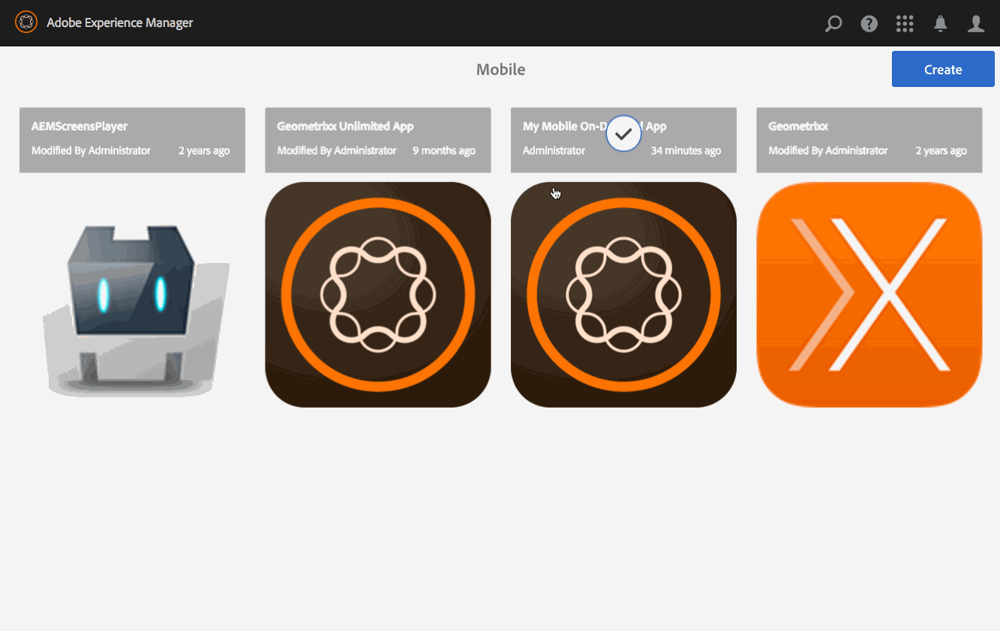

# Gestion des articles{#managing-articles}

{{ue-over-mobile}}

Les actions de gestion de contenu sont les blocs de création qui permettent de créer et de gérer des articles dans une application. Les actions suivantes sont effectuées sur les articles dans l’application.

## Présentation des articles {#articles-overview}

Les articles représentent le texte basé avec l&#39;art pour transmettre l&#39;information.

>[!NOTE]
>
>Consultez les ressources suivantes de l’aide en ligne pour en savoir plus sur les rubriques suivantes des applications AEM Mobile :
>
>* [Considérations de conception](https://helpx.adobe.com/digital-publishing-solution/help/design-app.html)
>
>* [Gestion des articles](https://helpx.adobe.com/digital-publishing-solution/help/creating-articles.html)
>

## Création d’un article {#creating-an-article}

Le workflow général de création d’un article est le suivant :

1. Sélectionnez **Mobile** dans le rail latéral.
1. Dans Mobile, choisissez votre application Mobile On-Demand dans le catalogue.
1. Cliquez sur la flèche vers le bas située dans le coin supérieur droit de la mosaïque **Gérer les articles**.
1. Choisissez un modèle d&#39;article et cliquez sur **Suivant**.
1. Parcourez chaque étape de l’assistant pour continuer à créer votre article.
1. Une fois prêt, cliquez sur **Créer**.
1. Votre nouvel article apparaît dans la mosaïque **Gérer les articles**.

## Importer un nouvel article {#importing-a-new-article}

Le contenu Mobile On-Demand existant peut être téléchargé (importé) depuis Mobile On-Demand vers AEM. Cela permet la modification et l’affichage de contenu local.

>[!NOTE]
>
>L’importation n’inclut pas les images.

Workflow pour importer un nouvel article

1. Dans Mobile, choisissez l’application Mobile On-Demand dans le catalogue.
1. Cliquez sur la flèche vers le bas située dans le coin supérieur droit de la mosaïque **Gérer les articles** et sélectionnez Importer des articles.
1. Cliquez sur **Importer des articles** dans la boîte de dialogue, puis sur Fermer.
1. Vos articles Mobile On-Demand apparaissent maintenant dans la mosaïque **Gérer les articles**.

>[!CAUTION]
>
>Associez d’abord une connexion Mobile On-Demand.

## Modification d’un article {#editing-an-article}

Utilisez l’éditeur AEM intégré par glisser-déposer pour ajouter ou modifier un article. Il est possible d’ajouter ou de supprimer des composants tels que du texte et des images. Vous pouvez insérer des images depuis DAM Assets.

>[!CAUTION]
>
>Seuls les articles créés dans AEM peuvent être ouverts dans l’éditeur.

Workflow de modification d’un article :

1. Dans Mobile, choisissez votre application Mobile On-Demand dans le catalogue.
1. Sélectionnez un article d’origine AEM dans la mosaïque **Gérer les articles**.
1. Cliquez sur l’article en surbrillance dans la vue Liste pour l’ouvrir dans l’éditeur de contenu.
1. Utilisez l’éditeur de contenu pour faire glisser le contenu de l’article (manuscrits, images, texte, etc.).

### Affichage et modification des métadonnées dans un article {#viewing-and-editing-the-metadata-within-an-article}

Le contenu tel que les articles, les bannières, etc., possède de nombreuses propriétés telles que des titres, des descriptions, des images. Cette action permet d’afficher et de modifier ces propriétés. Ces modifications peuvent éventuellement être chargées sur Mobile On-Demand lors de l’enregistrement.

Workflow général d’affichage/de modification d’un article :

1. Dans Mobile, choisissez votre application Mobile On-Demand dans le catalogue.
1. Sélectionnez un article dans la mosaïque **Gérer les articles**.

1. Sélectionnez **Afficher les propriétés** dans la barre d’actions.
1. Affichez toutes les métadonnées disponibles pour cet article.
1. Modifiez les métadonnées si vous le souhaitez et cliquez sur **Enregistrer** lorsque vous avez terminé.
1. Vous pouvez éventuellement charger immédiatement les modifications dans Mobile On-Demand.

## Chargement d’un article {#uploading-an-article}

L’action de chargement copie le contenu sélectionné et l’ajoute à un projet Mobile On-Demand. Le contenu Mobile On-Demand existant est remplacé par la nouvelle version.

Workflow général de chargement d’un article :

1. Dans **Mobile**, choisissez l’application Mobile On-Demand dans le catalogue.
1. Dans le volet **Gérer les articles**, sélectionnez un article à charger sur Mobile On-Demand.
1. Ajoutez d’autres articles, le cas échéant, dans la vue Liste.
1. Sélectionnez **Télécharger** dans la barre d’actions, puis cliquez sur Télécharger dans la boîte de dialogue.
1. Votre ou vos articles sont maintenant chargés sur Mobile On-Demand.

## Suppression d’un article {#deleting-an-article}

Cette opération supprime le contenu sélectionné de Mobile On-Demand et, éventuellement, de l’instance AEM locale.

Workflow général de suppression d’un article :

1. Dans Mobile, choisissez votre application Mobile On-Demand dans le catalogue.
1. Sélectionnez l’article à supprimer dans la mosaïque **Gérer les articles**.
1. Assurez-vous qu’il est sélectionné dans la liste. Sélectionnez d’autres éléments à supprimer selon vos besoins.
1. Cliquez sur **Supprimer** dans la barre d’actions.
1. Cochez cette case si vous souhaitez supprimer d’AEM et Mobile On-Demand.
1. Cliquez sur **Supprimer**.
1. Votre article est maintenant supprimé de la liste.

### Les étapes suivantes {#the-next-steps}

Une fois que vous en savez plus sur la gestion des articles, consultez

* [Gestion des bannières](/help/mobile/mobile-on-demand-managing-banners.md)
* [Gestion des collections](/help/mobile/mobile-on-demand-managing-collections.md)
* [Chargement des ressources partagées](/help/mobile/mobile-on-demand-shared-resources.md)
* [Publication/dépublication du contenu](/help/mobile/mobile-on-demand-publishing-unpublishing.md)
* [Aperçu avec contrôle en amont](/help/mobile/aem-mobile-manage-ondemand-services.md)
