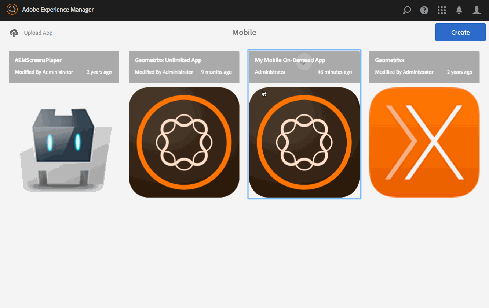

# Publier un contenu non publié{#publish-unpublish-content}

>[!NOTE]
>
>Adobe recommande d’utiliser l’éditeur d’application d’une seule page (SPA) pour les projets nécessitant un rendu côté client basé sur la structure SPA (par exemple, React). [En savoir plus](/help/sites-developing/spa-overview.md).

Une fois que vous êtes familiarisé avec les actions de gestion de contenu sur les articles, les bannières et les collections, vous pouvez publier votre contenu. Vous pouvez également annuler la publication de votre contenu.

>[!NOTE]
>
>Pour en savoir plus sur les considérations de conception pour les applications AEM Mobile, reportez-vous à la section Considérations relatives à la [conception pour les applications](https://helpx.adobe.com/digital-publishing-solution/help/design-app.html) AEM Mobile dans l&#39;aide en ligne.

## Publication/annulation de publication du contenu {#publishing-unpublishing-the-content}

Ceci diffère d’une publication AEM. Nous ne publions pas de contenu sur une instance de serveur AEM Publish pour le rendre public. Ici, nous informons Mobile On-Demand que le contenu sélectionné doit être rendu public dans l&#39;application Mobile On-Demand en direct.

>[!NOTE]
>
>Le contenu doit être téléchargé sur Mobile On-Demand avant d’être publié.

Flux général de publication/annulation de publication d’un article :

1. Dans Mobile, sélectionnez votre application Mobile On-Demand dans le catalogue.
1. Sélectionnez un article.
1. Si nécessaire, Ajoutez d’autres articles à partir de la vue de liste.
1. Sélectionnez Publier dans la barre d’actions. Après quelques instants, vos articles seront maintenant publics.
1. Suivez les mêmes étapes ci-dessus pour annuler la publication d’articles.

<!-- FAIL >>[!NOTE]
>
>Generally, you should preflight before publishing. See [Previewing with Preflight](/content/docs/en/aem/6-3/administer/mobile-apps/aem-mobile/previewing-with-preflight-on-demand-services.md) for more details.-->

### Étapes suivantes {#the-next-steps}

Une fois que vous avez appris à créer et à publier du contenu, reportez-vous à la section

* [Développement de contenu AEM pour AEM Mobile On-demand Services](/help/mobile/aem-mobile-on-demand.md)
* [Administration du contenu à utiliser AEM Mobile On-demand Services](/help/mobile/aem-mobile.md)

Ou encore, vous devez vous familiariser avec les rubriques de création, voir

[Création de contenu AEM pour les applications AEM Mobile On-demand Services](/help/mobile/mobile-apps-ondemand.md)
