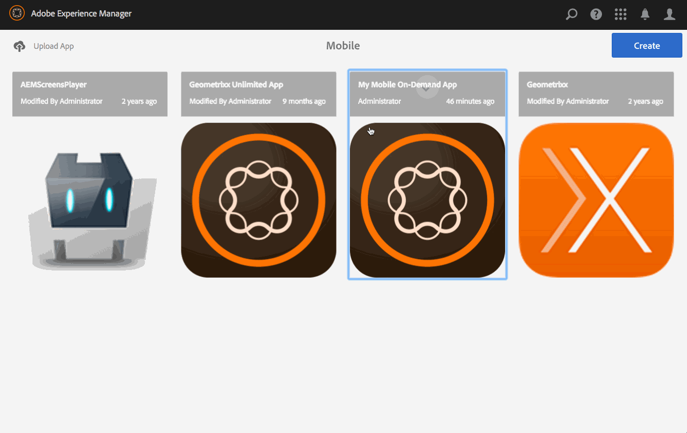

# Publier/Dépublier le contenu{#publish-unpublish-content}

{{ue-over-mobile}}

Une fois que vous êtes familiarisé avec les actions de gestion de contenu sur les articles, les bannières et les collections, vous pouvez publier votre contenu. Vous pouvez également dépublier votre contenu.

>[!NOTE]
>
>Pour en savoir plus sur les considérations de conception des applications AEM Mobile, consultez [Considérations de conception des applications AEM Mobile](https://helpx.adobe.com/fr/digital-publishing-solution/help/aem-mobile-end-of-life-faq.html) dans l’aide en ligne.

## Publication/dépublication du contenu {#publishing-unpublishing-the-content}

Cela diffère d’une « publication AEM ». Vous ne poussez pas le contenu vers une instance de serveur de publication AEM pour le rendre visible publiquement. Ici, vous informez Mobile On-Demand que le contenu sélectionné doit être rendu public dans l’application mobile On-Demand active.

>[!NOTE]
>
>Le contenu doit être chargé sur Mobile On-Demand avant de pouvoir être publié.

Workflow général de publication/dépublication d’un article :

1. Dans Mobile, choisissez votre application Mobile On-Demand dans le catalogue.
1. Sélectionnez un article.
1. Ajoutez des articles supplémentaires, le cas échéant, dans la vue Liste.
1. Sélectionnez Publier dans la barre d’actions. Après quelques instants, vos articles seront maintenant publics.
1. Suivez les mêmes étapes ci-dessus pour Dépublier des articles.

<!--
FAIL >>[!NOTE]
>
>Generally, you should preflight before publishing. See [Previewing with Preflight](/content/docs/en/aem/6-3/administer/mobile-apps/aem-mobile/previewing-with-preflight-on-demand-services.md) for more details.
-->

### Les étapes suivantes {#the-next-steps}

Une fois que vous avez appris à créer et publier du contenu, reportez-vous aux sections suivantes :

* [Développement de contenu AEM pour AEM Mobile On-demand Services](/help/mobile/aem-mobile-on-demand.md)
* [Administration de contenu pour utiliser AEM Mobile On-demand Services](/help/mobile/aem-mobile.md)

Ou, si vous souhaitez toujours en savoir plus sur les rubriques de création, voir [Création de contenu AEM pour les applications AEM Mobile On-demand Services](/help/mobile/mobile-apps-ondemand.md).
