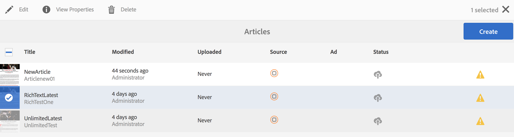

# Création et ajout de modèles et de composants {#creating-and-adding-templates-and-components}

>[!NOTE]
>
>Adobe recommande d’utiliser l’éditeur d’application d’une seule page (SPA) pour les projets nécessitant un rendu côté client basé sur la structure SPA (par exemple, React). [En savoir plus](/help/sites-developing/spa-overview.md).

AEM Mobile On-Demand fournit un modèle d’application entièrement configuré, un modèle d’article et des composants d’article.

L’application We.Unlimited est un exemple de modèle représentant le shell d’une application AEM Mobile On-Demand entièrement configurable et gérable.

Lorsque vous sélectionnez cet exemple de modèle lors de la création d’une application, un tableau de bord riche en fonctionnalités AEM Mobile est fourni.

>[!NOTE]
>
>Pour gérer le contenu de votre application et de votre application mobile à partir du Centre de contrôle des applications AEM Mobile, voir [Tableau de bord de l’application AEM Mobile](/help/mobile/mobile-apps-ondemand-application-dashboard.md).

## Création de modèles d’application {#creating-app-templates}

Un modèle d’application est utilisé pour créer une application et agit comme un ensemble de modèles de page et de composants qui représentent une base ou une base d’application. Le modèle estampe certaines propriétés fondamentales pour diriger l’application de la manière appropriée. En règle générale, un client ne créerait pas trop d’applications au total.

Les modèles d’application offrent un moyen simple d’exploiter les conceptions existantes créées par les développeurs, utilisées pour créer de nouvelles applications dans AEM.

Lors de la création d’une application basée sur le modèle d’une autre application, vous obtenez une application dont le point de départ est représentatif de l’application à partir de laquelle elle a été créée.

Procédure de création d’une application basée sur un modèle d’application :

1. Accédez au catalogue d’applications AEM Mobile : *&lt;server-url>/aem/apps.html/content/mobileapps*
1. Sélectionnez **Créer** —> **Application** comme illustré ci-dessous.

Une fois que vous avez créé une application à l’aide de ce modèle, vous pouvez ajouter des articles, des bannières et des collections à votre application. Pour revoir la création d’articles, de bannières et de collections, voir [Actions de gestion de contenu](/help/mobile/mobile-apps-ondemand-manage-content-ondemand.md).

>[!NOTE]
>
>Vous pouvez également sélectionner un exemple de modèle d’application, par exemple l’application **We.Unlimited**, mise à votre disposition par un développeur d’AEM. Si vous utilisez cet exemple de modèle pour votre application, vous obtenez des exemples d’articles et de collections sur lesquels travailler. Vous aurez la possibilité d’utiliser les exemples de modèles et de composants, de personnaliser les modèles existants ou de créer de nouveaux modèles pour votre application.

>[!CAUTION]
>
>Définition de la propriété ***redirectTarget***
>
>Lors de l’utilisation de l’un des modèles d’application, le développeur définit le contenu de l’application. Cependant, le développeur doit savoir où l’application est créée dans le jcr et la valeur de la propriété ***redirectTarget***.
>
>***redirectTarget*** est calculé dans le cadre de l’opération de création d’application et tente de résoudre un chemin, si une propriété redirectTarget est disponible dans le modèle d’application et que la valeur de redirectTarget est définie comme relative. Lorsque le processus de création d’application trouve une valeur relative pour redirectTarget dans le modèle d’application, la valeur est ajoutée à l’emplacement résolu de l’emplacement de création de l’application.
>
>Par exemple, si un modèle d’application définit une balise ***redirectTarget*** avec la valeur &quot;*language-masters/en*&quot; et que l’application a été créée dans &quot;*/content/mobileapps/fooApp*&quot;, la valeur finale de redirectTarget après la création de l’application sera &quot;*/content/mobileapps/fooApp/language-masters/en*&quot;.

## Création de modèles de contenu {#creating-content-templates}

Chaque type d’entité comporte deux modèles d’usine. à savoir :

* **Modèles par défaut :** utilisés pour la création de contenu avec les propriétés/la structure par défaut applicables
* **Modèles importés :** utilisés pour importer du contenu depuis AEM Mobile avec les propriétés/la structure par défaut applicables

### Modèles d’article {#article-templates}

L’article illimité est un exemple de modèle qui représente une mise en page d’article standard d’AEM Mobile On Demand.

1. Cliquez sur **+** dans **Gérer les articles** pour créer un article. Vous pouvez choisir un **article illimité** ou un **article de texte enrichi**. L’image ci-dessous montre l’option qui vous permet de choisir parmi ces deux modèles d’article.

1. Cliquez sur **Suivant** pour définir les métadonnées d’article telles que le nom/le titre de l’article, la description, l’auteur, l’abstrait, le service, l’image miniature, l’accès à l’article, etc.
1. Cliquez sur **Suivant** pour remplir les propriétés de publicité.
1. Cliquez sur **Suivant** pour saisir l’image de l’article ou celle des médias sociaux.
1. Cliquez sur **Suivant** pour choisir un lien de collection vers lequel ce nouvel article doit être créé.
1. Cliquez sur **Suivant** pour saisir les détails du partage sur les réseaux sociaux.
1. Cliquez sur **Créer** pour terminer le processus de création d’un article à l’aide de l’exemple. Vous pouvez cliquer sur **Terminé** ou **Modifier l’article** pour modifier les propriétés de cet article.

### Ajout de composants à l’article {#adding-components-to-article}

Une fois créé, un auteur peut modifier le contenu d’un article en ajoutant des composants tels que du texte et des images. Les articles sont une extension des modèles de page d’AEM.

Sélectionnez un article, vous souhaitez le modifier, puis cliquez sur **Modifier** pour ajouter des composants à l’article.

 

Sélectionnez &quot;**+**&quot; dans le panneau de gauche pour ajouter des composants à votre article.

### Création de modèles d&#39;usine {#creating-out-of-the-box-templates}

Il n’existe aucun modèle d’article prêt à l’emploi, mais il existe un modèle par défaut que les modèles personnalisés doivent étendre. Voir [Exemple de modèle d’article de l’application Geometrixx Unlimited](http://localhost:4502/crx/de/index.jsp#/apps/geometrixx-unlimited-app/templates/article).

Les propriétés clés au-delà du modèle d’AEM normal sont les suivantes :

***dps-resourceType=&quot;dps:Article&quot;***

Cette propriété garantit que la page AEM est reconnue comme une page d’article ciblée AEM Mobile.

Selon AEM modèles, vous pouvez ajouter toute propriété par défaut ou tout noeud enfant au ***jcr:content*** du modèle.

### Modèles de bannière et de collection {#banner-and-collection-templates}

>[!CAUTION]
>
>Les bannières et les collections ne comportent pas de contenu. Par conséquent, leur création ne prend pas en charge les modèles personnalisés.

## Création et ajout de composants {#creating-and-adding-components}

Les composants utilisent et autorisent l’accès aux widgets, qui sont utilisés pour le rendu du contenu.

Un composant simple est inclus dans le référentiel de code, dont la source se trouve dans AEM. Par la suite, il peut également être ouvert localement en CRXDE Lite.

>[!NOTE]
>
>Actuellement, aucun composant prêt à l’emploi n’est fourni pour AEM Mobile.

Vous pouvez ajouter des composants à votre page. Tout composant peut être utilisé dans une application AEM Mobile, mais lorsqu’il est appliqué, son rendu risque de ne pas être correct.

Cependant, les composants personnalisés ne peuvent pas exporter et charger correctement vers AEM Mobile On-demand Services sans un gestionnaire de synchronisation de contenu d’exportation personnalisé qui s’affiche dans AEM.

Une fois que le composant a déjà été inclus dans une page AEM, ainsi que quelques autres composants de bloc de création, vous pouvez ajouter un autre composant à la page ou en modifier un existant.

**Pour ajouter un autre composant à la page :**

1. Sélectionnez cette page et assurez-vous que vous êtes en mode d’édition, via la liste déroulante en haut à droite de l’en-tête de l’éditeur.
1. Activation/désactivation du panneau latéral à l’aide de l’icône la plus à gauche dans l’en-tête de l’éditeur
1. Sélectionnez l’onglet **Composants**
1. Faites glisser et déposez l’un des composants disponibles sur la page.

**Pour modifier un composant existant :**

1. Sélectionnez cette page et assurez-vous que vous êtes en mode **Modifier** et sélectionnez le composant.
1. Appuyez sur l’icône de clé à molette pour configurer le composant.

>[!NOTE]
>
>Vous pouvez créer un composant dans AEM et le personnaliser à l’aide de [Développement avec CRXDE Lite](/help/sites-developing/developing-with-crxde-lite.md). Une fois que vous avez personnalisé le composant existant en fonction de vos besoins, vous pouvez l’ajouter dans votre page à l’aide de l’option **Modifier** sous **Gérer les articles** comme illustré dans la figure ci-dessus.

>[!NOTE]
>
>Voir [Bonnes pratiques pour le développement de modèles et de composants](/help/mobile/best-practices-aem-mobile.md) dans AEM Mobile.

### Étapes suivantes {#the-next-steps}

* [Utilisation des propriétés de contenu pour exporter du contenu](/help/mobile/on-demand-content-properties-exporting.md)
* [Mobile avec synchronisation de contenu](/help/mobile/mobile-ondemand-contentsync.md)
