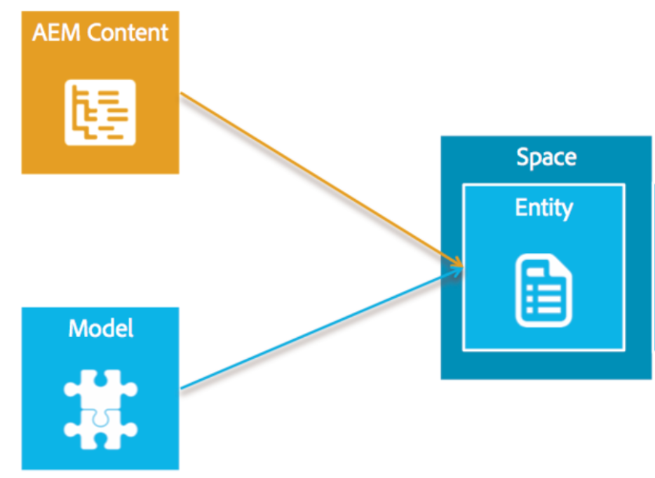
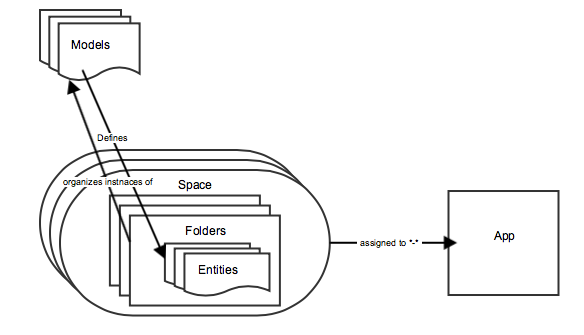

# Présentation des modèles{#models-overview}

>[!NOTE]
>
>Adobe recommande d’utiliser l’éditeur d’application d’une seule page (SPA) pour les projets nécessitant un rendu côté client basé sur la structure SPA (par exemple, React). [En savoir plus](/help/sites-developing/spa-overview.md).

La gestion des modèles implique la création et la gestion de modèles dans le but de les associer à des objets de données éventuels. Chaque modèle comprend toutes les propriétés et définitions de champ nécessaires pour faciliter la création et le rendu des objets.

La gestion des modèles implique la création de **modèles**, **entités** et **espaces**. Le diagramme suivant illustre la relation entre le contenu AEM et les modèles.

## Modèle de contenu {#the-content-model}

Un modèle décrit le type de contenu et indique les informations qui seront disponibles pour l’application native. Il s’agit d’une description de ce qui constitue un élément de contenu. Un modèle de contenu est les règles de création d’un élément de contenu. Le modèle de contenu inclut les données disponibles, les ressources pouvant être utilisées, la relation entre les ressources et les données, la relation avec d’autres modèles de contenu et les métadonnées disponibles.

Les modèles servent également à transformer du contenu AEM existant en objets qui peuvent être facilement utilisés par des applications mobiles natives.

Content Services fournit quelques modèles prêts à l’emploi pour les objets courants tels que les ressources, les collections de ressources, les pages HTML, les configurations d’application et les pages indépendantes du canal. Ils seront configurables afin de répondre aux besoins spécifiques des clients sans nécessiter un effort de développement AEM.

L’utilisateur peut créer ses propres modèles. Cela permet de créer de nouveaux types de contenu qui ne sont pas déjà gérés par AEM. La création de modèles s’effectue via une interface utilisateur à l’aide de types primitifs existants.

Le diagramme suivant illustre le modèle de contenu des applications AEM Mobile et la manière dont les entités, les dossiers et les espaces sont affectés à une application.

### Les modèles {#the-models}

Les modèles sont utilisés pour déterminer comment les entités sont créées. Ils définissent ce qui est disponible dans une entité et comment ces données sont générées à partir du contenu AEM. Avant de commencer à utiliser des espaces, des dossiers et des entités, vous devez vous familiariser avec la création et la gestion de modèles.

>[!NOTE]
>
>Il existe un modèle en dehors d’une application, car plusieurs applications peuvent l’utiliser.

Voir **[Modèles](/help/mobile/administer-mobile-apps.md)** pour créer et gérer des modèles dans le tableau de bord et le référentiel.

### Entités dans le modèle de contenu {#entities-in-content-model}

Une entité est une instance d’un modèle de contenu. Une entité est exposée à la bibliothèque côté client via l’API Content Services et permet à une application native d’accéder au contenu de manière indépendante du canal.

Dans le cas de contenu d’AEM existant, une entité est générée à l’aide d’un modèle et de la source de contenu AEM. Par exemple, une entité de page est un objet indépendant des canaux et des mises en page, généré à partir d’une page AEM et du modèle de page.

Les modifications apportées au contenu référencé d’une entité entraînent une modification de l’entité. Par exemple, si une balise *cq:page* est mise à jour, toutes les entités basées sur cette page sont également mises à jour.

Voir **[Utilisation d’entités](/help/mobile/spaces-and-entities.md)** pour créer des entités personnalisées à partir de modèles.

>[!NOTE]
>
>Si le modèle ne correspond pas à un contenu d’AEM existant, tel que le client a créé un nouveau modèle, il y aura une interface utilisateur pour qu’un client puisse créer une nouvelle entité.

### Espaces dans le modèle de contenu {#spaces-in-content-model}

Un espace permet d’organiser les entités pour un accès facile. Un espace peut contenir un ou plusieurs types d’entité et peut contenir des sous-dossiers.

Du côté AEM, un espace est un moyen pratique de gérer les entités liées. Il peut également être utilisé pour attribuer des autorisations d’autorisation. Une autorisation peut être accordée à un emplacement, qui protègera alors les entités qui se trouvent dans cet emplacement.

*Par exemple*,

Un utilisateur possède trois classifications générales d’entités. L’une est destinée à un usage interne uniquement, l’autre est approuvée pour un usage public et encore un troisième est pour les entités courantes utilisées par de nombreuses applications. Pour faciliter la gestion, l’utilisateur crée trois espaces, à savoir *internal*, *public* (avec du contenu en anglais et en français) et *common* pour gérer les entités appropriées comme indiqué ci-dessous :

* /content/entities/internal
* /content/entities/public/en
* /content/entities/public/fr
* /content/entities/common

Un point de terminaison de service sera fourni à l’espace afin que la bibliothèque cliente native puisse demander une liste du contenu d’un espace. Cette &quot;liste&quot; est renvoyée sous la forme d’un objet JSON.

Voir **[Espaces et entités](/help/mobile/spaces-and-entities.md)** pour créer et publier des espaces.

>[!NOTE]
>
>Un espace peut être utilisé par de nombreuses applications et une application peut utiliser de nombreux espaces.

### Dossiers dans le modèle de contenu {#folders-in-content-model}

Les dossiers permettent aux utilisateurs d’organiser les entités selon les besoins et facilitent un contrôle de liste de contrôle d’accès plus précis. Les espaces peuvent inclure des dossiers pour mieux organiser le contenu et les ressources de l’espace. Un utilisateur peut créer sa propre hiérarchie sous un espace.

Voir **[Utilisation de dossiers dans un espace](/help/mobile/spaces-and-entities.md)** pour créer et gérer des dossiers dans un espace.
