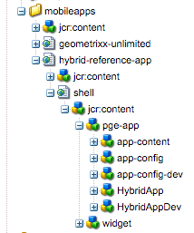

# Votre application hybride est-elle prête pour AEM Mobile ?{#is-your-hybrid-app-ready-for-aem-mobile}

>[!NOTE]
>
>Adobe recommande d’utiliser l’éditeur d’application d’une seule page (SPA) pour les projets nécessitant un rendu côté client basé sur la structure SPA (par exemple, React). [En savoir plus](/help/sites-developing/spa-overview.md).

Vous avez donc importé votre application Hybrid PhoneGap ou Cordova dans AEM, et maintenant ? Il est probable que vous souhaitiez ajouter du contenu autorisé à votre application. Pour accomplir cette tâche, vous devez connaître la structure générale d’une application AEM. Une application dans AEM est généralement divisée en deux parties. Le shell et le contenu. Le shell est constitué des parties statiques de votre application ; tels que les fichiers de configuration PhoneGap, la structure de l’application et les commandes de navigation. Le contenu de l’archive que vous avez importée est stocké dans le shell. Dans le contexte de ce document, le shell est le contenu non créé par AEM de votre application PhoneGap hybride créée par le développeur de l’application.

Le contenu fait référence aux composants, modèles et pages créées dans AEM et créées par le développeur AEM. Le contenu est classé comme contenu de développement ou comme contenu créé. Les composants, conceptions et modèles de page sont considérés comme du contenu de développement puisqu’ils sont créés par un développeur. author-content sont des pages qui ont été créées à l’aide des composants et des modèles. Elles sont généralement effectuées par un concepteur ou un spécialiste du marketing.

L’ajout de pages AEM créées à votre application hybride requiert une coordination entre le développeur de l’application et le développeur AEM. Partout dans l’application où vous souhaitez ajouter du contenu créé, le développeur d’applications doit organiser ces pages dans une structure qui peut être superposée dans AEM. Le développeur d’applications doit être en mesure de fournir au développeur AEM les chemins d’accès vers l’emplacement où le contenu créé AEM doit être ajouté, puis fournir une page d’espace réservé dans l’application hybride qui sera remplacée une fois que le développeur AEM a créé le contenu de la page.

Pour simplifier l’explication, nous utiliserons AEM Marketing Cloud : Référence hybride AEM Mobile pour expliquer les concepts. L’application de référence hybride se compose d’une page d’accueil avec un menu latéral.

Dans cet exemple, nous allons créer la page de bienvenue de l&#39;application. Jetez un oeil à la source [https://github.com/Adobe-Marketing-Cloud-Apps/aem-mobile-hybrid-reference/blob/master/hybrid-app/www/js/app.js#L75](https://github.com/Adobe-Marketing-Cloud-Apps/aem-mobile-hybrid-reference/blob/master/hybrid-app/www/js/app.js#L75). Nous constatons que le développeur de l’application a défini une page d’accueil et fourni un modèle pour la page rendue par l’application. C’est là que le développeur d’applications et le développeur AEM doivent coordonner. Le chemin d’accès au modèle de page d’accueil dans l’application de référence hybride est défini sur &quot;&quot;content/mobileapps/hybrid-reference-app/en/welcome.template.html&quot;&quot;. Ce chemin est extrêmement important car le développeur AEM créera sa page d’accueil dans le référentiel AEM en utilisant le même chemin d’accès.

Il est important que l’application hybride et le contenu créé par AEM utilisent le même chemin d’accès car nous comptons sur la possibilité d’incruster du contenu à l’aide de Content Sync pour ajouter de nouvelles pages à l’application hybride. Lorsque l’application hybride est importée dans AEM dans le cadre du processus d’importation, les configurations de synchronisation du contenu sont configurées.

Lorsque vous téléchargez la source à partir du tableau de bord de l’application, ces scripts ContentSync sont exécutés pour assembler une archive de votre application hybride.

ContentSync commence par extraire &quot;shell&quot; de l’application, où est stocké tout le contenu développé de l’application hybride, puis il extrait le &quot;contenu&quot; de l’application. Désormais, s&#39;il y a des pages dans le &quot;shell&quot; qui ont le même chemin que dans &quot;content&quot;, les pages sous &quot;shell&quot; seront (remplacées) par les pages sous &quot;content&quot;. En d’autres termes, dans l’exemple d’application de référence hybride, si nous créons une page dans AEM qui a le même chemin que &quot;content/mobileapps/hybrid-reference-app/en/welcome.template.html&quot; lorsque ContentSync est exécuté, elle superpose la page qui faisait partie de l’application de référence hybride avec tout ce qui se trouve dans AEM à cet emplacement. L’incrustation est prise en charge par ContentSync de sorte que pour les utilisateurs de l’application, les mises à jour apportées à l’application avec le contenu créé par AEM s’affichent sans problème et ne nécessitent pas de recréation de l’application. Par conséquent, lorsque vous exécutez l’application, la page d’accueil s’affiche comme suit :

