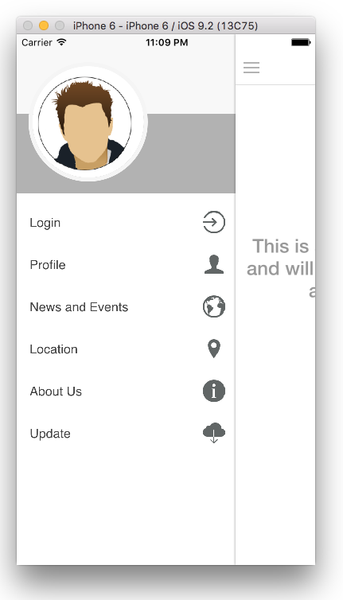

# Votre application hybride est-elle prête pour Adobe Experience Manager Mobile ?{#is-your-hybrid-app-ready-for-aem-mobile}

{{ue-over-mobile}}

Vous avez donc importé votre application Hybrid PhoneGap ou Cordova dans AEM, et maintenant ? Vous souhaitez probablement ajouter du contenu modifiable à votre application. Pour accomplir cette tâche, vous avez besoin d’une compréhension générale de la structure d’une application AEM. Dans AEM, une application est généralement divisée en deux parties. Le « shell » et le « content ». Le shell comprend les parties statiques de votre application, telles que les fichiers de configuration PhoneGap, le framework de l’application et les commandes de navigation. Le contenu de l’archive importée est stocké dans le shell. Dans le cadre de ce document, le shell est tout le contenu non créé par AEM de votre application Hybrid PhoneGap créée par le développeur d’applications.

Le contenu fait référence aux composants, modèles et pages créés dans AEM créés par le développeur AEM. Le contenu est classé en tant que contenu développeur ou contenu créé. Les composants, les conceptions et les modèles de page sont considérés comme des contenus de développement, car ils sont créés par un développeur ou une développeuse. Les contenus de création sont des pages qui ont été créées à l’aide des composants et des modèles. Ces pages sont généralement créées par un Designer ou un marketeur.

L’ajout de pages AEM créées à votre application hybride nécessite une coordination entre le développeur d’applications et le développeur AEM. À tout endroit de l’application où vous souhaitez ajouter du contenu créé, le développeur ou la développeuse de l’application doit organiser ces pages dans une structure qui peut être superposée en Experience Manager. Le développeur d’application doit être en mesure de fournir au développeur Experience Manager les chemins d’accès vers lesquels le contenu créé par l’Experience Manager est ajouté. Ensuite, fournissez une page d’espace réservé dans l’application hybride qui est remplacée une fois que le développeur Experience Manager a créé le contenu de la page.

Pour faciliter la compréhension de l’explication, l’Experience Cloud AEM est utilisé : Référence hybride AEM Mobile pour expliquer les concepts. L’application Référence hybride se compose d’une page d’accueil avec un menu latéral.

Dans cet exemple, la page d’accueil de l’application va être créée. En examinant la source [https://github.com/Adobe-Marketing-Cloud-Apps/aem-mobile-hybrid-reference/blob/master/hybrid-app/www/js/app.js#L75](https://github.com/Adobe-Marketing-Cloud-Apps/aem-mobile-hybrid-reference/blob/master/hybrid-app/www/js/app.js#L75). Notez que le développeur ou la développeuse d’applications a défini une page d’accueil et fourni un modèle pour la page générée par l’application. Le développeur d’application et le développeur AEM doivent se coordonner sur cette page. Le chemin d’accès au modèle de page d’accueil dans l’application de référence hybride est défini sur « content/mobileapps/hybrid-reference-app/en/welcome.template.html ». Ce chemin est important, car le développeur AEM créera sa page d’accueil dans le référentiel AEM en utilisant le même chemin.

Il est important que l’application hybride et le contenu créé par AEM utilisent le même chemin d’accès, car cela repose sur la possibilité de superposer du contenu à l’aide de la synchronisation de contenu pour ajouter de nouvelles pages à l’application hybride. Lors de l’importation de l’application hybride dans AEM, dans le cadre du processus d’importation, les configurations de synchronisation de contenu sont configurées.

Lorsque vous « Téléchargez Source » à partir du tableau de bord de l’application, ces scripts ContentSync sont exécutés pour assembler une archive de votre application hybride.

ContentSync extrait d’abord le shell de l’application, où est stocké tout le contenu développé par l’application dans l’application hybride. Ensuite, il extrait le « contenu » de l’application. Désormais, si des pages dans le « shell » ont le même chemin d’accès que dans « content », les pages sous « shell » sont (remplacées) par les pages sous « content ». Ainsi, dans l’exemple d’application de référence hybride, si une page créée dans AEM a le même chemin d’accès que « content/mobileapps/hybrid-reference-app/en/welcome.template.html », lorsque ContentSync s’exécute, elle recouvre la page qui faisait partie de l’application de référence hybride. Il le recouvre avec tout ce qui se trouve dans AEM à cet emplacement. La superposition est gérée par ContentSync. Ainsi, pour une personne qui utilise l’application, les mises à jour de l’application avec du contenu créé par AEM s’effectuent en toute transparence et ne nécessitent pas de reconstruire l’application. Par conséquent, lorsque vous exécutez l’application, la page d’accueil s’affiche comme suit :

