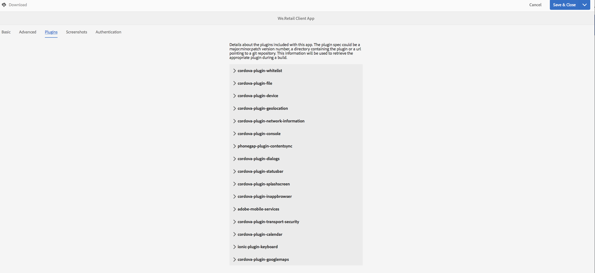
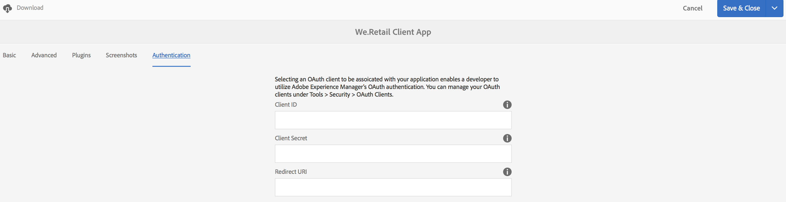

# Mosaïque Gestion de l’application{#manage-app-tile}

>[!NOTE]
>
>Adobe recommande d’utiliser l’éditeur d’application d’une seule page (SPA) pour les projets nécessitant un rendu côté client basé sur la structure SPA (par exemple, React). [En savoir plus](/help/sites-developing/spa-overview.md).

La mosaïque **Gestion de l’application** du tableau de bord des applications permet de modifier les détails d’une application. Pour ouvrir la page Détails, cliquez sur le lien des détails de la mosaïque Gestion de l’application. Dans la page Gérer l’application, vous pouvez modifier les paramètres Configuration de l’application PhoneGap (config.xml) et préparer votre application pour l’envoi aux différentes boutiques d’applications.


## Understanding the Manage App Tile {#understanding-the-manage-app-tile}

You can drill into each tile in the **Manage App** tile to view or edit details by clicking the &#39;...&#39; in the bottom right corner.

### Onglet Simple {#the-basic-tab}

Vous pouvez modifier le **nom**, l’ **auteur**, la description **** courte et la **description de votre application à partir de cet onglet.**


### Onglet Avancé {#the-advanced-tab}

Chaque plate-forme d’applications mobiles décrit les données collectées, ciblant spécifiquement chaque magasin d’applications.

Chaque plateforme est pilotée par le contenu de config.xml PhoneGap :

```xml
<widget>
<gap:platform name="ios"/>
<gap:platform name="android"/>
</widget>
```

Chaque boutique d’applications fournisseur, telle qu’Apple App Store ou Google Play Store, nécessite par exemple une ou plusieurs captures d’écran de votre application mobile afin d’afficher les détails de votre application aux clients. Ces captures d&#39;écran peuvent avoir des exigences strictes en termes de dimensions et de contenu (en gros, elles doivent représenter l&#39;application). Les applications AEM prennent en charge la sélection et la gestion de ces captures d’écran pour les plates-formes et les dimensions de port de vue prises en charge, comme l’exige la boutique d’applications de chaque fournisseur.

>[!NOTE]
>
>L’application AEM Vérifier permet d’envoyer des captures d’écran directement aux détails de votre application dans AEM.
>
>Voir Démarrage rapide [mobile pour AEM vérification](/help/mobile/phonegap-mobile-quickstart.md) pour plus d’informations.


### Métadonnées {#metadata}

>[!NOTE]
>
>Une fois que vous êtes familiarisé avec la mosaïque **Gérer l’application** , reportez-vous à la section [Modification des métadonnées](/help/mobile/phonegap-editmetadata.md) de l’application pour la vue et la modification des métadonnées.

#### Métadonnées courantes {#common-metadata}

Chaque application doit être associée à des métadonnées qui facilitent la configuration de différents aspects de l’application. La page Gestion de l’application est divisée en deux différentes zones liées à la collecte de métadonnées. Les métadonnées spécifiques à la plateforme et les métadonnées communes.

Il existe une configuration et des métadonnées communes à toutes les plateformes.

Dans cette section, vous définissez l’URL du serveur de mise à jour de contenu, la page d’entrée de votre application mobile, la version de PhoneGap utilisée pour la compilation, la version, le nom et la description de votre application, etc.

**Version** de l’application est la version opérationnelle de votre application. L’une des pratiques conseillées consiste à utiliser une notation à 3 décimales séparées par un point en commençant en dessous de 1.0.0 avant la première version.

**PhoneGap Version** est la version dans laquelle vous souhaitez compiler votre application avec PhoneGap. L’une des pratiques conseillées consiste à toujours la mettre à jour pour bénéficier des dernières fonctionnalités et des correctifs PhoneGap.

**L’URL** du serveur de mise à jour de contenu est l’URL que votre application utilisera pour appeler les mises à jour de ContentSync. Elle doit correspondre à l’URL de votre répartiteur. Si vous n’utilisez pas de répartiteur, il doit s’agir de l’une des instances de publication qui sera utilisée pour déployer les mises à jour ContentSync de votre application.


>[!NOTE]
>
>Cette section peut sembler vide, sauf si des données sont remplies dans les champs.
>
>Dans la partie supérieure de la vue Détails, vous voyez la version de l’application, la version de PhoneGap et l’URL de mise à jour, chacune de ces valeurs pouvant être définie dans la section Métadonnées courantes. Toutefois, le ID de l&#39;application ne peut pas être modifié.

#### Métadonnées de plateforme {#platform-metadata}

Chaque plateforme définie dans PhoneGap config.xml peut contenir des propriétés personnalisées. Un développeur AEM doit contribuer à établir la structure de contenu pour capturer ces propriétés. Un exemple de propriétés spécifiques à la plateforme est disponible pour iOS.

Les métadonnées pour toutes les plateformes configurées s’affichent désormais en même temps sur l’onglet Avancé de la mosaïque Gérer l’application.

>[!NOTE]
>
>Les sections de métadonnées de plateforme ne sont pas utilisées par PhoneGap durant une compilation à distance PhoneGap ou à partir d’une ligne de commande. En réalité, AEM essaie de capturer des métadonnées pour les plateformes, de sorte ce qu’elles soient utilisables ultérieurement lors d’une soumission sur la boutique d’applications ciblée.

Dans le cas de plateformes dont le langage n’est pas compris par AEM, un développeur AEM peut étendre l’IU pour capturer ces métadonnées, qui peuvent ensuite être exportées et utilisées lors de la procédure de soumission de l’application.

#### Métadonnées iOS {#ios-metadata}

L’Appstore d’Apple nécessite des métadonnées supplémentaires pour la soumission de votre application en vue de sa diffusion. La section Métadonnées iOS tente de collecter les informations nécessaires, qui peuvent être utilisées par l’outil iTMSTransporter d’Apple pour publier les métadonnées sur le compte développeur Apple associé.

To obtain the Apple specific metadata you first need to create your application on [https://itunesconnect.apple.com](https://itunesconnect.apple.com/). Lors de la création de votre application, Apple génère les métadonnées requises par la section des métadonnées iOS si vous souhaitez utiliser l’outil Apple iTMSTransporter pour valider et télécharger les métadonnées sur itunesconnect.apple.com. Si vous souhaitez uniquement vous procurer les métadonnées à collecter, vous n’êtes pas obligé de renseigner les métadonnées spécifiques à iOS. Vous pouvez exporter les métadonnées qui fusionneront les métadonnées iOS et les métadonnées courantes et collecteront toutes les captures d’écran dans un fichier zip téléchargeable à tout moment.

Le fichier zip téléchargé contient un fichier itmsp qui peut être contrôlé au niveau du fichier metadata.xml. Le fichier itmsp contient les métadonnées exportées (dans le fichier metadata.xml) et toutes les captures d’écran associées.

La fonctionnalité d’exportation sert à collecter les captures d’écran et les métadonnées pour les transmettre à l’éditeur de l’application qui s’en servira lors du processus de soumission sur la boutique d’applications.


#### Métadonnées Android {#android-metadata}

Si vous sélectionnez la plateforme Android, aucune métadonnée personnalisée ne peut être définie à ce stade. Si vous cliquez sur le bouton Télécharger, un fichier de propriétés zippé, contenant toutes les métadonnées et captures d’écrans associées, est généré.

La fonctionnalité d’exportation sert à collecter les captures d’écran et les métadonnées pour les transmettre à l’éditeur de l’application qui s’en servira lors du processus de soumission sur la boutique d’applications.


### URL du serveur de mise à jour du contenu {#content-update-server-url}

L’une des principales fonctionnalités des applications AEM est la possibilité d’obtenir un nouveau contenu pour une demande d’application mobile via ContentSync, où le contenu peut être des ressources HTML, des pages, des vidéos, des images, du texte, etc. Une fois qu’un auteur de contenu a mis à jour le contenu, puis le publie, le serveur met le contenu à jour pour que l’application mobile puisse le télécharger.

La propriété URL du serveur Content Update Server est l’URL qui doit pointer vers une instance de publication ; soit directement, soit par l&#39;intermédiaire du répartiteur ou du CDN. Le format de l’URL est le suivant :

`https://[hostname]:[port]`

>[!NOTE]
>
>Si l’instance du serveur de création se réplique sur plusieurs instances de serveur de publication (une architecture courante pour AEM), chaque serveur de publication a le même contenu de mise à jour. En effet, la mise à jour est compilée sur le serveur de création et répliquée sur toutes les instances de publication. En général, l’équilibrage de charge et le basculement sont entièrement pris en charge.

### Onglet Plugins {#the-plugins-tab}

L’onglet **Plugins** décrit les plug-ins associés à votre application. Ces informations seront utilisées pour récupérer le module externe approprié pendant une génération.



### L&#39;onglet Captures d&#39;écran {#the-screenshots-tab}

L’onglet **Captures d’écran** affiche les résolutions d’écran prises en charge sur différentes plates-formes.


>[!NOTE]
>
>Pour ajouter et supprimer des captures d’écran, voir [Modification des métadonnées](/help/mobile/phonegap-editmetadata.md)d’une application.

### Onglet Authentification {#the-authentication-tab}

L&#39;onglet **Authentification** vous permet de sélectionner un client OAuth à associer à votre application et permet à un développeur d&#39;utiliser l&#39;authentification Adobe Experience Manager OAuth.



### Étapes suivantes {#the-next-steps}

Une fois que vous avez pris connaissance de la gestion des mosaïques d’application dans le tableau de bord d’applications, consultez les ressources suivantes pour les autres rôles de création :

* [Modification de métadonnées d’application](/help/mobile/phonegap-editmetadata.md)
* [Définitions d’application](/help/mobile/phonegap-app-definitions.md)
* [Création d’une application à l’aide de l’assistant de création d’application](/help/mobile/phonegap-create-new-app.md)
* [Importation d’une application hybride existante](/help/mobile/phonegap-adding-content-to-imported-app.md)
* [Content Services](/help/mobile/develop-content-as-a-service.md)

### Ressources supplémentaires {#additional-resources}

Pour en savoir plus sur les rôles et les responsabilités d’un administrateur et d’un développeur, consultez les ressources ci-dessous :

* [Développer pour Adobe PhoneGap Enterprise avec AEM](/help/mobile/developing-in-phonegap.md)
* [Administration de contenu pour Adobe PhoneGap Enterprise avec AEM](/help/mobile/administer-phonegap.md)

