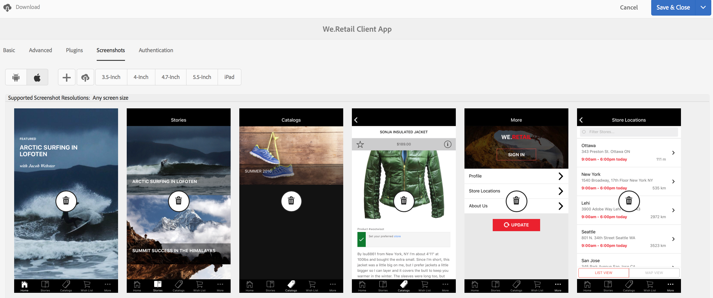

# Mosaïque Gérer l’application{#manage-app-tile}

>[!NOTE]
>
>Adobe recommande d’utiliser l’éditeur SPA pour les projets nécessitant un rendu côté client, basé sur un framework, pour une application à une seule page (comme React). [En savoir plus](/help/sites-developing/spa-overview.md).

La mosaïque **`Manage App`** du tableau de bord de l’application vous permet de modifier les détails de l’application. Pour ouvrir la page Détails, cliquez sur le lien Détails de la mosaïque **`Manage App`**. Dans la page **`Manage App`**, vous pouvez modifier les paramètres Configuration de l’application PhoneGap (config.xml) et préparer l’envoi de votre application aux différents magasins d’applications.


## Présentation de la mosaïque `Manage App` {#understanding-the-manage-app-tile}

Vous pouvez parcourir chaque mosaïque de la mosaïque **`Manage App`** pour afficher ou modifier les détails en cliquant sur &quot;...&quot; dans le coin inférieur droit.

### Onglet De base {#the-basic-tab}

Vous pouvez modifier les **Nom**, **Auteur**, **Description courte** et la **Description** de votre application depuis cet onglet.


### Onglet Avancé {#the-advanced-tab}

Chaque plateforme d’applications mobiles décrit les données collectées, ciblant spécifiquement chaque boutique d’applications.

Les plateformes affichées sont pilotées par le contenu du fichier de configuration.xml PhoneGap :

```xml
<widget>
<gap:platform name="ios"/>
<gap:platform name="android"/>
</widget>
```

Chaque boutique d’applications de fournisseur (Apple App Store ou Google Play Store, par exemple) nécessite une ou plusieurs captures d’écran de votre application mobile pour afficher les détails de votre application aux clients. Ces captures d’écran peuvent avoir des exigences strictes concernant les dimensions et le contenu (en fait, elles doivent représenter fidèlement l’application). Les applications AEM prennent en charge la sélection et la gestion de ces captures d’écran pour les plateformes prises en charge et l’affichage des dimensions de port, selon les besoins de la boutique d’applications de chaque fournisseur.

>[!NOTE]
>
>L’application AEM Vérifier vous permet d’envoyer des captures d’écran directement aux détails de votre application dans AEM.
>
>Pour plus d’informations, voir [Démarrage rapide mobile pour AEM de la vérification](/help/mobile/phonegap-mobile-quickstart.md) .


### Métadonnées {#metadata}

>[!NOTE]
>
>Une fois que vous connaissez la mosaïque **`Manage App`**, reportez-vous à la section [Modification des métadonnées de l’application](/help/mobile/phonegap-editmetadata.md) pour afficher et modifier les métadonnées.

#### Métadonnées courantes {#common-metadata}

Chaque application doit être associée à des métadonnées qui facilitent la configuration de différents aspects de l’application. La page Gérer l’application est divisée en deux zones distinctes liées à la collecte de métadonnées. Métadonnées spécifiques à la plateforme et métadonnées communes.

Il existe une configuration et des métadonnées communes à toutes les plateformes.

Dans cette section, vous définissez l’URL du serveur de mise à jour de contenu, la page d’entrée de votre application mobile, la version de PhoneGap à des fins de compilation, la version de votre application, le nom, la description, etc.

**App Version** est la version opérationnelle de votre application. Il est recommandé d’utiliser une notation à 3 décimales et de commencer sous 1.0.0 avant votre première version.

**PhoneGap Version** est la version dans laquelle vous souhaitez compiler votre application avec PhoneGap. La bonne pratique consiste à suivre la version actuelle pour vous assurer d’obtenir les fonctionnalités et correctifs les plus récents et les plus performants.

**URL du serveur de mise à jour de contenu** est l’URL utilisée par votre application pour appeler les mises à jour ContentSync. Elle doit être définie sur votre URL Dispatcher ou, si vous n’utilisez pas de Dispatcher, sur l’une de vos instances de publication utilisée pour fournir des mises à jour ContentSync à votre application.


>[!NOTE]
>
>Cette section peut apparaître vide, sauf si des données sont renseignées dans les champs.
>
>Dans la partie supérieure de la vue détaillée, vous voyez la version de l’application, la version PhoneGap et l’URL de mise à jour. Chacune de ces valeurs peut être définie dans la section Métadonnées courantes . Toutefois, l’ID de l’application ne peut pas être modifié.

#### Métadonnées de plateforme {#platform-metadata}

Chaque plateforme définie dans le fichier de configuration PhoneGap config.xml peut contenir des propriétés de plateforme personnalisées. Un développeur AEM doit contribuer à la structure de contenu pour capturer ces propriétés. Vous trouverez un exemple de propriétés spécifiques à la plateforme pour iOS.

Les métadonnées pour toutes les plateformes configurées s’affichent désormais en même temps dans l’onglet Avancé de la mosaïque `Manage App`.

>[!NOTE]
>
>Les sections de métadonnées de plateforme ne sont pas utilisées par PhoneGap lors d’une interface de ligne de commande ou lors de la création d’un PhoneGap distant. AEM tente plutôt de capturer des métadonnées pour des plateformes qui peuvent être utilisées ultérieurement lors de l’envoi à la boutique d’applications du fournisseur ciblé.

Pour les plateformes non comprises par AEM, il est toujours possible pour un développeur AEM d’étendre l’interface utilisateur afin de capturer ces métadonnées qui pourront ensuite être exportées et utilisées pendant le processus d’envoi de l’application.

#### Métadonnées iOS {#ios-metadata}

L’AppStore Apple requiert des métadonnées supplémentaires pour envoyer votre application en vue de sa distribution. La section Métadonnées iOS tente de collecter les informations requises qui peuvent être utilisées par l’outil Apple TMSTransporter pour publier les métadonnées sur le compte de développeur Apple associé.

Pour obtenir les métadonnées spécifiques à Apple, créez votre application sur [https://itunesconnect.apple.com](https://itunesconnect.apple.com/). Lors de la création de votre application, Apple génère les métadonnées qui sont requises par la section Métadonnées iOS si vous souhaitez utiliser l’outil Apple iTMSTransporter pour valider et charger les métadonnées sur itunesconnect.apple.com. Si vous souhaitez obtenir les métadonnées à collecter, il n’est pas nécessaire de renseigner les métadonnées spécifiques à iOS. Vous pouvez toujours exporter les métadonnées qui fusionnent iOS et les métadonnées communes et collecter toutes les captures d’écran dans un fichier zip qui peut être téléchargé à tout moment.

Le fichier zip téléchargé contient un fichier itmsp qui peut être inspecté pour le fichier metadata.xml. Le fichier itmsp contient les métadonnées exportées (dans le fichier metadata.xml ), ainsi que toutes les captures d’écran associées.

La fonctionnalité d’exportation est utilisée pour fournir un moyen pratique de collecter les captures d’écran et les métadonnées qui peuvent être transmises à l’éditeur de l’application pour entrée dans la boutique d’applications spécifique au fournisseur.


#### métadonnées Android™ {#android-metadata}

Lors de la sélection de la plateforme Android™, aucune métadonnée personnalisée ne peut être définie à ce stade. Lorsque vous cliquez sur le bouton de téléchargement, un fichier zip est généré avec un fichier de propriétés qui contient toutes les métadonnées et les captures d’écran associées.

La fonctionnalité d’exportation est utilisée pour fournir un moyen pratique de collecter les captures d’écran et les métadonnées qui peuvent être transmises à l’éditeur de l’application pour entrée dans la boutique d’applications spécifique au fournisseur.


### URL du serveur de mise à jour du contenu {#content-update-server-url}

L’une des fonctionnalités clés des applications AEM est la possibilité de demander un nouveau contenu à une application mobile via ContentSync, où le contenu peut être des ressources html, des pages, des vidéos, des images, du texte, etc. Une fois qu’un auteur de contenu a mis à jour le contenu, puis le publie, le serveur met à disposition la mise à jour de contenu pour que l’application mobile puisse la télécharger.

La propriété URL du serveur de mise à jour de contenu est l’URL qui doit pointer vers une instance de publication, directement ou par le biais de Dispatcher ou du réseau de diffusion de contenu. Le format de l’URL est simple :

`https://[hostname]:[port]`

>[!NOTE]
>
>Si votre instance de serveur de création effectue une réplication sur de nombreuses instances de serveur de publication (architecture commune pour AEM), chaque serveur de publication dispose du même contenu de mise à jour. Cela est dû au fait que la mise à jour est créée sur l’auteur et répliquée sur toutes les instances de publication. Fondamentalement, l’équilibrage de charge et le basculement sont entièrement pris en charge.

### Onglet Plugins {#the-plugins-tab}

L’onglet **Plugins** décrit les modules externes associés à votre application. Ces informations sont utilisées pour récupérer le module externe approprié lors d’une génération.


### Onglet Captures d’écran {#the-screenshots-tab}

L’onglet **Captures d’écran** affiche les résolutions d’écran prises en charge sur différentes plateformes.



>[!NOTE]
>
>Pour ajouter et supprimer des captures d’écran, voir [Modification des métadonnées d’application](/help/mobile/phonegap-editmetadata.md).

### Onglet Authentification {#the-authentication-tab}

L&#39;onglet **Authentification** permet de sélectionner un client OAuth à associer à votre application et permet à un développeur d&#39;utiliser l&#39;authentification Adobe Experience Manager OAuth.


### Les étapes suivantes {#the-next-steps}

Une fois que vous avez appris la procédure de gestion de la mosaïque d’application dans le tableau de bord de l’application, consultez les ressources suivantes pour d’autres rôles de création :

* [Modification des métadonnées d’application](/help/mobile/phonegap-editmetadata.md)
* [Définitions des applications](/help/mobile/phonegap-app-definitions.md)
* [Création d’une application à l’aide de l’assistant Créer une application](/help/mobile/phonegap-create-new-app.md)
* [Importation d’une application hybride existante](/help/mobile/phonegap-adding-content-to-imported-app.md)
* [Content Services](/help/mobile/develop-content-as-a-service.md)

### Autres ressources {#additional-resources}

Pour en savoir plus sur les rôles et les responsabilités d’un administrateur et d’un développeur, consultez les ressources ci-dessous :

* [Développement pour Adobe PhoneGap Enterprise avec AEM](/help/mobile/developing-in-phonegap.md)
* [Administration de contenu pour Adobe PhoneGap Enterprise avec AEM](/help/mobile/administer-phonegap.md)
