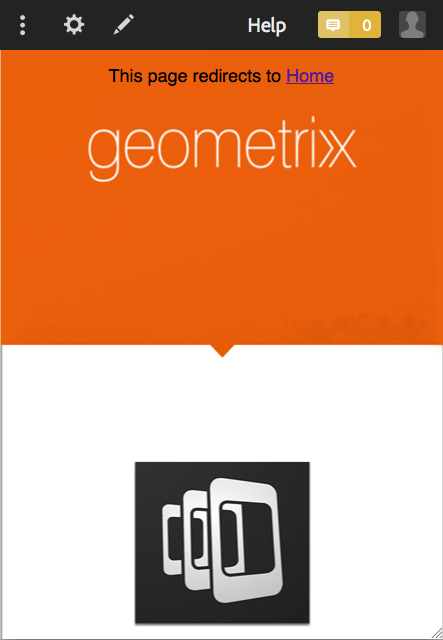
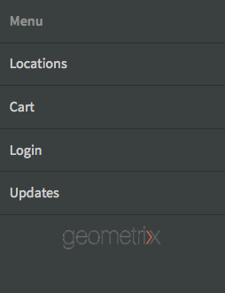

# Création et modification d’applications à l’aide de la console d’applications{#creating-and-editing-apps-using-the-apps-console}

>[!NOTE]
>
>Adobe recommande d’utiliser l’éditeur d’application d’une seule page (SPA) pour les projets nécessitant un rendu côté client basé sur la structure SPA (par exemple, React). [En savoir plus](/help/sites-developing/spa-overview.md).

Le processus de développement des applications mobiles AEM reconnaît que des utilisateurs de différentes compétences contribuent au développement des applications mobiles. Le mappage de processus suivant illustre l’ordre général dans lequel les auteurs de contenu et les développeurs d’applications effectuent des tâches.

Cette page contient des informations sur la façon d’exécuter les tâches du marketeur. Pour plus d&#39;informations sur les tâches de développement, consultez Création d&#39;applications PhoneGap.

## La structure des applications mobiles {#the-structure-of-mobile-applications}

AEM Mobile fournit le plan d&#39;application PhoneGap pour la création d&#39;applications mobiles. Le plan définit la structure des applications que vous créez. Les applications se composent des éléments suivants :

* Page racine.
* Variations de langue de l’application.
* page d&#39;accueil de la variation de langue.

### La racine d&#39;une application PhoneGap {#the-root-of-a-phonegap-app}

La page racine des applications mobiles que vous créez dans AEM s’affiche dans la console Applications.

La page racine est stockée sous la propriété Chemin de destination de l’application spécifiée lors de la création de l’application (le chemin par défaut est /content/phonegap/apps). Le nom de page est la propriété Name de l’application. Par exemple, l’URL par défaut de la page racine du site nommé `myphonegapapp` est `http://localhost:4502/content/phonegap/apps/myphonegapapp.html`.

### Variation de langue d&#39;une application PhoneGap {#the-language-variation-of-a-phonegap-app}

Les premières pages enfants de la page racine sont les variations de langue de l’application. Le nom de chaque page correspond à la langue de création de l’application. Par exemple, l’anglais est le nom de la variante anglaise de l’application.

**Remarque :** Le modèle PhoneGap par défaut crée uniquement une application en anglais. Votre développeur peut modifier le plan directeur pour qu&#39;il puisse créer plus de variations de langue.

La page Langue a deux objectifs :

* Le contenu de la page correspond à la page de fractionnement de la variation linguistique de l’application.
* Les propriétés de page contrôlent plusieurs aspects de conception de l’application, tels que l’URL à utiliser pour demander des mises à jour de contenu, ainsi que des informations sur la connexion à la création de cloud et à l’intégration des services Analytics Adobe.

### La Page d&#39;accueil {#the-home-page}

La page Page d&#39;accueil, ou index.html, d&#39;une variante de langue d&#39;une application s&#39;affiche à l&#39;ouverture de l&#39;application. La page d&#39;accueil fournit aux utilisateurs un menu de liens vers diverses pages de l&#39;application. Le système de paragraphe vous permet d’ajouter des composants à la page pour la création de contenu.

## Création d’une application mobile {#creating-a-mobile-application}

Les applications mobiles sont basées sur un modèle qui définit une structure de page et des propriétés. Vous pouvez configurer les propriétés d’application suivantes :

* **Titre :** Titre de l’application.
* **Chemin de destination :** Emplacement dans le référentiel dans lequel l’application est stockée. Conservez la valeur par défaut pour créer un chemin d’accès en fonction du nom de l’application.

* **Nom :** La valeur par défaut est la valeur de la propriété Title (Titre) dont les caractères d’espace sont supprimés. Le nom est utilisé dans CQ pour faire référence à l’application, par exemple pour le noeud de référentiel qui représente l’application.
* **Description :** Description de l’application.
* **URL du serveur :** URL qui fournit du contenu en direct (OTA) mis à jour vers l’application. La valeur par défaut est l’URL du serveur de publication de l’instance utilisée pour créer une application (provenant du service externalizer). Remarque : il doit s’agir d’une instance de serveur de publication et non d’un auteur, ce qui nécessite une authentification.

Vous pouvez également fournir un fichier image à utiliser comme miniature de l’application, sélectionner la configuration PhoneGap Build à utiliser et sélectionner la configuration Mobile App Analytics à utiliser. Cette image est uniquement utilisée comme miniature pour représenter votre application mobile dans la console des applications mobiles en Experience Manager.

Il existe d’autres onglets (et facultatifs) pour créer un service cloud et intégrer le module Adobe Mobile Services SDK dans votre application.

* Créer : Cliquez ici pour gérer les configurations et configurer votre service de génération build.phonegap.com. Ensuite, à partir de la liste déroulante, vous pourrez sélectionner le nouveau service PhoneGap build cloud créé.
* Analytics : Cliquez sur Gérer les configurations et configurez votre service cloud SDK  Adobe Mobile Services. Ensuite, dans la liste déroulante, vous pourrez sélectionner le nouveau service mobile à intégrer à votre application mobile.

>[!NOTE]
>
>Les développeurs peuvent utiliser le kit de démarrage AEM PhoneGap pour créer des applications et les ajouter à la console.

La procédure suivante utilise l’interface utilisateur tactile pour créer une application mobile.

1. Dans le rail, cliquez sur Applications.
1. Cliquez ou appuyez sur l’icône Créer.

   

1. (Facultatif) Dans l’onglet Avancé, fournissez une description de l’application et modifiez l’URL du serveur si nécessaire.
1. (Facultatif) Si vous utilisez PhoneGap Build pour compiler l’application, dans l’onglet Build (Créer), sélectionnez Configuration à utiliser.

   Pour créer une configuration de build PhoneGap, cliquez sur Gérer les configurations.

1. (Facultatif) Si vous utilisez SiteCatalyst pour effectuer le suivi de l’activité de l’application, dans l’onglet Analytics, sélectionnez la configuration à utiliser.

   Pour créer une configuration d’application mobile, cliquez sur Gérer les configurations.

1. (Facultatif) Pour fournir une icône d’application, cliquez sur le bouton Parcourir, sélectionnez le fichier image dans votre système de fichiers, puis cliquez sur Ouvrir.
1. Cliquez sur Créer.

### Modification des propriétés d’une application mobile {#changing-the-properties-of-a-mobile-application}

Après avoir créé une application mobile, vous pouvez modifier ses propriétés.

#### Modification du titre, de la description et de l’icône {#change-the-title-description-and-icon}

1. Dans le rail, cliquez ou appuyez sur Applications.
1. Sélectionnez l’application à configurer, puis cliquez sur l’icône Propriétés de la page de Vue.

   

1. Pour modifier les valeurs de propriété, cliquez ou appuyez sur l’icône Modifier.

   

1. Configurez les propriétés de base et avancées, puis cliquez ou appuyez sur l’icône Terminé.

   

#### Configuration d’une variante de langue de l’application {#configure-a-language-variation-of-the-application}

1. Dans le rail, cliquez ou appuyez sur Applications.
1. Cliquez sur pour explorer l’application mobile que vous souhaitez modifier dans la console d’administration des applications. Sélectionnez la version linguistique de l’application à configurer, puis cliquez sur l’icône Propriétés de l’application de la Vue.

   

1. Pour modifier les valeurs de propriété, cliquez ou appuyez sur l’icône Modifier.

   

1. Configurez les propriétés dans les onglets Simple, Avancé, Créer et Analytics, puis cliquez ou appuyez sur l’icône Terminé.

   

### Création du contenu d&#39;une application mobile {#authoring-the-content-of-a-mobile-application}

Après avoir créé l’application mobile, ajoutez le contenu utilisé comme interface utilisateur de l’application.

1. Dans le rail, cliquez ou appuyez sur Applications.
1. Cliquez ou appuyez sur l’application, puis cliquez ou appuyez sur Anglais.
1. Modifiez la Page d&#39;accueil ou ajoutez des pages enfants selon vos besoins.

### Déplacement de contenu vers des applications mobiles {#moving-content-to-mobile-applications}

Le cache de synchronisation de contenu sur l’instance de publication AEM est utilisé comme référentiel de contenu pour les applications mobiles :

* Le contenu du cache Content Sync est inclus dans l’application lorsque les développeurs compilent l’application.
* Le contenu du cache est disponible pour les applications mobiles installées pour la mise à jour du contenu de l’application.

Les applications mobiles comportent une commande Mises à jour qui télécharge et installe le contenu mis à jour de l’application. Lorsqu’une instance d’application envoie une demande de mise à jour, Content Sync détermine le contenu qui a changé depuis la dernière mise à jour ou installation de l’application et fournit le nouveau contenu.

Pour rendre le contenu mis à jour disponible pour les applications, vous devez mettre à jour le cache de synchronisation de contenu. Lors de la première mise à jour du cache, tout le contenu publié est ajouté. Les mises à jour suivantes ajoutent uniquement le contenu publié qui a changé depuis la mise à jour précédente.

Content Sync assure également le suivi des mises à jour. Grâce à ces informations, Content Sync peut déterminer la mise à jour du cache à envoyer à une application mobile.

Exécutez la procédure suivante sur l’instance où vous souhaitez mettre à jour le cache. Par exemple, si votre application demande des mises à jour à partir de l’instance de publication, effectuez la procédure sur l’instance de publication.

1. Dans le rail, cliquez ou appuyez sur Applications, puis cliquez ou appuyez sur votre application.
1. Sélectionnez la page de démarrage, puis cliquez ou appuyez sur l’icône Mettre à jour le cache.

   

### Utilisation de modèles d’application {#using-app-templates}

Il s’agit d’une fonctionnalité disponible avec Apps 6.1 Feature Pack 2 et qui offre un moyen simple d’exploiter les modèles d’application existants pour créer de nouvelles applications dans AEM.

Qu’est-ce qu’un modèle d’application ? Considérez-le comme un ensemble de modèles de page et de composants qui représentent une base ou une base d’application.
Lors de la création d’une application basée sur le modèle d’une autre application, vous obtenez une application dont le point de départ est représentatif de l’application à partir de laquelle elle a été créée.

Vous devez disposer d’un modèle d’application mobile existant (ou d’une application installée avec un modèle d’application) pour pouvoir utiliser cette fonction.

Les derniers exemples d’applications AEM 6.1 incluent une version mise à jour de l’application Geometrixx avec un modèle d’application. Vous pouvez également installer le StarterKit qui fournit également un modèle.

Procédure de création d’une application à partir d’un modèle d’application :

1. Assurez-vous que le dernier pack de fonctionnalités et les exemples de packages de référence des applications AEM 6.1 sont installés.
1. Cliquez sur Applications dans le rail de gauche.

1. Cliquez sur le bouton + Créer en haut et sélectionnez Créer une application.
1. Une fois que vous avez reçu la liste des modèles d’application, sélectionnez-en un :

1. Cliquez sur Suivant.
1. Indiquez un ID d’application et un titre, mais vous pouvez également inclure un nom et une description.

   1. De plus, vous pouvez fournir un fichier PNG (format d’icône PhoneGap pris en charge) en tant qu’icône en parcourant les ressources AEM.
   1. Rappelez-vous que vous pouvez modifier tous ces champs une fois l’application créée dans le volet Gérer l’application. A l’exception de l’ID d’application, une fois l’ID d’application défini, vous ne pouvez plus le modifier.

1. Cliquez sur le bouton Créer, vous obtiendrez 2 options, Terminé (revenir à la vue de catalogue des applications) ou Gérer l’application (ouvre le tableau de bord de l’application).
1. Une fois créée, la nouvelle application doit apparaître dans le catalogue de l’application :

1. Cliquez sur l’application pour l’ouvrir, vous avez créé une nouvelle application à partir du modèle d’une application existante.

>[!NOTE]
>
>Si vous désinstallez le package de l’application de référence Geometrixx Outdoors d’AEM et que vous avez créé une application basée sur son modèle, cette application ne sera plus fonctionnelle. L’application Geometrixx Outdoors peut être supprimée, mais le modèle d’application doit rester s’il est utilisé par d’autres applications mobiles.

## Exploration de l’exemple d’application Geometrixx Outdoors {#exploring-the-sample-geometrixx-outdoors-app}

L’application Geometrixx Outdoors est un exemple d’application PhoneGap qui présente les fonctionnalités du modèle d’application PhoneGap par défaut et les exemples de composants mobiles.

Pour ouvrir l’application, dans le rail, cliquez sur Applications mobiles, puis sélectionnez Application Geometrixx Outdoors.

### Fonctionnalités courantes de la page - Application Geometrixx Mobile {#common-page-features-geometrixx-mobile-app}

Chaque page de l’application mobile comprend les fonctionnalités suivantes :

* Bouton Retour permettant de revenir à la page parente. Notez que le bouton Précédent n’apparaît pas sur la Page d&#39;accueil.
* Un rail extensible qui offre un menu de commandes et de liens :

   * Ouvrez la page Emplacements.
   * Ouvrez le panier.
   * Connectez-vous.
   * Mettez à jour l’application.

* Système de paragraphe permettant d’ajouter des composants et de créer du contenu.

### Page d&#39;accueil - Application mobile Geometrixx {#the-home-page-geometrixx-mobile-app}

Le contenu de la Page d&#39;accueil comprend les outils de navigation suivants :

* Composant de Liste de menus qui fournit des liens vers les pages enfants Engrenage, Critiques, Actualités et Qui sommes-nous.
* Composant du carrousel de glissement qui présente les pages enfants.

### Page d&#39;engrenage - Application mobile Geometrixx {#the-gear-page-geometrixx-mobile-app}

La page Engrenage permet aux utilisateurs d’accéder aux pages de produits. Un composant de liste de menus permet d&#39;accéder aux pages enfants de la page Encre. Les pages enfants sont des catégories de produits du site Web.

* Saison
* Vêtements
* Sexe
* Activité

Chaque page de catégorie utilise la même structure de contenu que la page d’engrenage. Le carrousel permet d’accéder aux pages enfants qui sont des sous-catégories de produits. Les pages de sous-catégorie contiennent des listes de produits qui fournissent des liens vers les pages de produits.

### Page Produits - Application mobile Geometrixx {#the-products-page-geometrixx-mobile-app}

La page Produits et son héritage de pages enfants implémentent un système de classification pour les pages de produits. Les pages les plus basses de chaque branche de l&#39;hiérarchie sont une page de produit qui contient un composant Produit ng.

La page Produits n’est pas disponible pour les utilisateurs de l’application. La page Engrenage permet d&#39;accéder à chaque page de produit.

### Page de commentaires - Application Geometrixx Mobile {#the-reviews-page-geometrixx-mobile-app}

Contient un bouton Précédent. Le système de paragraphe vous permet d’ajouter des composants.

Lors de l’utilisation de l’application, la page Révisions est disponible à partir du carrousel sur la page Anglais.

### Page d&#39;actualités - Application mobile Geometrixx {#the-news-page-geometrixx-mobile-app}

Contient un bouton Précédent. Le système de paragraphe vous permet d’ajouter des composants.

Lors de l’utilisation de l’application, la page Actualités est disponible à partir du carrousel sur la page Anglais.

### Page Qui sommes-nous - Application mobile Geometrixx {#the-about-us-page-geometrixx-mobile-app}

La page Qui sommes-nous contient plusieurs composants de ligne à deux colonnes. Chaque colonne contient un composant Image ou Texte. Les composants sont modifiables et le système de paragraphe vous permet d’ajouter des composants.

Lors de l’utilisation de l’application, la page Qui sommes-nous est disponible à partir du carrousel sur la page Anglais.

### Page Emplacements - Application Geometrixx Mobile {#the-locations-page-geometrixx-mobile-app}

La page Emplacements contient un composant Emplacements.

Lors de l’utilisation de l’application, la page Emplacements est disponible à partir de la liste de menus sur la page Anglais.

## Exemples de composants mobiles {#sample-mobile-components}

Plusieurs composants sont immédiatement disponibles dans Sidekick lors de la création des pages d’une application mobile. Les composants appartiennent au groupe de composants PhoneGap.

### Carrousel de balayage {#swipe-carousel}

Le composant Glissement de carrousel est un outil permettant de présenter et de parcourir les pages du site. Le composant comprend un carrousel qui passe en revue les images des pages au-dessus d’une liste de liens de page. Modifiez le composant pour spécifier les pages à exposer et le comportement du carrousel.

Notez que les images s’affichent dans le carrousel pour les pages associées à une image d’une manière spécifique. Lorsque les pages ne sont pas associées aux images, seule la liste des liens s’affiche.

**Onglet Propriétés du carrousel**

Configurez le comportement du carrousel :

* Vitesse de lecture : Durée en millisecondes pendant laquelle chaque image est affichée avant d’afficher la prochaine image.
* Heure de la Transition : Durée, en millisecondes, de l’animation pour les transitions d’images.
* Style des contrôles : Type de contrôles fournis pour le déplacement d’une image à l’autre.

**Onglet Propriétés de la Liste**

Spécifiez comment la liste de page est générée :

* Créer une Liste à l&#39;aide de : Méthode à utiliser pour spécifier les pages à inclure dans le carrousel. Voir Création de la Liste de pages.
* Commande par : Sélectionnez une propriété de page à utiliser pour trier la liste de page. Par exemple, sélectionnez jcr:title pour trier les pages par ordre alphabétique de titre.
* Limite : Nombre maximal de pages à inclure. Cette propriété est appropriée pour les méthodes de recherche de création de la liste de page.

#### Création de la Liste de page {#building-the-page-list}

Le composant Glissement de carrousel fournit les valeurs suivantes pour la propriété Build Liste Using. La boîte de dialogue Modifier change en fonction de la valeur que vous sélectionnez :

**Pages enfants**

Le composant liste toutes les pages enfants d’une page spécifique. Après avoir sélectionné cette valeur, sélectionnez la page dans l’onglet Pages enfants ou n’indiquez aucune valeur pour liste des enfants de la page active.

**Liste fixe**

Spécifiez une liste de pages d’inclusion. Après avoir sélectionné cette valeur, configurez la liste sur l’onglet Liste fixe qui s’affiche lorsque vous sélectionnez Liste fixe :

* Pour ajouter une page, cliquez sur Ajouter un élément, puis recherchez la page.
* Utilisez les icônes de flèche vers le haut et vers le bas pour déplacer la page dans la liste.
* Cliquez sur le bouton Supprimer pour supprimer une page de la liste.

La propriété Ordre par n’affecte pas l’ordre des listes fixes.

**Rechercher**

Renseignez la liste à l’aide des résultats d’une recherche de mots-clés. La recherche est effectuée dans les enfants d’une page que vous spécifiez :

1. Pour spécifier la page racine de la recherche, utilisez la propriété Début dans pour sélectionner le chemin de page. Ne spécifiez aucun chemin à rechercher sous la page active.
1. Dans la propriété Requête de recherche, entrez les mots-clés de recherche.

**Recherche avancée**

Renseignez la liste à l’aide d’une requête [Querybuilder](/help/sites-developing/querybuilder-api.md) .

### Image {#image}

Ajoutez une image au contenu de votre application.

### Texte {#text}

Ajoutez du texte enrichi dans le contenu de votre application.

### Emplacements de magasin {#store-locations}

Le composant Emplacements de la boutique fournit aux utilisateurs des outils pour trouver des points de vente :

* Rechercher
* Liste des emplacements proches ou éloignés des coordonnées GPS du dispositif.

Le composant nécessite que le référentiel contienne des informations d&#39;emplacement pour chaque magasin. Les exemples d’emplacement sont installés sur le noeud /etc/commerce/locations/adobe. 

### Ligne à deux colonnes {#two-column-row}

Permet d’ajouter des composants côte à côte à une page.

