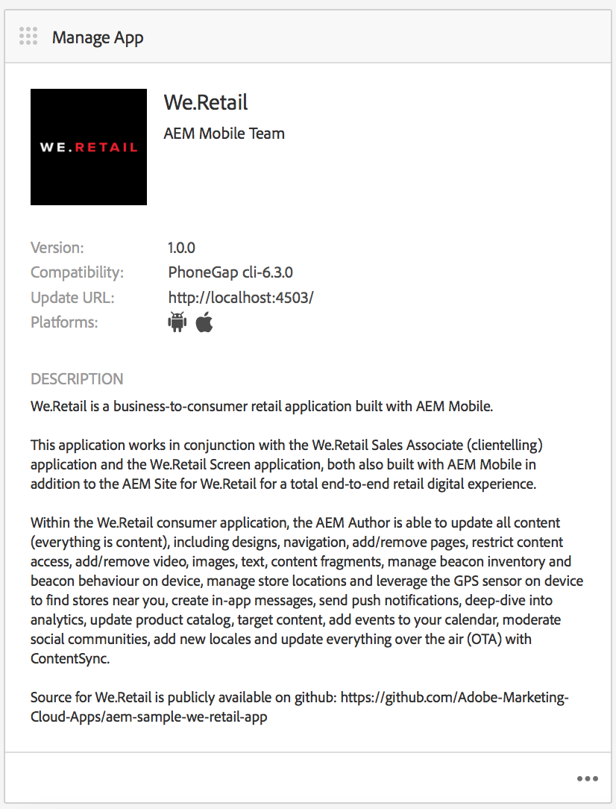

# Création d’applications mobiles{#authoring-mobile-applications}

>[!NOTE]
>
>Adobe recommande d’utiliser l’éditeur d’application d’une seule page (SPA) pour les projets nécessitant un rendu côté client basé sur la structure SPA (par exemple, React). [En savoir plus](/help/sites-developing/spa-overview.md).

Le Tableau de bord AEM Mobile vous permet de créer, de créer et de déployer votre application mobile, de créer, de supprimer et de modifier les métadonnées de l’application. Une fois votre application activée, vous pouvez analyser les analyses des applications, y compris les mesures de cycle de vie et d’utilisation, afin d’améliorer la conversion des clients et la fidélité à la marque.

Pour créer votre application AEM Mobile, consultez la page [Création d’applications mobiles](/help/mobile/building-app-mobile-phonegap.md).

Pour configurer votre environnement et commencer, voir [Administration d&#39;AEM à utiliser AEM PhoneGap Enterprise](/help/mobile/administer-phonegap.md).

## Le catalogue d’applications AEM Mobile {#the-aem-mobile-apps-catalog}

Le [catalogue d’applications AEM Mobile](http://localhost:4502/aem/apps.html/content/phonegap) affiche l’ensemble de votre application mobile gérée en AEM.

Considérez ce catalogue comme le &quot;landing page&quot; pour AEM Mobile, où les administrateurs peuvent début d&#39;une nouvelle application AEM Mobile en créant un modèle ou en téléchargeant une application existante déjà lancée par un développeur mobile.

Pour accéder au landing page de catalogue des applications, procédez comme suit :

1. Accédez à **Navigation**, puis sélectionnez **Mobile**.

1. Sélectionnez **Applications** pour ouvrir le catalogue des applications.

## Le tableau de bord Applications d’AEM Mobile {#the-aem-mobile-app-dashboard}

La sélection d’une application AEM Mobile dans le catalogue entraîne l’affichage de son tableau de bord. Il vous permet de gérer votre application, d’afficher ses statistiques, ainsi que de créer, de déployer et de gérer le contenu de votre application mobile.

Vous pouvez développer chaque volet du Tableau de bord AEM Mobile pour la vue ou modifier les détails en cliquant sur le bouton &quot;..&quot;. dans le coin inférieur droit.

### Mosaïque Gestion de l’application {#the-manage-app-tile}

La mosaïque Gestion de l’application présente l’icône de l’application, son nom, sa description, les plateformes prises en charge, l’URL de page d’appel pour les mises à jour et les informations relatives à la version. Vous pouvez voir les détails de cette mosaïque pour modifier et gérer la configuration d’applications PhoneGap (config.xml) et préparer votre application en vue de sa soumission et de sa diffusion sur les différentes boutiques d’applications.

Cliquez [ici](/help/mobile/phonegap-app-details-tile.md) pour plus de détails.

### Mosaïque Gérer le contenu de la page {#the-manage-page-content-tile}

Le contenu peut être créé, mis à jour et supprimé dans AEM Mobile de la même manière que dans AEM Sites. Le **volet Gérer le contenu de la page** affiche le nombre de pages du contenu géré et leur dernière modification. Vous pouvez voir le détail du contenu pour créer, copier, déplacer, supprimer et mettre à jour des pages en cliquant sur chaque enregistrement de la mosaïque. Une fois le contenu mis à jour, vous pouvez envoyer une mise à jour à vos clients par le biais du **volet Gérer les packs de contenu.**

### Mosaïque Gérer les packages de contenu {#the-manage-content-packages-tile}

Une fois que vous avez ajouté ou modifié votre contenu par le biais de la mosaïque de gestion du contenu de la page, vous pouvez diffuser ces modifications à vos clients à l’aide d’une mise à jour de la version de contenu.

Le package de contenu permet à AEM App Author de gérer le contenu des pages dans AEM et de demander à votre équipe de développement d’apporter des modifications à votre application PhoneGap Shell (c’est-à-dire à la structure ou à l’infrastructure de l’application), puis d’envoyer ces modifications à vos clients rapidement et sans avoir à recruter un développeur pour qu’il les soumette à nouveau aux divers magasins pour distribution.

Le package de contenu crée un fichier ZIP, considéré comme un package de version de contenu, pour chaque mise à jour. Ces packs contiennent des ressources html et des pages html générées lors du rendu de l’application. Ils sont suffisamment intelligents pour compresser uniquement les fichiers qui ont été modifiés depuis la dernière mise à jour.

La colonne Gérer la mosaïque de module de contenu **Type** affiche &quot;App&quot; pour indiquer le contenu du shell d&#39;application, par exemple la structure ou l&#39;infrastructure de l&#39;application gérée par un développeur ou &quot;Content&quot; qui représente le contenu de la page géré par l&#39;auteur du contenu.

Le contenu peut être représenté sous la forme d’un langage ou d’une partie donnée de l’application dans laquelle les packages Version du contenu sont consommés par l’application. Le choix de la façon dont vous regroupez le contenu est censé être souple et dépendre entièrement de la manière dont vous souhaitez gérer le contenu de votre application.

La colonne **Modifié** indique la date de dernière modification des pages.

La colonne **Intermédiaire** indique la date de dernière création d’une mise à jour du contenu. Pour créer une mise à jour de contenu et définir une étape intermédiaire pour vos modifications, ouvrez un enregistrement dans la mosaïque et créez une mise à jour.

La colonne **Publié** indique la date de publication de la dernière mise à jour de contenu à laquelle vos utilisateurs ont pu accéder. Pour publier du contenu, vous devez tout d’abord en faire l’étape, puis publier la mise à jour en parcourant ce volet et en le publiant à partir de la console des détails de la version de contenu.

 

Cette icône représente un package Version du contenu pour l’interpréteur d’application

Cette icône représente un package Version du contenu pour le contenu de l’application

### Mosaïque PhoneGap Build {#the-phonegap-build-tile}

Le **PhoneGap Build Tile** se connecte à [https://build.phonegap.com](https://build.phonegap.com) pour créer et héberger des buids distants. Une fois générée, la compilation est disponible sous forme de téléchargement ou est déployée directement sur votre appareil à l’aide d’un code QR.

Vous pouvez également télécharger la source de l’appareil à compiler en local dans la [ligne de commande de PhoneGap](https://docs.phonegap.com/en/3.5.0/guide_cli_index.md.html).

### Mosaïque Mesures {#the-metrics-tile}

>[!CAUTION]
>
>Le volet Mesures s’affiche uniquement après avoir configuré le service cloud.
>
>Voir [Configuration de votre Cloud Service Mobile Services Adobe](/help/mobile/configure-adobe-mobile-cloud-service.md) pour plus d’informations.

AEM Mobile s’intègre à Adobe Analytics par l’intermédiaire du [Adobe Mobile Services SDK](https://www.adobe.com/ca/solutions/digital-marketing/mobile-services/app-sdk.html) (AMS).

La mosaïque **Mesures** du centre de contrôle présente un récapitulatif des données analytiques issues d’AMS pour votre application. Vous pouvez parcourir le tableau de bord Analyses en cliquant sur « … » en bas à droite.

### Mosaïque Gérer le contenu de l&#39;entité {#the-manage-entity-content-tile}

Le volet Gérer le contenu d’entité vous permet d’ajouter et de gérer des définitions d’application. Les définitions d’application permettent d’identifier les espaces (et autres configurations) appropriés pour l’application. Ainsi, un nouvel espace peut être ajouté, sans avoir à recompiler l’application. La définition de l’application est mise à jour et inclut les informations relatives aux nouveaux espaces.

Cliquez [ici](/help/mobile/phonegap-app-definitions.md) pour créer et gérer les définitions de votre application.

Vous pouvez parcourir le tableau de bord de gestion du contenu d&#39;entité en cliquant sur le bouton &quot;...&quot; en bas à droite.

#### Ressources supplémentaires {#additional-resources}

Pour en savoir plus sur les rôles et les responsabilités d’un administrateur et d’un développeur, consultez les ressources ci-dessous :

* [Développer pour Adobe PhoneGap Enterprise avec AEM](/help/mobile/developing-in-phonegap.md)
* [Administration de contenu pour Adobe PhoneGap Enterprise avec AEM](/help/mobile/administer-phonegap.md)

