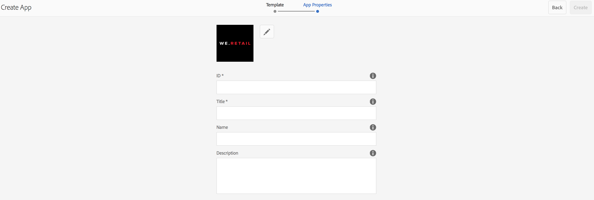

# Créer une application AEM Mobile à l’aide de l’assistant de création{#creating-a-new-aem-mobile-app-using-create-wizard}

{{ue-over-mobile}}

Les applications AEM Mobile sont basées sur un plan directeur qui définit une structure et des propriétés de page. Vous pouvez configurer les propriétés d’application suivantes :

* **Titre :** le titre de l’application.
* **Chemin de destination :** emplacement dans le référentiel où l’application est stockée. Conservez la valeur par défaut pour créer un chemin d’accès en fonction du nom de l’application.

* **Name :** la valeur par défaut est la valeur de la propriété Title avec les espaces supprimés. Le nom est utilisé dans AEM pour faire référence à l’application, par exemple, pour le nœud de référentiel qui représente l’application.
* **Description :** une description de l’application.
* **URL du serveur :** l’URL qui fournit des mises à jour de contenu par voie hertzienne (OTA) à l’application. La valeur par défaut est l’URL du serveur de publication de l’instance utilisée pour créer une application (provenant du service d’externaliseur). Notez qu’il doit s’agir d’une instance de serveur de publication plutôt que d’un auteur, ce qui nécessite une authentification.

Vous pouvez également fournir un fichier image à utiliser comme miniature de l’application, sélectionner la configuration de PhoneGap Build à utiliser, puis sélectionner la configuration d’analyse des applications mobiles à utiliser. Cette image est uniquement utilisée sous forme de miniature pour représenter votre application mobile dans la console des applications mobiles dans Experience Manager.

Il existe d’autres onglets (facultatifs) pour créer le service cloud et intégrer le plug-in SDK Adobe Mobile Services dans votre application.

* Build : cliquez sur gérer les configurations et configurez votre service de build build.phonegap.com ici. Ensuite, dans la liste déroulante, vous pourrez sélectionner le service cloud PhoneGap build que vous venez de créer.
* Analytics : cliquez sur Gérer les configurations et configurez votre service cloud [Adobe Mobile Services SDK](https://experienceleague.adobe.com/docs/mobile-services/using/home.html?lang=fr). Ensuite, dans la liste déroulante, vous pourrez sélectionner le service mobile nouvellement créé à intégrer à votre application mobile.

## Utilisation de modèles d’application {#using-app-templates}

Les modèles d’application offrent un moyen facile d’utiliser les conceptions existantes créées par les développeurs et développeuses, utilisées pour la création de nouvelles applications au sein d’AEM.

Qu’est-ce qu’un modèle d’application ? Considérez-le comme un ensemble de modèles de page et de composants qui représentent une ligne de base ou la base d’une application.
Lors de la création d’une application basée sur le modèle d’une autre application, vous obtiendrez une application qui dispose d’un point de départ représentatif de l’application à partir de laquelle elle a été créée.

Pour utiliser cette fonctionnalité, vous devez disposer d’un modèle d’application mobile existant (ou d’une application installée disposant d’un modèle d’application).

Le dernier package d’exemples d’applications AEM comprend une version mise à jour de l’application Geometrixx avec un modèle d’application. Vous pouvez également installer le [StarterKit](https://github.com/Adobe-Marketing-Cloud-Apps/aem-phonegap-starter-kit) qui fournit également un modèle.

Étapes de création d’une application basée sur un modèle d’application :

1. Accédez au catalogue d’applications AEM Mobile : &lt;*server-url*>aem/apps.html/content/mobileapps
1. Sélectionnez **Créer** puis choisissez **App** comme illustré ci-dessous

Sélectionnez un modèle d’application mis à votre disposition par un développeur ou une développeuse AEM. Consultez [Structure d’une application AEM Mobile](/help/mobile/phonegap-structure-an-app.md) pour obtenir de l’aide pour le développement.

Renseignez les détails de votre nouvelle application selon vos besoins, y compris éventuellement la modification de son image miniature. Ces valeurs peuvent être modifiées ultérieurement à partir de la mosaïque **Gérer l’application**.

## Les étapes suivantes {#the-next-steps}

Consultez les ressources suivantes pour en savoir plus sur les autres rôles de création :

* [La Mosaïque Gérer L’Application](/help/mobile/phonegap-app-details-tile.md)
* [Modification Des Métadonnées De L’Application](/help/mobile/phonegap-editmetadata.md)
* [Définitions d’application](/help/mobile/phonegap-app-definitions.md)
* [Importer une application hybride existante](/help/mobile/phonegap-adding-content-to-imported-app.md)
* [Content Services](/help/mobile/develop-content-as-a-service.md)

## Ressources supplémentaires {#additional-resources}

Pour en savoir plus sur les rôles et les responsabilités d’un administrateur et d’un développeur, consultez les ressources ci-dessous :

* [Développement pour Adobe PhoneGap Enterprise avec AEM](/help/mobile/developing-in-phonegap.md)
* [Administration de contenu pour Adobe PhoneGap Enterprise avec AEM](/help/mobile/administer-phonegap.md)
