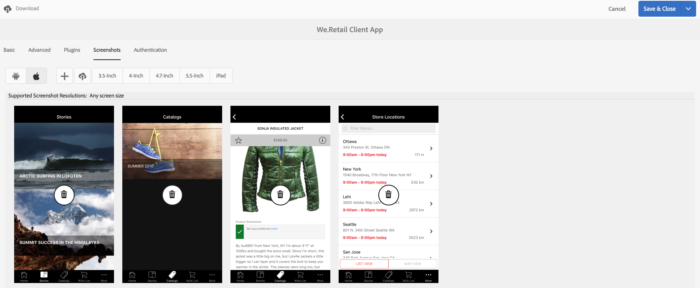

# Modification de métadonnées d’application {#editing-app-metadata}

>[!NOTE]
>
>Adobe recommande d’utiliser l’éditeur d’application d’une seule page (SPA) pour les projets nécessitant un rendu côté client basé sur la structure SPA (par exemple, React). [En savoir plus](/help/sites-developing/spa-overview.md).

The **Manage App** tile and &quot;Manage App&quot; page provides a means to view and edit application metadata. Les métadonnées d’application sont nécessaires pour publier une application dans la boutique d’un fournisseur. Il peut s’agir de métadonnées courantes, de métadonnées iOS et de captures d’écran. See the [Manage App Tile](/help/mobile/phonegap-app-details-tile.md) for further details on common and iOS metadata.

## Modification des données de l’application {#editing-the-app-data}

Pour modifier les métadonnées de l’application :

1. Accédez à la page du tableau de bord de l’application.

   

1. Pour vue ou modifier des détails en cliquant sur le bouton &quot;...&quot; dans le coin inférieur droit du volet **Gérer l’application** .

1. Saisissez ou vue les détails dans l’un des cinq onglets disponibles, comme illustré dans la figure ci-dessous.

   

## Modification des métadonnées courantes et IOS {#editing-common-and-ios-metadata}

Vous pouvez modifier les métadonnées courantes et IOS :

* Sélectionnez l’onglet **Avancé** dans la page de description de l’application.
* Modifiez ou vue les métadonnées courantes et IOS. Pour plus de détails, voir les figures ci-dessous.

 

## Ajouter et supprimer des captures d&#39;écran {#add-and-remove-screenshots}

Vous pouvez inclure des captures d’écran d’application au déploiement de métadonnées. Certains fournisseurs nécessitent des captures d’écran précises pour envoyer une application à leur boutique d’applications. Ces images doivent déjà figurer dans AEM Assets. Reportez-vous à la section [Sélecteur de ressources](../assets/search-assets.md#assetpicker) pour transférer vos captures d’écran.

### Ajout de captures d’écran {#add-screenshots}

Pour ajouter une ressource en tant que capture d’écran :

1. While in edit mode of the **Manage App** page, click add (plus icon).
1. Sélectionnez le fichier et cliquez sur **Sélectionner** pour l’ajouter.

   

1. Sélectionnez le fichier et cliquez sur **Sélectionner** pour l’ajouter.

>[!NOTE]
>
>La capture d’écran doit correspondre à la résolution d’écran du périphérique de cible.

### Suppression de captures d’écran {#delete-screenshots}

Pour supprimer une capture d’écran :

Cliquez sur la suppression de la ressource.

## Étapes suivantes {#the-next-steps}

Consultez les ressources suivantes pour en savoir plus sur les autres rôles de création :

* [Mosaïque Gestion de l’application](/help/mobile/phonegap-app-details-tile.md)
* [Définitions d’application](/help/mobile/phonegap-app-definitions.md)
* [Création d’une application à l’aide de l’assistant de création d’application](/help/mobile/phonegap-create-new-app.md)
* [Importation d’une application hybride existante](/help/mobile/phonegap-adding-content-to-imported-app.md)
* [Content Services](/help/mobile/develop-content-as-a-service.md)

### Ressources supplémentaires {#additional-resources}

Pour en savoir plus sur les rôles et les responsabilités d’un administrateur et d’un développeur, consultez les ressources ci-dessous :

* [Développer pour Adobe PhoneGap Enterprise avec AEM](/help/mobile/developing-in-phonegap.md)
* [Administration de contenu pour Adobe PhoneGap Enterprise avec AEM](/help/mobile/administer-phonegap.md)
