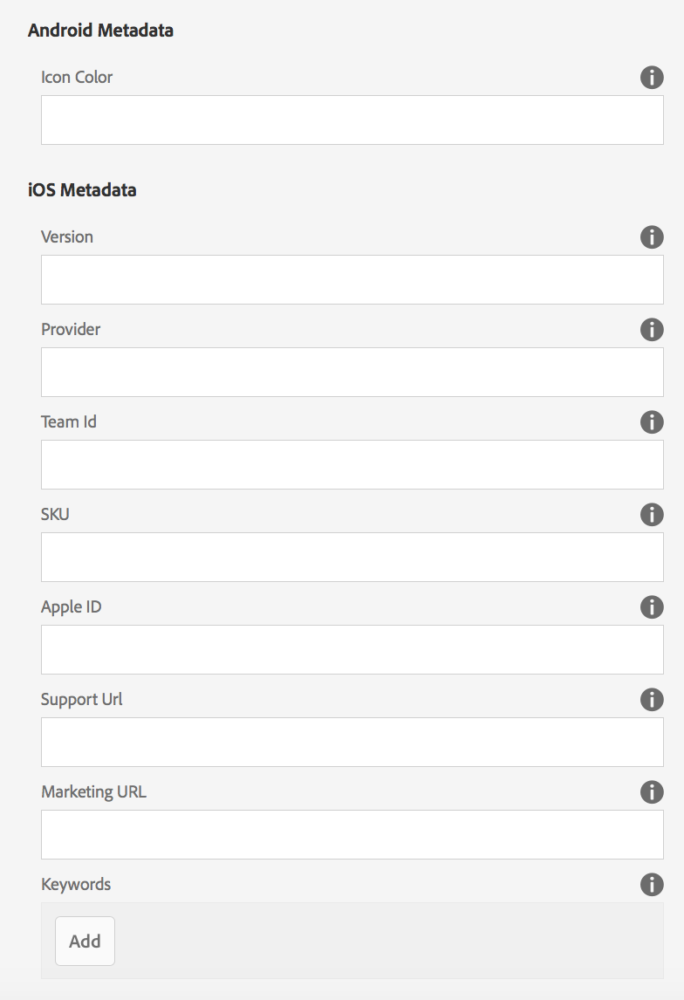

# Modification Des Métadonnées De L’Application {#editing-app-metadata}

{{ue-over-mobile}}

La mosaïque **Gérer l’application** et la page « Gérer l’application » permettent d’afficher et de modifier les métadonnées de l’application. Les métadonnées d’application sont des détails requis pour publier une application dans le magasin d’un fournisseur. Cela peut inclure des métadonnées courantes, des métadonnées iOS et des captures d’écran. Consultez la section [Gérer la mosaïque de l’application](/help/mobile/phonegap-app-details-tile.md) pour plus d’informations sur les métadonnées communes et iOS.

## Modifier les données de l’application {#editing-the-app-data}

Pour modifier les métadonnées de l’application :

1. Accédez à la page du tableau de bord de l’application.

   

1. Pour afficher ou modifier des détails en cliquant sur le signe « ... » dans le coin inférieur droit de la mosaïque **Gérer l’application**.

1. Saisissez ou affichez les détails dans l’un des cinq onglets disponibles, comme illustré dans la figure ci-dessous.

   

## Modification des métadonnées communes et IOS {#editing-common-and-ios-metadata}

Vous pouvez modifier les métadonnées communes et IOS :

* Sélectionnez l’onglet **Avancé** dans la page de description de l’application.
* Modifiez ou affichez les métadonnées communes et IOS. Voir les chiffres ci-dessous pour plus de détails.

 

## Ajout et suppression de captures d’écran {#add-and-remove-screenshots}

Vous pouvez inclure des captures d’écran de l’application dans le cumul des métadonnées. Certains fournisseurs exigent des captures d&#39;écran précises lors de l&#39;envoi d&#39;une application à leur boutique d&#39;applications. Ces images doivent déjà exister dans Assets. Voir [Sélecteur de ressources](../assets/search-assets.md#assetpicker) pour charger vos captures d’écran.

### Ajouter des captures d’écran {#add-screenshots}

Pour ajouter une ressource en tant que capture d’écran :

1. En mode d’édition de la page **Gérer l’application**, cliquez sur ajouter (icône plus).
1. Sélectionnez la ressource et cliquez sur **Sélectionner** pour l’ajouter.

   

1. Sélectionnez la ressource et cliquez sur **Sélectionner** pour l’ajouter.

>[!NOTE]
>
>La capture d’écran doit correspondre à la résolution d’écran de l’appareil cible.

### Supprimer les captures d’écran {#delete-screenshots}

Pour supprimer une capture d’écran :

Cliquez sur la suppression de la ressource.

## Les étapes suivantes {#the-next-steps}

Consultez les ressources suivantes pour en savoir plus sur les autres rôles de création :

* [La Mosaïque Gérer L’Application](/help/mobile/phonegap-app-details-tile.md)
* [Définitions d’application](/help/mobile/phonegap-app-definitions.md)
* [Création d’une application à l’aide de l’assistant Créer une application](/help/mobile/phonegap-create-new-app.md)
* [Importer une application hybride existante](/help/mobile/phonegap-adding-content-to-imported-app.md)
* [Content Services](/help/mobile/develop-content-as-a-service.md)

### Ressources supplémentaires {#additional-resources}

Pour en savoir plus sur les rôles et les responsabilités d’un administrateur et d’un développeur, consultez les ressources ci-dessous :

* [Développement pour Adobe PhoneGap Enterprise avec AEM](/help/mobile/developing-in-phonegap.md)
* [Administration de contenu pour Adobe PhoneGap Enterprise avec AEM](/help/mobile/administer-phonegap.md)
