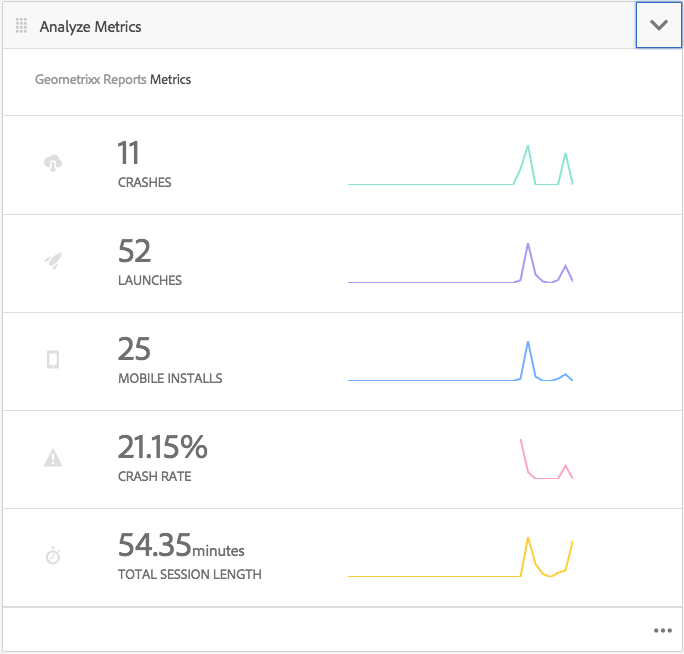

# Suivi des performances des applications avec les analyses mobiles Adobe{#track-app-performance-with-adobe-mobile-analytics}

>[!NOTE]
>
>Adobe recommande d’utiliser l’éditeur d’application d’une seule page (SPA) pour les projets nécessitant un rendu côté client basé sur la structure SPA (par exemple, React). [En savoir plus](/help/sites-developing/spa-overview.md).

Vous souhaitez augmenter les conversions et la fidélité des clients.

Vous souhaitez proposer des expériences pertinentes et attrayantes à vos clients.

Que fait votre application AEM Mobile pour vos campagnes marketing ?

Comment affiner vos applications mobiles pour offrir à vos utilisateurs la meilleure expérience possible ?

Grâce à Adobe Mobile Services, vous pouvez découvrir comment vos utilisateurs utilisent vos applications mobiles en suivant l’utilisation, les blocages d’applications, les détails des périphériques et tant d’autres mesures essentielles pour vos applications mobiles.

Adobe Experience Manager Mobile offre un aperçu des détails de vos analyses mobiles directement à partir du Tableau de bord d’applications AEM Mobile. La mosaïque de mesures **mobiles** du tableau de bord fournit des analyses en temps réel pour votre application mobile, ce qui permet aux développeurs, aux auteurs et aux administrateurs d’avoir un aperçu rapide de l’état de votre application mobile. Sous les couvertures qui alimentent les analyses se trouve le kit [Adobe Mobile Analytics](https://www.adobe.com/ca/solutions/digital-analytics/mobile-web-apps-analytics.html) SDK. Le Adobe Mobile Analytics SDK peut être connecté à vos applications en mode natif ou via un module PhoneGap Bridge pour les vues Web. Les mesures sont collectées et mises en cache sur l’appareil jusqu’à ce que celui-ci soit connecté, au moment où les données sont transmises à Adobe Mobile Services Cloud pour rapports et analyse.

Le SDK Adobe Mobile Analytics fournit les éléments suivants :

1. **Collecte de données pour les canaux mobiles** : collectez des données complètes pour vos sites web et applications mobiles sur tous les grands systèmes d’exploitation.
1. **Analyse** d’engagement mobile - Comprenez l’engagement des utilisateurs au sein de votre application mobile, de votre site Web ou de votre vidéo, notamment la fréquence de lancement du canal par les clients, la fréquence à laquelle ils effectuent des achats, etc.
1. **Tableaux de bord et rapports** d&#39;applications mobiles - Obtenez des rapports d&#39;utilisation qui incluent des mesures de cycle de vie pour vos applications et des mesures de boutique d&#39;applications — afficher les tendances pour les utilisateurs, les lancements, la durée de session moyenne, la durée de rétention et les blocages.
1. **Analyse** des campagnes mobiles : quantifiez l&#39;efficacité des campagnes spécifiques aux mobiles telles que les SMS, les publicités de recherche mobile, les publicités d&#39;affichage mobile et les codes QR.
1. **Analyse** de géolocalisation - Recherchez où les utilisateurs de votre application lancent et interagissent avec vos expériences mobiles par localisation GPS ou points ciblés.
1. **Analyse** du cheminement : déterminez comment les utilisateurs naviguent dans votre application afin de déterminer quels écrans et éléments de l’interface utilisateur attirent les utilisateurs et ce qui les pousse à abandonner.

Cette section décrit comment les développeurs  AEM peuvent alors apprendre à instrumentaliser les applications AEM Mobile avec le suivi des analyses.

Enfin, [AEM administrateurs](#administrators) apprennent à :

* créer un service cloud pour Adobe Mobile Services
* créer une configuration de service mobile et associer une suite de rapports
* association de la configuration du service mobile à une application mobile
* Mesures de vue via le Centre de commandes des applications AEM
* attribuer la configuration du SDK AMS à votre application mobile

## Pour les développeurs - Intégration d’Analytics dans votre application {#for-developers-integrate-analytics-into-your-app}

**Condition préalable :** aem administrateurs doivent configurer la configuration de cloud Adobe Mobile Services, [comme décrit ci-dessous](#amscloudserviceconfig).

Les développeurs sont chargés d&#39; [ajouter des analyses à une application](/help/mobile/phonegap-add-analytics-to-apps.md) AEM Mobile en fonction des besoins afin de suivre, de créer des rapports et de comprendre comment les utilisateurs interagissent avec le contenu de votre application mobile et de mesurer les mesures clés de cycle de vie, telles que les lancements, le temps passé dans l&#39;application et le taux de plantage.

## Pour les administrateurs - Configuration de l’Adobe Mobile Services Cloud Service {#for-administrators-configure-the-adobe-mobile-services-cloud-service}

Pour tirer parti d&#39;Adobe Mobile Services, vous devez configurer l&#39;Cloud Service Mobile Services de l&#39;Adobe AEM avec vos informations de compte Adobe Analytics. Le Centre de commandes des applications fournit un volet Mesures **d’** analyse dans lequel vous pouvez créer et associer le service cloud à votre application mobile.

Configurez le service cloud sur votre application mobile en commençant par cliquer sur l’icône d’engrenage située dans le volet Analyser les mesures.

Cliquez sur l’icône d’engrenage dans le volet Analyser les mesures pour ouvrir la boîte de dialogue modale &quot;Configurer Mobile Services Analytics&quot;. Sélectionnez votre configuration dans la liste déroulante Sélectionner une configuration de service mobile. Si vous devez créer une nouvelle configuration, cliquez sur l’icône en forme de clé.

Pour créer un service cloud Adobe Mobile Service, deux étapes sont impliquées : la connexion au service et la sélection de la suite de rapports à affecter à la configuration.

Pour commencer, cliquez sur le bouton &quot;+&quot; sur la mosaïque Gérer les Cloud Services dans le tableau de bord.

Lorsque vous cliquez sur le bouton &quot;**+**&quot;, l’assistant Cloud Service **** Ajouté s’affiche.

Sélectionnez ou créez une nouvelle configuration de service mobile en remplissant les champs obligatoires comme illustré ci-dessous. Votre administrateur AEM aura besoin de ces informations pour créer la connexion à Adobe Mobile Services.

Une fois les paramètres de compte Mobile Services terminés, vous êtes invité à sélectionner une application. Ce faisant, Adobe Mobile Service Analytics rapports est connecté à cette application.

Sélectionnez le service mobile de votre choix, puis cliquez sur &quot;Mettre à jour&quot; pour attribuer la configuration du service mobile et fermer la boîte de dialogue.

Maintenant que vous avez associé la configuration du service mobile à l’application AEM Mobile, le volet début pour récupérer les données de mesure et commencer à rapports.

### Fichier de configuration du SDK Adobe Mobile Services {#adobe-mobile-services-sdk-config-file}

A ce stade, votre application mobile est associée à un service cloud, mais l’application mobile ne sait pas encore comment communiquer les mesures mobiles collectées à Adobe Analytics. Pour transférer l’application mobile vers Adobe Analytics, le fichier de configuration du SDK Mobile Services Adobe doit être ajouté à Adobe Experience Manager.

Dans le volet Analyser les mesures, cliquez sur l’icône en forme de flèche pour afficher les entrées du menu Télécharger / Télécharger la configuration du SDK AMS.

La première étape consiste à obtenir la configuration du SDK auprès d’Adobe Mobile Services, en cliquant sur &quot;Télécharger la configuration du SDK AMS&quot;, vous redirigerez vers le site Web Adobe Mobile Services où vous pouvez télécharger le fichier de configuration. Une fois que vous avez obtenu le fichier ADBMobileConfig.json, cliquez sur &quot;Télécharger la configuration du SDK AMS&quot; pour télécharger le fichier de configuration dans AEM.

Cliquez sur le bouton &quot;Télécharger la configuration de l’application Adobe Mobile Services&quot; et recherchez le fichier ADBMobileConfig.json, puis cliquez sur &quot;Télécharger&quot;.

Maintenant que l’application mobile a accès au fichier ADBMobileConfig.json, elle dispose des connaissances nécessaires pour communiquer à l’Adobe Analytics et commencer à rapports sur les valeurs de mesures importantes qui contribueront à la réussite de vos applications.

## What&#39;s Next? {#what-s-next}

1. [Expérimenter le développement d’une application AEM Mobile](/help/mobile/starting-aem-phonegap-app.md)
1. [Gérer le contenu d’une application mobile](/help/mobile/phonegap-manage-app-content.md)
1. [Développer une application mobile](/help/mobile/building-app-mobile-phonegap.md)
1. [Suivre les performances d’une application avec Adobe Mobile Analytics](/help/mobile/phonegap-intro-to-app-analytics.md)
1. [Offrir une expérience personnalisée dans une application mobile grâce à Adobe Target](/help/mobile/phonegap-aem-mobile-content-personalization.md)
1. [Diffuser des messages importants à l’intention des utilisateurs](/help/mobile/phonegap-push-notifications.md)